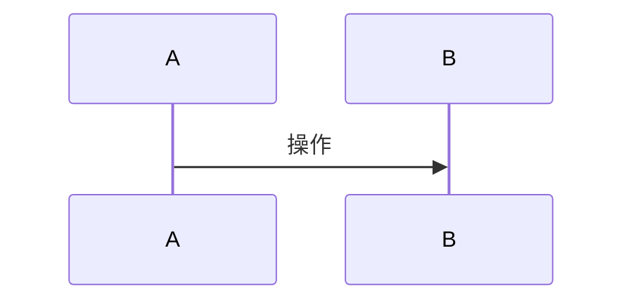
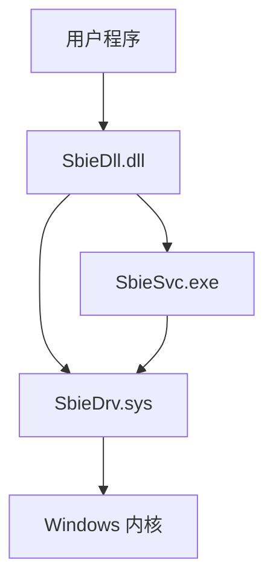
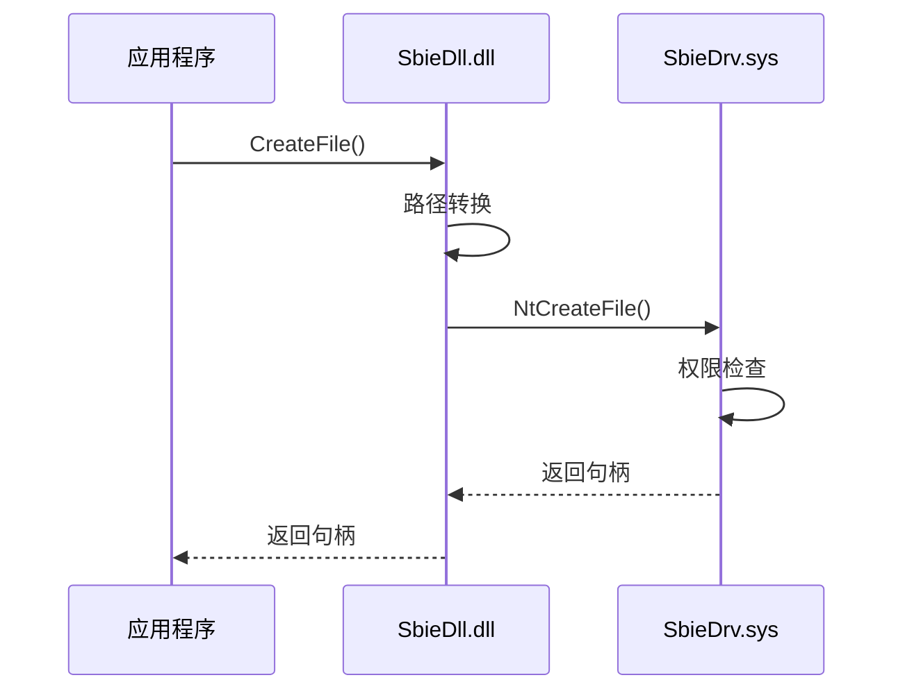
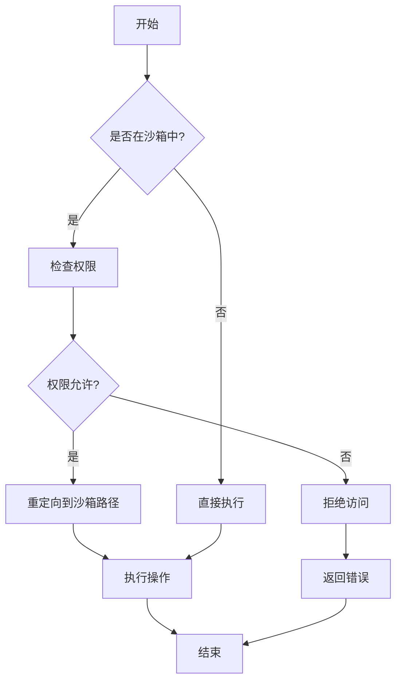
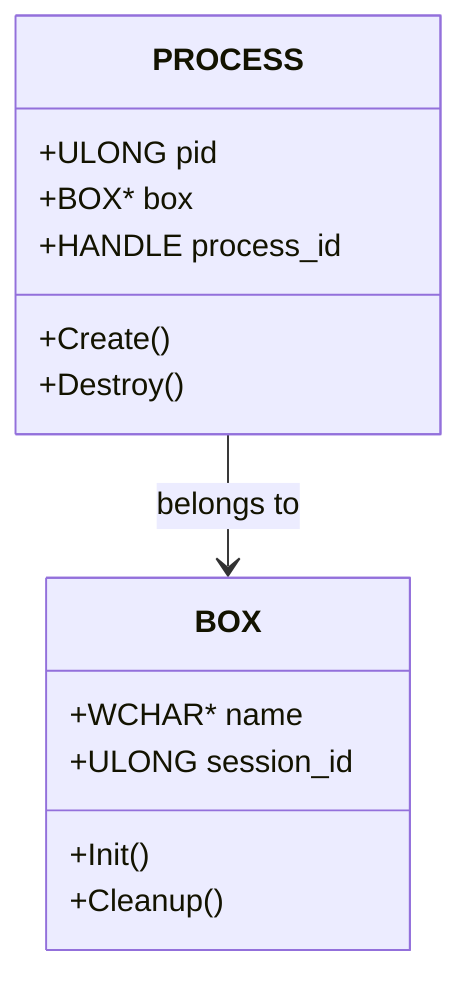
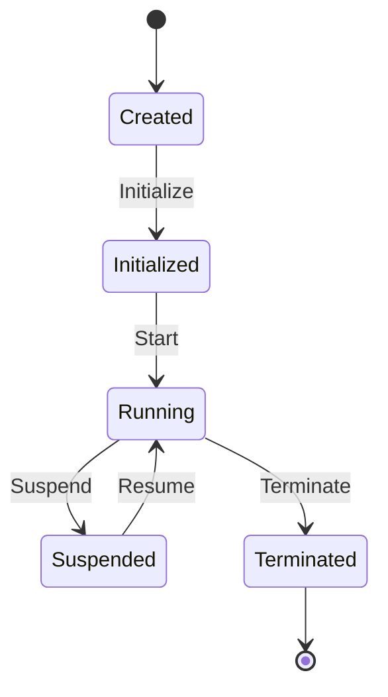

# Sandboxie 项目深度分析 Skill

## 🎯 Skill 定位

本 skill 专注于对 Sandboxie 项目进行全方位的深度分析，帮助用户：

1. **从零开始学习**：即使没有 Windows 内核开发经验，也能逐步掌握项目
2. **深入理解代码**：分析每个函数、结构体、模块的功能和设计意图
3. **可视化理解**：生成时序图、流程图、架构图等帮助理解
4. **实战能力**：能够修改代码、添加功能、诊断和修复问题
5. **技能提升**：学习 Windows 内核编程、驱动开发、沙箱技术等

---

## 📚 分析维度

### 1. 代码级分析
- **函数分析**：每个函数的功能、参数、返回值、调用关系
- **结构体分析**：数据结构的字段含义、生命周期、使用场景
- **宏定义分析**：宏的作用、使用位置、设计意图
- **全局变量分析**：全局状态管理、线程安全性

### 2. 模块级分析
- **模块职责**：模块在整体架构中的定位
- **对外接口**：导出函数、IOCTL 命令、API 接口
- **内部协作**：模块内各文件的协作关系
- **依赖关系**：与其他模块的依赖

### 3. 架构级分析
- **整体架构**：三层架构（驱动层、服务层、GUI 层）
- **通信机制**：IOCTL、LPC、命名管道等
- **数据流**：从用户操作到内核执行的完整流程
- **安全模型**：隔离机制、权限控制、攻击面

### 4. 可视化分析
- **架构图**：系统整体架构、模块关系
- **时序图**：典型操作的执行时序
- **流程图**：关键算法的执行流程
- **调用链图**：函数调用关系
- **数据流图**：数据在各层之间的流动

---

## 🚀 使用场景

### 场景 1：学习项目架构

**用户请求示例**：
- "帮我分析 Sandboxie 的整体架构"
- "我想了解 Sandboxie 是如何工作的"
- "生成 Sandboxie 的架构图"

**分析步骤**：
1. 读取 `references/architecture-overview.md` 获取架构概览
2. 生成 Mermaid 架构图展示三层结构
3. 说明各层的职责和通信方式
4. 提供关键模块的快速导航

### 场景 2：分析特定功能

**用户请求示例**：
- "分析文件系统虚拟化是如何实现的"
- "进程隔离的原理是什么"
- "注册表重定向的流程"

**分析步骤**：
1. 定位相关的源文件（使用 `references/module-mapping.md`）
2. 分析关键函数和数据结构
3. 生成时序图展示执行流程
4. 说明设计要点和注意事项

### 场景 3：深入分析函数

**用户请求示例**：
- "分析 File_NtCreateFile 函数的实现"
- "Process_CreateProcessInternalW 做了什么"
- "这个函数的调用链是什么"

**分析步骤**：
1. 读取函数源码
2. 分析函数签名、参数、返回值
3. 解析函数逻辑，识别关键步骤
4. 生成调用链图
5. 说明设计意图和潜在问题

### 场景 4：分析数据结构

**用户请求示例**：
- "PROCESS 结构体有哪些字段"
- "BOX 结构体是如何使用的"
- "分析 SYSCALL_ENTRY 的设计"

**分析步骤**：
1. 定位结构体定义
2. 分析每个字段的含义和用途
3. 说明结构体的生命周期
4. 展示使用示例
5. 说明设计考虑

### 场景 5：生成可视化图表

**用户请求示例**：
- "生成进程启动的时序图"
- "画出文件操作的流程图"
- "展示模块间的依赖关系"

**分析步骤**：
1. 分析相关代码和流程
2. 使用 Mermaid 生成对应图表
3. 添加注释说明关键步骤
4. 提供图表的文字解释

### 场景 6：诊断问题

**用户请求示例**：
- "为什么某个程序在沙箱中无法运行"
- "这个崩溃是什么原因"
- "如何调试这个问题"

**分析步骤**：
1. 分析问题现象和日志
2. 定位可能相关的代码
3. 分析执行流程，找出问题点
4. 提供调试方法和修复建议

### 场景 7：学习特定技术

**用户请求示例**：
- "Sandboxie 如何实现 API Hook"
- "写时复制是如何工作的"
- "系统调用拦截的原理"

**分析步骤**：
1. 提供技术背景知识
2. 分析 Sandboxie 中的具体实现
3. 对比不同实现方式的优劣
4. 提供学习资源和参考

---

## 📖 分析方法论

### 自底向上分析法

```
第一层：文件级分析
  ├─ 单个 .c/.cpp 文件的详细分析
  ├─ 函数功能、数据结构、算法逻辑
  └─ 输出：files/xxx.md

第二层：模块级分析
  ├─ 整合相关文件的分析
  ├─ 模块职责、对外接口、内部协作
  └─ 输出：modules/xxx-layer.md

第三层：项目级分析
  ├─ 整合所有模块的分析
  ├─ 整体架构、核心流程、安全模型
  └─ 输出：00-PROJECT-OVERVIEW.md
```

### 多维度分析框架

每个分析包含以下维度：

1. **职责定位**：模块/函数的核心职责
2. **公开接口**：对外暴露的 API
3. **核心逻辑**：关键算法和流程
4. **依赖关系**：内部和外部依赖
5. **数据模型**：核心数据结构
6. **执行流程**：典型场景的执行路径
7. **安全考虑**：安全机制和潜在风险
8. **性能考虑**：性能瓶颈和优化点
9. **可维护性**：代码质量和改进空间
10. **设计亮点**：优秀的设计模式

---

## 🗂️ 项目结构速查

### 核心目录

```
Sandboxie/
├── Sandboxie/core/          # 核心代码（C/C++）
│   ├── drv/                 # 内核驱动 (SbieDrv.sys)
│   ├── dll/                 # 注入 DLL (SbieDll.dll)
│   ├── svc/                 # 系统服务 (SbieSvc.exe)
│   └── low/                 # 底层注入辅助 (LowLevel.dll)
├── SandboxiePlus/           # Plus 版代码（C++/Qt）
│   ├── SandMan/             # GUI 主程序
│   ├── QSbieAPI/            # API 封装层
│   └── MiscHelpers/         # 辅助工具
├── docs/                    # 文档目录
│   ├── ai-analysis/         # AI 生成的分析文档
│   └── *.md                 # 各种技术文档
└── .cursor/skills/          # Cursor Skills
    ├── sandboxie-analyzer/  # 本 skill
    └── sandboxie-modifier/  # 修改 skill
```

### 模块映射表

详见 `references/module-mapping.md`，包含：
- 功能 → 文件映射
- 模块 → 职责映射
- 问题 → 代码位置映射

---

## 🔍 分析工具和模板

### 1. 函数分析模板

使用 `templates/function-analysis.md` 模板分析函数：

```markdown
## 函数名：XXX

### 基本信息
- **文件位置**：path/to/file.c
- **函数签名**：返回类型 函数名(参数列表)
- **调用约定**：__stdcall / __cdecl / ...

### 功能描述
简要描述函数的功能（1-2 句话）

### 参数说明
| 参数名 | 类型 | 方向 | 说明 |
|--------|------|------|------|

### 返回值
说明返回值的含义和可能的值

### 核心逻辑
1. 步骤 1
2. 步骤 2
3. ...

### 调用关系
- **被调用者**：列出调用此函数的函数
- **调用者**：列出此函数调用的函数

### 关键代码片段
```c
// 关键代码
```

### 设计要点
说明设计考虑、注意事项

### 潜在问题
列出可能的问题或改进点
```

### 2. 结构体分析模板

使用 `templates/struct-analysis.md` 模板分析结构体：

```markdown
## 结构体名：XXX

### 定义位置
文件：path/to/file.h

### 结构体定义
```c
typedef struct _XXX {
    // 字段定义
} XXX;
```

### 字段说明
| 字段名 | 类型 | 偏移 | 说明 |
|--------|------|------|------|

### 生命周期
- **创建**：在哪里创建
- **初始化**：如何初始化
- **使用**：主要使用场景
- **销毁**：在哪里销毁

### 使用示例
```c
// 使用示例代码
```

### 设计考虑
说明为什么这样设计
```

### 3. 流程分析模板

使用 `templates/flow-analysis.md` 模板分析流程：

```markdown
## 流程名：XXX

### 触发条件
说明什么情况下会触发此流程

### 执行步骤
1. 步骤 1：说明
2. 步骤 2：说明
3. ...

### 时序图


### 涉及的模块
列出参与此流程的模块

### 关键函数
列出流程中的关键函数

### 数据流
说明数据如何在各模块间流动

### 异常处理
说明错误情况的处理
```

---

## 📊 可视化图表生成

### 支持的图表类型

#### 1. 架构图（Architecture Diagram）



#### 2. 时序图（Sequence Diagram）



#### 3. 流程图（Flowchart）



#### 4. 类图（Class Diagram）



#### 5. 状态图（State Diagram）



---

## 🎓 学习路径

### 初学者路径（0 基础）

**第 1 周：理解整体架构**
1. 阅读 `references/architecture-overview.md`
2. 理解三层架构的设计
3. 了解各模块的职责
4. 学习基本的 Windows 概念

**第 2 周：学习驱动层**
1. 学习 Windows 驱动开发基础
2. 分析 `core/drv/driver.c` 驱动入口
3. 理解系统调用拦截机制
4. 学习文件系统过滤

**第 3 周：学习 DLL 层**
1. 学习 API Hook 技术
2. 分析 `core/dll/hook.c` Hook 框架
3. 理解路径重定向机制
4. 学习进程注入技术

**第 4 周：学习服务层**
1. 学习 Windows 服务开发
2. 分析 `core/svc/` 服务架构
3. 理解 LPC 通信机制
4. 学习进程代理模式

**第 5-6 周：深入特定功能**
1. 选择感兴趣的功能深入学习
2. 阅读相关的详细分析文档
3. 调试和实验代码
4. 尝试小的修改

### 开发者路径（有基础）

**快速上手**：
1. 阅读项目全景分析
2. 根据需求定位相关模块
3. 深入阅读模块分析文档
4. 结合源码进行实践

**进阶学习**：
1. 研究核心算法实现
2. 分析性能优化点
3. 学习安全机制设计
4. 尝试功能扩展

### 安全研究者路径

**研究重点**：
1. 分析隔离机制的实现
2. 研究可能的绕过方法
3. 评估安全边界
4. 提出改进建议

---

## 🛠️ 实用工具

### 1. 代码搜索

使用 `scripts/search-code.py` 快速搜索代码：

```bash
# 搜索函数定义
python scripts/search-code.py --function "File_NtCreateFile"

# 搜索结构体
python scripts/search-code.py --struct "PROCESS"

# 搜索配置项
python scripts/search-code.py --config "OpenFilePath"
```

### 2. 调用链分析

使用 `scripts/call-chain.py` 分析函数调用链：

```bash
# 生成调用链
python scripts/call-chain.py --function "Process_CreateProcessInternalW"

# 生成调用图
python scripts/call-chain.py --function "File_NtCreateFile" --graph
```

### 3. 依赖分析

使用 `scripts/dependency.py` 分析模块依赖：

```bash
# 分析模块依赖
python scripts/dependency.py --module "drv"

# 生成依赖图
python scripts/dependency.py --all --graph
```

---

## 📝 分析输出规范

### 文档命名规范

- **项目级**：`00-PROJECT-OVERVIEW.md`
- **模块级**：`01-xxx-layer.md`（如 `01-kernel-driver-layer.md`）
- **文件级**：`<layer>_<filename>.md`（如 `drv_file.c.md`）
- **功能级**：`feature-xxx.md`（如 `feature-file-virtualization.md`）

### 文档结构规范

每个分析文档应包含：

1. **概述**：简要说明分析对象
2. **基本信息**：位置、大小、依赖等
3. **核心内容**：详细分析
4. **可视化**：图表辅助理解
5. **关注点**：安全、性能、可维护性
6. **参考**：相关文档和资源

### Markdown 格式规范

- 使用清晰的标题层级
- 代码块使用语法高亮
- 表格整理关键信息
- 使用 Mermaid 生成图表
- 添加必要的注释和说明

---

## 🔗 参考资源

### 内部文档

- `references/architecture-overview.md` - 架构总览
- `references/module-mapping.md` - 模块映射表
- `references/function-index.md` - 函数索引
- `references/struct-index.md` - 结构体索引
- `references/config-reference.md` - 配置参考

### 已有分析文档

- `docs/ai-analysis/` - AI 生成的分析文档
- `docs/SANDBOXIE_TECHNICAL_ANALYSIS.md` - 技术原理分析
- `docs/LICENSE_REMOVAL_GUIDE.md` - 授权机制分析

### 外部资源

- [Windows Internals](https://docs.microsoft.com/en-us/sysinternals/resources/windows-internals) - Windows 内部原理
- [WDK Documentation](https://docs.microsoft.com/en-us/windows-hardware/drivers/) - 驱动开发文档
- [Sandboxie GitHub](https://github.com/sandboxie-plus/Sandboxie) - 官方仓库

---

## 💡 使用技巧

### 1. 快速定位代码

当用户询问某个功能时：
1. 先查看 `references/module-mapping.md` 定位相关文件
2. 使用搜索工具快速找到关键函数
3. 阅读已有的分析文档（如果存在）
4. 结合源码进行深入分析

### 2. 生成分析文档

当需要生成新的分析文档时：
1. 使用对应的模板（`templates/` 目录）
2. 按照分析方法论进行系统分析
3. 生成必要的可视化图表
4. 遵循文档规范输出

### 3. 回答问题

当用户提问时：
1. 理解用户的背景和需求
2. 提供适当深度的解释
3. 使用图表辅助说明
4. 提供代码示例
5. 给出学习建议

### 4. 诊断问题

当用户遇到问题时：
1. 收集问题现象和日志
2. 分析可能的原因
3. 定位相关代码
4. 提供调试方法
5. 给出修复建议

---

## ⚠️ 注意事项

1. **准确性**：分析必须基于实际代码，不能臆测
2. **完整性**：分析要全面，不遗漏关键信息
3. **清晰性**：表达要清晰，使用专业术语
4. **实用性**：分析要有实用价值，能指导实践
5. **更新性**：随代码更新及时更新分析文档

---

## 🎯 Skill 目标

通过使用本 skill，用户应该能够：

✅ **理解架构**：完全理解 Sandboxie 的三层架构设计  
✅ **读懂代码**：能够阅读和理解任何模块的代码  
✅ **掌握原理**：深入理解沙箱隔离的核心原理  
✅ **修改代码**：能够自信地修改和扩展功能  
✅ **诊断问题**：能够快速定位和解决问题  
✅ **学习技能**：掌握 Windows 内核编程等相关技能  

---

**Skill 版本**：1.0  
**创建日期**：2026-03-05  
**适用项目**：Sandboxie / Sandboxie-Plus  
**维护者**：AI Assistant
