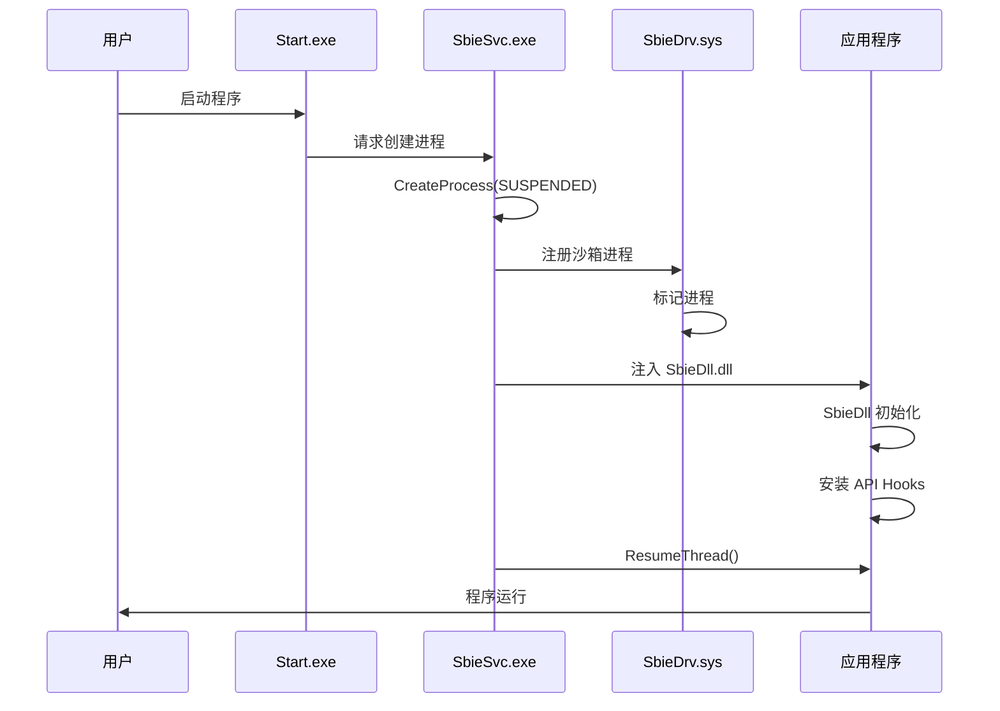
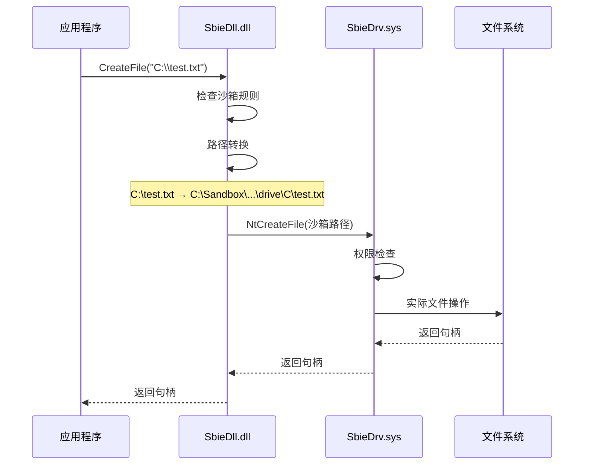

# Sandboxie 架构总览

> 本文档提供 Sandboxie 项目的架构概览，是快速理解项目的入口文档

## 三层架构

```
┌─────────────────────────────────────────────────────────┐
│                    应用程序层                              │
│              (被沙箱化的应用程序)                          │
└────────────────────┬────────────────────────────────────┘
                     │
┌────────────────────▼────────────────────────────────────┐
│                 SbieDll.dll                              │
│            (用户态 Hook 和重定向)                         │
│  • API Hooking (CreateFile, RegSetValue...)             │
│  • 路径转换 (真实路径 ↔ 沙箱路径)                         │
│  • 与 SbieSvc 通信 (LPC)                                 │
└────────────────────┬────────────────────────────────────┘
                     │
        ┌────────────┴────────────┐
        │                         │
┌───────▼──────┐         ┌───────▼──────────┐
│  SbieSvc.exe │         │   SbieDrv.sys    │
│  (系统服务)   │◄────────┤   (内核驱动)      │
│              │  IOCTL  │                  │
└──────────────┘         └──────────────────┘
        │                         │
┌───────▼─────────────────────────▼──────────────────────┐
│              Windows 操作系统内核                         │
└─────────────────────────────────────────────────────────┘
```

## 核心模块

### 1. SbieDrv.sys - 内核驱动层

**位置**：`Sandboxie/core/drv/`  
**代码量**：约 50,000 行  
**语言**：C

**职责**：
- 系统调用拦截（Syscall Hooking）
- 文件系统过滤（Minifilter）
- 进程创建监控
- 内核对象访问控制
- 强制执行沙箱策略

**关键文件**：
- `driver.c` - 驱动入口
- `api.c` - IOCTL 接口
- `process.c` - 进程管理
- `file.c` - 文件系统虚拟化
- `key.c` - 注册表虚拟化
- `ipc.c` - IPC 隔离
- `syscall.c` - 系统调用拦截

### 2. SbieDll.dll - 用户态 DLL 层

**位置**：`Sandboxie/core/dll/`  
**代码量**：约 40,000 行  
**语言**：C

**职责**：
- Windows API Hooking
- 路径重定向和转换
- 与服务层通信
- 实现用户态隔离策略

**关键文件**：
- `dll.c` - DLL 入口
- `hook.c` - Hook 框架
- `file.c` - 文件 API Hook
- `key.c` - 注册表 API Hook
- `proc.c` - 进程 API Hook
- `ipc.c` - IPC API Hook

### 3. SbieSvc.exe - 系统服务层

**位置**：`Sandboxie/core/svc/`  
**代码量**：约 30,000 行  
**语言**：C++

**职责**：
- 驱动管理和通信
- 进程创建代理
- 配置管理
- 权限提升代理
- 网络过滤代理

**关键文件**：
- `main.cpp` - 服务入口
- `ProcessServer.cpp` - 进程服务器
- `DriverAssist.cpp` - 驱动助手
- `SbieIniServer.cpp` - 配置服务器
- `PipeServer.cpp` - 管道服务器

### 4. QSbieAPI - API 封装层

**位置**：`SandboxiePlus/QSbieAPI/`  
**代码量**：约 15,000 行  
**语言**：C++ / Qt

**职责**：
- 封装底层驱动通信
- 提供面向对象的 API
- 管理沙箱和进程对象

**关键类**：
- `CSbieAPI` - 主 API 类
- `CSandBox` - 沙箱对象
- `CSbieProcess` - 进程对象
- `CSbieIni` - 配置管理

### 5. SandMan.exe - GUI 层

**位置**：`SandboxiePlus/SandMan/`  
**代码量**：约 25,000 行  
**语言**：C++ / Qt

**职责**：
- 用户界面
- 沙箱管理
- 进程监控
- 配置编辑

**关键类**：
- `CSandMan` - 主窗口
- `CSbieView` - 沙箱视图
- `COptionsWindow` - 选项窗口
- `CSettingsWindow` - 设置窗口

## 通信机制

### 1. IOCTL 通信（驱动 ↔ 用户态）

```
用户态程序
    ↓ DeviceIoControl()
    ↓ 设备：\Device\SandboxieDriverApi
SbieDrv.sys
    ↓ Api_Ioctl_Dispatcher()
    ↓ 处理各种 IOCTL 命令
返回结果
```

**主要 IOCTL 命令**：
- `API_QUERY_PROCESS` - 查询进程信息
- `API_QUERY_BOX_PATH` - 查询沙箱路径
- `API_ENUM_PROCESSES` - 枚举进程
- `API_START_PROCESS` - 启动进程

### 2. LPC 通信（GUI/DLL ↔ 服务）

```
客户端（SandMan / SbieDll）
    ↓ NtConnectPort()
    ↓ 端口：\RPC Control\SbieSvcPort
SbieSvc.exe
    ↓ PipeServer 处理请求
    ↓ 分发到各个子服务器
返回结果
```

### 3. 命名管道通信

用于沙箱内进程与服务的通信：
- `\\.\pipe\SandboxieDriverApi_*` - 驱动 API 管道
- `\\.\pipe\SandboxieSvcPort_*` - 服务端口管道

## 核心流程

### 进程启动流程



### 文件操作流程



## 隔离机制

### 1. 文件系统隔离

**写时复制（Copy-on-Write）**：
- 读操作：先查沙箱目录，不存在则读原始路径
- 写操作：重定向到沙箱目录，首次写入时复制原文件

**配置项**：
- `OpenFilePath` - 允许直接访问的路径
- `ClosedFilePath` - 禁止访问的路径
- `ReadFilePath` - 只读访问的路径
- `WriteFilePath` - 可写访问的路径

### 2. 注册表隔离

**虚拟化机制**：
- 沙箱注册表存储在：`HKEY_USERS\Sandbox_<SID>_<BoxName>`
- 读操作：合并沙箱注册表和系统注册表
- 写操作：重定向到沙箱注册表

**配置项**：
- `OpenKeyPath` - 允许直接访问的键
- `ClosedKeyPath` - 禁止访问的键
- `ReadKeyPath` - 只读访问的键
- `WriteKeyPath` - 可写访问的键

### 3. 进程隔离

**隔离措施**：
- 限制进程令牌权限
- 阻止跨沙箱进程访问
- 控制进程创建
- 限制句柄继承

**配置项**：
- `OpenPipePath` - 允许访问的管道
- `ClosedIpcPath` - 禁止访问的 IPC 对象
- `OpenWinClass` - 允许访问的窗口类

### 4. 网络隔离

**过滤机制**：
- WFP（Windows Filtering Platform）过滤
- 基于规则的允许/阻止
- 支持进程级和沙箱级规则

**配置项**：
- `ClosedFilePath=!<pipe>,\\Device\\Afd` - 完全阻止网络
- `OpenFilePath=\\Device\\Afd` - 允许网络访问

## 配置系统

### Sandboxie.ini 结构

```ini
[GlobalSettings]
FileRootPath=C:\Sandbox\%USER%\%SANDBOX%

[DefaultBox]
Enabled=y
OpenFilePath=%AppData%
ClosedFilePath=!<pipe>,\\Device\\Afd
Template=Firefox
```

### 配置传播路径

```
Sandboxie.ini 文件
    ↓ 读取
SbieSvc (SbieIniServer)
    ↓ IOCTL 传递
SbieDrv (conf.c)
    ↓ 缓存到 BOX 结构
SbieDll 查询使用
```

## 数据结构

### 核心结构体

#### PROCESS（驱动层）

```c
typedef struct _PROCESS {
    ULONG pid;                  // 进程 ID
    BOX *box;                   // 所属沙箱
    HANDLE process_id;          // 进程句柄
    PEPROCESS process_object;   // 进程对象
    BOOLEAN is_sandboxed;       // 是否沙箱化
    // ... 更多字段
} PROCESS;
```

#### BOX（驱动层）

```c
typedef struct _BOX {
    WCHAR name[34];             // 沙箱名称
    ULONG session_id;           // 会话 ID
    LIST_ENTRY list_entry;      // 链表节点
    // 配置缓存
    WCHAR *file_root_path;
    // ... 更多字段
} BOX;
```

#### CSandBox（API 层）

```cpp
class CSandBox : public QObject {
    QString m_Name;             // 沙箱名称
    QMap<QString, QString> m_Settings;  // 配置项
    QMap<quint32, CSbieProcess*> m_Processes;  // 进程列表
    // ... 更多成员
};
```

## 安全模型

### 信任边界

```
不可信区域（沙箱内）
    ↕ 严格验证
可信区域（沙箱外）
```

### 多层防护

1. **内核层**：强制执行策略，不可绕过
2. **DLL 层**：用户态拦截，提高性能
3. **服务层**：权限代理，安全检查
4. **配置层**：灵活的规则系统

### 攻击面

- 驱动 IOCTL 接口
- DLL Hook 绕过
- 配置解析漏洞
- 权限提升漏洞

## 性能考虑

### 优化策略

1. **缓存机制**：配置缓存、路径缓存
2. **延迟加载**：按需加载模块
3. **异步处理**：非关键操作异步化
4. **内存池**：减少内存分配开销

### 性能瓶颈

- 文件操作重定向
- 注册表合并查询
- 系统调用拦截开销
- 进程创建延迟

## 兼容性

### 支持的系统

- Windows 7 SP1 (x64)
- Windows 8/8.1 (x64)
- Windows 10 (x64/ARM64)
- Windows 11 (x64/ARM64)

### 已知限制

- 不支持 32 位系统
- 某些内核模式程序无法沙箱化
- 部分反作弊系统不兼容
- 某些驱动程序无法在沙箱中运行

## 参考资源

- [项目全景分析](../../docs/ai-analysis/00-PROJECT-OVERVIEW.md)
- [内核驱动层分析](../../docs/ai-analysis/modules/01-kernel-driver-layer.md)
- [服务层分析](../../docs/ai-analysis/modules/02-service-layer.md)
- [GUI 层分析](../../docs/ai-analysis/modules/03-gui-layer.md)
