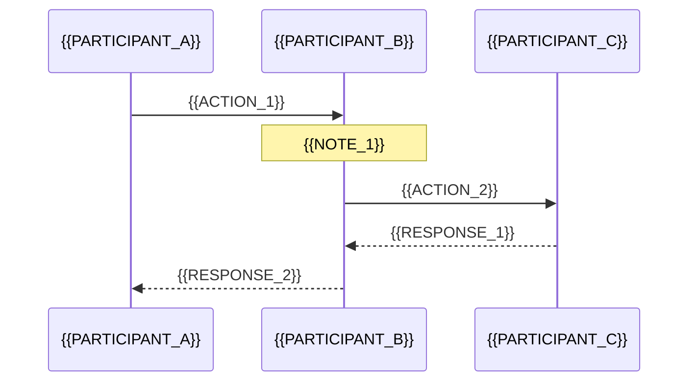

## 流程名：{{FLOW_NAME}}

### 基本信息

- **流程类型**：{{FLOW_TYPE}}（启动流程/操作流程/通信流程等）
- **涉及层级**：{{LAYERS}}（驱动层/DLL层/服务层/GUI层）
- **复杂度**：{{COMPLEXITY}}（简单/中等/复杂）

---

### 流程概述

{{简要描述流程的目的和作用（2-3 句话）}}

---

### 触发条件

#### 触发方式

- **方式 1**：{{TRIGGER_1}}
- **方式 2**：{{TRIGGER_2}}

#### 前置条件

- {{PRECONDITION_1}}
- {{PRECONDITION_2}}

---

### 执行步骤

#### 详细步骤

1. **{{STEP_1_TITLE}}**
   - 位置：`{{STEP_1_LOCATION}}`
   - 说明：{{STEP_1_DESCRIPTION}}
   - 关键函数：`{{STEP_1_FUNCTION}}`

2. **{{STEP_2_TITLE}}**
   - 位置：`{{STEP_2_LOCATION}}`
   - 说明：{{STEP_2_DESCRIPTION}}
   - 关键函数：`{{STEP_2_FUNCTION}}`

3. **{{STEP_3_TITLE}}**
   - 位置：`{{STEP_3_LOCATION}}`
   - 说明：{{STEP_3_DESCRIPTION}}
   - 关键函数：`{{STEP_3_FUNCTION}}`

---

### 时序图



---

### 流程图

```mermaid
flowchart TD
    A[{{START_NODE}}] --> B{{{DECISION_1}}}
    B -->|{{CONDITION_1}}| C[{{PROCESS_1}}]
    B -->|{{CONDITION_2}}| D[{{PROCESS_2}}]
    C --> E{{{DECISION_2}}}
    E -->|{{CONDITION_3}}| F[{{PROCESS_3}}]
    E -->|{{CONDITION_4}}| G[{{PROCESS_4}}]
    D --> H[{{END_NODE}}]
    F --> H
    G --> H
```

---

### 涉及的模块

#### 驱动层

- **模块**：`{{DRV_MODULE_1}}`
- **文件**：`{{DRV_FILE_1}}`
- **职责**：{{DRV_RESPONSIBILITY_1}}

#### DLL 层

- **模块**：`{{DLL_MODULE_1}}`
- **文件**：`{{DLL_FILE_1}}`
- **职责**：{{DLL_RESPONSIBILITY_1}}

#### 服务层

- **模块**：`{{SVC_MODULE_1}}`
- **文件**：`{{SVC_FILE_1}}`
- **职责**：{{SVC_RESPONSIBILITY_1}}

#### GUI 层

- **模块**：`{{GUI_MODULE_1}}`
- **文件**：`{{GUI_FILE_1}}`
- **职责**：{{GUI_RESPONSIBILITY_1}}

---

### 关键函数

#### 函数列表

| 函数名 | 位置 | 职责 | 调用时机 |
|--------|------|------|---------|
| `{{FUNCTION_1}}` | {{LOCATION_1}} | {{RESPONSIBILITY_1}} | {{TIMING_1}} |
| `{{FUNCTION_2}}` | {{LOCATION_2}} | {{RESPONSIBILITY_2}} | {{TIMING_2}} |
| `{{FUNCTION_3}}` | {{LOCATION_3}} | {{RESPONSIBILITY_3}} | {{TIMING_3}} |

#### 调用链

```mermaid
graph TD
    A[{{FUNCTION_1}}] --> B[{{FUNCTION_2}}]
    A --> C[{{FUNCTION_3}}]
    B --> D[{{FUNCTION_4}}]
    C --> D
    D --> E[{{FUNCTION_5}}]
```

---

### 数据流

#### 数据传递路径

```
{{DATA_SOURCE}}
    ↓ {{DATA_TRANSFORM_1}}
{{INTERMEDIATE_1}}
    ↓ {{DATA_TRANSFORM_2}}
{{INTERMEDIATE_2}}
    ↓ {{DATA_TRANSFORM_3}}
{{DATA_DESTINATION}}
```

#### 数据结构

- **输入数据**：`{{INPUT_STRUCT}}`
- **中间数据**：`{{INTERMEDIATE_STRUCT}}`
- **输出数据**：`{{OUTPUT_STRUCT}}`

#### 数据流图

```mermaid
graph LR
    A[{{DATA_1}}] --> B[{{PROCESS_1}}]
    B --> C[{{DATA_2}}]
    C --> D[{{PROCESS_2}}]
    D --> E[{{DATA_3}}]
```

---

### 通信机制

#### 跨层通信

| 源 | 目标 | 机制 | 数据格式 |
|----|------|------|---------|
| {{SOURCE_1}} | {{TARGET_1}} | {{MECHANISM_1}} | {{FORMAT_1}} |
| {{SOURCE_2}} | {{TARGET_2}} | {{MECHANISM_2}} | {{FORMAT_2}} |

#### 通信示例

```c
// 示例：{{COMMUNICATION_EXAMPLE_TITLE}}
{{COMMUNICATION_EXAMPLE_CODE}}
```

---

### 状态变化

#### 状态图

```mermaid
stateDiagram-v2
    [*] --> {{STATE_1}}
    {{STATE_1}} --> {{STATE_2}}: {{TRANSITION_1}}
    {{STATE_2}} --> {{STATE_3}}: {{TRANSITION_2}}
    {{STATE_3}} --> {{STATE_4}}: {{TRANSITION_3}}
    {{STATE_4}} --> [*]
```

#### 状态说明

| 状态 | 说明 | 持续时间 |
|------|------|---------|
| {{STATE_1}} | {{STATE_1_DESCRIPTION}} | {{STATE_1_DURATION}} |
| {{STATE_2}} | {{STATE_2_DESCRIPTION}} | {{STATE_2_DURATION}} |

---

### 异常处理

#### 可能的错误

| 错误类型 | 原因 | 处理方式 | 恢复策略 |
|---------|------|---------|---------|
| {{ERROR_1}} | {{ERROR_1_CAUSE}} | {{ERROR_1_HANDLING}} | {{ERROR_1_RECOVERY}} |
| {{ERROR_2}} | {{ERROR_2_CAUSE}} | {{ERROR_2_HANDLING}} | {{ERROR_2_RECOVERY}} |

#### 错误处理流程

```mermaid
flowchart TD
    A[检测到错误] --> B{错误类型}
    B -->|{{ERROR_TYPE_1}}| C[处理方式 1]
    B -->|{{ERROR_TYPE_2}}| D[处理方式 2]
    C --> E[记录日志]
    D --> E
    E --> F{是否可恢复}
    F -->|是| G[尝试恢复]
    F -->|否| H[终止流程]
```

---

### 性能分析

#### 性能指标

- **平均执行时间**：{{AVG_TIME}}
- **最大执行时间**：{{MAX_TIME}}
- **CPU 使用率**：{{CPU_USAGE}}
- **内存占用**：{{MEMORY_USAGE}}

#### 性能瓶颈

1. **{{BOTTLENECK_1}}**：{{BOTTLENECK_1_DESCRIPTION}}
2. **{{BOTTLENECK_2}}**：{{BOTTLENECK_2_DESCRIPTION}}

#### 优化建议

- {{OPTIMIZATION_1}}
- {{OPTIMIZATION_2}}

---

### 安全考虑

#### 安全检查点

1. **{{SECURITY_CHECK_1}}**
   - 位置：{{CHECK_1_LOCATION}}
   - 检查内容：{{CHECK_1_CONTENT}}

2. **{{SECURITY_CHECK_2}}**
   - 位置：{{CHECK_2_LOCATION}}
   - 检查内容：{{CHECK_2_CONTENT}}

#### 潜在风险

- ⚠️ {{RISK_1}}
- ⚠️ {{RISK_2}}

#### 缓解措施

- {{MITIGATION_1}}
- {{MITIGATION_2}}

---

### 并发控制

#### 同步机制

- **锁的使用**：{{LOCK_USAGE}}
- **临界区**：{{CRITICAL_SECTION}}
- **原子操作**：{{ATOMIC_OPERATIONS}}

#### 竞态条件

- **可能的竞态**：{{RACE_CONDITION}}
- **保护措施**：{{PROTECTION}}

---

### 配置影响

#### 相关配置项

| 配置项 | 影响 | 默认值 |
|--------|------|--------|
| {{CONFIG_1}} | {{CONFIG_1_IMPACT}} | {{CONFIG_1_DEFAULT}} |
| {{CONFIG_2}} | {{CONFIG_2_IMPACT}} | {{CONFIG_2_DEFAULT}} |

#### 配置示例

```ini
[{{SECTION}}]
{{CONFIG_1}}={{VALUE_1}}
{{CONFIG_2}}={{VALUE_2}}
```

---

### 日志记录

#### 日志点

1. **{{LOG_POINT_1}}**
   - 位置：{{LOG_1_LOCATION}}
   - 级别：{{LOG_1_LEVEL}}
   - 内容：{{LOG_1_CONTENT}}

2. **{{LOG_POINT_2}}**
   - 位置：{{LOG_2_LOCATION}}
   - 级别：{{LOG_2_LEVEL}}
   - 内容：{{LOG_2_CONTENT}}

#### 日志示例

```
{{LOG_EXAMPLE}}
```

---

### 调试技巧

#### 断点位置

- `{{BREAKPOINT_1}}` - {{BREAKPOINT_1_REASON}}
- `{{BREAKPOINT_2}}` - {{BREAKPOINT_2_REASON}}

#### 调试命令

```
// WinDbg 命令
{{WINDBG_COMMAND_1}}
{{WINDBG_COMMAND_2}}

// 查看关键变量
{{VARIABLE_INSPECTION}}
```

#### 常见问题排查

1. **问题**：{{ISSUE_1}}
   - **排查**：{{ISSUE_1_TROUBLESHOOTING}}
   - **解决**：{{ISSUE_1_SOLUTION}}

2. **问题**：{{ISSUE_2}}
   - **排查**：{{ISSUE_2_TROUBLESHOOTING}}
   - **解决**：{{ISSUE_2_SOLUTION}}

---

### 测试用例

#### 正常流程测试

```
测试步骤：
1. {{TEST_STEP_1}}
2. {{TEST_STEP_2}}
3. {{TEST_STEP_3}}

预期结果：
{{EXPECTED_RESULT}}
```

#### 异常流程测试

```
测试场景：{{ERROR_SCENARIO}}
测试步骤：
1. {{ERROR_TEST_STEP_1}}
2. {{ERROR_TEST_STEP_2}}

预期结果：
{{ERROR_EXPECTED_RESULT}}
```

---

### 相关流程

- [{{RELATED_FLOW_1}}]({{RELATED_FLOW_1_LINK}}) - {{RELATED_FLOW_1_DESCRIPTION}}
- [{{RELATED_FLOW_2}}]({{RELATED_FLOW_2_LINK}}) - {{RELATED_FLOW_2_DESCRIPTION}}

---

### 版本历史

| 版本 | 日期 | 变更说明 |
|------|------|---------|
| {{VERSION_1}} | {{DATE_1}} | {{CHANGE_1}} |
| {{VERSION_2}} | {{DATE_2}} | {{CHANGE_2}} |

---

### 参考资料

- [相关文档 1]({{REFERENCE_1_LINK}})
- [相关文档 2]({{REFERENCE_2_LINK}})
- [Windows 文档]({{WINDOWS_DOC_LINK}})

---

### TODO / 改进建议

- [ ] {{TODO_1}}
- [ ] {{TODO_2}}
- [ ] {{IMPROVEMENT_1}}

---

**分析日期**：{{ANALYSIS_DATE}}  
**分析者**：{{ANALYZER}}
