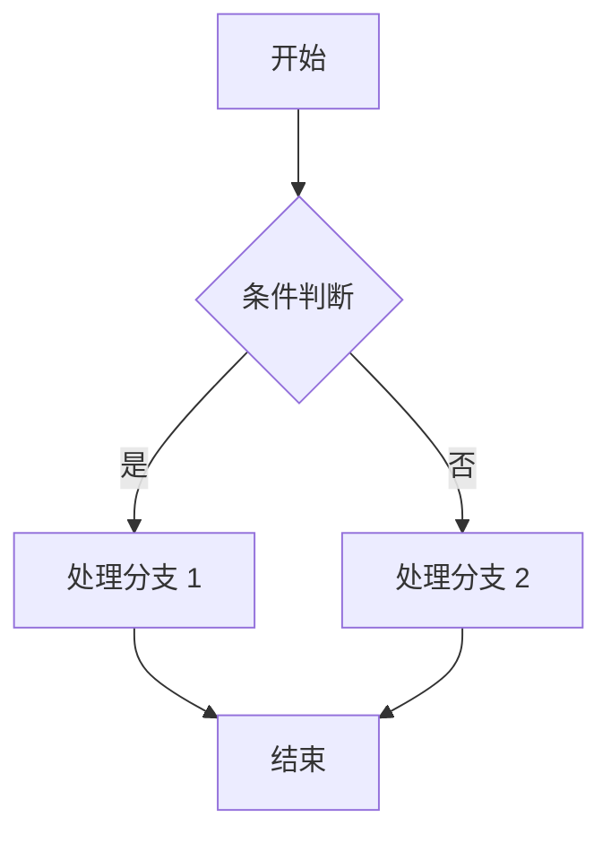
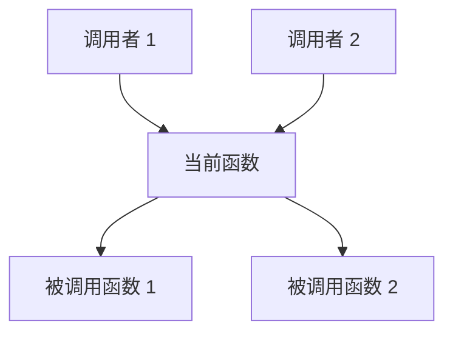

## 函数名：{{FUNCTION_NAME}}

### 基本信息

- **文件位置**：`{{FILE_PATH}}`
- **行号范围**：{{START_LINE}} - {{END_LINE}}
- **函数签名**：
  ```c
  {{RETURN_TYPE}} {{FUNCTION_NAME}}({{PARAMETERS}})
  ```
- **调用约定**：{{CALLING_CONVENTION}}

---

### 功能描述

{{简要描述函数的功能（1-2 句话）}}

---

### 参数说明

| 参数名 | 类型 | 方向 | 说明 |
|--------|------|------|------|
| {{PARAM_NAME}} | {{PARAM_TYPE}} | IN/OUT/INOUT | {{PARAM_DESCRIPTION}} |

---

### 返回值

**类型**：`{{RETURN_TYPE}}`

**说明**：
- `{{VALUE_1}}` - {{DESCRIPTION_1}}
- `{{VALUE_2}}` - {{DESCRIPTION_2}}

---

### 核心逻辑

#### 执行步骤

1. **步骤 1**：{{STEP_1_DESCRIPTION}}
2. **步骤 2**：{{STEP_2_DESCRIPTION}}
3. **步骤 3**：{{STEP_3_DESCRIPTION}}

#### 流程图



---

### 调用关系

#### 被调用者（谁调用此函数）

- `{{CALLER_FUNCTION_1}}` - {{CALLER_DESCRIPTION_1}}
- `{{CALLER_FUNCTION_2}}` - {{CALLER_DESCRIPTION_2}}

#### 调用者（此函数调用谁）

- `{{CALLEE_FUNCTION_1}}` - {{CALLEE_DESCRIPTION_1}}
- `{{CALLEE_FUNCTION_2}}` - {{CALLEE_DESCRIPTION_2}}

#### 调用链图



---

### 关键代码片段

```c
// 关键代码段 1：{{CODE_SECTION_1_TITLE}}
{{CODE_SECTION_1}}

// 关键代码段 2：{{CODE_SECTION_2_TITLE}}
{{CODE_SECTION_2}}
```

---

### 数据结构

#### 使用的结构体

- `{{STRUCT_1}}` - {{STRUCT_1_DESCRIPTION}}
- `{{STRUCT_2}}` - {{STRUCT_2_DESCRIPTION}}

#### 使用的全局变量

- `{{GLOBAL_VAR_1}}` - {{GLOBAL_VAR_1_DESCRIPTION}}
- `{{GLOBAL_VAR_2}}` - {{GLOBAL_VAR_2_DESCRIPTION}}

---

### 设计要点

#### 设计考虑

1. **{{DESIGN_POINT_1_TITLE}}**：{{DESIGN_POINT_1_DESCRIPTION}}
2. **{{DESIGN_POINT_2_TITLE}}**：{{DESIGN_POINT_2_DESCRIPTION}}

#### 注意事项

- ⚠️ {{CAUTION_1}}
- ⚠️ {{CAUTION_2}}

#### 优势

- ✅ {{ADVANTAGE_1}}
- ✅ {{ADVANTAGE_2}}

---

### 错误处理

#### 可能的错误

| 错误码/返回值 | 原因 | 处理方式 |
|--------------|------|---------|
| {{ERROR_1}} | {{ERROR_1_REASON}} | {{ERROR_1_HANDLING}} |
| {{ERROR_2}} | {{ERROR_2_REASON}} | {{ERROR_2_HANDLING}} |

---

### 性能考虑

- **时间复杂度**：{{TIME_COMPLEXITY}}
- **空间复杂度**：{{SPACE_COMPLEXITY}}
- **性能瓶颈**：{{PERFORMANCE_BOTTLENECK}}
- **优化建议**：{{OPTIMIZATION_SUGGESTION}}

---

### 安全考虑

- **输入验证**：{{INPUT_VALIDATION}}
- **权限检查**：{{PERMISSION_CHECK}}
- **潜在风险**：{{SECURITY_RISK}}
- **缓解措施**：{{MITIGATION}}

---

### 线程安全性

- **是否线程安全**：{{THREAD_SAFE_YES_NO}}
- **同步机制**：{{SYNCHRONIZATION_MECHANISM}}
- **竞态条件**：{{RACE_CONDITION}}

---

### 使用示例

```c
// 示例 1：{{EXAMPLE_1_TITLE}}
{{EXAMPLE_1_CODE}}

// 示例 2：{{EXAMPLE_2_TITLE}}
{{EXAMPLE_2_CODE}}
```

---

### 相关函数

- `{{RELATED_FUNCTION_1}}` - {{RELATED_FUNCTION_1_DESCRIPTION}}
- `{{RELATED_FUNCTION_2}}` - {{RELATED_FUNCTION_2_DESCRIPTION}}

---

### 历史变更

| 日期 | 版本 | 变更说明 |
|------|------|---------|
| {{DATE_1}} | {{VERSION_1}} | {{CHANGE_1}} |
| {{DATE_2}} | {{VERSION_2}} | {{CHANGE_2}} |

---

### 参考资料

- [相关文档 1]({{REFERENCE_1_LINK}})
- [相关文档 2]({{REFERENCE_2_LINK}})

---

### TODO / FIXME

- [ ] {{TODO_1}}
- [ ] {{TODO_2}}

---

**分析日期**：{{ANALYSIS_DATE}}  
**分析者**：{{ANALYZER}}
