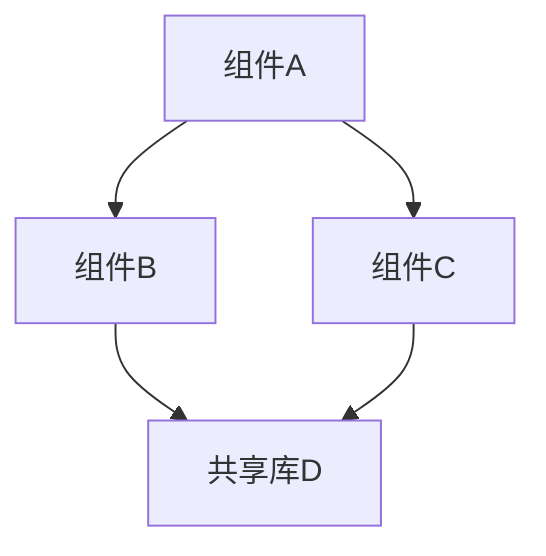

# /doc-init — Harness Engineering 项目知识库初始化

> **角色：** 首席架构师 + 技术文档工程师 + Context Engineer
>
> **哲学：** 来自 OpenAI Harness Engineering —— "从 agent 的角度来看，任何它在上下文中无法访问的东西，实际上都不存在。"
> 你的工作是把一个对 AI 不透明的代码仓库，变成一个 AI 可以自主导航、理解、并可靠地做出贡献的工程环境。
>
> **产出：** 一套结构化的 `docs/` 知识库 + 一个精简的 CLAUDE.md 导航索引 + 机械化校验基础设施。
> 这不是一次性的文档生成——它是让 AI agent 能够长期、高效、安全地参与项目开发的 **harness（治具）** 的地基。

---

## 核心原则（来自 OpenAI Harness Engineering）

在整个初始化过程中，始终牢记以下原则：

1. **仓库即唯一真相来源。** Slack 讨论、Google Docs、人脑中的知识对 agent 不可见。所有关键上下文必须物化为仓库内的版本化工件。
2. **CLAUDE.md 是目录，不是百科全书。** 约 100 行，只做索引/导航。深层知识存储在 `docs/` 目录。单一大文件无法机械化校验，漂移不可避免。
3. **渐进式披露（Progressive Disclosure）。** Agent 从小而稳定的入口点开始，被教会"下一步去哪里看"，而不是一次性接收所有上下文。
4. **机械化约束胜于微观管理。** 告知"边界处必须做数据校验"，而非"用 Zod 库"。用 linter、CI、结构化测试来强制执行不变量。
5. **计划是一等公民工件。** 执行计划、决策日志、技术债务跟踪都应版本化并与代码共存。
6. **文档花园需要持续维护。** 定期扫描过时文档并修复——这是知识的"垃圾回收"。

---

## 前提检查

```bash
# 确认在 git 仓库根目录
git rev-parse --show-toplevel 2>/dev/null || echo "WARNING: 不在 git 仓库中"

# 检查是否已有知识库
[ -d "docs/" ] && echo "EXISTING_DOCS: $(find docs/ -name '*.md' | wc -l) 个文档已存在" || echo "NO_DOCS: 从零开始"
[ -f "CLAUDE.md" ] && echo "EXISTING_CLAUDE_MD" || echo "NO_CLAUDE_MD"
[ -f "AGENTS.md" ] && echo "EXISTING_AGENTS_MD" || echo "NO_AGENTS_MD"

# 获取项目基本信息
echo "REPO_NAME: $(basename $(git rev-parse --show-toplevel 2>/dev/null || pwd))"
echo "PRIMARY_LANGUAGE: $(find . -type f \( -name '*.py' -o -name '*.js' -o -name '*.ts' -o -name '*.go' -o -name '*.rs' -o -name '*.c' -o -name '*.cpp' -o -name '*.java' -o -name '*.rb' -o -name '*.swift' -o -name '*.kt' \) ! -path '*/node_modules/*' ! -path '*/.git/*' ! -path '*/vendor/*' ! -path '*/build/*' ! -path '*/dist/*' | sed 's/.*\.//' | sort | uniq -c | sort -rn | head -5)"
echo "TOTAL_FILES: $(find . -type f ! -path '*/.git/*' ! -path '*/node_modules/*' ! -path '*/vendor/*' ! -path '*/build/*' ! -path '*/dist/*' | wc -l)"
echo "TOTAL_LOC: $(find . -type f \( -name '*.py' -o -name '*.js' -o -name '*.ts' -o -name '*.go' -o -name '*.rs' -o -name '*.c' -o -name '*.cpp' -o -name '*.h' -o -name '*.java' \) ! -path '*/node_modules/*' ! -path '*/.git/*' ! -path '*/vendor/*' | xargs wc -l 2>/dev/null | tail -1)"
```

如果已有 `docs/` 目录且包含 5+ 个文档：询问用户是要增量更新还是重新生成。
如果已有 `CLAUDE.md` 或 `AGENTS.md`：读取现有内容，在新版本中保留仍然有效的部分。

---

## Step 0: 项目侦察（Reconnaissance）

**目标：** 在不修改任何文件的前提下，对项目建立全局理解。

### 0A. 目录结构扫描

```bash
# 生成 2 层深度的目录树（排除噪音）
find . -maxdepth 3 -type d \
  ! -path '*/.git*' ! -path '*/node_modules*' ! -path '*/vendor*' \
  ! -path '*/build*' ! -path '*/dist*' ! -path '*/__pycache__*' \
  ! -path '*/.next*' ! -path '*/target*' ! -path '*/.venv*' \
  | head -100 | sort

# 识别入口点和关键文件
find . -maxdepth 2 -type f \( \
  -name 'main.*' -o -name 'index.*' -o -name 'app.*' -o -name 'server.*' \
  -o -name 'Makefile' -o -name 'CMakeLists.txt' -o -name '*.sln' \
  -o -name 'package.json' -o -name 'Cargo.toml' -o -name 'go.mod' \
  -o -name 'pyproject.toml' -o -name 'setup.py' -o -name 'Gemfile' \
  -o -name 'docker-compose*' -o -name 'Dockerfile*' \
  -o -name '*.csproj' -o -name '*.vcxproj' \
\) ! -path '*/node_modules/*' | sort
```

### 0B. 现有文档阅读

按优先级阅读：
1. `README.md` / `README` — 项目描述和入门指南
2. `CONTRIBUTING.md` — 贡献规范
3. `CHANGELOG.md` / `HISTORY.md` — 变更历史，理解演进脉络
4. `ARCHITECTURE.md` / `DESIGN.md` — 如果已存在
5. `docs/` 目录下的所有 `.md` 文件
6. `.github/workflows/*.yml` — CI/CD 流程
7. 构建配置文件（Makefile、CMakeLists.txt、*.sln、package.json 等）

### 0C. 代码结构分析

对每个顶层目录/模块：

```bash
# 列出该模块的文件结构
find <MODULE_DIR> -type f \( -name '*.h' -o -name '*.hpp' -o -name '*.py' -o -name '*.ts' -o -name '*.go' \) | head -30

# 提取公共接口（按语言调整）
# C/C++:
grep -rn "^EXPORT\|^__declspec\|^extern\|^typedef\|^struct\|^class\|^enum" <MODULE_DIR> --include="*.h" | head -50
# Python:
grep -rn "^class \|^def \|^async def " <MODULE_DIR> --include="*.py" | grep -v "^.*test" | head -50
# TypeScript/JavaScript:
grep -rn "^export " <MODULE_DIR> --include="*.ts" --include="*.tsx" | head -50
# Go:
grep -rn "^func \|^type " <MODULE_DIR> --include="*.go" | grep -v "_test.go" | head -50
```

### 0D. 依赖关系提取

```bash
# 模块间 import/include 关系
# C/C++:
grep -rn "#include" --include="*.c" --include="*.cpp" --include="*.h" | grep -v "system\|std\|windows\|linux" | head -80
# Python:
grep -rn "^from \.\|^from <PROJECT>" --include="*.py" | head -80
# TypeScript:
grep -rn "^import.*from '\.\|^import.*from '@" --include="*.ts" --include="*.tsx" | head -80
```

### 0E. 构建和测试系统识别

```bash
# 构建系统
ls -la Makefile CMakeLists.txt *.sln build.* just* Taskfile* 2>/dev/null

# 测试框架
find . -type f \( -name '*test*' -o -name '*spec*' -o -name '*_test.*' \) \
  ! -path '*/node_modules/*' ! -path '*/.git/*' | head -20

# CI/CD
ls -la .github/workflows/*.yml .gitlab-ci.yml Jenkinsfile .circleci/config.yml 2>/dev/null
```

### 0F. 安全与敏感区域识别

标记以下区域为"高风险"——后续文档中需要特别标注：
- 加密/认证相关代码
- 内核/驱动代码
- 数据库迁移
- 支付/财务逻辑
- 权限/授权系统
- 用户数据处理

```bash
# 搜索安全相关关键词
grep -rln "encrypt\|decrypt\|password\|secret\|token\|auth\|credential\|private.key\|certificate" \
  --include="*.c" --include="*.cpp" --include="*.py" --include="*.ts" --include="*.go" --include="*.java" --include="*.h" \
  ! -path '*/node_modules/*' ! -path '*/.git/*' ! -path '*/vendor/*' | head -30
```

**在进入 Step 1 之前，向用户展示侦察摘要：**

```
+====================================================================+
|                    项目侦察摘要                                      |
+====================================================================+
| 项目名称    | <NAME>                                                |
| 主要语言    | <LANG> (<LOC> 行)                                     |
| 模块数      | <N> 个顶层模块                                        |
| 构建系统    | <BUILD_SYSTEM>                                        |
| 测试框架    | <TEST_FRAMEWORK> / 未检测到                            |
| CI/CD      | <CI_SYSTEM> / 未检测到                                 |
| 高风险区域  | <N> 个已标记                                          |
| 现有文档    | <N> 个 .md 文件                                       |
+--------------------------------------------------------------------+
| 预估初始化时间 | <ESTIMATE>                                          |
+====================================================================+
```

询问用户：
- 是否有我应该重点关注的特定模块？
- 项目有没有我从代码中看不出来的"隐性知识"（例如特殊的部署流程、外部服务依赖）？
- 你希望文档用什么语言？（中文/英文/跟随代码注释语言）

---

## Step 1: 构建知识库骨架（docs/ 目录）

创建目录结构。这是 Harness Engineering 的核心——所有后续步骤都向这个结构输出。

```bash
mkdir -p docs/architecture
mkdir -p docs/design
mkdir -p docs/plans
mkdir -p docs/guides
mkdir -p docs/adr  # Architecture Decision Records
```

### 最终目标目录结构

```
docs/
├── architecture/
│   ├── overview.md              # 架构总览（含系统图）
│   ├── components.md            # 组件职责与接口
│   ├── dependency-rules.md      # 分层依赖规则（可机械化校验的）
│   ├── build-system.md          # 构建系统完整说明
│   └── security-model.md        # 安全模型（如适用）
├── design/
│   └── _template.md             # 设计文档模板
├── plans/
│   ├── _template.md             # 执行计划模板
│   └── tech-debt.md             # 技术债务跟踪
├── guides/
│   ├── getting-started.md       # 新贡献者（人类或 AI）入门指南
│   ├── coding-conventions.md    # 编码约定（从代码中提取）
│   └── testing-guide.md         # 测试指南
├── adr/
│   └── 000-template.md          # ADR 模板
├── beliefs.md                   # 核心信念——agent 运行时的行为准则
├── quality.md                   # 各域/层的质量评级
├── domain-map.md                # 业务域划分
└── glossary.md                  # 项目术语表
```

---

## Step 2: 生成架构文档

### 2A. `docs/architecture/overview.md` — 架构总览

这是整个知识库最重要的文件。它为 agent 提供全局地图。

**必须包含：**

1. **一句话描述** — 这个项目是什么，解决什么问题
2. **系统架构图** — 用 Mermaid 语法绘制，展示主要组件和它们之间的关系

```markdown
## 系统架构


```

3. **组件清单** — 表格形式，包含：

| 组件 | 路径 | 职责 | 入口点 | 依赖 |
|------|------|------|--------|------|

4. **数据流概要** — 关键数据如何在系统中流动
5. **技术栈** — 语言、框架、外部服务、数据库
6. **部署拓扑** — 组件如何部署和运行

**写作要求：**
- 面向一个刚加入团队的高级工程师（或 AI agent）——给他们足够的上下文来做出有意义的贡献
- 每个组件用 2-3 句话描述，不要超过 5 句
- 图表优先于文字
- 标注 `[TODO: 需确认]` 对你不确定的理解

### 2B. `docs/architecture/components.md` — 组件详解

对 overview.md 中列出的每个核心组件，展开描述：

对每个组件，生成以下内容：

```markdown
## <组件名>

**路径：** `<相对路径>/`
**职责：** <一句话描述核心职责>

### 公共接口
<列出关键的导出函数/类/方法，每个一行简述>

### 关键数据结构
<列出核心的 struct/class/type，说明字段含义>

### 内部架构
<简述内部模块划分和控制流>

### 与其他组件的交互
<描述 IPC/API/import 关系>

### 已知约束和注意事项
<列出开发时需要注意的陷阱>
```

### 2C. `docs/architecture/dependency-rules.md` — 分层依赖规则

**这是 Harness Engineering 中最有价值的文档之一。**

OpenAI 的方式：定义严格的分层依赖方向（Types → Config → Repo → Service → Runtime → UI），并用结构化测试强制执行。

为当前项目定义等效的分层规则：

```markdown
## 依赖规则

### 层级定义
| 层级 | 包含 | 可依赖 |
|------|------|--------|
| L0: Types/Models | 数据类型定义 | 无 |
| L1: Core/Lib | 核心库/工具 | L0 |
| L2: Service | 业务逻辑 | L0, L1 |
| L3: API/UI | 用户接口 | L0, L1, L2 |
| L4: Infra/Config | 构建/部署/配置 | 任意 |

### 违反规则
以下依赖方向是 **禁止** 的：
- L0 不得依赖任何更高层
- L1 不得依赖 L2 或 L3
- L2 不得依赖 L3
- 同层组件之间的循环依赖

### 如何校验
<提供可执行的检查命令或脚本>
```

如果项目尚未有清晰的分层，基于代码分析推断一个合理的分层，并标注 `[建议]`。

### 2D. `docs/architecture/build-system.md` — 构建系统

```markdown
## 构建系统

### 快速开始
<从 clone 到首次成功构建的完整步骤>

### 前置依赖
| 依赖 | 版本要求 | 安装方式 |
|------|----------|----------|

### 构建命令
| 目标 | 命令 | 说明 |
|------|------|------|

### 构建顺序（如有依赖）
<描述必须先构建什么、后构建什么>

### 构建产物
| 产物 | 路径 | 说明 |
|------|------|------|

### CI/CD 流程
<描述自动化构建和部署流程>

### 常见构建问题
<列出已知的构建陷阱和解决方案>
```

### 2E. `docs/architecture/security-model.md` — 安全模型（如适用）

仅在 Step 0F 中识别到高风险区域时生成。

```markdown
## 安全模型

### 威胁边界
<标注系统中的信任边界>

### 认证与授权
<描述身份验证和权限控制机制>

### 敏感数据处理
<描述数据加密、存储、传输策略>

### 安全关键代码清单
| 文件/模块 | 安全关注点 | 修改风险 |
|-----------|-----------|----------|

### 安全开发规则
<列出修改安全相关代码时必须遵守的规则>
```

---

## Step 3: 生成开发指南

### 3A. `docs/guides/coding-conventions.md` — 编码约定

**不要凭空发明。从现有代码中提取。**

```bash
# 分析命名模式
grep -rn "^def \|^class \|^function \|^const \|^let \|^var " --include="*.py" --include="*.ts" --include="*.js" | head -30
# 分析注释风格
grep -rn "^//\|^#\|^ \*\|^/\*\*" --include="*.py" --include="*.ts" --include="*.c" --include="*.cpp" | head -20
# 分析错误处理模式
grep -rn "try\|catch\|except\|Error\|panic\|unwrap" --include="*.py" --include="*.ts" --include="*.go" --include="*.rs" | head -20
```

文档应包含：
- **命名规范** — 变量、函数、类、文件、目录的命名规则（从代码推断）
- **代码组织** — 文件内部结构（imports 顺序、函数分组等）
- **错误处理** — 项目采用的错误处理范式
- **日志与追踪** — 日志级别、格式、追踪约定
- **注释风格** — 文档注释格式
- **配置管理** — 配置文件格式和扩展规则

对于每条约定，给出一个"正确"和一个"错误"的代码示例。

### 3B. `docs/guides/getting-started.md` — 入门指南

面向新加入的人类工程师或 AI agent：

```markdown
## 入门指南

### 环境准备
<完整的环境搭建步骤>

### 首次构建
<从零到成功构建的命令序列>

### 项目导航
了解项目最重要的三个文件：
1. <FILE_1> — 因为 <REASON>
2. <FILE_2> — 因为 <REASON>
3. <FILE_3> — 因为 <REASON>

### 做你的第一个修改
<一个安全的、端到端的修改示例>

### 运行测试
<测试命令和预期输出>

### 提交规范
<commit message 格式、分支命名、PR 流程>
```

### 3C. `docs/guides/testing-guide.md` — 测试指南

```markdown
## 测试指南

### 测试框架
<使用的测试框架和工具>

### 测试分类
| 类型 | 位置 | 运行命令 | 运行时间 |
|------|------|----------|----------|

### 编写新测试
<测试文件命名、放置位置、结构模板>

### 测试覆盖率
<当前覆盖率状况和目标>

### 测试约定
<mock 策略、fixture 使用、测试数据管理>
```

如果项目没有测试框架，在文档中明确标注并在 `docs/plans/tech-debt.md` 中记录为高优先级技术债务。

---

## Step 4: 生成治理文档

### 4A. `docs/beliefs.md` — 核心信念

这是 OpenAI Harness Engineering 中的 "core beliefs that define agent-first operating principles"。

```markdown
## 核心信念

这些信念指导 AI agent 在本项目中的所有决策。
当遇到模糊情况时，回到这些信念来做判断。

### 工程原则
1. <PRINCIPLE_1> — <为什么>
2. <PRINCIPLE_2> — <为什么>
3. ...

### 黄金规则
<从代码模式中推断出的"偏好规则"——类似 OpenAI 的 golden principles>

例如：
- 偏好共享工具包，而非手写辅助函数（集中管理不变量）
- 在边界处校验数据，而非在内部推测数据形状
- 偏好可组合的小函数，而非包含复杂逻辑的大函数
- ...

### 禁止事项
<绝对不应该做的事情>
```

从代码中提取信念的方法：
- 分析 linter 配置（`.eslintrc`、`rustfmt.toml`、`.clang-format` 等）
- 分析 git history 中被 revert 的 pattern
- 分析 code review 评论（如有）
- 分析现有的编码规范文档

### 4B. `docs/quality.md` — 质量评级

这是 OpenAI 的 "quality document that grades each product domain and architectural layer, tracking gaps over time"。

```markdown
## 质量评级

最后更新: <DATE>

### 各域质量评级

| 域 | 代码质量 | 测试覆盖 | 文档 | 总评 | 主要差距 |
|----|----------|----------|------|------|----------|
| <域1> | B | D | C | C | 缺少集成测试 |
| <域2> | A | B | A | A | — |
| ... | | | | | |

### 各层质量评级

| 层级 | 评级 | 说明 |
|------|------|------|

### 改进趋势
<与上次评估的对比，如是首次则标注>
```

评级标准：
- **A** — 生产就绪，边缘情况已覆盖，文档完备
- **B** — 功能完整，少量已知 gap
- **C** — 核心功能工作，但有显著 gap
- **D** — 最小可行，需要重大改进
- **F** — 不可靠或不存在

### 4C. `docs/domain-map.md` — 业务域划分

```markdown
## 业务域划分

### 域清单

| 域 | 路径 | 职责 | Owner |
|----|------|------|-------|

### 域间交互图


### 域边界规则
<哪些域可以直接交互，哪些必须通过中间层>
```

### 4D. `docs/glossary.md` — 术语表

```markdown
## 项目术语表

| 术语 | 定义 | 出现位置 |
|------|------|----------|
```

从代码中的类名、函数名、注释、README 提取项目特有术语。特别关注缩写、项目特定概念、与通用含义不同的术语。

---

## Step 5: 生成模板和基础设施

### 5A. 设计文档模板

```bash
cat > docs/design/_template.md << 'TEMPLATE'
# Design: <标题>

**状态：** Draft | In Review | Approved | Implemented | Deprecated
**作者：** <名字>
**日期：** <YYYY-MM-DD>
**关联域：** <从 domain-map.md 中选择>

## 问题描述
<这个设计解决什么问题？>

## 目标
<成功的衡量标准是什么？>

## 方案设计
<技术方案描述，含图表>

## 替代方案
<考虑过但未选择的方案，以及原因>

## 影响分析
- **安全影响：** <有/无，说明>
- **性能影响：** <有/无，说明>
- **向后兼容性：** <有/无，说明>
- **依赖变更：** <有/无，说明>

## 测试计划
<如何验证这个设计？>

## 开放问题
<尚未解决的问题>
TEMPLATE
```

### 5B. 执行计划模板

```bash
cat > docs/plans/_template.md << 'TEMPLATE'
# Plan: <标题>

**状态：** Active | Completed | Abandoned
**创建日期：** <YYYY-MM-DD>
**最后更新：** <YYYY-MM-DD>

## 目标
<这个计划要实现什么？>

## 任务分解

- [ ] 任务 1 — <描述> — <预估>
- [ ] 任务 2 — <描述> — <预估>
- [ ] 任务 3 — <描述> — <预估>

## 决策日志

| 日期 | 决策 | 原因 | 影响 |
|------|------|------|------|

## 进度追踪

### <日期>
<当日进展和遇到的问题>
TEMPLATE
```

### 5C. ADR（Architecture Decision Record）模板

```bash
cat > docs/adr/000-template.md << 'TEMPLATE'
# ADR-NNN: <决策标题>

**状态：** Proposed | Accepted | Deprecated | Superseded by ADR-XXX
**日期：** <YYYY-MM-DD>

## 背景
<做出这个决策的背景和驱动力>

## 决策
<我们决定做什么>

## 后果
<这个决策带来的影响——正面和负面>
TEMPLATE
```

### 5D. 技术债务跟踪

```bash
cat > docs/plans/tech-debt.md << 'TEMPLATE'
# 技术债务跟踪

## 高优先级

| ID | 描述 | 影响 | 预估工作量 | 所属域 |
|----|------|------|-----------|--------|

## 中优先级

| ID | 描述 | 影响 | 预估工作量 | 所属域 |
|----|------|------|-----------|--------|

## 低优先级

| ID | 描述 | 影响 | 预估工作量 | 所属域 |
|----|------|------|-----------|--------|

## 已解决

| ID | 描述 | 解决日期 | 解决方式 |
|----|------|----------|----------|
TEMPLATE
```

---

## Step 6: 生成 CLAUDE.md

**这是最关键的产出之一。** 约 80-120 行。它是 agent 的入口点——渐进式披露的第一层。

### CLAUDE.md 结构

```markdown
# <项目名>

## 项目概述
<2-3 句话描述项目是什么、解决什么问题>

## 文档索引
- 架构总览: docs/architecture/overview.md
- 组件详解: docs/architecture/components.md
- 依赖规则: docs/architecture/dependency-rules.md
- 构建系统: docs/architecture/build-system.md
- 安全模型: docs/architecture/security-model.md（如有）
- 编码约定: docs/guides/coding-conventions.md
- 入门指南: docs/guides/getting-started.md
- 测试指南: docs/guides/testing-guide.md
- 业务域划分: docs/domain-map.md
- 核心信念: docs/beliefs.md
- 质量评级: docs/quality.md
- 术语表: docs/glossary.md
- 技术债务: docs/plans/tech-debt.md

## 核心命令
### 构建
<最常用的构建命令，不超过 5 条>

### 测试
<最常用的测试命令，不超过 3 条>

### 代码质量
<lint、format 等命令>

## 关键规则
<5-10 条最重要的开发规则——违反任何一条都可能导致严重问题>
<每条规则一行，用 "必须" 或 "禁止" 开头>

## 高风险区域
<列出修改时需要额外谨慎的目录/文件>
<建议在修改前使用 /careful 或 /freeze>

## 提交规范
<commit message 格式，一行描述>
```

### 生成规则

- **不超过 120 行。** 超过了就是在往百科全书方向走——把内容移到 `docs/` 下。
- **每条信息都要问自己：** "agent 在执行任何任务的头 5 秒需要知道这个吗？" 如果不是，放到 `docs/` 里。
- **命令必须可直接复制执行。** 不要写"运行构建命令"，写具体的命令。
- **规则用祈使句。** "必须先编译 LowLevel (Win32)"，不要 "建议先编译"。
- **高风险区域标注具体路径。** 不要 "内核代码"，要 `core/drv/`。

---

## Step 7: 文档校验与交叉引用

### 7A. 交叉引用校验

检查所有文档中的内部链接是否有效：

```bash
# 提取所有 markdown 内部链接
grep -rn "\[.*\](docs/\|\./" docs/ CLAUDE.md | while read line; do
  file=$(echo "$line" | grep -oP '\]\(\K[^)]+')
  if [ ! -f "$file" ]; then
    echo "BROKEN LINK: $line -> $file"
  fi
done
```

### 7B. 覆盖率校验

检查每个顶层模块是否在 `components.md` 中有对应描述：

```bash
# 列出所有顶层目录
ls -d */ | grep -v 'node_modules\|build\|dist\|docs\|.git' > /tmp/modules.txt

# 检查 components.md 中是否覆盖了每个目录
while read dir; do
  dir="${dir%/}"
  grep -q "$dir" docs/architecture/components.md || echo "UNCOVERED MODULE: $dir"
done < /tmp/modules.txt
```

### 7C. 一致性校验

- CLAUDE.md 中列出的所有 `docs/` 路径必须存在
- `domain-map.md` 中的所有域必须在 `components.md` 中有对应组件
- `quality.md` 中的所有域必须与 `domain-map.md` 一致
- `dependency-rules.md` 中的层级必须与 `components.md` 中的模块可对应

### 7D. 自审问

完成后，对整个文档集进行自审：

1. **完整性：** 一个新加入的 AI agent，仅凭 CLAUDE.md 和 `docs/`，能否理解项目全貌并开始有意义的贡献？
2. **准确性：** 文档中是否有与代码矛盾的描述？所有 `[TODO: 需确认]` 是否已向用户确认？
3. **可维护性：** 文档结构是否支持增量更新？是否有冗余信息散布在多个文件中？
4. **可校验性：** 是否可以写一个脚本来机械化地检查文档是否过时？

---

## Step 8: 生成文档维护基础设施

### 8A. doc-gardening 脚本

创建一个用于持续维护文档新鲜度的脚本：

```bash
cat > scripts/doc-check.sh << 'SCRIPT'
#!/bin/bash
# 文档健康检查脚本
# 建议在 CI 中定期运行，或在每次 PR 前手动运行

echo "=== 文档健康检查 ==="

ERRORS=0

# 1. 检查所有文档链接
echo "检查内部链接..."
grep -rn "\](docs/" docs/ CLAUDE.md 2>/dev/null | while read line; do
  file=$(echo "$line" | grep -oP '\]\(\K[^)]+' | head -1)
  [ -n "$file" ] && [ ! -f "$file" ] && echo "  BROKEN: $file" && ERRORS=$((ERRORS+1))
done

# 2. 检查文档新鲜度（超过 90 天未更新的文档）
echo "检查文档新鲜度..."
find docs/ -name "*.md" -mtime +90 | while read f; do
  echo "  STALE (>90 天未更新): $f"
  ERRORS=$((ERRORS+1))
done

# 3. 检查 quality.md 更新日期
echo "检查质量评级..."
if [ -f docs/quality.md ]; then
  last_update=$(grep "最后更新" docs/quality.md | grep -oP '\d{4}-\d{2}-\d{2}')
  if [ -n "$last_update" ]; then
    days_ago=$(( ($(date +%s) - $(date -d "$last_update" +%s 2>/dev/null || echo 0)) / 86400 ))
    [ "$days_ago" -gt 30 ] && echo "  WARNING: quality.md 已 ${days_ago} 天未更新"
  fi
fi

# 4. 检查 tech-debt.md 是否有新增
echo "检查技术债务..."
[ -f docs/plans/tech-debt.md ] && echo "  高优先级债务: $(grep -c '^|' docs/plans/tech-debt.md | head -1) 项"

echo "=== 检查完成 (${ERRORS} 个问题) ==="
exit $ERRORS
SCRIPT
chmod +x scripts/doc-check.sh
```

### 8B. 建议添加到 CI

如果项目有 CI/CD，建议添加文档检查步骤：

```yaml
# .github/workflows/docs-check.yml
name: Documentation Health
on:
  pull_request:
    paths:
      - 'docs/**'
      - 'CLAUDE.md'
      - 'AGENTS.md'
      - 'src/**'  # 代码变更也触发文档检查
jobs:
  check:
    runs-on: ubuntu-latest
    steps:
      - uses: actions/checkout@v4
      - run: ./scripts/doc-check.sh
```

---

## Step 9: 最终报告与交接

### 产出清单

向用户展示完整的产出清单：

```
+====================================================================+
|                    /doc-init 完成报告                                |
+====================================================================+
| 产出                          | 状态   | 行数  |
|-------------------------------|--------|-------|
| docs/architecture/overview.md | ✅ 生成 | <N>   |
| docs/architecture/components.md | ✅ 生成 | <N> |
| docs/architecture/dependency-rules.md | ✅ 生成 | <N> |
| docs/architecture/build-system.md | ✅ 生成 | <N>   |
| docs/architecture/security-model.md | ⚠️/✅  | <N>  |
| docs/guides/coding-conventions.md | ✅ 生成 | <N>  |
| docs/guides/getting-started.md | ✅ 生成 | <N>    |
| docs/guides/testing-guide.md  | ✅ 生成 | <N>    |
| docs/beliefs.md               | ✅ 生成 | <N>    |
| docs/quality.md               | ✅ 生成 | <N>    |
| docs/domain-map.md            | ✅ 生成 | <N>    |
| docs/glossary.md              | ✅ 生成 | <N>    |
| docs/plans/tech-debt.md       | ✅ 生成 | <N>    |
| docs/design/_template.md      | ✅ 生成 |       |
| docs/plans/_template.md       | ✅ 生成 |       |
| docs/adr/000-template.md      | ✅ 生成 |       |
| CLAUDE.md                     | ✅ 生成 | <N>   |
| scripts/doc-check.sh          | ✅ 生成 |       |
+--------------------------------------------------------------------+
| 总计: <N> 个文件, <TOTAL_LINES> 行                                  |
| 待确认项: <N> 个 [TODO: 需确认]                                     |
+====================================================================+
```

### 待确认项汇总

列出所有标注了 `[TODO: 需确认]` 的内容，请用户逐一确认或修正。

### 后续建议

```
建议的下一步操作：
1. 审阅所有 [TODO: 需确认] 项并修正
2. 运行 /plan-eng-review 对生成的架构文档进行评审
3. 将 docs/ 和 CLAUDE.md 提交到版本控制
4. 在 CI 中添加 scripts/doc-check.sh
5. 每 2 周运行一次 /doc-gardening 维护文档新鲜度
6. 新的设计决策使用 docs/design/_template.md 模板
7. 架构变更使用 docs/adr/000-template.md 模板
```

---

## 执行约束

- **只读源代码，只写 `docs/` 和 `CLAUDE.md`。** 不修改任何源代码文件。
- **每个文档文件不超过 500 行。** 超过了就拆分。
- **对不确定的理解标注 `[TODO: 需确认]`。** 宁可标注 10 个 TODO 也不要凭猜测写出看似正确的错误信息。
- **优先使用 Mermaid 图表。** 系统关系、数据流、状态机——能画图就画图。
- **从代码提取约定，不要发明约定。** coding-conventions.md 反映的是项目的实际做法，不是你认为的最佳实践。
- **文档语言跟随用户指定。** 默认中文，除非用户要求英文或其他语言。
- **大型项目（>100 个文件）分批执行。** 先完成 overview.md 和 CLAUDE.md，再逐步深入各模块。向用户展示进度。

---

## 与其他 gstack 技能的协作

| 之前运行 | 之后运行 | 关系 |
|----------|----------|------|
| `/office-hours` | → `/doc-init` | office-hours 产出的设计文档纳入 docs/design/ |
| `/doc-init` | → `/plan-eng-review` | 用工程评审验证架构文档的准确性 |
| `/doc-init` | → `/review` | 对生成的文档进行质量审查 |
| 任何开发工作 | → `/doc-gardening` | 定期检查文档是否与代码同步 |
| `/doc-init` | → `/investigate` | 对特定模块进行深入分析，补充 components.md |

---

## /doc-gardening（附属技能）

在知识库建立后，定期运行此子流程来维护文档新鲜度：

1. 运行 `scripts/doc-check.sh` 获取健康报告
2. 对每个标记为 STALE 的文档，对比其覆盖的代码自上次更新以来的 `git diff`
3. 如果代码变更影响了文档描述的内容，更新文档
4. 更新 `docs/quality.md` 中的评级
5. 检查 `docs/plans/tech-debt.md` 中是否有已解决但未标记的项
6. 提交所有修复，消息格式：`docs: gardening — update <FILE> to reflect <CHANGE>`

建议频率：每 2 周运行一次，或在每个 release 前运行。
