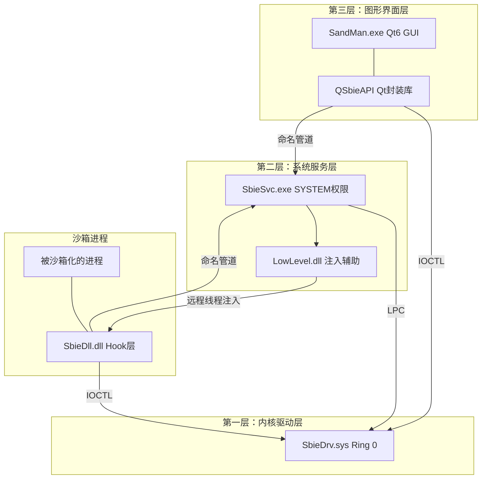
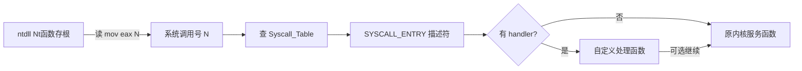
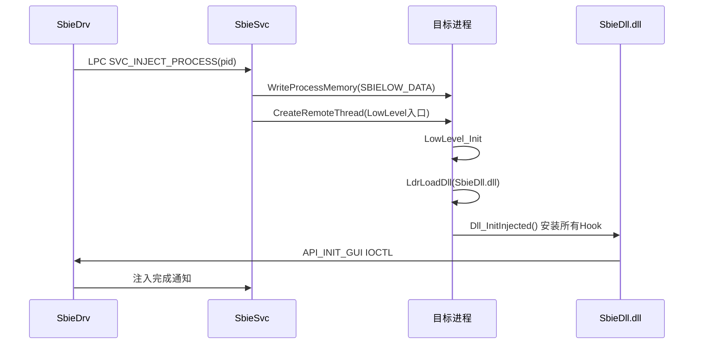
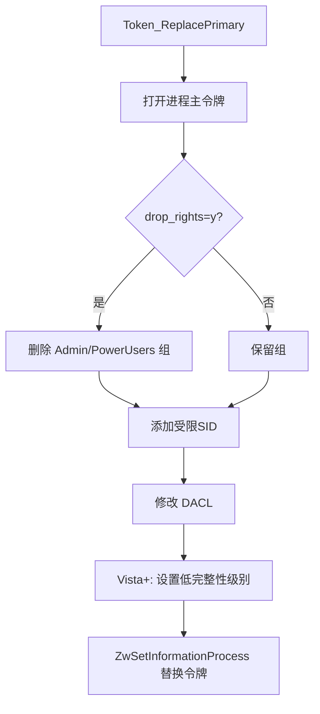

# Sandboxie 项目全景分析

> **文档版本**：1.0 | **分析日期**：2026-03-11
> **项目来源**：[Sandboxie-Plus](https://github.com/sandboxie-plus/Sandboxie)

---

## 目录

1. [项目简介](#1-项目简介)
2. [整体架构](#2-整体架构)
3. [核心模块详解](#3-核心模块详解)
4. [关键技术原理](#4-关键技术原理)
5. [完整进程生命周期](#5-完整进程生命周期)
6. [文件系统虚拟化](#6-文件系统虚拟化)
7. [注册表虚拟化](#7-注册表虚拟化)
8. [IPC 隔离](#8-ipc-隔离)
9. [安全模型](#9-安全模型)
10. [内核 API 汇总](#10-内核-api-汇总)
11. [配置系统](#11-配置系统)
12. [源码文件索引](#12-源码文件索引)

---

## 1. 项目简介

Sandboxie 是一个 **Windows 沙箱隔离系统**，允许用户在隔离环境中运行任意程序——所有文件写入、注册表修改、IPC 通信都被重定向到沙箱专属区域，不影响真实系统，可随时一键清除。

**典型使用场景**：
- 安全测试未知程序（防止恶意软件感染系统）
- 运行多个独立的浏览器会话
- 测试安装包而不污染真实注册表/文件系统
- 隔离运行过时/不受信任的软件

---

## 2. 整体架构

### 三层架构图



### 各层职责

| 层次 | 组件 | 权限 | 核心职责 |
|------|------|------|--------|
| 内核驱动 | SbieDrv.sys | Ring 0 | 强制隔离，系统调用/文件/注册表/IPC 拦截 |
| 系统服务 | SbieSvc.exe | SYSTEM | 驱动加载，DLL 注入，特权操作代理 |
| 用户 Hook | SbieDll.dll | 进程内 | API Hook，路径重定向，用户态过滤 |
| 图形界面 | SandMan.exe | 普通用户 | 沙箱管理，配置编辑，监控展示 |

---

## 3. 核心模块详解

### 3.1 SbieDrv.sys — 内核驱动

详见 [01-kernel-driver-layer.md](modules/01-kernel-driver-layer.md)

| 子系统 | 实现文件 | 技术机制 |
|--------|---------|--------|
| 进程监控 | `process.c` | `PsSetCreateProcessNotifyRoutineEx` |
| 文件虚拟化 | `file.c`, `file_flt.c` | FltMgr 微过滤器 |
| 注册表虚拟化 | `key.c`, `key_flt.c` | `CmRegisterCallbackEx` |
| IPC 隔离 | `ipc.c` | `ObRegisterCallbacks` |
| 令牌降权 | `token.c` | `SeFilterToken` + 完整性级别 |
| 线程保护 | `thread.c` | Object 回调 + 系统调用拦截 |
| 网络过滤 | `wfp.c` | Windows Filtering Platform |
| 系统调用拦截 | `syscall.c` | ntdll 扫描 + SSDT |
| API 接口 | `api.c` | Fast IO DeviceControl |

### 3.2 SbieDll.dll — 用户态 Hook

详见 [02-dll-layer.md](modules/02-dll-layer.md)

| 类别 | 代表 Hook API | 文件 |
|------|-------------|------|
| 文件 | `NtCreateFile`, `NtQueryDirectoryFile` | `file.c` |
| 注册表 | `NtOpenKey`, `NtSetValueKey` | `key.c` |
| 进程 | `CreateProcessInternalW` | `proc.c` |
| IPC | `NtOpenSection`, `NtCreatePort` | `ipc.c` |
| COM | `CoCreateInstance` | `com.c` |
| 网络 | `connect`, `getaddrinfo` | `net.c` |
| 服务 | `OpenSCManagerW` | `scm.c` |

### 3.3 SbieSvc.exe — 系统服务

详见 [03-service-layer.md](modules/03-service-layer.md)

| 组件 | 职责 |
|------|------|
| DriverAssist | 驱动加载、LPC 通信、DLL 注入协调 |
| ProcessServer | 进程启动/终止/挂起 |
| GuiServer | Job Object、窗口站管理 |
| FileServer | 文件特权操作代理 |
| IniServer | 配置文件读写 |
| ComServer | COM 激活代理 |

### 3.4 SandMan.exe — Qt6 GUI

详见 [04-app-layer.md](modules/04-app-layer.md)

---

## 延伸阅读

| 主题 | 文档 |
|------|------|
| 完整进程生命周期时序图 | [05-process-lifecycle.md](05-process-lifecycle.md) |
| 文件/注册表/IPC/安全模型详解 | [06-technical-details.md](06-technical-details.md) |
| 内核驱动层模块分析 | [modules/01-kernel-driver-layer.md](modules/01-kernel-driver-layer.md) |
| 用户态DLL层模块分析 | [modules/02-dll-layer.md](modules/02-dll-layer.md) |
| 系统服务层模块分析 | [modules/03-service-layer.md](modules/03-service-layer.md) |
| 图形界面层模块分析 | [modules/04-app-layer.md](modules/04-app-layer.md) |

### 文件级分析文档（74 个）

#### 内核驱动层 core/drv/

| 源文件 | 分析文档 |
|--------|--------|
| `driver.c` | [drv_driver.c.md](files/drv_driver.c.md) |
| `api.c` | [drv_api.c.md](files/drv_api.c.md) |
| `process.c` | [drv_process.c.md](files/drv_process.c.md) |
| `process_force.c` | [drv_process_force.c.md](files/drv_process_force.c.md) |
| `process_api.c` | [drv_process_api.c.md](files/drv_process_api.c.md) |
| `process_low.c` | [drv_process_low.c.md](files/drv_process_low.c.md) |
| `file.c` | [drv_file.c.md](files/drv_file.c.md) |
| `file_flt.c` | [drv_file_flt.c.md](files/drv_file_flt.c.md) |
| `key.c` | [drv_key.c.md](files/drv_key.c.md) |
| `key_flt.c` | [drv_key_flt.c.md](files/drv_key_flt.c.md) |
| `ipc.c` | [drv_ipc.c.md](files/drv_ipc.c.md) |
| `ipc_port.c` | [drv_ipc_port.c.md](files/drv_ipc_port.c.md) |
| `token.c` | [drv_token.c.md](files/drv_token.c.md) |
| `thread.c` | [drv_thread.c.md](files/drv_thread.c.md) |
| `thread_token.c` | [drv_thread_token.c.md](files/drv_thread_token.c.md) |
| `syscall.c` | [drv_syscall.c.md](files/drv_syscall.c.md) |
| `wfp.c` | [drv_wfp.c.md](files/drv_wfp.c.md) |
| `gui.c` | [drv_gui.c.md](files/drv_gui.c.md) |
| `conf.c` | [drv_conf.c.md](files/drv_conf.c.md) |
| `hook.c` | [drv_hook.c.md](files/drv_hook.c.md) |
| `box.c` | [drv_box.c.md](files/drv_box.c.md) |
| `obj.c` | [drv_obj.c.md](files/drv_obj.c.md) |
| `verify.c` | [drv_verify.c.md](files/drv_verify.c.md) |
| `log.c` | [drv_log.c.md](files/drv_log.c.md) |
| `session.c` | [drv_session.c.md](files/drv_session.c.md) |
| `dyn_data.c` | [drv_dyn_data.c.md](files/drv_dyn_data.c.md) |
| `process_force.c` | [drv_process_force.c.md](files/drv_process_force.c.md) |
| `process_api.c` | [drv_process_api.c.md](files/drv_process_api.c.md) |
| `process_low.c` | [drv_process_low.c.md](files/drv_process_low.c.md) |
| `process_hook.c` + `process_util.c` | [drv_process_hook.c.md](files/drv_process_hook.c.md) |
| `file_ctrl.c` + `file_xlat.c` | [drv_file_ctrl_xlat.c.md](files/drv_file_ctrl_xlat.c.md) |
| `file_flt.c` | [drv_file_flt.c.md](files/drv_file_flt.c.md) |
| `key_flt.c` | [drv_key_flt.c.md](files/drv_key_flt.c.md) |
| `ipc_port.c` | [drv_ipc_port.c.md](files/drv_ipc_port.c.md) |
| `ipc_lsa.c` + `ipc_sam.c` + `ipc_spl.c` | [drv_ipc_lsa_sam_spl.c.md](files/drv_ipc_lsa_sam_spl.c.md) |
| `thread_token.c` | [drv_thread_token.c.md](files/drv_thread_token.c.md) |
| `syscall_open.c` + `syscall_win32.c` + 系列 | [drv_syscall_variants.c.md](files/drv_syscall_variants.c.md) |
| `conf_expand.c` + `conf_user.c` | [drv_conf_expand.c.md](files/drv_conf_expand.c.md) |
| `mem.c` + `util.c` | [drv_mem_util.c.md](files/drv_mem_util.c.md) |
| `dll.c` | [drv_dll.c.md](files/drv_dll.c.md) |

#### 用户态 DLL 层 core/dll/

| 源文件 | 分析文档 |
|--------|--------|
| `dllmain.c` | [dll_dllmain.c.md](files/dll_dllmain.c.md) |
| `file.c` | [dll_file.c.md](files/dll_file.c.md) |
| `file_recovery.c` + `file_snapshots.c` | [dll_file_recovery.c.md](files/dll_file_recovery.c.md) |
| `key.c` | [dll_key.c.md](files/dll_key.c.md) |
| `proc.c` | [dll_proc.c.md](files/dll_proc.c.md) |
| `ipc.c` + `ipc_start.c` | [dll_ipc.c.md](files/dll_ipc.c.md) |
| `gui.c` + gui 系列 | [dll_gui.c.md](files/dll_gui.c.md) |
| `com.c` | [dll_com.c.md](files/dll_com.c.md) |
| `net.c` + `dns_filter.c` | [dll_net.c.md](files/dll_net.c.md) |
| `scm.c` + scm 系列 | [dll_scm.c.md](files/dll_scm.c.md) |
| `secure.c` | [dll_secure.c.md](files/dll_secure.c.md) |
| `ldr.c` + `ldr_init.c` | [dll_ldr.c.md](files/dll_ldr.c.md) |
| `advapi.c` | [dll_advapi.c.md](files/dll_advapi.c.md) |
| `handle.c` | [dll_handle.c.md](files/dll_handle.c.md) |
| `sbieapi.c` | [dll_sbieapi.c.md](files/dll_sbieapi.c.md) |
| `trace.c` | [dll_trace.c.md](files/dll_trace.c.md) |
| `hook_inst.c` + `hook_tramp.c` | [dll_hook_inst.c.md](files/dll_hook_inst.c.md) |
| `ipc.c` + `ipc_start.c` | [dll_ipc.c.md](files/dll_ipc.c.md) |
| `gui.c` + gui 系列 | [dll_gui.c.md](files/dll_gui.c.md) |
| `com.c` | [dll_com.c.md](files/dll_com.c.md) |
| `net.c` + `dns_filter.c` | [dll_net.c.md](files/dll_net.c.md) |
| `scm.c` + scm 系列 | [dll_scm.c.md](files/dll_scm.c.md) |
| `secure.c` | [dll_secure.c.md](files/dll_secure.c.md) |
| `ldr.c` + `ldr_init.c` | [dll_ldr.c.md](files/dll_ldr.c.md) |
| `advapi.c` | [dll_advapi.c.md](files/dll_advapi.c.md) |
| `handle.c` | [dll_handle.c.md](files/dll_handle.c.md) |
| `sbieapi.c` | [dll_sbieapi.c.md](files/dll_sbieapi.c.md) |
| `trace.c` | [dll_trace.c.md](files/dll_trace.c.md) |
| `callsvc.c` | [dll_callsvc.c.md](files/dll_callsvc.c.md) |
| `rpcrt.c` | [dll_rpcrt.c.md](files/dll_rpcrt.c.md) |
| `file_dir.c` + `file_copy.c` + `file_del.c` | [dll_file_dir.c.md](files/dll_file_dir.c.md) |
| `file_recovery.c` + `file_snapshots.c` | [dll_file_recovery.c.md](files/dll_file_recovery.c.md) |
| `key_merge.c` + `key_util.c` + `key_del.c` | [dll_key_merge.c.md](files/dll_key_merge.c.md) |
| `terminal.c` + `userenv.c` | [dll_terminal.c.md](files/dll_terminal.c.md) |
| `crypt.c` + `cred.c` | [dll_crypt.c.md](files/dll_crypt.c.md) |
| `custom.c` + `setup.c` + `support.c` | [dll_custom.c.md](files/dll_custom.c.md) |
| `Win32.c` + `gdi.c` + `sysinfo.c` | [dll_Win32.c.md](files/dll_Win32.c.md) |
| `obj.c` + `config.c` | [dll_obj.c.md](files/dll_obj.c.md) |
| `dllmem.c` + `dllpath.c` | [dll_dllmem_dllpath.c.md](files/dll_dllmem_dllpath.c.md) |
| `lsa.c` + `kernel.c` | [dll_lsa_kernel.c.md](files/dll_lsa_kernel.c.md) |

#### 底层注入 core/low/

| 文件 | 分析文档 |
|------|--------|
| `init.c` + `inject.c` + asm | [core_low.md](files/core_low.md) |

#### 系统服务层 core/svc/

| 源文件 | 分析文档 |
|--------|--------|
| `main.cpp` | [svc_main.cpp.md](files/svc_main.cpp.md) |
| `DriverAssist.cpp` + 系列 | [svc_DriverAssist.cpp.md](files/svc_DriverAssist.cpp.md) |
| `ProcessServer.cpp` | [svc_ProcessServer.cpp.md](files/svc_ProcessServer.cpp.md) |
| `GuiServer.cpp` | [svc_GuiServer.cpp.md](files/svc_GuiServer.cpp.md) |
| `fileserver.cpp` | [svc_fileserver.cpp.md](files/svc_fileserver.cpp.md) |
| `sbieiniserver.cpp` | [svc_sbieiniserver.cpp.md](files/svc_sbieiniserver.cpp.md) |
| `comserver.cpp` + 系列 | [svc_comserver.cpp.md](files/svc_comserver.cpp.md) |
| `serviceserver.cpp` | [svc_serviceserver.cpp.md](files/svc_serviceserver.cpp.md) |
| `iphlpserver.cpp` + `netapiserver.cpp` | [svc_iphlpserver.cpp.md](files/svc_iphlpserver.cpp.md) |
| `MountManager.cpp` | [svc_MountManager.cpp.md](files/svc_MountManager.cpp.md) |
| `UserServer.cpp` + `DriverAssistSid.cpp` | [svc_UserServer.cpp.md](files/svc_UserServer.cpp.md) |
| `queueserver.cpp` + `namedpipeserver.cpp` | [svc_queueserver.cpp.md](files/svc_queueserver.cpp.md) |
| `terminalserver.cpp` + `EpMapperServer.cpp` | [svc_terminalserver_epmapper.cpp.md](files/svc_terminalserver_epmapper.cpp.md) |

---

## 4. 关键技术原理

### 4.1 系统调用拦截

Sandboxie 扫描 ntdll.dll 导出的 Nt 函数机器码，提取 `mov eax, N` 中的系统调用号，建立调用号→内核处理函数映射表：



### 4.2 DLL 注入机制



### 4.3 写时复制（Copy-on-Write）语义

```
读取：CopyPath 存在 → 读 CopyPath；否则 → 读 TruePath
写入：确保 CopyPath 父目录存在 → 写入 CopyPath
删除：在 CopyPath 写入删除标记，枚举时过滤
枚举：合并 CopyPath + TruePath 结果，过滤已删除项
```

### 4.4 令牌降权


