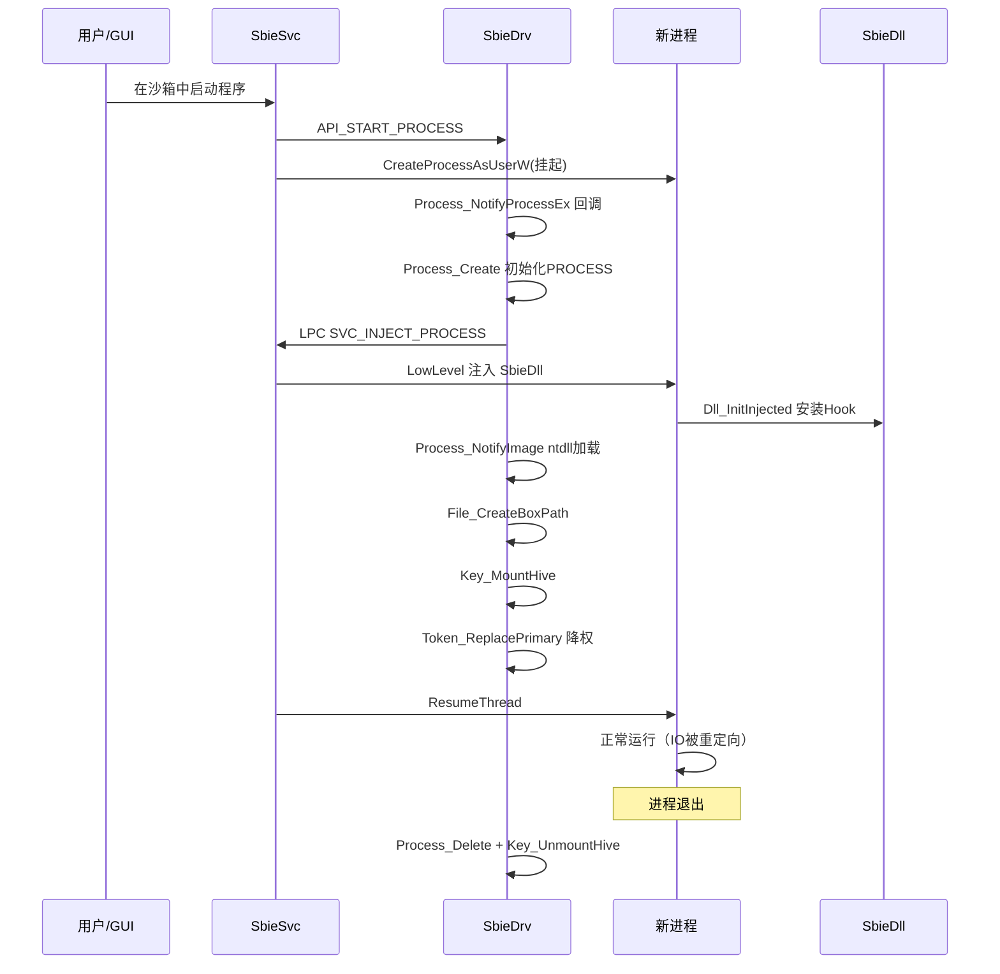

## 5. 完整进程生命周期

```mermaid
sequenceDiagram
    participant U as 用户/GUI
    participant SVC as SbieSvc
    participant DRV as SbieDrv
    participant P as 新进程
    participant SDLL as SbieDll

    U->>SVC: 在沙箱中启动程序
    SVC->>DRV: API_START_PROCESS
    SVC->>P: CreateProcessAsUserW(挂起)
    DRV->>DRV: Process_NotifyProcessEx 回调
    DRV->>DRV: Process_Create 初始化PROCESS
    DRV->>SVC: LPC SVC_INJECT_PROCESS
    SVC->>P: LowLevel 注入 SbieDll
    P->>SDLL: Dll_InitInjected 安装Hook
    DRV->>DRV: Process_NotifyImage ntdll加载
    DRV->>DRV: File_CreateBoxPath
    DRV->>DRV: Key_MountHive
    DRV->>DRV: Token_ReplacePrimary 降权
    SVC->>P: ResumeThread
    P->>P: 正常运行（IO被重定向）
    Note over P: 进程退出
    DRV->>DRV: Process_Delete + Key_UnmountHive
```
