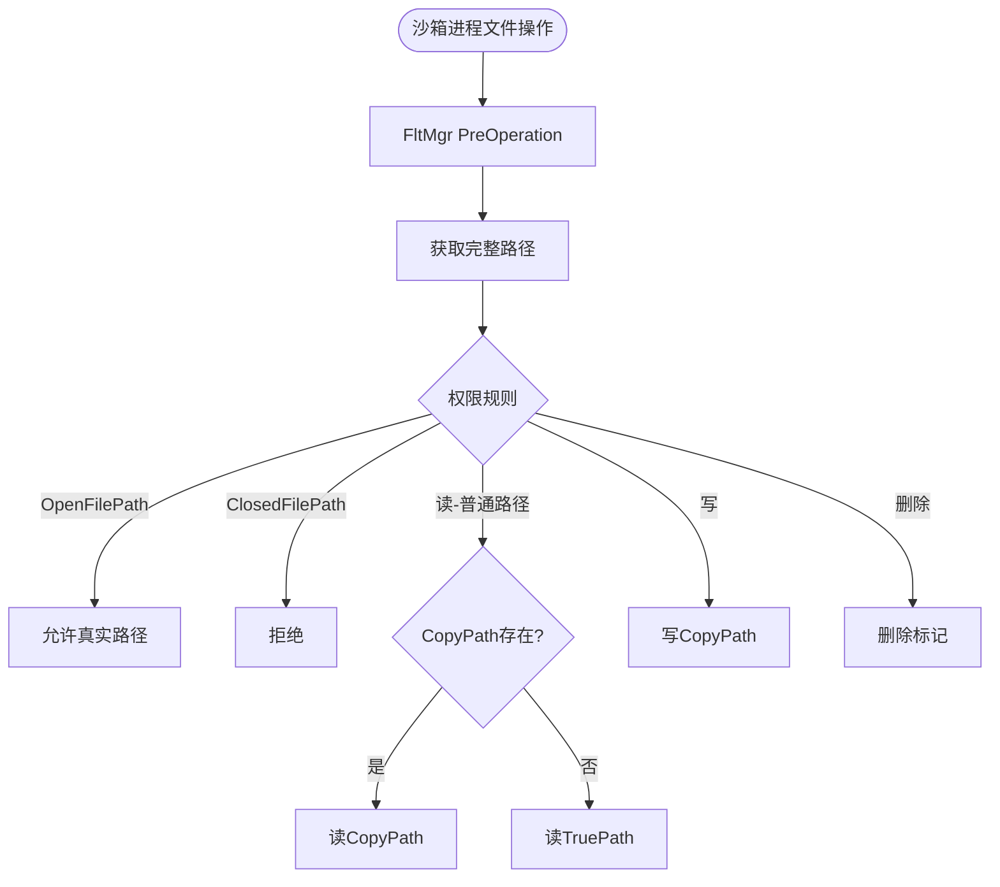
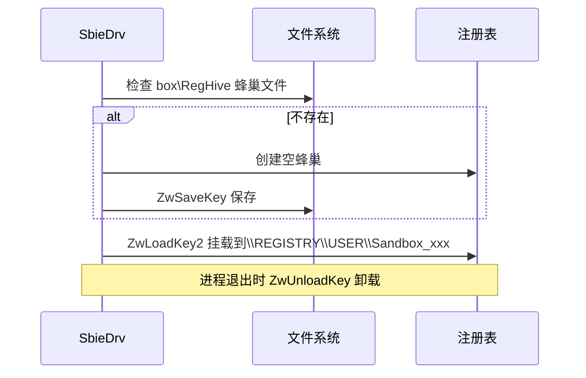
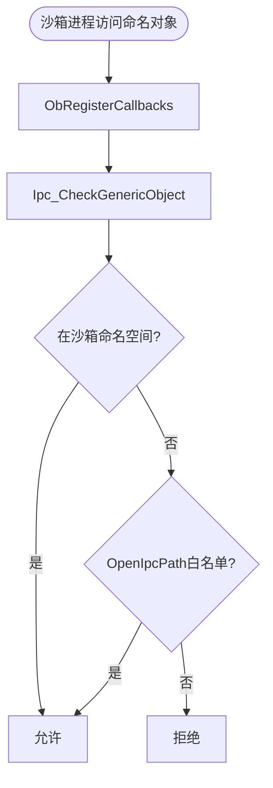

## 6. 文件/注册表虚拟化详解

### 文件虚拟化流程

### 路径映射

| TruePath | CopyPath |
|----------|----------|
| `C:\Windows\notepad.exe` | `Sandbox\User\Box\drive\C\Windows\notepad.exe` |
| `HKLM\SOFTWARE\Microsoft` | `REGISTRY\USER\Sandbox_SID_Box\machine\software\microsoft` |

### 注册表蜂巢挂载

## 7. IPC 隔离

沙箱命名空间：`\Sandbox\{SID}\Session_{N}\{BoxName}\BaseNamedObjects\`

## 8. 安全模型

| 防御层 | 机制 | 执行位置 |
|--------|------|--------|
| 令牌降权 | 低完整性级别+受限SID | 内核 |
| 系统调用拦截 | OB/SSDT回调 | 内核 |
| 文件系统过滤 | FltMgr | 内核 |
| 注册表过滤 | CmRegisterCallback | 内核 |
| IPC 隔离 | ObRegisterCallbacks | 内核 |
| API Hook | Inline Hook | 用户态（辅助）|

## 9. 内核 API 汇总

| API | 模块 | 用途 |
|-----|------|------|
| `PsSetCreateProcessNotifyRoutineEx` | process.c | 进程监控 |
| `PsSetLoadImageNotifyRoutine` | process.c | 映像加载 |
| `FltRegisterFilter` | file.c | 文件过滤 |
| `CmRegisterCallbackEx` | key.c | 注册表过滤 |
| `ObRegisterCallbacks` | ipc.c/thread.c | 对象访问控制 |
| `FwpsCalloutRegister` | wfp.c | 网络过滤 |
| `ZwLoadKey2`/`ZwUnloadKey` | key.c | 蜂巢挂载 |
| `SeFilterToken` | token.c | 令牌过滤 |
| `IoCreateDevice` | api.c | 设备对象 |

## 10. 配置系统速查

| 配置项 | 说明 |
|--------|------|
| `OpenFilePath` | 白名单文件路径 |
| `ClosedFilePath` | 黑名单文件路径 |
| `OpenKeyPath` | 白名单注册表路径 |
| `OpenIpcPath` | 白名单IPC对象 |
| `DropAdminRights` | 删除管理员权限 |
| `UseSecurityMode` | 安全模式（需证书）|
| `NetworkAccess` | 网络访问控制 |
| `Template` | 应用兼容性模板 |

## 11. 分析文档索引

### 文件级分析

| 文件 | 文档 |
|------|------|
| `core/drv/driver.c` | [drv_driver.c.md](files/drv_driver.c.md) |
| `core/drv/api.c` | [drv_api.c.md](files/drv_api.c.md) |
| `core/drv/process.c` | [drv_process.c.md](files/drv_process.c.md) |
| `core/drv/file.c` | [drv_file.c.md](files/drv_file.c.md) |
| `core/drv/key.c` | [drv_key.c.md](files/drv_key.c.md) |
| `core/drv/ipc.c` | [drv_ipc.c.md](files/drv_ipc.c.md) |
| `core/drv/token.c` | [drv_token.c.md](files/drv_token.c.md) |
| `core/drv/thread.c` | [drv_thread.c.md](files/drv_thread.c.md) |
| `core/drv/syscall.c` | [drv_syscall.c.md](files/drv_syscall.c.md) |
| `core/drv/wfp.c` | [drv_wfp.c.md](files/drv_wfp.c.md) |
| `core/drv/conf.c` | [drv_conf.c.md](files/drv_conf.c.md) |
| `core/drv/hook.c` | [drv_hook.c.md](files/drv_hook.c.md) |
| `core/drv/gui.c` | [drv_gui.c.md](files/drv_gui.c.md) |
| `core/drv/verify.c` | [drv_verify.c.md](files/drv_verify.c.md) |
| `core/drv/box.c` | [drv_box.c.md](files/drv_box.c.md) |
| `core/drv/log.c` | [drv_log.c.md](files/drv_log.c.md) |
| `core/dll/dllmain.c` | [dll_dllmain.c.md](files/dll_dllmain.c.md) |
| `core/dll/file.c` | [dll_file.c.md](files/dll_file.c.md) |
| `core/dll/key.c` | [dll_key.c.md](files/dll_key.c.md) |
| `core/dll/proc.c` | [dll_proc.c.md](files/dll_proc.c.md) |
| `core/low/` | [core_low.md](files/core_low.md) |
| `core/svc/main.cpp` | [svc_main.cpp.md](files/svc_main.cpp.md) |
| `core/svc/DriverAssist.cpp` | [svc_DriverAssist.cpp.md](files/svc_DriverAssist.cpp.md) |
| `core/svc/ProcessServer.cpp` | [svc_ProcessServer.cpp.md](files/svc_ProcessServer.cpp.md) |
| `core/svc/GuiServer.cpp` | [svc_GuiServer.cpp.md](files/svc_GuiServer.cpp.md) |
| `core/svc/sbieiniserver.cpp` | [svc_sbieiniserver.cpp.md](files/svc_sbieiniserver.cpp.md) |

### 模块级分析

| 模块 | 文档 |
|------|------|
| 内核驱动层 SbieDrv.sys | [modules/01-kernel-driver-layer.md](modules/01-kernel-driver-layer.md) |
| 用户态DLL层 SbieDll.dll | [modules/02-dll-layer.md](modules/02-dll-layer.md) |
| 系统服务层 SbieSvc.exe | [modules/03-service-layer.md](modules/03-service-layer.md) |
| 图形界面层 SandMan.exe | [modules/04-app-layer.md](modules/04-app-layer.md) |
