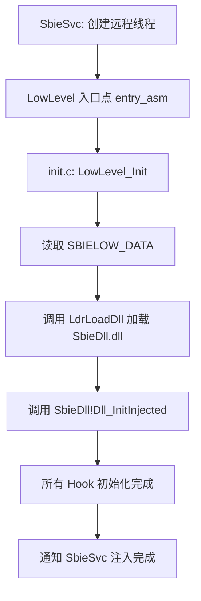

# core/low/ — 底层注入辅助（LowLevel.dll）

## 概述

`core/low/` 目录包含 `LowLevel.dll` 的源码，这是 Sandboxie 的**最底层注入辅助组件**。LowLevel.dll 首先被注入目标进程，然后负责加载 SbieDll.dll 并完成 Hook 初始化，处理各种系统差异（WoW64、ARM64EC 等）。

## 基本信息

| 属性 | 值 |
|------|----|
| 目录 | `Sandboxie/core/low/` |
| 所属模块 | LowLevel.dll |
| 关键文件 | `init.c`（初始化）, `inject.c`（注入逻辑）, `lowdata.h`（共享数据结构）|

## SBIELOW_DATA 结构体（lowdata.h）

驱动和 LowLevel 之间共享的数据块，注入时写入目标进程：

```c
typedef struct _SBIELOW_DATA {
    ULONG_PTR  ntdll_base;        // ntdll.dll 基址
    ULONG_PTR  KernelDll_base;    // kernelbase.dll 基址
    ULONG_PTR  syscall_data;      // 系统调用表地址
    ULONG_PTR  LdrLoadDll_addr;   // LdrLoadDll 函数地址
    ULONG_PTR  LdrGetProcAddr;    // LdrGetProcedureAddress 地址
    WCHAR      BoxName[34];       // 沙箱名称
    WCHAR      SbieDll_path[256]; // SbieDll.dll 完整路径
    BOOLEAN    bHostInject;       // 仅 Host 注入模式
} SBIELOW_DATA;
```

## 注入流程（inject.c）



## 汇编入口（entry_asm.asm / entry_arm.asm）

- x86/x64：`entry_asm.asm` 包含注入入口的汇编存根
- ARM64：`entry_arm.asm` 处理 ARM64 调用约定差异
- 入口代码极其简单，仅建立栈帧后调用 C 函数 `LowLevel_Init`

## WoW64 支持

在 WoW64 进程中（32 位进程运行于 64 位 Windows），需要分别注入 32 位版本的 LowLevel.dll 和 SbieDll.dll，因此存在 `SboxDll32.def` 等 32 位版本定义文件。
