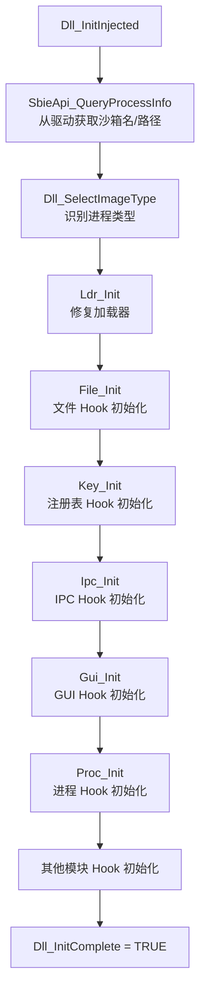

# dll/dllmain.c — SbieDll 入口点

## 概述

`dllmain.c` 是 `SbieDll.dll` 的入口点，在每个沙箱进程加载时执行初始化，协调所有 Hook 子系统的启动。

## 基本信息

| 属性 | 值 |
|------|----|
| 文件路径 | `Sandboxie/core/dll/dllmain.c` |
| 所属模块 | SbieDll.dll |
| 语言 | C（用户态）|
| 核心职责 | DLL 初始化、沙箱检测、子系统初始化协调 |

## 关键全局变量

| 变量 | 含义 |
|------|------|
| `Dll_BoxName` | 当前沙箱名称（NULL=非沙箱进程）|
| `Dll_ImageName` | 当前进程的可执行文件名 |
| `Dll_BoxFilePath` | 沙箱文件系统根路径 |
| `Dll_BoxKeyPath` | 沙箱注册表根路径 |
| `Dll_BoxIpcPath` | 沙箱命名对象目录路径 |
| `Dll_ProcessId` | 当前进程 ID |
| `Dll_OsBuild` | Windows Build 号 |
| `Dll_ImageType` | 进程类型（DLL_IMAGE_* 枚举）|
| `Dll_IsWow64` | 是否为 WoW64 进程 |
| `Dll_CompartmentMode` | 应用容器模式 |

## DllMain 执行流程

### `DLL_PROCESS_ATTACH`
1. 检测 OS 版本（探测 ntdll 导出）
2. `Dll_InitGeneric()` — 通用初始化（获取模块句柄等）
3. 通过 IOCTL 查询驱动判断是否为沙箱进程
4. 若是：调用 `Dll_InitInjected()` 完整初始化所有 Hook

### `DLL_THREAD_ATTACH`
- `Dll_FixWow64Syscall()`（Win8 以前修复 WoW64 系统调用）
- `Gui_ConnectToWindowStationAndDesktop()`

### `DLL_THREAD_DETACH`
- `Dll_FreeTlsData()` 释放线程本地存储

## Dll_InitInjected() 初始化顺序

## DLL_IMAGE_TYPE 枚举

| 类型 | 含义 |
|------|------|
| `DLL_IMAGE_UNSPECIFIED` | 未知/通用进程 |
| `DLL_IMAGE_SANDBOXIE_SBIESVC` | SbieSvc 服务 |
| `DLL_IMAGE_SANDBOXIE_RPCSS` | 沙箱 RpcSs |
| `DLL_IMAGE_SANDBOXIE_DCOMLAUNCH` | 沙箱 DcomLaunch |
| `DLL_IMAGE_INTERNET_EXPLORER` | Internet Explorer |
| `DLL_IMAGE_FIREFOX` | Firefox |
| `DLL_IMAGE_CHROME` | Chrome/Chromium |
| `DLL_IMAGE_MSOFFICE` | Microsoft Office |

识别后可对特定程序应用专属兼容性补丁。
