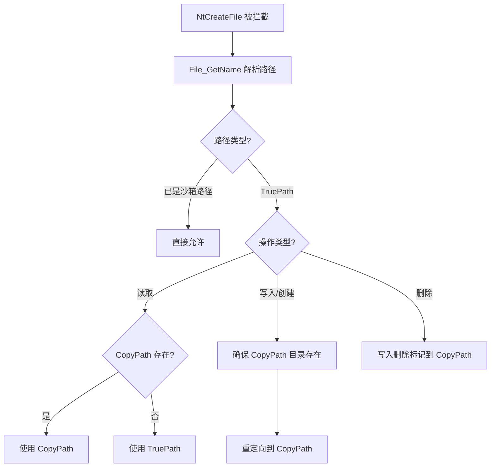

# dll/file.c — 文件 Hook（用户态）

## 概述

`dll/file.c` 在用户态实现文件系统操作的 Hook，拦截 `NtCreateFile`、`NtOpenFile`、`NtQueryDirectoryFile` 等 NT 文件 API，完成 **TruePath↔CopyPath 路径转换**，并在需要时将操作代理给 SbieSvc（`FileServer`）。

## 基本信息

| 属性 | 值 |
|------|----|
| 文件路径 | `Sandboxie/core/dll/file.c` |
| 所属模块 | SbieDll.dll |
| 语言 | C（用户态）|
| 核心职责 | 用户态文件路径重定向与访问控制 |
| 关联文件 | `file_dir.c`, `file_copy.c`, `file_del.c`, `file_link.c`, `file_pipe.c`, `file_recovery.c` |

## 核心函数

### `File_GetName(RootDirectory, ObjectName, OutTruePath, OutCopyPath, OutFlags)`

最关键的路径解析函数，将任意文件路径解析为：
- `TruePath`：文件系统真实路径
- `CopyPath`：沙箱副本路径
- `Flags`：路径标志（`FGN_IS_BOXED_PATH` 等）

解析步骤：
1. 解析 RootDirectory 句柄
2. 拼接 ObjectName 得到完整路径
3. 翻译 DOS 路径到 NT 路径
4. 处理符号链接和重解析点
5. 处理 WoW64 文件重定向（`\System32` ↔ `\SysWoW64`）
6. 构建 CopyPath（在 `Dll_BoxFilePath` 下）

### `File_NtCreateFile()` / `File_NtOpenFile()`

拦截 `NtCreateFile`/`NtOpenFile`：
1. 调用 `File_GetName()` 获取 TruePath/CopyPath
2. 判断路径权限（OpenFilePath/ClosedFilePath 规则）
3. 读操作：先尝试 CopyPath，不存在则用 TruePath
4. 写操作：确保 CopyPath 目录存在，重定向到 CopyPath
5. 特殊情况通过 `CallSvc(FileWire)` 代理给 SbieSvc

### `File_NtQueryDirectoryFile()`

拦截目录枚举，合并两份结果：
- 枚举 CopyPath 下的文件（包括虚拟文件）
- 枚举 TruePath 下的文件（排除已在 CopyPath 中存在的）
- 过滤掉带删除标记的文件

### `File_GetCopyPath()` / `File_GetTruePath()`

双向路径转换工具函数：
```
TruePath: C:\Windows\notepad.exe
CopyPath: C:\Sandbox\User\Box\drive\C\Windows\notepad.exe
```

## 文件操作决策流程



## Hook 注册

在 `File_Init()` 中通过 `SBIEDLL_HOOK` 宏注册：
```c
SBIEDLL_HOOK(Nt, CreateFile);
SBIEDLL_HOOK(Nt, OpenFile);
SBIEDLL_HOOK(Nt, QueryAttributesFile);
SBIEDLL_HOOK(Nt, QueryFullAttributesFile);
SBIEDLL_HOOK(Nt, SetInformationFile); // 用于删除
SBIEDLL_HOOK(Nt, QueryDirectoryFile);
```
