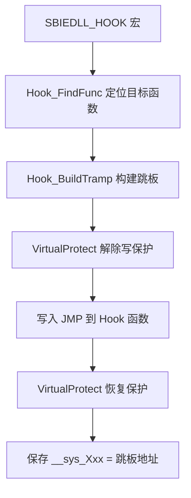

# dll/hook_inst.c + hook_tramp.c — Hook 框架（用户态）

## 概述

`hook_inst.c` 和 `hook_tramp.c` 实现 SbieDll 的用户态 **Inline Hook + Trampoline** 框架，是所有 API 拦截的基础设施。

## 基本信息

| 文件 | 职责 |
|------|------|
| `hook_inst.c` | Hook 安装逻辑（写 JMP 指令）|
| `hook_tramp.c` | Trampoline（跳板）代码生成 |

## Hook 安装流程（hook_inst.c）



## Trampoline 生成（hook_tramp.c）

Trampoline 是一段可执行内存，布局如下：

```asm
; 跳板内容：
[原始函数前 N 字节]     ; 备份被覆盖的指令
JMP [原始函数 + N]      ; 跳回原函数继续执行
```

关键函数：
- `Hook_Tramp_Code()` — 分析原始指令，确定需要复制的字节数（需处理相对跳转修正）
- `Hook_Tramp_Alloc()` — 在目标函数附近分配可执行内存（保证 32 位相对 JMP 可达）

## x64 特殊处理

x64 使用 14 字节的绝对跳转（`MOV RAX + JMP RAX`）而非 5 字节相对跳转，因为 ntdll 与自定义代码可能相距超过 2GB。

```asm
; x64 Hook 存根（14 字节）
48 B8 xx xx xx xx xx xx xx xx  ; MOV RAX, target_addr
FF E0                           ; JMP RAX
```

## SBIEDLL_HOOK 宏展开

```c
#define SBIEDLL_HOOK(mod, name) \
    __sys_##mod##_##name = Hook_InstallHook( \
        L#name, mod##_##name, &__sys_##mod##_##name);
```
