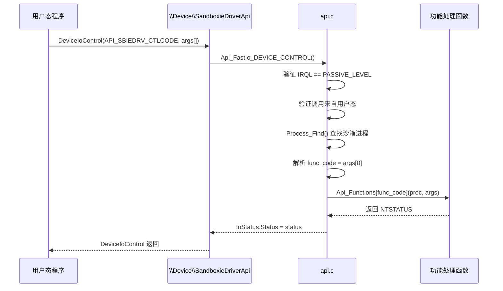
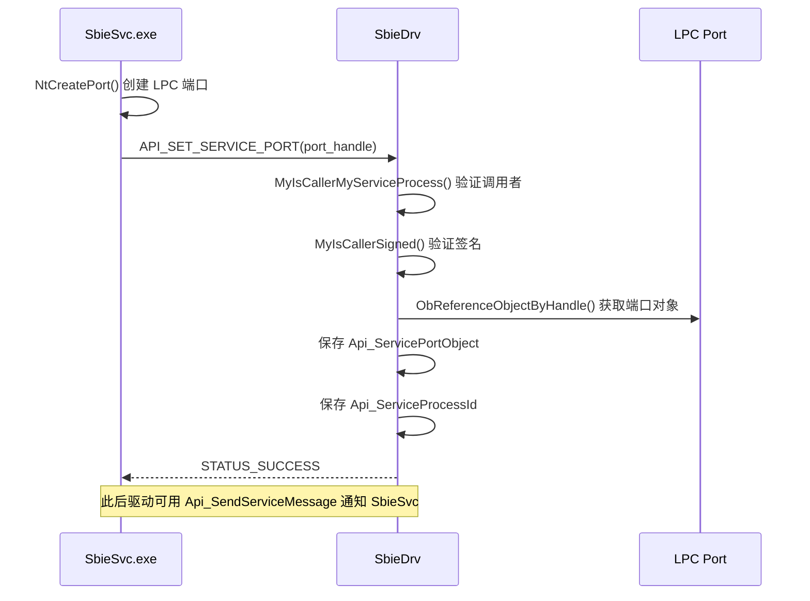

# drv/api.c — IOCTL 接口层

## 概述

`api.c` 实现了内核驱动与用户态程序（SbieSvc、SandMan、SbieDll）之间的**通信接口**。通过 `\Device\SandboxieDriverApi` 设备和 Fast I/O DEVICE_CONTROL，用户态程序可以调用驱动功能、查询沙箱状态、读取日志等。

---

## 基本信息

| 属性 | 值 |
|------|----|
| 文件路径 | `Sandboxie/core/drv/api.c` |
| 所属模块 | SbieDrv.sys |
| 语言 | C（内核模式）|
| 核心职责 | 用户态↔驱动通信接口（IOCTL / Fast IO）|

---

## 设备对象与通信机制

```
\Device\SandboxieDriverApi        (内核设备)
\DosDevices\SandboxieDriverApi    (符号链接，用户态访问)
```

用户态通过 `DeviceIoControl(handle, API_SBIEDRV_CTLCODE, ...)` 发起调用。

**Fast IO 路径**（`Api_FastIo_DEVICE_CONTROL`）：直接在调用线程执行，无需构建 IRP，性能更高。

**调用约定**：输入缓冲区为 `ULONG64[API_NUM_ARGS]` 数组，第一个元素是功能代码（`func_code`），后续为参数。

---

## API 功能代码表

| 功能代码 | 处理函数 | 说明 |
|---------|---------|------|
| `API_GET_VERSION` | `Api_GetVersion` | 获取驱动版本字符串和 ABI 版本 |
| `API_LOG_MESSAGE` | `Api_LogMessage` | 向驱动日志缓冲区写入消息 |
| `API_GET_MESSAGE` | `Api_GetMessage` | 读取驱动日志（序列号机制）|
| `API_GET_HOME_PATH` | `Api_GetHomePath` | 获取安装目录（NT/DOS 路径）|
| `API_SET_SERVICE_PORT` | `Api_SetServicePort` | SbieSvc 注册其 LPC 端口 |
| `API_UNLOAD_DRIVER` | `Driver_Api_Unload` | 触发驱动卸载 |
| `API_PROCESS_EXEMPTION_CONTROL` | `Api_ProcessExemptionControl` | 设置/查询进程豁免标志 |
| `API_QUERY_DRIVER_INFO` | `Api_QueryDriverInfo` | 查询驱动特性标志（WFP/OB/加密等）|
| `API_SET_SECURE_PARAM` | `Api_SetSecureParam` | 向安全注册表写入参数 |
| `API_GET_SECURE_PARAM` | `Api_GetSecureParam` | 从安全注册表读取参数 |
| `API_VERIFY` | `Api_Verify` | 验证数据签名 |
| `API_START_PROCESS` | `Process_Api_Start` | 启动沙箱进程（SbieSvc 调用）|
| `API_QUERY_PROCESS` | `Process_Api_Query` | 查询进程沙箱归属 |
| `API_QUERY_SYSCALLS` | `Syscall_Api_Query` | 查询系统调用拦截表 |
| `API_INVOKE_SYSCALL` | `Syscall_Api_Invoke` | 代理执行系统调用 |

---

## 关键函数分析

### `Api_Init()`

1. 初始化日志缓冲区 `Api_LogBuffer`（8×8KB 环形缓冲）
2. 创建 `ERESOURCE` 锁 `Api_LockResource`
3. 设置 Fast IO Dispatch 表（只注册 `FastIoDeviceControl`）
4. 设置 IRP Dispatch（CREATE、CLEANUP）
5. 调用 `IoCreateDevice` 创建设备 `\Device\SandboxieDriverApi`
6. 调用 `Api_SetFunction` 注册所有功能处理函数
7. 将 `Api_UseCount` 从 -1 设为 0，表示 API 就绪

### `Api_FastIo_DEVICE_CONTROL()`

核心分发函数，逻辑：
1. 验证 IRQL 为 `PASSIVE_LEVEL` 且来自用户态
2. 识别控制码（`API_SBIEDRV_CTLCODE`）
3. 特殊处理：`API_SBIEDRV_FILTERTOKEN_CTLCODE`（内核模式 SeFilterToken）
4. 调用 `Process_Find()` 确定调用进程是否在沙箱中
5. 从输入缓冲区提取参数，调用对应 `Api_Functions[func_code]`
6. Debug 模式下验证 IRQL 和 APC 状态未被破坏

### `Api_SetServicePort()`

SbieSvc 启动后通过此 API 注册其 LPC 端口句柄：
- 验证调用者为非沙箱进程且签名合法
- 以 `ObReferenceObjectByHandle` 获取端口对象引用
- 保存 `Api_ServicePortObject` 和 `Api_ServiceProcessId`
- 此后驱动可通过 `Api_SendServiceMessage()` 向 SbieSvc 发送 LPC 消息

### `Api_AddMessage()` / `Api_GetMessage()`

日志环形缓冲机制：
- 驱动内部调用 `Api_AddMessage` 写入日志条目（格式：`session_id[4] + process_id[4] + error_code[4] + strings[]`）
- SbieSvc/UI 调用 `Api_GetMessage`（`API_GET_MESSAGE`）按序列号拉取日志
- 使用 `LOG_BUFFER` 环形缓冲，自动覆盖旧条目

### `Api_QueryDriverInfo(info_class=0)`

返回驱动特性标志位（`SBIE_FEATURE_FLAG_*`）：

| 标志 | 条件 |
|------|------|
| `SBIE_FEATURE_FLAG_WFP` | `WFP_Enabled` |
| `SBIE_FEATURE_FLAG_OB_CALLBACKS` | `Obj_CallbackInstalled` |
| `SBIE_FEATURE_FLAG_CERTIFIED` | `Verify_CertInfo.active` |
| `SBIE_FEATURE_FLAG_SECURITY_MODE` | `Verify_CertInfo.opt_sec` |
| `SBIE_FEATURE_FLAG_ENCRYPTION` | `Verify_CertInfo.opt_enc` |
| `SBIE_FEATURE_FLAG_NET_PROXY` | `Verify_CertInfo.opt_net` |

---

## 变量

| 变量 | 说明 |
|------|------|
| `Api_DeviceObject` | 设备对象指针 |
| `Api_ServicePortObject` | SbieSvc LPC 端口对象引用 |
| `Api_ServiceProcessId` | SbieSvc 进程 ID |
| `Api_LockResource` | 临界区 ERESOURCE |
| `Api_UseCount` | 当前使用计数（-1=禁用，0+=活跃）|
| `Api_LogBuffer` | 日志环形缓冲区 |
| `Api_Functions` | 函数指针数组 `[API_LAST - API_FIRST]` |

---

## 时序图：用户态调用驱动 API



---

## 时序图：SbieSvc 注册 LPC 端口



---

## 设计要点

1. **Fast IO 优化**：使用 Fast IO dispatch 而非标准 IRP，减少上下文切换开销。
2. **使用计数保护**：`Api_UseCount` 防止在 API 禁用期间处理新请求。
3. **参数安全传递**：所有用户态指针都通过 `ProbeForRead`/`ProbeForWrite` + `__try/__except` 保护。
4. **双重验证**：`Api_SetServicePort` 同时验证调用者进程和代码签名，防止伪造服务注册。
5. **环形日志**：`LOG_BUFFER` 机制允许驱动异步记录日志，UI 按需拉取，不阻塞驱动关键路径。
