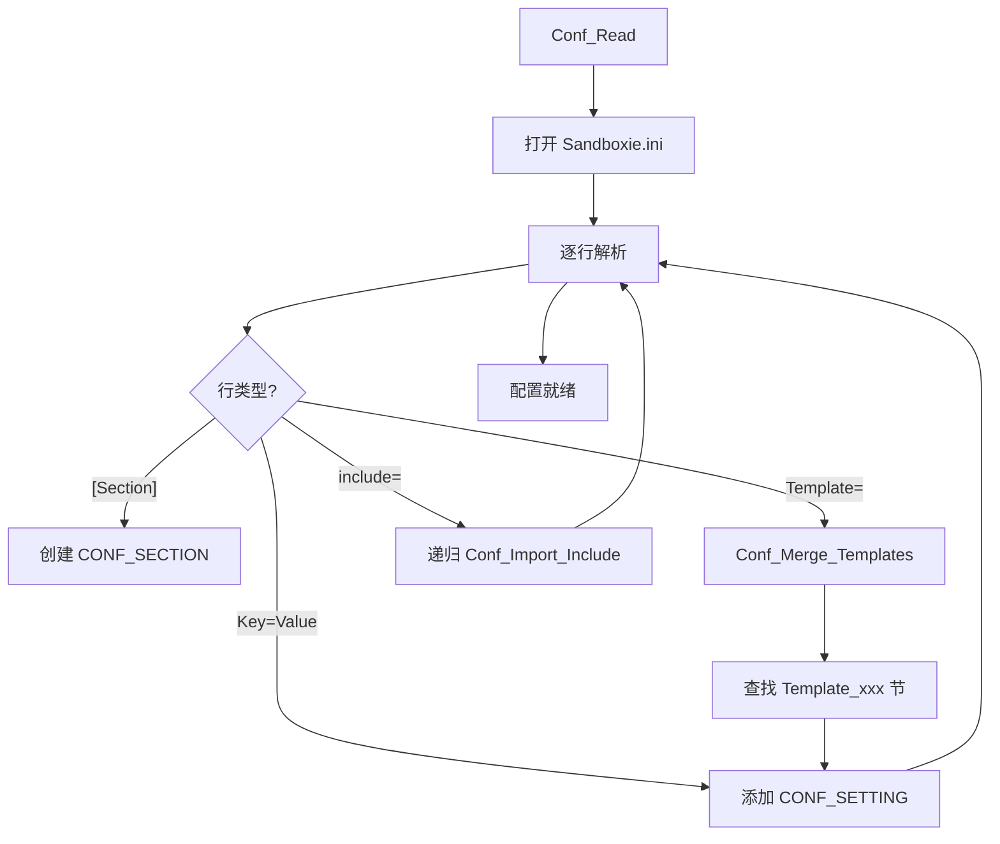

# drv/conf.c — 配置系统

## 概述

`conf.c` 实现了 Sandboxie 的**配置读取引擎**，负责解析 `Sandboxie.ini`（含模板、包含文件），提供线程安全的配置查询 API，支持配置热重载。驱动层的所有沙箱策略（路径规则、功能开关等）均通过此模块读取。

## 基本信息

| 属性 | 值 |
|------|----|
| 文件路径 | `Sandboxie/core/drv/conf.c` |
| 所属模块 | SbieDrv.sys |
| 核心职责 | INI 配置解析与查询 |
| 关联文件 | `conf_expand.c`（变量展开）, `conf_user.c`（用户级配置）|

## 核心数据结构

```c
typedef struct _CONF_DATA {
    POOL *pool;
    LIST sections;         // CONF_SECTION 链表（保序）
    HASH_MAP sections_map; // 快速查找
    WCHAR *path;           // 配置文件路径
    volatile ULONG use_count; // 引用计数（热重载保护）
} CONF_DATA;

typedef struct _CONF_SECTION {
    LIST_ELEM list_elem;
    WCHAR *name;           // 节名（沙箱名或 GlobalSettings）
    LIST settings;         // CONF_SETTING 链表
    HASH_MAP settings_map;
    BOOLEAN from_template; // 是否来自模板
} CONF_SECTION;

typedef struct _CONF_SETTING {
    LIST_ELEM list_elem;
    WCHAR *name;   // 设置名
    WCHAR *value;  // 设置值
} CONF_SETTING;
```

## 关键函数

### `Conf_Init()`
驱动加载时初始化配置系统，调用 `Conf_Read(0)` 读取会话 0 的配置文件。

### `Conf_Read(session_id)`
从 `Driver_HomePathDos\Sandboxie.ini` 读取配置：
1. 用 `STREAM` 接口逐行读取文件
2. 解析 `[SectionName]` 和 `Key=Value` 格式
3. 处理 `Template=` 指令，合并模板节
4. 处理 `include` 指令，递归导入其他 INI 文件
5. 处理变量展开（`%SID%`, `%SessionId%` 等）

### `Conf_Get(section, setting, index)`
查询配置值，支持多值枚举（通过 `index` 参数）。使用 `Conf_AdjustUseCount(TRUE)` 保护返回的指针在热重载期间有效。

### `Conf_Get_Boolean(section, setting, index, default)`
解析 `y`/`n` 布尔配置值的便捷包装。

### `Conf_AdjustUseCount(increment)`
引用计数管理，防止配置重载时使已有指针失效。调用者在使用 `Conf_Get` 返回值时必须持有此引用。

### `Conf_Reload()`
配置热重载：创建新的 `CONF_DATA`，等待旧引用归零，替换全局指针。

## 配置查询示例

```c
// 查询沙箱 DefaultBox 的 OpenFilePath 第一个值
Conf_AdjustUseCount(TRUE);
const WCHAR *path = Conf_Get(L"DefaultBox", L"OpenFilePath", 0);
if (path) {
    // 使用 path...
}
Conf_AdjustUseCount(FALSE);
```

## Sandboxie.ini 结构示例

```ini
[GlobalSettings]
SbieHome=C:\Sandbox

[DefaultBox]
Enabled=y
OpenFilePath=C:\Windows\Fonts\
Template=AutoRecoverIgnore

[Template_AutoRecoverIgnore]
AutoRecoverIgnore=%Temp%
```

## 配置加载流程图


