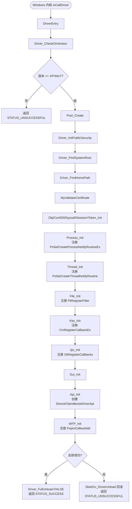
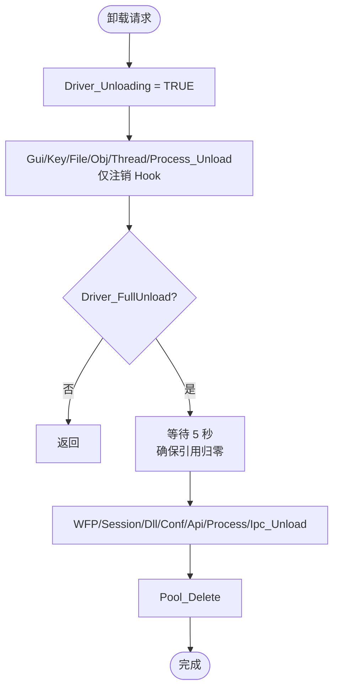

# drv/driver.c — 内核驱动入口点

## 概述

`driver.c` 是 `SbieDrv.sys` 的**根入口文件**，实现了驱动的 `DriverEntry`（加载）与 `SbieDrv_DriverUnload`（卸载）两个核心函数，负责全局变量初始化、子系统级联启动/关闭、系统版本检测以及驱动设备对象管理。

---

## 基本信息

| 属性 | 值 |
|------|----|
| 文件路径 | `Sandboxie/core/drv/driver.c` |
| 所属模块 | SbieDrv.sys（内核驱动）|
| 语言 | C（内核模式 WDM）|
| 主要职责 | 驱动入口/卸载/全局初始化 |
| 依赖头文件 | `driver.h`, `api.h`, `process.h`, `file.h`, `key.h`, `ipc.h`, `gui.h`, `token.h`, `wfp.h` |

---

## 全局变量

| 变量名 | 类型 | 用途 |
|--------|------|------|
| `Driver_Object` | `DRIVER_OBJECT*` | 驱动对象，整个驱动生命周期使用 |
| `Driver_Pool` | `POOL*` | 全局内核内存池（PagedPool 包装）|
| `Driver_OsVersion` | `ULONG` | Windows 版本（见 `DRIVER_WINDOWS_*` 宏）|
| `Driver_OsBuild` | `ULONG` | Windows Build 号 |
| `Driver_HomePathNt` | `WCHAR*` | Sandboxie 安装目录的 NT 路径（如 `\Device\HarddiskVolume3\SbPlus`）|
| `Driver_HomePathDos` | `WCHAR*` | DOS 路径（如 `\??\C:\SbPlus`）|
| `Driver_SystemRootPathNt` | `WCHAR*` | `\SystemRoot` 解析后的 NT 路径 |
| `Driver_PublicSd` | `PSECURITY_DESCRIPTOR` | 公开安全描述符（Authenticated Users + World）|
| `Driver_LowLabelSd` | `PSECURITY_DESCRIPTOR` | 低完整性级别安全描述符（Vista+）|
| `Driver_Unloading` | `volatile BOOLEAN` | 卸载标志，防止新请求进入 |
| `Driver_FullUnload` | `BOOLEAN` | 是否做完整卸载（vs. 仅卸载 Hook）|
| `tzuk` | `const ULONG` | 内存池标签 `'xobs'`，所有驱动内存分配均使用此标签 |

---

## 关键函数

### `DriverEntry(DRIVER_OBJECT*, UNICODE_STRING*)`

**驱动入口点**，由 Windows 内核在加载 `SbieDrv.sys` 时调用。

执行顺序（串行，任一失败则回滚）：

1. `Driver_CheckOsVersion()` — 检测 OS 版本，设置 `Driver_OsVersion`
2. `Pool_Create()` — 创建全局内存池
3. `Driver_InitPublicSecurity()` — 创建 DACL 安全描述符
4. `Driver_FindSystemRoot()` — 解析 `\SystemRoot` 符号链接
5. `Driver_FindHomePath()` — 从注册表 `ImagePath` 找到安装目录
6. `MyValidateCertificate()` — 验证证书（授权检查）
7. `Obj_Init()` — 初始化对象管理器接口
8. `Conf_Init()` — 加载 `Sandboxie.ini` 配置
9. `Dll_Init()` — 准备 DLL 注入数据
10. `Syscall_Init()` — 建立系统调用拦截表
11. `Session_Init()` — 初始化会话管理
12. `Token_Init()` — 初始化令牌操作
13. `Process_Init()` — 注册进程/线程/映像通知回调（**Hook 激活**）
14. `Thread_Init()` — 初始化线程管理
15. `File_Init()` — 文件系统过滤驱动注册
16. `Key_Init()` — 注册表过滤驱动注册
17. `Ipc_Init()` — IPC 对象拦截
18. `Gui_Init()` — GUI 隔离初始化
19. `Api_Init()` — 创建 `\Device\SandboxieDriverApi` 设备
20. `WFP_Init()` — Windows 过滤平台（网络）初始化

### `SbieDrv_DriverUnload(DRIVER_OBJECT*)`

卸载驱动时调用，反向清理：
1. 注销所有 Hook（`Gui_Unload`, `Key_Unload`, `File_Unload`, `Obj_Unload`, `Thread_Unload`, `Process_Unload`）
2. 若为完整卸载：等待 5 秒，清理 WFP、Session、Dll、Conf、Api、Ipc
3. 最后删除内存池

### `Driver_CheckOsVersion()`

调用 `PsGetVersion()` 获取 OS 版本，映射到内部常量：
- `DRIVER_WINDOWS_XP` = 5.1
- `DRIVER_WINDOWS_VISTA` = 6.0
- `DRIVER_WINDOWS_7` = 6.1
- `DRIVER_WINDOWS_8` = 6.2
- `DRIVER_WINDOWS_81` = 6.3
- `DRIVER_WINDOWS_10` = 10.x（包含 Windows 11）

### `Driver_FindHomePath(UNICODE_STRING* RegistryPath)`

从注册表 `ImagePath` 值读取 SbieDrv.sys 路径，剥离文件名得到安装目录，然后打开目录对象获得规范化的 NT 路径（`Driver_HomePathNt`）。

### `Driver_Api_Unload(PROCESS*, ULONG64*)`

IOCTL 触发的软卸载路径：确认沙箱中无活动进程后，调用 `Api_Disable()` 停止接受新请求，然后启动完整卸载序列。

---

## 内核 API 使用汇总

| 内核 API | 用途 |
|---------|------|
| `PsGetVersion` | 获取 OS 版本号 |
| `ExAllocatePoolWithTag` | 内核内存分配（标签 `tzuk`）|
| `RtlCreateSecurityDescriptor` / `RtlSetDaclSecurityDescriptor` | 构建安全描述符 |
| `ZwOpenKey` / `ZwQueryValueKey` | 读注册表 ImagePath |
| `ZwCreateFile` | 打开安装目录 |
| `ObReferenceObjectByHandle` | 获取文件对象 |
| `MmGetSystemRoutineAddress` | 动态查找未导出内核函数（如 `MmCopyMemory`）|
| `BCryptOpenAlgorithmProvider` | 验证证书签名（BCrypt）|

---

## 流程图

---

## 卸载流程图

---

## 设计要点

1. **失败回滚**：每个 `Init()` 失败后立即调用 `SbieDrv_DriverUnload()` 做反向清理，防止资源泄漏。
2. **池标签 `tzuk`**：所有驱动内存都标注 `'xobs'`（Sandboxie 内部标识），方便内核调试器过滤。
3. **两阶段卸载**：区分「仅卸载 Hook」和「完整卸载」，支持驱动更新时短暂的无 Hook 状态。
4. **ARM64 支持**：`Driver_FindKiServiceInternal()` 在 ARM64 上动态定位 `KiServiceInternal`，以绕过 ZwXxx 函数的验证器干扰。
5. `Driver_FullUnload = FALSE` 设置在最后一步，表示初始化成功；若初始化中途失败，该标志为 `TRUE`，卸载时做完整清理。

---

## 相关文件

| 文件 | 关系 |
|------|------|
| `driver.h` | 全局变量和类型声明 |
| `api.c` | DriverEntry 最后调用 Api_Init，创建 IOCTL 设备 |
| `process.c` | 进程通知回调（Hook 核心）|
| `common/pool.c` | Driver_Pool 实现 |
| `common/my_version.h` | 版本号 `MY_VERSION_STRING` |
