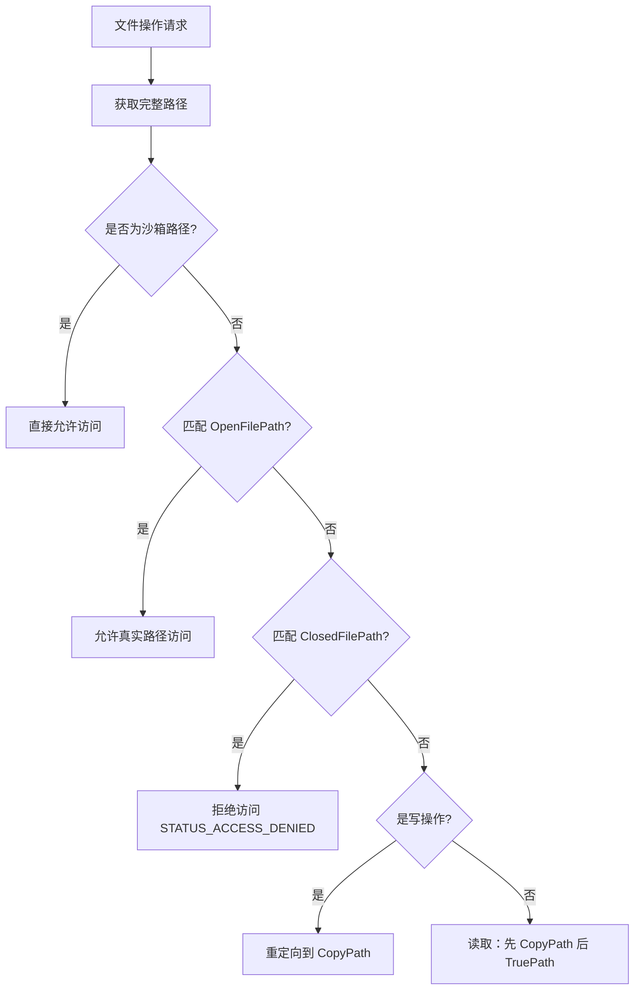

# drv/file.c — 文件系统虚拟化

## 概述

`file.c` 实现了 Sandboxie 的**文件系统虚拟化**核心逻辑。通过注册 Windows 文件系统微过滤器（Filter Driver），拦截沙箱进程的所有文件 I/O 操作，将写操作重定向到沙箱副本目录，同时对读操作按优先级查找（沙箱副本 → 真实路径）。

## 基本信息

| 属性 | 值 |
|------|----|
| 文件路径 | `Sandboxie/core/drv/file.c` |
| 所属模块 | SbieDrv.sys |
| 语言 | C（内核模式，FltMgr 微过滤器）|
| 核心职责 | 文件系统写时复制（Copy-on-Write）虚拟化 |
| 关联文件 | `file_flt.c`（过滤器核心）, `file_ctrl.c`, `file_xlat.c` |

## 架构说明

Sandboxie 文件虚拟化使用**两路径模型**：

- **TruePath**：文件系统上的真实路径（如 `C:\Windows\system32\notepad.exe`）
- **CopyPath**：沙箱副本路径（如 `C:\Sandbox\User\DefaultBox\drive\C\Windows\system32\notepad.exe`）

**访问规则**：

```
读操作：先找 CopyPath，不存在则读 TruePath
写操作：先创建 CopyPath 目录结构，写入 CopyPath
删除操作：在 CopyPath 写入删除标记文件
```

## 关键函数

### `File_Init()`
在 Vista+ 上注册 FltMgr 微过滤器（`File_Init_Filter()`）。在 XP 上使用解析回调钩子（`File_Init_XpHook()`）。同时初始化重解析点支持。

### `File_InitProcess(PROCESS*)`
为新沙箱进程初始化文件访问规则列表：
- 读取 `OpenFilePath`、`ClosedFilePath`、`ReadFilePath`、`WriteFilePath` 配置
- 构建 `PATTERN` 链表，用于路径匹配
- 设置 `file_block_network_files`、`blocked_dlls` 等标志

### `File_Generic_MyParseProc()`（Vista 以前）
对象解析钩子（ParseProcedure），在文件对象创建时拦截，进行路径判断和重定向。

### `File_PreOperation()` / `File_PostOperation()`（Vista+，在 file_flt.c）
FltMgr 预/后操作回调：
- `IRP_MJ_CREATE`：判断路径类型，决定是否重定向
- `IRP_MJ_SET_INFORMATION`（删除）：写入删除标记
- `IRP_MJ_READ` / `IRP_MJ_WRITE`：确保写操作到沙箱副本

### `File_GetName()`（在 dll/file.c 中被调用）
核心路径解析函数，将任意文件路径解析为 TruePath 和 CopyPath。

## 路径类型判断逻辑



## 内核 API 使用

| API | 用途 |
|-----|------|
| `FltRegisterFilter` | 注册文件系统微过滤器 |
| `FltStartFiltering` | 启动过滤 |
| `FltGetFileNameInformation` | 获取文件完整路径 |
| `FltSetCallbackDataDirty` | 标记回调数据已修改（重定向路径）|
| `ZwCreateFile` | 在沙箱中创建目录/文件 |
| `ZwSetInformationFile` | 设置文件信息（删除标记）|

## 沙箱路径结构

```
<BoxFilePath>\                     (box->file_path)
  drive\                           (盘符映射)
    C\                             (C: 盘)
      Windows\system32\            (对应真实 C:\Windows\system32\)
  user\                            (用户目录映射)
    current\                       (当前用户)
```
