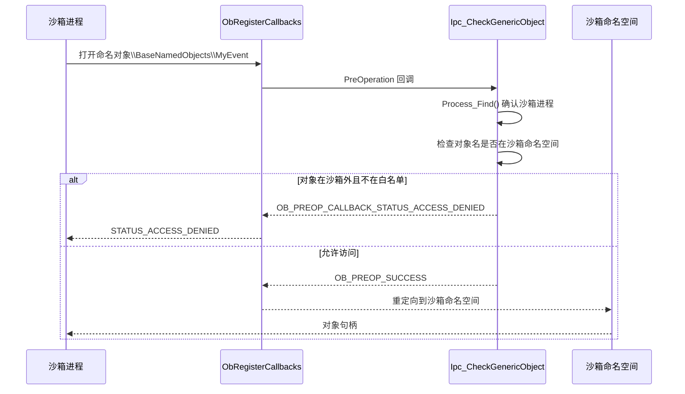

# drv/ipc.c — IPC 对象隔离

## 概述

`ipc.c` 实现 **IPC 对象隔离**，通过 `ObRegisterCallbacks` 注册对象操作回调，拦截沙箱进程对命名 IPC 对象的访问，并将沙箱进程的命名对象重定向到沙箱专属命名空间。

## 基本信息

| 属性 | 值 |
|------|----|
| 文件路径 | `Sandboxie/core/drv/ipc.c` |
| 所属模块 | SbieDrv.sys |
| 核心职责 | 命名 IPC 对象访问控制与命名空间隔离 |
| 关联文件 | `ipc_port.c`, `ipc_lsa.c`, `ipc_sam.c`, `ipc_spl.c` |

## 隔离的对象类型

| 对象类型 | 处理函数 |
|---------|--------|
| Event / EventPair / KeyedEvent | `Ipc_CheckGenericObject` |
| Timer / Mutant / Semaphore | `Ipc_CheckGenericObject` |
| Section（内存节）| `Ipc_CheckGenericObject` |
| JobObject | `Ipc_CheckJobObject` |
| SymbolicLinkObject / DirectoryObject | `Ipc_CheckGenericObject` |
| ALPC/LPC Port | `Ipc_CheckPortObject` |

## 命名空间隔离

沙箱进程的命名对象被重定向到：
```
\Sandbox\{SID}\Session_{N}\{BoxName}\BaseNamedObjects\
```
代替全局：
```
\BaseNamedObjects\
```

## 关键函数

### `Ipc_Init()`
- 为每种 IPC 对象类型调用 `Ipc_Init_Type()` 注册 Object 回调
- 拦截 `NtConnectPort`、`NtSecureConnectPort`、`NtCreatePort`、`NtAlpcConnectPort`、`NtAlpcCreatePort`
- 注册 IOCTL 处理函数（`API_DUPLICATE_OBJECT` 等）

### `Ipc_CheckGenericObject()`
对象操作回调：
1. 检查操作者是否为沙箱进程
2. 检查目标对象是否在沙箱命名空间内
3. 对比 `open_ipc_paths` / `closed_ipc_paths` 规则
4. 拒绝越界访问（`STATUS_ACCESS_DENIED`）

### `Ipc_CheckPortObject()`
专门处理 LPC/ALPC 端口访问，允许连接到白名单端口（SbieSvc、LSASS 等）。

### `Ipc_CreateBoxPath(PROCESS*)`
为沙箱进程创建其专属命名对象目录（`\BaseNamedObjects\Sandbox_xxx`）。

### `Ipc_InitProcess(PROCESS*)`
读取 `OpenIpcPath`、`ClosedIpcPath` 等配置，构建访问规则链表。

## IPC 访问控制时序图


