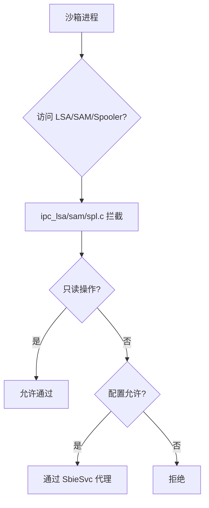

# drv/ipc_lsa.c / ipc_sam.c / ipc_spl.c — 特殊 IPC 代理

## 概述

这三个文件分别处理沙箱进程访问 LSA（本地安全机构）、SAM（安全账户管理器）和 Spooler（打印机后台处理程序）的特殊 IPC 请求，通过代理机制允许受控的访问。

## ipc_lsa.c — LSA 代理

### 功能
Sandboxie 允许沙箱进程进行正常的认证操作（如 `LsaLogonUser`），但需要防止通过 LSA 接口提取凭据或修改安全策略。

### 关键处理
- 允许连接 `\lsasspirpc`、`\protected_storage` 端口（认证需要）
- 拦截 `LsaOpenPolicy` 的写权限请求
- 阻止访问 LSA 密码历史等敏感数据

## ipc_sam.c — SAM 代理

### 功能
控制对 SAM 数据库（本地用户账户）的访问。

### 关键处理
- 只读访问：允许查询用户信息（程序登录检查需要）
- 写访问：默认拒绝（`OpenSamEndpoint=y` 可配置允许）
- 防止沙箱程序创建/修改本地用户账户

## ipc_spl.c — 打印机 Spooler 代理

### 功能
允许沙箱进程通过打印机后台处理程序（spoolsv.exe）打印文档。

### 关键处理
- 允许连接 `\spoolss` 命名管道（打印需要）
- 通过 SbieSvc 的 `PipeServer` 代理打印操作
- 打印到文件的输出路径重定向到沙箱目录

## 三者共同点

