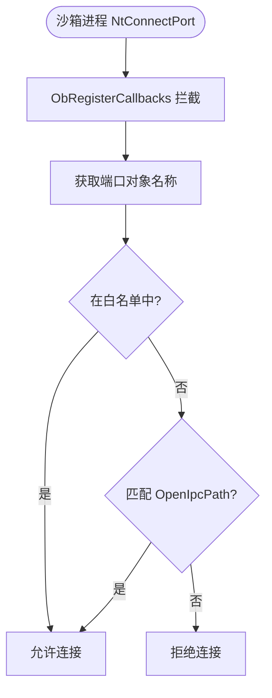

# drv/ipc_port.c — LPC/ALPC 端口控制

## 概述

`ipc_port.c` 专门处理沙箱进程的 **LPC/ALPC 端口连接请求**，控制哪些命名端口可被沙箱进程连接，防止通过 LPC 绕过沙箱隔离。

## 基本信息

| 属性 | 值 |
|------|----|
| 文件路径 | `Sandboxie/core/drv/ipc_port.c` |
| 所属模块 | SbieDrv.sys |
| 核心职责 | LPC/ALPC 端口访问控制 |

## 允许连接的白名单端口

| 端口路径 | 用途 |
|---------|------|
| `\RPC Control\lsasspirpc` | LSASS 安全认证 |
| `\RPC Control\samss` | SAM 服务 |
| `\ThemeApiPort` | 主题服务 |
| `\Windows\ApiPort` | Win32k API 端口 |
| `\SbieSvc*` | Sandboxie 自身服务端口 |

## 关键函数

### `Ipc_CheckPortObject(pre_info, proc)`

LPC/ALPC 对象操作回调：
1. 获取端口对象名称（`Obj_GetName`）
2. 检查是否在白名单中
3. 检查进程配置的 `OpenIpcPath` 规则
4. 若不允许连接返回 `ACCESS_DENIED`

### `Ipc_Api_DuplicateObject(proc, args)`

IOCTL 处理函数：允许沙箱进程请求 SbieSvc 代理复制某些句柄（受限场景）。

## 端口访问控制流程

