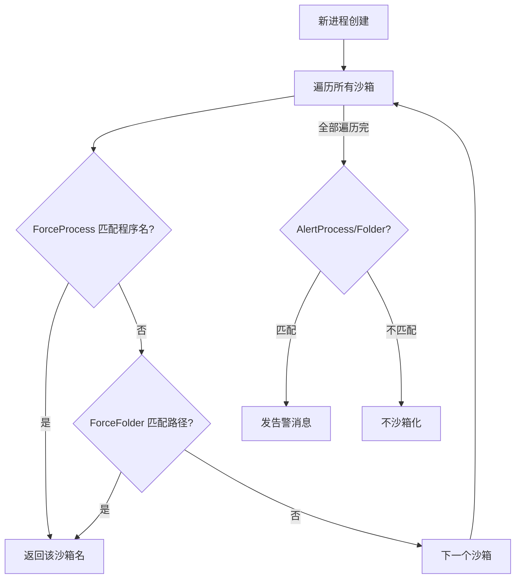

# drv/process_force.c — 强制沙箱化规则

## 概述

实现「强制程序」功能：根据 `ForceProcess`、`ForceFolder` 配置，自动将匹配的程序强制加入指定沙箱。

## 关键函数

### `Process_GetForcedStartBox(ImagePath, ParentPid)`
遍历所有沙箱配置，匹配 `ForceProcess`（程序名）和 `ForceFolder`（路径前缀），返回匹配的沙箱名。

### `Process_AddForcedChild(proc)`
将进程加入 `Process_MapFcp`，确保子进程继承沙箱（`ForceChildren=y`）。

## 配置项
```ini
[DefaultBox]
ForceProcess=chrome.exe
ForceFolder=C:\Downloads\
ForceChildren=y
AlertProcess=notepad.exe   # 仅弹窗提示不强制
```

## 决策流程

