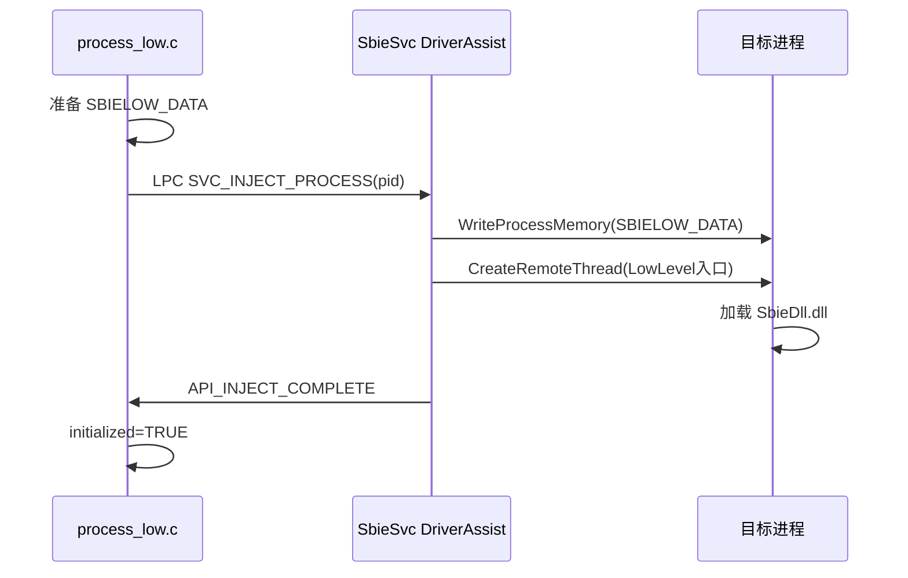

# drv/process_low.c — 底层注入协调

## 概述

负责准备 `SBIELOW_DATA` 注入数据结构，并通过 LPC 向 SbieSvc 发送注入请求。

## 关键函数

### `Process_Low_Init()`
驱动初始化时预扫描 ntdll/kernelbase，准备 `SBIELOW_DATA` 模板（含 `LdrLoadDll` 地址、系统调用表地址、注入存根代码）。

### `Process_Low_Inject(proc)`
1. 填充 `SBIELOW_DATA`（BoxName、SbieDll 路径等）
2. `Api_SendServiceMessage(SVC_INJECT_PROCESS)` 发送 LPC 消息
3. 等待 SbieSvc 完成注入（最多 30 秒）

## 注入时序

