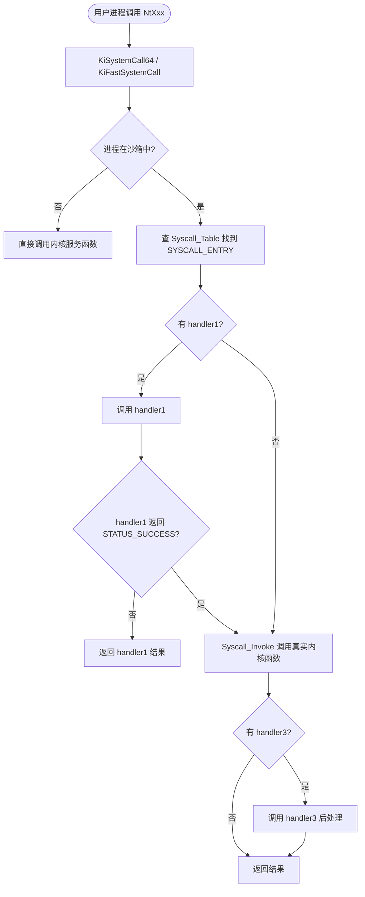

# drv/syscall.c — 系统调用拦截

## 概述

`syscall.c` 实现了 Sandboxie 的**系统调用拦截机制**，是整个驱动的技术核心之一。它通过分析 ntdll.dll 的系统调用存根，建立系统调用号→内核函数的映射表，并允许注册自定义处理函数来拦截特定系统调用。

## 基本信息

| 属性 | 值 |
|------|----|
| 文件路径 | `Sandboxie/core/drv/syscall.c` |
| 所属模块 | SbieDrv.sys |
| 语言 | C（内核模式）|
| 核心职责 | 系统调用号解析、拦截表建立、代理执行 |
| 关联文件 | `syscall_32.c`, `syscall_64.c`, `syscall_util.c`, `syscall_win32.c` |

## 核心数据结构

```c
// SYSCALL_ENTRY: 每个被拦截的系统调用的描述符
typedef struct _SYSCALL_ENTRY {
    LIST_ELEM list_elem;
    ULONG syscall_index;      // 系统调用号
    void *kernel_handler;     // 内核中真实的系统服务函数地址
    ULONG param_count;        // 参数个数
    P_Syscall_Handler1 handler1; // 一级拦截函数
    P_Syscall_Handler2 handler2; // 二级拦截函数
    P_Syscall_Handler3 handler3; // 三级拦截函数
    UCHAR name[1];            // 系统调用名称（变长）
} SYSCALL_ENTRY;
```

## 关键函数

### `Syscall_Init()`
1. `Syscall_Init_List()` — 扫描 ntdll.dll 导出表，解析每个 Nt/Zw 函数的系统调用号
2. `Syscall_Init_Table()` — 建立 syscall_index → SYSCALL_ENTRY 的快速查找表
3. `Syscall_Init_ServiceData()` — 将系统调用表数据打包，供 SbieDll 通过 IOCTL 查询
4. 注册特定系统调用拦截（`DuplicateObject`, `GetNextProcess`, `DeviceIoControlFile` 等）

### `Syscall_GetIndexFromNtdll(UCHAR* code)`
从 ntdll.dll 中某个 Nt/Zw 函数的机器码中提取系统调用号：
- x64：读取 `mov eax, imm32` 指令中的立即数
- x86：读取 `mov eax, imm32` 指令
- ARM64：读取 `movz x16, #imm` 指令

### `Syscall_Set1(name, handler)` / `Syscall_Set2()` / `Syscall_Set3()`
注册系统调用拦截处理函数：
- `Set1`：完全接管（handler 替代内核函数）
- `Set2`：前置检查（handler 返回非 0 则调用内核函数）
- `Set3`：后置处理（先调用内核函数，再调用 handler）

### `Syscall_Invoke(entry, user_args)`
代理执行真实内核系统调用，将用户态参数传递给内核服务函数。

### `Syscall_Api_Invoke()`
IOCTL 处理函数：允许 SbieDll 通过驱动代理执行某些需要提权的系统调用。

## 系统调用拦截注册表（部分）

| 系统调用 | 注册模块 | 拦截目的 |
|---------|---------|--------|
| `NtCreateUserProcess` | process.c | 控制进程创建 |
| `NtDuplicateObject` | syscall.c | 控制句柄复制 |
| `NtGetNextProcess` | syscall.c | 阻止枚举进程 |
| `NtGetNextThread` | syscall.c | 阻止枚举线程 |
| `NtDeviceIoControlFile` | syscall.c | 控制 IOCTL |
| `NtOpenProcessToken` | thread.c | 令牌访问控制 |
| `NtSetInformationProcess` | thread.c | 进程信息修改控制 |
| `NtCreateFile` | file.c | 文件创建（XP 路径）|
| `NtCreateKey` | key.c | 注册表键创建 |
| `NtCreatePort` | ipc.c | LPC 端口创建 |

## 系统调用拦截流程图


