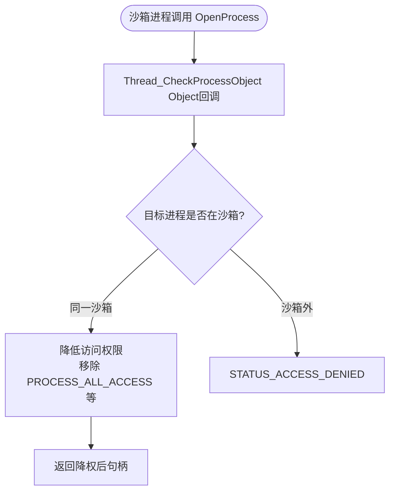

# drv/thread.c — 线程管理

## 概述

`thread.c` 通过 `PsSetCreateThreadNotifyRoutine` 监控线程创建，并拦截令牌相关系统调用（`NtOpenProcessToken`、`NtSetInformationThread` 等），防止沙箱进程通过线程模拟（Impersonation）提升权限或访问外部资源。

## 基本信息

| 属性 | 值 |
|------|----|
| 文件路径 | `Sandboxie/core/drv/thread.c` |
| 所属模块 | SbieDrv.sys |
| 核心职责 | 线程令牌控制、跨进程访问保护 |
| 关联文件 | `thread_token.c`（令牌处理）|

## 关键函数

### `Thread_Init()`
1. 注册线程通知回调 `PsSetCreateThreadNotifyRoutine`
2. 拦截 `NtOpenProcessToken`、`NtOpenProcessTokenEx`
3. 拦截 `NtOpenThreadToken`、`NtOpenThreadTokenEx`
4. 拦截 `NtSetInformationProcess`、`NtSetInformationThread`
5. 拦截 `NtImpersonateAnonymousToken`
6. 注册 `API_OPEN_PROCESS` IOCTL 处理
7. 注册进程/线程对象访问回调（`ObRegisterCallbacks`）

### `Thread_Notify(ProcessId, ThreadId, Create)`
线程创建/销毁通知：
- 创建时：若线程属于新进程（`Thread_FindAndInitProcess`），完成跨进程初始化
- 销毁时：清理线程本地数据

### `Thread_OpenProcessToken()` — 系统调用拦截
拦截 `NtOpenProcessToken`：
- 若目标进程是沙箱进程自身 → 允许（返回过滤后令牌）
- 若目标进程是非沙箱进程 → 拒绝（防止令牌窃取）

### `Thread_SetInformationProcess()` — 系统调用拦截
拦截 `NtSetInformationProcess`，防止沙箱进程修改进程信息（如优先级、调试端口）。

### `Thread_CheckProcessObject()` — Object 回调
当沙箱进程尝试打开另一个进程时：
- 若目标在同一沙箱 → 允许（降低访问权限位）
- 若目标在沙箱外 → 拒绝（`STATUS_ACCESS_DENIED`）

### `Thread_CheckThreadObject()` — Object 回调
同上，针对线程对象访问的保护。

## THREAD 结构体（thread.h）

```c
typedef struct _THREAD {
    LIST_ELEM list_elem;
    HANDLE tid;                        // 线程 ID
    BOOLEAN create_process_in_progress;// 正在创建子进程
    void *token_object;                // 当前模拟令牌
    BOOLEAN token_CopyOnOpen;
    BOOLEAN token_EffectiveOnly;
    SECURITY_IMPERSONATION_LEVEL token_ImpersonationLevel;
} THREAD;
```

## 跨进程访问控制流程


