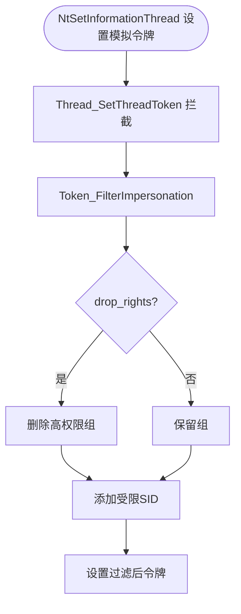

# drv/thread_token.c — 线程令牌控制

## 概述

`thread_token.c` 处理线程级别的令牌操作，防止沙箱进程通过线程模拟（Impersonation）提升权限或访问沙箱外资源。

## 关键函数

### `Thread_SetThreadToken(proc, ThreadId, TokenObject)`

当沙箱线程调用 `NtSetInformationThread(ThreadImpersonationToken)` 时被调用：
- 检查新令牌的权限级别
- 若令牌权限超出沙箱范围，则替换为受限版本
- 调用 `Token_FilterImpersonation()` 过滤模拟令牌

### `Token_FilterImpersonation(TokenObject, proc)`

过滤模拟令牌：
- 删除高权限组（若 `drop_rights=y`）
- 添加受限 SID
- 返回过滤后的令牌对象

### `Thread_CheckAnonymousToken(proc)`

拦截 `NtImpersonateAnonymousToken`：
- 匿名令牌在沙箱中通常是允许的（低权限）
- 但若配置 `UseSecurityMode=y` 则拒绝

## 模拟令牌过滤流程

