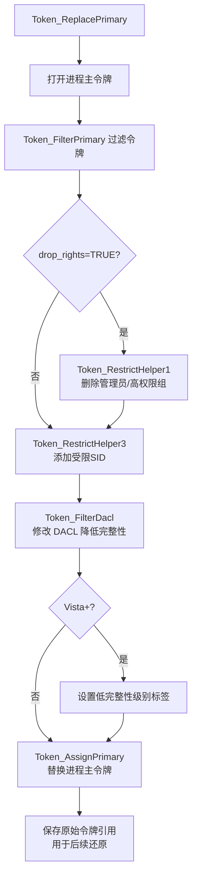

# drv/token.c — 令牌与权限管理

## 概述

`token.c` 实现了 Sandboxie 的**进程令牌操作**，是沙箱安全隔离的核心安全机制。它为每个沙箱进程替换主令牌，删除管理员组成员资格，添加受限 SID，降低完整性级别，从而防止沙箱进程获取超出应有的系统权限。

## 基本信息

| 属性 | 值 |
|------|----|
| 文件路径 | `Sandboxie/core/drv/token.c` |
| 所属模块 | SbieDrv.sys |
| 语言 | C（内核模式）|
| 核心职责 | 进程令牌过滤与替换（降权）|

## 令牌操作流程

沙箱进程启动时（在 `Process_NotifyImage` 中调用 `Token_ReplacePrimary`）：

## 关键函数

### `Token_ReplacePrimary(PROCESS*)`
主入口，协调令牌替换的完整流程。先获取进程对象，再调用 `Token_FilterPrimary` 过滤令牌，最后用 `Token_AssignPrimary` 替换。

### `Token_FilterPrimary(PROCESS*, ProcessObject)`
核心过滤函数：
1. 打开进程主访问令牌
2. 删除特权（通过 `SepFilterToken` / `SeFilterToken`）
3. 添加受限 SID（`SECURITY_RESTRICTED_CODE_RID`）
4. 调整 DACL

### `Token_RestrictHelper1(TokenObject, PROCESS*)`
删除高权限组（仅 `drop_rights=TRUE` 时）：
- 删除 Administrators 组
- 删除 Power Users 组
- 通过内部 `SepFilterToken` 函数实现

### `Token_RestrictHelper3(TokenObject, Groups, Privs, UserSid, Flags, PROCESS*)`
使用 `ZwCreateToken` 或 `ZwCreateTokenEx` 创建新令牌：
- 保留原令牌用户 SID
- 添加 Sandboxie 登录 SID（`SandboxieLogonSid`）
- 设置完整性级别（`SECURITY_MANDATORY_UNTRUSTED_RID` 或 `LOW`）

### `Token_AssignPrimary(ProcessObject, TokenObject, SessionId)`
调用 `ZwSetInformationProcess(ProcessHandle, ProcessAccessToken, ...)` 将过滤后的令牌设置为进程主令牌。

### `Thread_OpenProcessToken` / `Thread_OpenThreadToken`（拦截）
拦截 `NtOpenProcessToken` 和 `NtOpenThreadToken`，防止沙箱进程直接访问真实令牌。

## 使用的内核 API

| API | 用途 |
|-----|------|
| `PsOpenProcess` | 打开进程对象 |
| `ZwOpenProcessTokenEx` | 打开进程令牌 |
| `SeFilterToken` | 过滤令牌（用户态包装）|
| `SepFilterToken` | 内核内部过滤函数（动态定位）|
| `ZwCreateToken` / `ZwCreateTokenEx` | 创建新令牌 |
| `ZwSetInformationProcess` | 替换进程主令牌 |
| `ObReferenceObjectByHandle` | 通过句柄获取令牌对象 |

## 安全考虑

1. **双重验证**：不仅过滤令牌权限，还通过内核 Object Callback（`Thread_CheckProcessObject`）阻止沙箱进程直接打开其他进程。
2. **完整性级别**：在 Vista+ 上设置低或不可信完整性级别，防止 UIPI 绕过。
3. **原始令牌保存**：`proc->primary_token` 保存过滤前的原始令牌，用于权限代理操作（SbieSvc 代理执行）。
