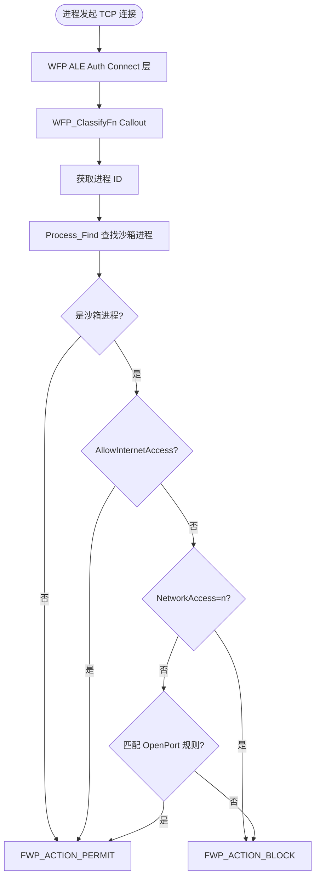

# drv/wfp.c — Windows 过滤平台（网络隔离）

## 概述

`wfp.c` 通过 **Windows Filtering Platform (WFP)** 实现沙箱进程的网络访问控制。注册 WFP Callout，在网络数据包层面检查发起连接的进程是否在沙箱中，并根据配置决定是否允许网络访问。

## 基本信息

| 属性 | 值 |
|------|----|
| 文件路径 | `Sandboxie/core/drv/wfp.c` |
| 所属模块 | SbieDrv.sys |
| 核心职责 | 网络连接过滤（出站/入站）|

## 关键函数

### `WFP_Init()`
1. 调用 `FwpmEngineOpen` 打开 WFP 引擎
2. 注册 Callout（`FwpmCalloutAdd`）到 `FWPM_LAYER_ALE_AUTH_CONNECT_V4/V6`（出站连接）
3. 注册 Callout 到 `FWPM_LAYER_ALE_AUTH_RECV_ACCEPT_V4/V6`（入站连接）
4. 添加过滤规则（`FwpmFilterAdd`）

### `WFP_InitProcess(PROCESS*)`
为新沙箱进程配置网络访问规则：
- 读取 `BlockPort`、`OpenPort`、`NetworkAccess` 配置
- 若配置 `NetworkAccess=n` 则完全阻断网络

### `WFP_DeleteProcess(PROCESS*)`
进程退出时清理 WFP 状态。

### `WFP_ClassifyFn()`（Callout 分类函数）
每个新网络连接触发：
1. 通过 `FwpsGetPacketListSecurityInformation` 获取发起进程 ID
2. 调用 `Process_Find()` 检查是否为沙箱进程
3. 根据进程配置决定 `FWP_ACTION_PERMIT` 或 `FWP_ACTION_BLOCK`

## 网络过滤流程

## 使用的 WFP API

| API | 用途 |
|-----|------|
| `FwpmEngineOpen` | 打开 WFP 引擎 |
| `FwpsCalloutRegister` | 注册 Callout 分类函数 |
| `FwpmCalloutAdd` | 向 WFP 数据库添加 Callout |
| `FwpmFilterAdd` | 添加过滤规则 |
| `FwpsGetPacketListSecurityInformation` | 获取数据包安全信息（进程 ID）|
