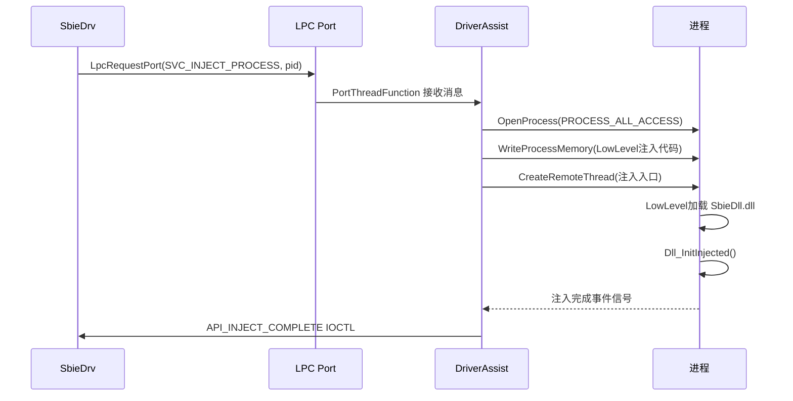

# svc/DriverAssist.cpp — 驱动辅助服务

## 概述

`DriverAssist.cpp` 是 SbieSvc 中**与内核驱动交互的核心组件**，负责加载驱动、管理驱动通信（LPC 端口）、处理驱动发来的消息（进程注入请求、日志消息等），以及协调 DLL 注入工作。

## 基本信息

| 属性 | 值 |
|------|----|
| 文件路径 | `Sandboxie/core/svc/DriverAssist.cpp` |
| 所属模块 | SbieSvc.exe |
| 语言 | C++ |
| 核心职责 | 驱动加载、LPC 通信、DLL 注入协调 |
| 关联文件 | `DriverAssistInject.cpp`, `DriverAssistLog.cpp`, `DriverAssistStart.cpp`, `DriverAssistSid.cpp` |

## 关键函数

### `Initialize()`
服务启动时调用：
1. `InjectLow_Init()` — 初始化底层注入机制（LowLevel.dll）
2. `InitializePortAndThreads()` — 创建 LPC 端口，启动消息处理线程
3. 异步启动驱动（`StartDriverAsync`）

### `InitializePortAndThreads()`
1. 创建具名 LPC 端口（格式：`SbieSvc-internal-{tickcount}`）
2. 调用驱动 `API_SET_SERVICE_PORT` 注册此端口
3. 启动多个消息处理线程（`PortThreadFunction`）

### `PortThreadFunction()`
LPC 消息处理循环：
- 接收驱动发来的 LPC 消息
- 根据 `msgid` 分发：
  - `SVC_INJECT_PROCESS` → 注入 SbieDll 到新进程
  - `SVC_CANCEL_PROCESS` → 终止问题进程
  - `SVC_LOG_MESSAGE` → 处理日志消息
  - `SVC_START_GUI_THREAD` → 启动 GUI 线程

### `InjectLow_Init()` / `InjectProcess()`（DriverAssistInject.cpp）
协调 DLL 注入过程：
1. 加载 LowLevel.dll 到 SbieSvc 进程
2. 通过 `WriteProcessMemory` + `CreateRemoteThread` 向目标进程注入
3. 等待注入完成信号
4. 调用驱动 `API_INJECT_COMPLETE` 通知注入结束

### `StartDriver()` / `StopDriver()`（DriverAssistStart.cpp）
通过 SCM（服务控制管理器）加载/卸载 SbieDrv.sys 驱动。

## 驱动通信时序图

