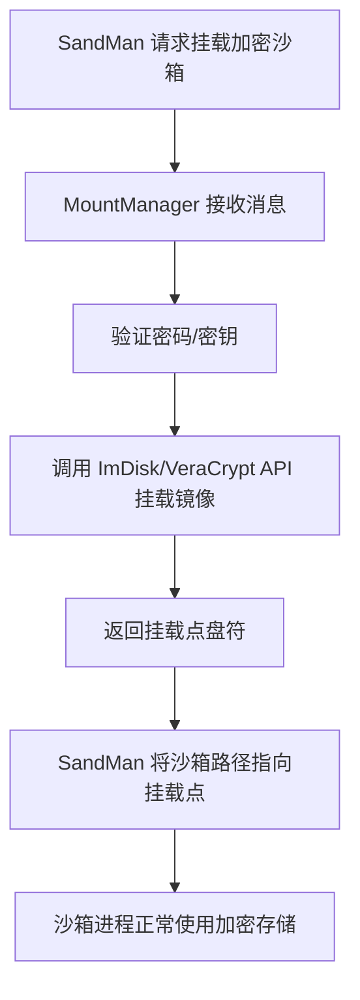

# svc/MountManager.cpp — 磁盘挂载管理

## 概述

`MountManager.cpp` 管理加密沙箱的**磁盘镜像挂载/卸载**，支持 ImDisk、VeraCrypt 等加密容器，实现沙箱数据加密存储。

## 基本信息

| 属性 | 值 |
|------|----|
| 文件路径 | `Sandboxie/core/svc/MountManager.cpp` |
| 所属模块 | SbieSvc.exe |
| 核心职责 | 加密磁盘镜像挂载/卸载（ImBox 功能）|

## 消息处理

| 消息 ID | 功能 |
|--------|------|
| `MSGID_MOUNT_MANAGER_MOUNT` | 挂载加密磁盘镜像 |
| `MSGID_MOUNT_MANAGER_UNMOUNT` | 卸载镜像 |
| `MSGID_MOUNT_MANAGER_GET_STATUS` | 查询挂载状态 |

## 工作流程

## 关联工具

`SandboxieTools/ImBox/` 目录包含 ImBox 工具，用于创建和管理加密磁盘镜像容器。
