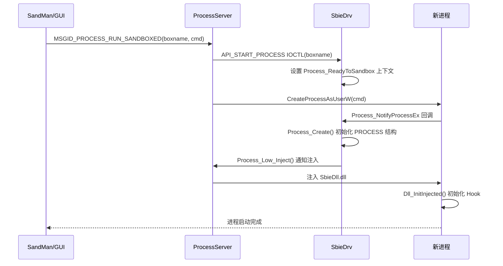

# svc/ProcessServer.cpp — 进程服务

## 概述

`ProcessServer.cpp` 是 SbieSvc 中负责**进程生命周期管理**的服务组件，通过命名管道（PipeServer）接收来自 SbieDll 和 GUI 的请求，处理进程启动、终止、挂起/恢复等操作。

## 基本信息

| 属性 | 值 |
|------|----|
| 文件路径 | `Sandboxie/core/svc/ProcessServer.cpp` |
| 所属模块 | SbieSvc.exe |
| 语言 | C++（用户态 SYSTEM 权限）|
| 核心职责 | 沙箱进程启动、终止、状态管理 |

## 消息 ID 处理表

| 消息 ID | 处理函数 | 功能 |
|--------|---------|------|
| `MSGID_PROCESS_CHECK_INIT_COMPLETE` | `CheckInitCompleteHandler` | 检查驱动是否就绪 |
| `MSGID_PROCESS_KILL_ONE` | `KillOneHandler` | 终止单个进程 |
| `MSGID_PROCESS_KILL_ALL` | `KillAllHandler` | 终止沙箱内所有进程 |
| `MSGID_PROCESS_RUN_SANDBOXED` | `RunSandboxedHandler` | 在沙箱中启动程序 |
| `MSGID_PROCESS_RUN_UPDATER` | `RunUpdaterHandler` | 启动更新程序 |
| `MSGID_PROCESS_GET_INFO` | `ProcInfoHandler` | 获取进程信息 |
| `MSGID_PROCESS_SUSPEND_RESUME_ONE` | `SuspendOneHandler` | 挂起/恢复单进程 |
| `MSGID_PROCESS_SUSPEND_RESUME_ALL` | `SuspendAllHandler` | 挂起/恢复沙箱所有进程 |
| `MSGID_PROCESS_SET_DEVICE_MAP` | `SetDeviceMap` | 设置设备映射 |

## 关键函数

### `KillProcess(ProcessId)`
安全终止沙箱进程：
1. `OpenProcess(PROCESS_TERMINATE | PROCESS_QUERY_LIMITED_INFORMATION)`
2. 调用 `SbieApi_QueryProcessInfo` 确认仍是沙箱进程（防 PID 复用）
3. 检查进程是否被标记为关键进程（`NtSetInformationProcess BreakOnTermination`）
4. 若是关键进程先清除标记，再调用 `TerminateProcess`

### `RunSandboxedHandler(msg)`
在指定沙箱中启动程序：
1. 验证请求来源合法性
2. 读取目标沙箱配置
3. 构建带沙箱环境的进程创建参数
4. 通过驱动 `API_START_PROCESS` IOCTL 通知驱动
5. 调用 `CreateProcessAsUserW` 启动进程

### `KillAllHandler(msg)`
终止沙箱内全部进程：
1. 通过驱动 `API_ENUM_PROCESSES` 枚举所有沙箱进程
2. 逐一调用 `KillProcess`
3. 等待所有进程退出（带超时）

## 进程启动时序图

