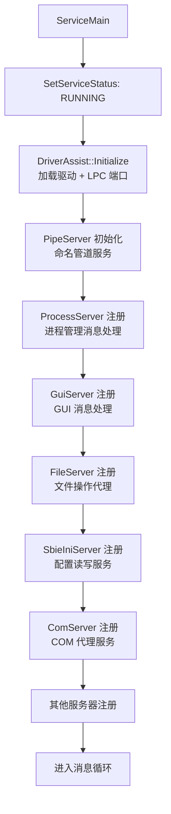

# svc/main.cpp — 服务主入口

## 概述

`main.cpp` 是 `SbieSvc.exe` 的主入口，实现 Windows 服务框架（`ServiceMain`），协调所有服务子组件的初始化和运行。

## 基本信息

| 属性 | 值 |
|------|----|
| 文件路径 | `Sandboxie/core/svc/main.cpp` |
| 所属模块 | SbieSvc.exe |
| 语言 | C++ |
| 核心职责 | 服务入口、组件初始化协调 |

## 服务初始化顺序

## PipeServer 架构

SbieSvc 所有服务组件基于统一的 `PipeServer` 命名管道服务框架：
- 每个服务器在构造函数中调用 `pipeServer->Register(MSGID_xxx, this, Handler)`
- `PipeServer` 接收命名管道连接，根据消息 ID 路由到对应处理器
- 每个连接在独立线程中处理（线程池）

## 子服务组件一览

| 组件 | 文件 | 职责 |
|------|------|------|
| `ProcessServer` | ProcessServer.cpp | 进程启动/终止 |
| `GuiServer` | GuiServer.cpp | GUI/Job Object 管理 |
| `FileServer` | fileserver.cpp | 文件操作代理 |
| `SbieIniServer` | sbieiniserver.cpp | 配置文件读写 |
| `ComServer` | comserver.cpp | COM 服务代理 |
| `IpHlpServer` | iphlpserver.cpp | IP Helper API 代理 |
| `NetApiServer` | netapiserver.cpp | 网络 API 代理 |
| `ServiceServer` | serviceserver.cpp | SCM 服务代理 |
| `TerminalServer` | terminalserver.cpp | 终端服务代理 |
| `UserServer` | UserServer.cpp | 用户信息代理 |
| `MountManager` | MountManager.cpp | 磁盘挂载管理 |
| `EpMapperServer` | EpMapperServer.cpp | RPC 端点映射 |
| `QueueServer` | queueserver.cpp | 异步队列服务 |
