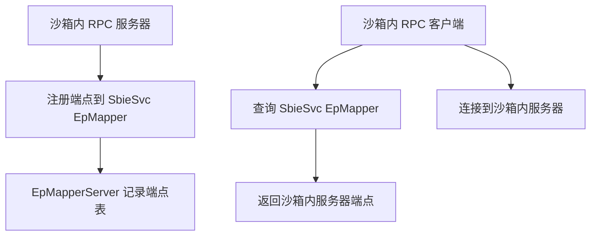

# svc/terminalserver.cpp / EpMapperServer.cpp

## terminalserver.cpp — 终端服务代理

### 概述
代理沙箱进程的 Terminal Services（WTS）API 调用，过滤多用户会话信息。

### 消息处理

| 消息 ID | 功能 |
|--------|------|
| `MSGID_TERMINAL_GET_INFO` | 获取当前会话信息 |
| `MSGID_TERMINAL_ENUMERATE` | 枚举会话（过滤只返回当前会话）|

### 处理逻辑
- `WTSEnumerateSessions`：只返回调用进程所在的会话，防止枚举其他用户会话
- `WTSQuerySessionInformation`：过滤敏感字段（用户名、域名等可配置）

---

## EpMapperServer.cpp — RPC 端点映射代理

### 概述

`EpMapperServer.cpp` 为沙箱提供专属的 **RPC 端点映射器（EPMapper）**，替代系统的全局 `epmapper`，实现沙箱内 RPC 服务的隔离注册和发现。

### 工作原理

### 关键消息

| 消息 ID | 功能 |
|--------|------|
| `MSGID_EPMAPPER_REGISTER` | 注册 RPC 端点 |
| `MSGID_EPMAPPER_RESOLVE` | 解析 RPC 端点地址 |
| `MSGID_EPMAPPER_UNREGISTER` | 注销端点 |
