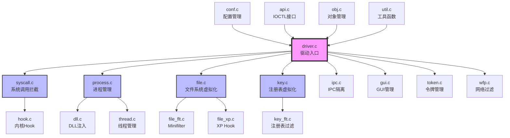

# 模块级分析：内核驱动层 (SbieDrv.sys)

## 1. 模块概述

**核心职责**：实现 Sandboxie 的内核级沙箱隔离机制，通过系统调用拦截、文件系统过滤、进程监控和资源虚拟化，确保沙箱进程与主机系统的完全隔离。

**模块边界**：
- **输入**：
  - 用户态应用程序的系统调用
  - Windows 内核的进程/线程/镜像通知
  - SbieSvc 服务的 IOCTL 请求
  - 配置文件（Sandboxie.ini）
  
- **输出**：
  - 拦截和重定向的系统调用
  - 虚拟化的文件系统和注册表访问
  - 进程创建/终止事件通知
  - 日志和跟踪信息

**模块路径**：`Sandboxie/core/drv/`

---

## 2. 架构总览

### 2.1 模块内部架构图



### 2.2 数据流向

```
应用程序系统调用
    ↓
syscall.c (系统调用拦截层)
    ↓
    ├─→ file.c (文件操作)
    │   ├─ 路径解析
    │   ├─ 访问控制检查
    │   ├─ 路径重定向
    │   └─ 写时复制
    │
    ├─→ key.c (注册表操作)
    │   ├─ 键路径解析
    │   ├─ 访问控制检查
    │   └─ 注册表虚拟化
    │
    ├─→ process.c (进程操作)
    │   ├─ 进程创建监控
    │   ├─ 沙箱化决策
    │   └─ DLL 注入触发
    │
    └─→ ipc.c (IPC 操作)
        ├─ 对象名称解析
        ├─ 访问控制检查
        └─ IPC 隔离
    ↓
conf.c (配置管理)
    - 读取访问规则
    - 应用沙箱策略
    ↓
原始 Windows 内核 API
```

---

## 3. 核心文件清单

| 文件/子模块 | 职责定位 | 关键对外接口 |
|-----------|---------|------------|
| **driver.c** | 驱动入口和初始化管理 | DriverEntry, Driver_CheckOsVersion |
| **syscall.c** | 系统调用拦截核心 | Syscall_Init, Syscall_Set1 |
| **process.c** | 进程隔离和管理 | Process_Init, Process_NotifyProcessEx |
| **file.c** | 文件系统虚拟化 | File_Init, File_CreateBoxPath |
| **key.c** | 注册表虚拟化 | Key_Init, Key_NtCreateKey |
| **ipc.c** | IPC 隔离 | Ipc_Init, Ipc_CheckObject |
| **gui.c** | GUI 管理 | Gui_Init, Gui_CreateWindow |
| **token.c** | 令牌管理和权限控制 | Token_Init, Token_CreateToken |
| **wfp.c** | 网络过滤 | Wfp_Init, Wfp_RegisterCallouts |
| **dll.c** | DLL 注入管理 | Dll_Init, Dll_InjectLowLevel |
| **thread.c** | 线程管理 | Thread_Init, Thread_NotifyThread |
| **conf.c** | 配置管理 | Conf_Init, Conf_Get |
| **api.c** | IOCTL 接口 | Api_Init, Api_Ioctl |
| **obj.c** | 对象管理 | Obj_Init, Obj_GetObjectName |
| **hook.c** | 内核 Hook 实现 | Hook_Init, Hook_Trampoline |
| **util.c** | 工具函数 | Util_GetProcessName, Util_GetSystemTime |
| **verify.c** | 证书验证 | MyValidateCertificate |
| **mem.c** | 内存管理 | Mem_Alloc, Mem_Free |
| **log.c** | 日志记录 | Log_Msg, Log_Status |

---

## 4. 对外暴露的公开 API

### 4.1 IOCTL 接口（与 SbieSvc 通信）

| IOCTL 代码 | 功能 | 处理函数 |
|-----------|------|---------|
| API_GET_VERSION | 获取驱动版本 | Api_GetVersion |
| API_QUERY_PROCESS | 查询进程信息 | Process_Api_Query |
| API_QUERY_BOX_PATH | 查询沙箱路径 | Box_Api_QueryPath |
| API_ENUM_PROCESSES | 枚举沙箱进程 | Process_Api_Enum |
| API_START_PROCESS | 启动沙箱进程 | Process_Api_Start |
| API_TERMINATE_PROCESS | 终止沙箱进程 | Process_Api_Terminate |
| API_RENAME_FILE | 重命名文件 | File_Api_Rename |
| API_GET_FILE_NAME | 获取文件名 | File_Api_GetName |
| API_OPEN_FILE | 打开文件 | File_Api_Open |
| API_RELOAD_CONF | 重新加载配置 | Conf_Api_Reload |
| API_GET_LOG | 获取日志 | Log_Api_Get |

### 4.2 系统调用拦截接口

| 系统调用 | 拦截函数 | 用途 |
|---------|---------|------|
| NtCreateFile | File_NtCreateFile | 文件创建/打开 |
| NtOpenFile | File_NtOpenFile | 文件打开 |
| NtCreateKey | Key_NtCreateKey | 注册表键创建 |
| NtOpenKey | Key_NtOpenKey | 注册表键打开 |
| NtCreateUserProcess | Process_CreateUserProcess | 进程创建 |
| NtCreateThread | Thread_NtCreateThread | 线程创建 |
| NtCreateEvent | Ipc_NtCreateEvent | 事件对象创建 |
| NtCreateMutant | Ipc_NtCreateMutant | 互斥体创建 |
| NtAlpcConnectPort | Ipc_NtAlpcConnectPort | ALPC 连接 |

---

## 5. 内部协作模式

### 5.1 核心场景 1：启动沙箱进程

```
时序图：

用户 -> SbieSvc: 启动进程请求
SbieSvc -> SbieDrv: IOCTL (API_START_PROCESS)
SbieDrv -> process.c: Process_Api_Start()
process.c -> Windows: CreateProcess()
Windows -> process.c: Process_NotifyProcessEx() 回调
process.c -> process.c: Process_Create() 创建进程对象
process.c -> dll.c: Dll_InjectLowLevel() 注入 DLL
dll.c -> LowLevel.dll: 注入到目标进程
LowLevel.dll -> SbieDll.dll: 加载用户态 DLL
SbieDll.dll -> process.c: Hook Windows API
process.c -> SbieSvc: 进程启动完成
SbieSvc -> 用户: 返回结果
```

### 5.2 核心场景 2：文件写入操作

```
调用链路：

1. 沙箱进程调用 CreateFile("C:\\test.txt", WRITE)
    ↓
2. SbieDll.dll Hook 拦截
    ↓
3. 调用 NtCreateFile (系统调用)
    ↓
4. syscall.c 拦截系统调用
    ↓
5. file.c: File_NtCreateFile()
    ├─ 解析路径: C:\test.txt
    ├─ 检查访问规则 (conf.c)
    ├─ 生成沙箱路径: C:\Sandbox\Box\drive\C\test.txt
    ├─ 检查文件是否存在
    ├─ 如果不存在，复制原文件（写时复制）
    └─ 打开沙箱文件
    ↓
6. 返回文件句柄给应用程序
    ↓
7. 应用程序写入数据到沙箱文件
```

### 5.3 核心场景 3：进程隔离

```
隔离机制：

1. 进程创建时
   process.c: Process_NotifyProcessEx()
   ├─ 判断是否需要沙箱化
   ├─ 创建 PROCESS 对象
   └─ 设置沙箱标志
    ↓
2. 令牌修改
   token.c: Token_CreateToken()
   ├─ 降低完整性级别 (High → Low)
   ├─ 移除管理员权限
   ├─ 添加受限 SID
   └─ 限制特权
    ↓
3. 资源访问控制
   所有系统调用被拦截
   ├─ file.c: 文件访问控制
   ├─ key.c: 注册表访问控制
   ├─ ipc.c: IPC 访问控制
   └─ gui.c: GUI 访问控制
    ↓
4. 网络过滤
   wfp.c: 网络访问控制
   ├─ 基于 IP/端口过滤
   └─ 基于进程过滤
```

---

## 6. 数据模型总览

### 6.1 核心数据结构

```c
// 进程对象
typedef struct _PROCESS {
    HANDLE pid;                      // 进程 ID
    const BOX *box;                  // 所属沙箱
    WCHAR *image_name;               // 镜像文件名
    BOOLEAN is_sandboxed;            // 是否沙箱化
    BOOLEAN parent_was_sandboxed;    // 父进程是否沙箱化
    LIST *open_file_paths;           // 打开文件路径列表
    LIST *closed_file_paths;         // 关闭文件路径列表
    // ... 更多字段
} PROCESS;

// 沙箱对象
typedef struct _BOX {
    WCHAR *name;                     // 沙箱名称
    WCHAR *file_path;                // 沙箱文件路径
    WCHAR *key_path;                 // 沙箱注册表路径
    ULONG flags;                     // 沙箱标志
    // ... 配置选项
} BOX;

// 文件操作上下文
typedef struct _MY_CONTEXT {
    KPROCESSOR_MODE AccessMode;      // 访问模式
    ULONG CreateDisposition;         // 创建配置
    ULONG CreateOptions;             // 创建选项
    ULONG OriginalDesiredAccess;     // 原始访问权限
} MY_CONTEXT;
```

### 6.2 全局映射表

```c
// 进程映射表 (ProcessId → PROCESS*)
HASH_MAP Process_Map;

// 沙箱映射表 (BoxName → BOX*)
HASH_MAP Box_Map;

// 配置映射表 (Setting → Value)
HASH_MAP Conf_Map;
```

---

## 7. 外部依赖汇总

### 7.1 内部依赖

| 模块 | 依赖模块 | 依赖原因 |
|-----|---------|---------|
| driver.c | 所有子模块 | 初始化所有子系统 |
| syscall.c | file, key, process, ipc | 分发系统调用 |
| process.c | dll, token, conf | 进程沙箱化 |
| file.c | conf, obj, util | 文件虚拟化 |
| key.c | conf, obj, util | 注册表虚拟化 |

### 7.2 外部依赖（Windows 内核）

| 依赖类别 | 主要 API |
|---------|---------|
| 进程管理 | PsSetCreateProcessNotifyRoutineEx, PsGetProcessId |
| 线程管理 | PsSetCreateThreadNotifyRoutine, PsGetThreadId |
| 文件系统 | ZwCreateFile, ZwQueryInformationFile, FltRegisterFilter |
| 注册表 | ZwCreateKey, ZwQueryKey, CmRegisterCallback |
| 对象管理 | ObOpenObjectByPointer, ObReferenceObject |
| 内存管理 | ExAllocatePoolWithTag, MmCopyMemory |
| 同步 | KeAcquireSpinLock, ExAcquireResourceSharedLite |
| 网络 | FwpmEngineOpen, FwpmCalloutAdd |

---

## 8. 关注点与改进建议

### 8.1 安全类

| 关注点 | 严重性 | 描述 | 建议 |
|-------|-------|------|------|
| 路径逃逸 | 高 | 路径解析错误可能导致文件泄漏 | 增强路径验证，添加更多测试用例 |
| 重解析点处理 | 中 | 符号链接可能绕过隔离 | 严格限制重解析点跟踪 |
| 系统调用拦截完整性 | 高 | 未拦截的系统调用可能绕过沙箱 | 定期审计系统调用列表 |
| 令牌伪造 | 高 | 令牌创建逻辑需要严格验证 | 增强令牌验证机制 |

### 8.2 性能类

| 关注点 | 影响 | 描述 | 建议 |
|-------|-----|------|------|
| 写时复制性能 | 中 | 大文件首次写入延迟高 | 考虑增量复制或延迟复制 |
| 哈希表冲突 | 低 | 进程映射表可能冲突 | 动态调整桶大小 |
| 系统调用开销 | 中 | 每次系统调用都有拦截开销 | 优化热路径，减少不必要的检查 |
| 配置查询 | 低 | 频繁查询配置可能影响性能 | 增加配置缓存 |

### 8.3 可维护性类

| 关注点 | 描述 | 建议 |
|-------|------|------|
| 代码复杂度 | file.c 和 process.c 文件较大 | 进一步拆分模块 |
| 注释不足 | 部分复杂逻辑缺少注释 | 增加详细注释 |
| 错误处理 | 部分错误处理不完整 | 统一错误处理机制 |
| 测试覆盖 | 缺少自动化测试 | 增加单元测试和集成测试 |

---

## 9. 整体评估与建议

### 9.1 架构优势

✅ **高度模块化**：每个功能都是独立的子系统，易于维护和扩展  
✅ **分层设计**：清晰的层次结构，职责分离明确  
✅ **跨版本兼容**：支持 Windows XP 到 Windows 11  
✅ **完善的隔离机制**：多层防护，安全性高  
✅ **灵活的配置系统**：支持细粒度的访问控制

### 9.2 改进机会

⚠️ **性能优化**：
- 优化热路径代码
- 增加缓存机制
- 减少不必要的系统调用

⚠️ **代码质量**：
- 增加单元测试
- 完善错误处理
- 增加代码注释

⚠️ **安全增强**：
- 定期安全审计
- 增强路径验证
- 完善系统调用拦截

### 9.3 技术债务

1. **XP 支持代码**：大量 XP 兼容代码增加维护成本
2. **全局变量**：部分全局变量可以封装
3. **代码重复**：部分逻辑在多个文件中重复
4. **文档不足**：缺少详细的技术文档

---

**分析完成时间**：2026-03-05  
**模块复杂度**：极高  
**代码行数**：约 50,000+ 行  
**核心文件数**：50+ 个
