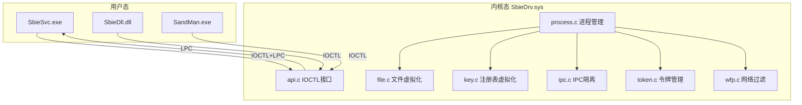
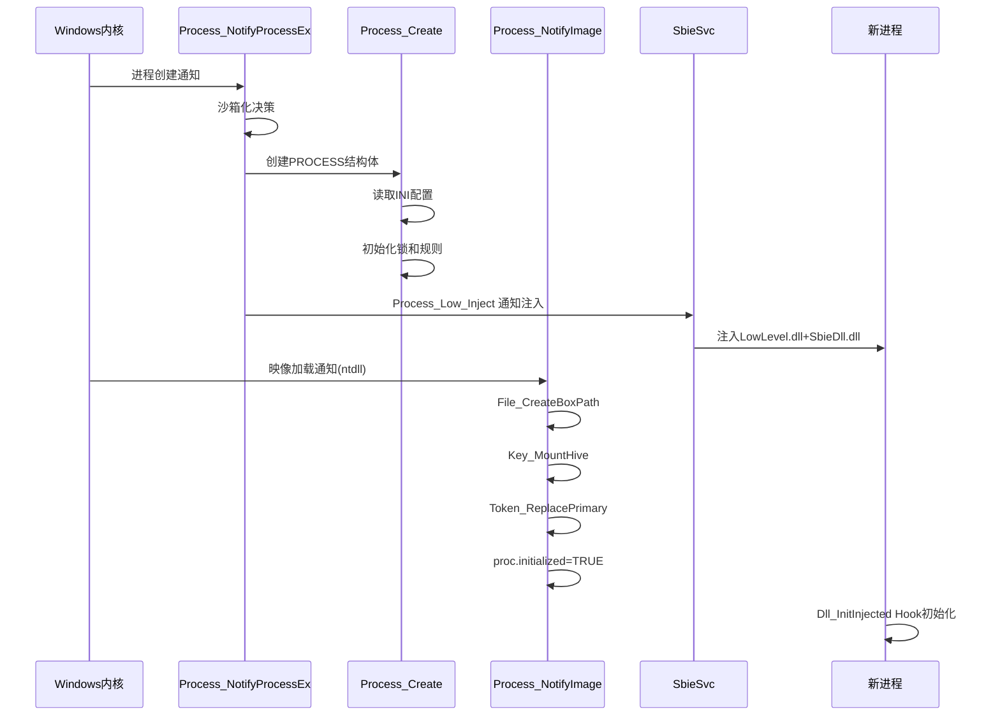
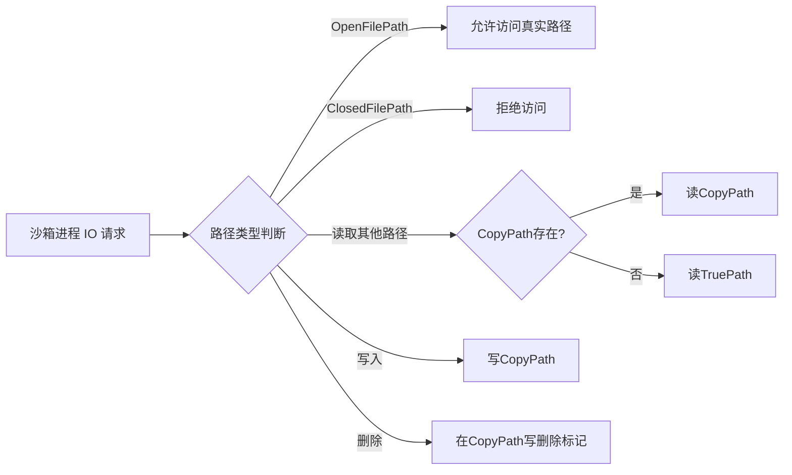

# 模块分析：内核驱动层（SbieDrv.sys）

## 概述

SbieDrv.sys 是 Sandboxie 的内核驱动，运行于 Ring 0，是沙箱安全隔离的根基。通过注册系统回调、文件系统过滤器、注册表过滤器、系统调用拦截，在进程级别强制执行沙箱策略。

## 基本信息

| 属性 | 值 |
|------|----|
| 输出文件 | `SbieDrv.sys` |
| 运行级别 | 内核态（Ring 0）|
| 加载方式 | SbieSvc 通过 SCM 加载 |
| 通信方式 | IOCTL + LPC |
| 源码目录 | `Sandboxie/core/drv/` |
| 支持架构 | x86、x64、ARM64 |

## 子模块职责

| 子模块 | 主文件 | 职责 |
|--------|--------|------|
| 驱动入口 | `driver.c` | 初始化/卸载 |
| API 接口 | `api.c` | IOCTL 分发、日志缓冲 |
| 进程管理 | `process.c` | 进程监控、沙箱化决策 |
| 文件虚拟化 | `file.c` + `file_flt.c` | Copy-on-Write |
| 注册表虚拟化 | `key.c` + `key_flt.c` | Copy-on-Write |
| IPC 隔离 | `ipc.c` | 命名对象访问控制 |
| GUI 隔离 | `gui.c` | UIPI/窗口消息保护 |
| 令牌管理 | `token.c` | 进程降权 |
| 线程管理 | `thread.c` | 跨进程访问保护 |
| 系统调用 | `syscall.c` | 系统调用拦截 |
| 网络过滤 | `wfp.c` | WFP 网络连接控制 |
| 配置系统 | `conf.c` | INI 配置解析 |
| Hook 框架 | `hook.c` | Inline Hook 基础设施 |
| 沙箱描述 | `box.c` | BOX 结构体管理 |
| 证书验证 | `verify.c` | 功能授权控制 |

## 架构图

## 关键内核回调

| 回调 API | 处理函数 | 用途 |
|---------|----------|------|
| `PsSetCreateProcessNotifyRoutineEx` | `Process_NotifyProcessEx` | 进程创建/销毁 |
| `PsSetLoadImageNotifyRoutine` | `Process_NotifyImage` | 映像加载 |
| `PsSetCreateThreadNotifyRoutine` | `Thread_Notify` | 线程创建 |
| `FltRegisterFilter` | `File_PreOperation` | 文件系统过滤 |
| `CmRegisterCallbackEx` | `Key_Callback` | 注册表过滤 |
| `ObRegisterCallbacks` | `Thread_CheckProcessObject` | 对象访问保护 |
| `FwpsCalloutRegister` | `WFP_ClassifyFn` | 网络过滤 |

## 进程沙箱化完整时序

## 文件/注册表虚拟化原理

