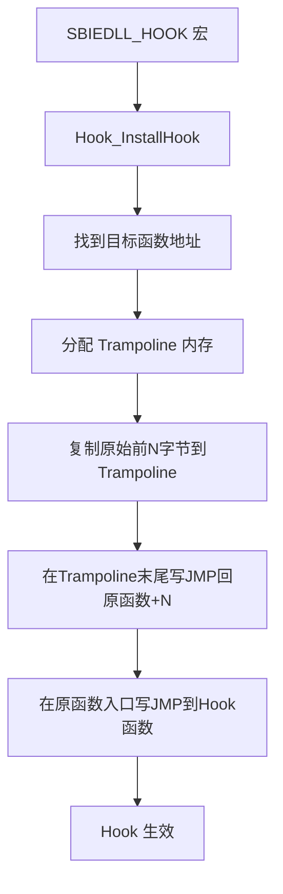
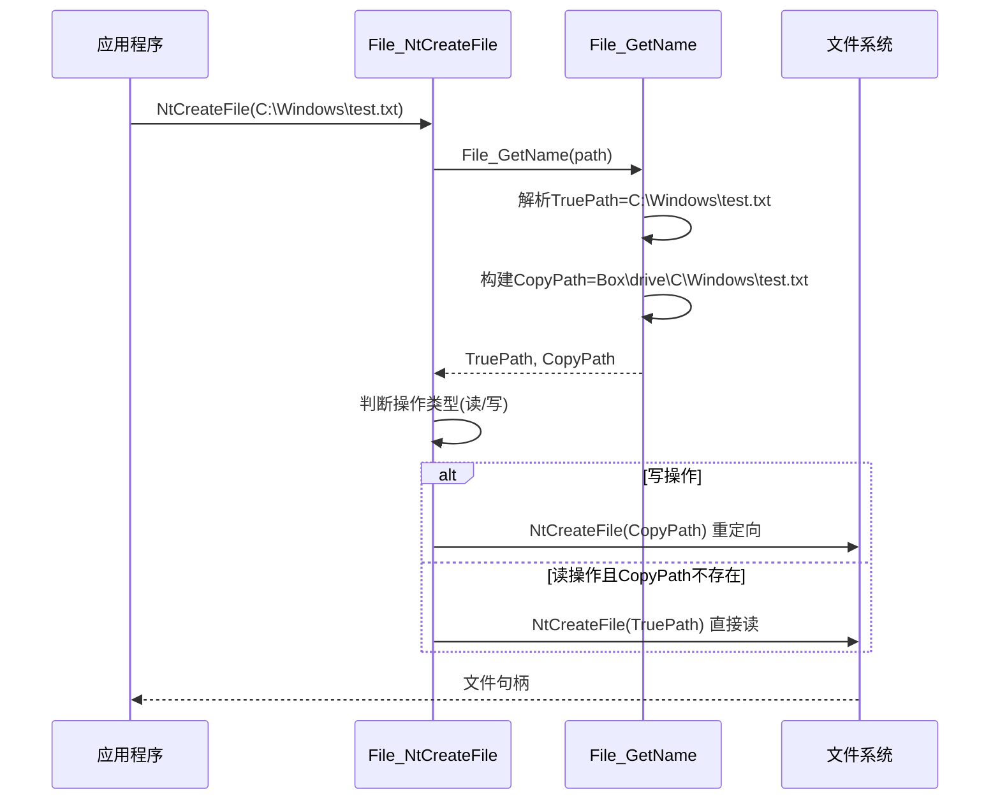
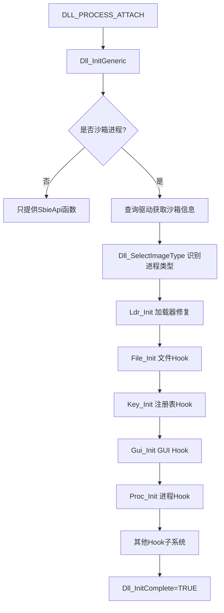

# 模块分析：用户态 DLL 层（SbieDll.dll）

## 概述

SbieDll.dll 注入到每个沙箱进程，通过 API Hook 在用户态拦截 Windows NT API，实现文件/注册表路径重定向、进程创建控制、IPC 隔离等功能，是用户态可见的沙箱边界执行者。

## 基本信息

| 属性 | 值 |
|------|----|
| 输出文件 | `SbieDll.dll`（64位）/ `SbieDll32.dll`（32位）|
| 注入方式 | LowLevel.dll 通过 LdrLoadDll 加载 |
| 运行环境 | 每个沙箱进程的用户态地址空间 |
| 源码目录 | `Sandboxie/core/dll/` |

## 子模块职责

| 子模块 | 文件 | 职责 |
|--------|------|------|
| DLL 入口 | `dllmain.c` | 初始化协调、沙箱检测 |
| Hook 框架 | `hook_inst.c`, `hook_tramp.c` | Hook 安装与跳板 |
| 文件 Hook | `file.c` + 系列 | NT 文件 API 重定向 |
| 注册表 Hook | `key.c` + 系列 | 注册表 API 重定向 |
| 进程 Hook | `proc.c` | 进程创建拦截 |
| IPC Hook | `ipc.c`, `ipc_start.c` | 命名对象重定向 |
| GUI Hook | `gui.c` + 系列 | 窗口/消息保护 |
| COM Hook | `com.c` | COM 激活代理 |
| 网络 Hook | `net.c` | 网络 API 控制 |
| 安全 Hook | `secure.c` | 安全 API 拦截 |
| 服务 Hook | `scm.c` + 系列 | SCM 服务访问控制 |
| 驱动通信 | `sbieapi.c` | IOCTL 调用封装 |

## Hook 框架原理



## SBIEDLL_HOOK 宏展开

```c
// 声明原始函数指针
typedef NTSTATUS (*P_NtCreateFile)(...);
P_NtCreateFile __sys_NtCreateFile = NULL;

// Hook 函数
NTSTATUS File_NtCreateFile(...) {
    // 自定义逻辑
    return __sys_NtCreateFile(...); // 调用原始
}

// 注册
SBIEDLL_HOOK(File_NtCreateFile); // 宏展开安装 Hook
```

## 文件路径重定向时序



## DLL 初始化流程


