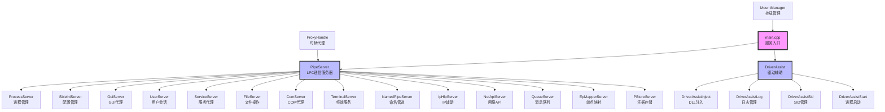

# 模块级分析：服务层 (SbieSvc.exe)

## 1. 模块概述

**核心职责**：作为 Sandboxie 的用户态服务，负责驱动管理、进程启动、配置管理、权限代理和沙箱进程与系统之间的通信桥梁。

**模块边界**：
- **输入**：
  - GUI 应用程序的请求（通过 LPC）
  - 沙箱进程的服务请求（通过 LPC）
  - 内核驱动的通知（通过 IOCTL）
  - 配置文件（Sandboxie.ini）
  
- **输出**：
  - 进程启动和管理
  - 配置读写操作
  - 驱动通信和控制
  - 权限提升代理
  - 文件恢复服务

**模块路径**：`Sandboxie/core/svc/`

---

## 2. 架构总览

### 2.1 模块内部架构图



### 2.2 代理进程架构

```
SbieSvc.exe (主服务 - SYSTEM权限)
    ↓
根据命令行参数派生代理进程：
    ↓
├─ Sandboxie_ComProxy (COM代理)
│  └─ 处理沙箱内的COM调用
│
├─ Sandboxie_UacProxy (UAC代理 - 管理员权限)
│  └─ 处理需要提权的操作
│
├─ Sandboxie_NetProxy (网络代理)
│  └─ 处理网络API调用
│
├─ Sandboxie_GuiProxy (GUI代理)
│  └─ 处理窗口和GUI操作
│
└─ Sandboxie_UserProxy (用户代理 - 用户权限)
   └─ 处理用户级别操作
```

---

## 3. 核心文件清单

| 文件/子模块 | 职责定位 | 关键对外接口 |
|-----------|---------|------------|
| **main.cpp** | 服务入口和初始化 | WinMain, ServiceMain |
| **PipeServer.cpp** | LPC通信服务器 | PipeServer::Start, PipeServer::HandleRequest |
| **DriverAssist.cpp** | 驱动辅助核心 | DriverAssist::Initialize, DriverAssist::CallDriver |
| **ProcessServer.cpp** | 进程管理服务 | ProcessServer::RunSandboxed, ProcessServer::TerminateAll |
| **SbieIniServer.cpp** | 配置管理服务 | SbieIniServer::GetSetting, SbieIniServer::SetSetting |
| **GuiServer.cpp** | GUI操作代理 | GuiServer::OpenWindow, GuiServer::ClipboardOp |
| **UserServer.cpp** | 用户会话服务 | UserServer::RunWorker, UserServer::ImpersonateUser |
| **ServiceServer.cpp** | Windows服务代理 | ServiceServer::StartService, ServiceServer::RunUacSlave |
| **FileServer.cpp** | 文件操作服务 | FileServer::RecoverFile, FileServer::DeleteSnapshot |
| **ComServer.cpp** | COM服务代理 | ComServer::RunSlave, ComServer::CreateInstance |
| **TerminalServer.cpp** | 终端服务代理 | TerminalServer::Connect, TerminalServer::Disconnect |
| **NamedPipeServer.cpp** | 命名管道代理 | NamedPipeServer::CreatePipe, NamedPipeServer::ConnectPipe |
| **IpHlpServer.cpp** | IP辅助服务 | IpHlpServer::GetAdaptersInfo |
| **NetApiServer.cpp** | 网络API服务 | NetApiServer::RunSlave, NetApiServer::NetShareEnum |
| **QueueServer.cpp** | 消息队列服务 | QueueServer::PostMessage, QueueServer::GetMessage |
| **EpMapperServer.cpp** | 端点映射服务 | EpMapperServer::ResolveEndpoint |
| **PStoreServer.cpp** | 凭据存储代理 | PStoreServer::ReadItem, PStoreServer::WriteItem |
| **MountManager.cpp** | 挂载点管理 | MountManager::QueryPoints, MountManager::CreatePoint |
| **ProxyHandle.cpp** | 句柄代理 | ProxyHandle::DuplicateHandle |

---

## 4. 对外暴露的公开 API

### 4.1 LPC 消息接口（与沙箱进程通信）

| 消息 ID | 功能 | 处理服务器 |
|--------|------|-----------|
| MSGID_PROCESS_RUN_SANDBOXED | 启动沙箱进程 | ProcessServer |
| MSGID_PROCESS_TERMINATE | 终止进程 | ProcessServer |
| MSGID_PROCESS_QUERY | 查询进程信息 | ProcessServer |
| MSGID_SBIEINI_GET_SETTING | 读取配置 | SbieIniServer |
| MSGID_SBIEINI_SET_SETTING | 写入配置 | SbieIniServer |
| MSGID_SBIEINI_RELOAD | 重新加载配置 | SbieIniServer |
| MSGID_GUI_OPEN_WINDOW | 打开窗口 | GuiServer |
| MSGID_GUI_CLIPBOARD_OP | 剪贴板操作 | GuiServer |
| MSGID_FILE_RECOVER | 恢复文件 | FileServer |
| MSGID_FILE_DELETE_SNAPSHOT | 删除快照 | FileServer |
| MSGID_COM_CREATE_INSTANCE | 创建COM对象 | ComServer |
| MSGID_SERVICE_START | 启动服务 | ServiceServer |
| MSGID_PIPE_CREATE | 创建命名管道 | NamedPipeServer |
| MSGID_NET_SHARE_ENUM | 枚举网络共享 | NetApiServer |

### 4.2 驱动通信接口（与 SbieDrv 通信）

| 功能 | IOCTL 代码 | 实现函数 |
|-----|-----------|---------|
| 获取驱动版本 | API_GET_VERSION | DriverAssist::GetVersion |
| 查询进程 | API_QUERY_PROCESS | DriverAssist::QueryProcess |
| 启动进程 | API_START_PROCESS | DriverAssist::StartProcess |
| 终止进程 | API_TERMINATE_PROCESS | DriverAssist::TerminateProcess |
| 重新加载配置 | API_RELOAD_CONF | DriverAssist::ReloadConf |
| 获取日志 | API_GET_LOG | DriverAssist::GetLog |
| 注入DLL | API_INJECT_DLL | DriverAssist::InjectDll |

---

## 5. 内部协作模式

### 5.1 核心场景 1：启动沙箱进程

```
时序图：

GUI -> PipeServer: LPC请求 (MSGID_PROCESS_RUN_SANDBOXED)
PipeServer -> ProcessServer: 路由消息
ProcessServer -> SbieIniServer: 读取沙箱配置
SbieIniServer -> Sandboxie.ini: 读取配置文件
SbieIniServer -> ProcessServer: 返回配置
ProcessServer -> DriverAssist: 通知驱动准备启动
DriverAssist -> SbieDrv: IOCTL (API_START_PROCESS)
SbieDrv -> DriverAssist: 返回成功
ProcessServer -> Windows: CreateProcess()
Windows -> SbieDrv: 进程创建通知
SbieDrv -> DriverAssistInject: 注入DLL请求
DriverAssistInject -> LowLevel.dll: 注入到目标进程
LowLevel.dll -> SbieDll.dll: 加载用户态DLL
ProcessServer -> PipeServer: 返回进程句柄
PipeServer -> GUI: LPC响应
```

### 5.2 核心场景 2：配置管理

```
调用链路：

1. GUI 修改配置
   GUI -> PipeServer: LPC (MSGID_SBIEINI_SET_SETTING)
    ↓
2. 路由到配置服务器
   PipeServer -> SbieIniServer: SetSetting()
    ↓
3. 写入配置文件
   SbieIniServer -> Sandboxie.ini: 写入配置
    ↓
4. 通知驱动重新加载
   SbieIniServer -> DriverAssist: ReloadConf()
    ↓
5. 驱动更新配置
   DriverAssist -> SbieDrv: IOCTL (API_RELOAD_CONF)
    ↓
6. 返回结果
   SbieIniServer -> PipeServer -> GUI: 成功
```

### 5.3 核心场景 3：权限提升代理

```
UAC 代理流程：

1. 沙箱进程需要管理员权限
   SandboxedApp -> SbieDll: 请求提权操作
    ↓
2. 请求服务代理
   SbieDll -> PipeServer: LPC请求
    ↓
3. 路由到服务服务器
   PipeServer -> ServiceServer: 处理请求
    ↓
4. 启动 UAC 代理进程
   ServiceServer -> CreateProcess: Sandboxie_UacProxy
    ↓
5. UAC 代理以管理员权限运行
   UacProxy -> ServiceServer::RunUacSlave()
    ↓
6. 执行需要提权的操作
   UacProxy -> Windows API: 以管理员权限执行
    ↓
7. 返回结果
   UacProxy -> ServiceServer -> PipeServer -> SbieDll: 结果
```

---

## 6. 数据模型总览

### 6.1 核心数据结构

```cpp
// LPC 消息结构
typedef struct _SBIELOW_CALL {
    PORT_MESSAGE h;              // LPC消息头
    ULONG msgid;                 // 消息ID
    ULONG session_id;            // 会话ID
    ULONG process_id;            // 进程ID
    ULONG64 parms[8];            // 参数数组
} SBIELOW_CALL;

// 进程启动参数
typedef struct _PROCESS_START_PARAMS {
    WCHAR *box_name;             // 沙箱名称
    WCHAR *image_path;           // 程序路径
    WCHAR *command_line;         // 命令行
    WCHAR *current_dir;          // 当前目录
    ULONG flags;                 // 启动标志
} PROCESS_START_PARAMS;

// 配置项
typedef struct _CONFIG_ENTRY {
    WCHAR *section;              // 配置节
    WCHAR *key;                  // 配置键
    WCHAR *value;                // 配置值
} CONFIG_ENTRY;
```

### 6.2 全局状态

```cpp
// 服务状态
SERVICE_STATUS ServiceStatus;
SERVICE_STATUS_HANDLE ServiceStatusHandle;

// 驱动句柄
HANDLE DriverHandle;

// LPC 端口
HANDLE LpcPort;

// 工作线程池
HANDLE WorkerThreads[MAX_WORKERS];

// SID 缓存
std::map<std::wstring, PSID> SidCache;
```

---

## 7. 外部依赖汇总

### 7.1 内部依赖

| 模块 | 依赖模块 | 依赖原因 |
|-----|---------|---------|
| main.cpp | 所有子服务器 | 初始化所有服务 |
| PipeServer | 所有子服务器 | 消息路由 |
| ProcessServer | DriverAssist, SbieIniServer | 进程启动需要驱动和配置 |
| ServiceServer | ProcessServer | UAC代理需要进程管理 |
| FileServer | DriverAssist | 文件恢复需要驱动支持 |

### 7.2 外部依赖（Windows API）

| 依赖类别 | 主要 API |
|---------|---------|
| 服务管理 | StartServiceCtrlDispatcher, RegisterServiceCtrlHandlerEx |
| 进程管理 | CreateProcess, TerminateProcess, OpenProcess |
| LPC通信 | NtCreatePort, NtConnectPort, NtReplyWaitReceivePort |
| 文件操作 | CreateFile, ReadFile, WriteFile, CopyFile |
| 注册表 | RegOpenKeyEx, RegQueryValueEx, RegSetValueEx |
| COM | CoCreateInstance, CoInitialize |
| 网络 | WSAStartup, socket, connect |
| 安全 | ImpersonateLoggedOnUser, RevertToSelf |

---

## 8. 关注点与改进建议

### 8.1 安全类

| 关注点 | 严重性 | 描述 | 建议 |
|-------|-------|------|------|
| LPC通信安全 | 高 | 需要验证消息来源 | 增强身份验证机制 |
| UAC代理安全 | 高 | 管理员权限代理需要严格控制 | 限制可执行的操作 |
| 配置文件权限 | 中 | Sandboxie.ini需要保护 | 设置适当的文件权限 |
| 句柄泄漏 | 中 | 代理句柄需要正确关闭 | 增加资源管理 |

### 8.2 性能类

| 关注点 | 影响 | 描述 | 建议 |
|-------|-----|------|------|
| LPC通信开销 | 中 | 频繁的LPC调用影响性能 | 批量处理消息 |
| 配置文件读写 | 低 | 频繁读写配置文件 | 增加内存缓存 |
| SID缓存 | 低 | SID查询较慢 | 已实现缓存，可优化缓存策略 |
| 线程池大小 | 低 | 固定线程池可能不够 | 动态调整线程池 |

### 8.3 可维护性类

| 关注点 | 描述 | 建议 |
|-------|------|------|
| 代理进程管理 | 多个代理进程增加复杂度 | 统一代理进程管理 |
| 错误处理 | 部分错误处理不完整 | 统一错误处理机制 |
| 日志记录 | 日志不够详细 | 增加详细日志 |
| 代码重复 | 多个服务器有重复代码 | 提取公共基类 |

---

## 9. 整体评估与建议

### 9.1 架构优势

✅ **多服务器架构**：职责分离，易于维护  
✅ **代理进程模式**：权限隔离，安全性高  
✅ **LPC通信**：高效的进程间通信  
✅ **灵活的配置系统**：支持动态配置  
✅ **完善的驱动管理**：与内核驱动紧密集成

### 9.2 改进机会

⚠️ **性能优化**：
- 优化LPC通信
- 增加配置缓存
- 批量处理消息

⚠️ **代码质量**：
- 增加单元测试
- 完善错误处理
- 减少代码重复

⚠️ **安全增强**：
- 增强LPC验证
- 限制UAC代理权限
- 保护配置文件

### 9.3 技术债务

1. **代理进程管理**：多个代理进程增加维护成本
2. **配置文件格式**：INI格式限制较多
3. **错误处理**：部分错误处理不统一
4. **文档不足**：缺少详细的API文档

---

**分析完成时间**：2026-03-05  
**模块复杂度**：高  
**代码行数**：约 30,000+ 行  
**核心文件数**：30+ 个
