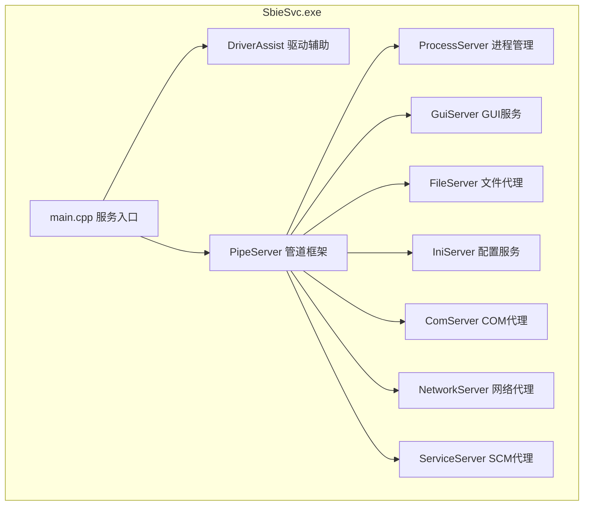
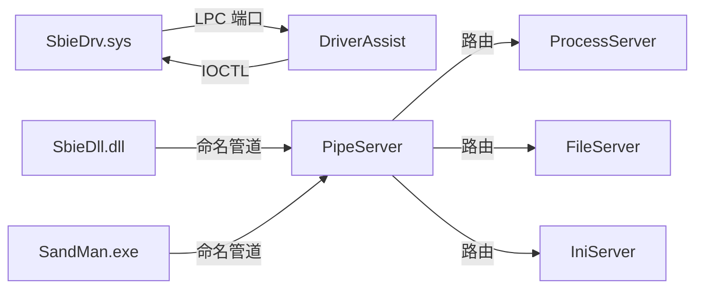
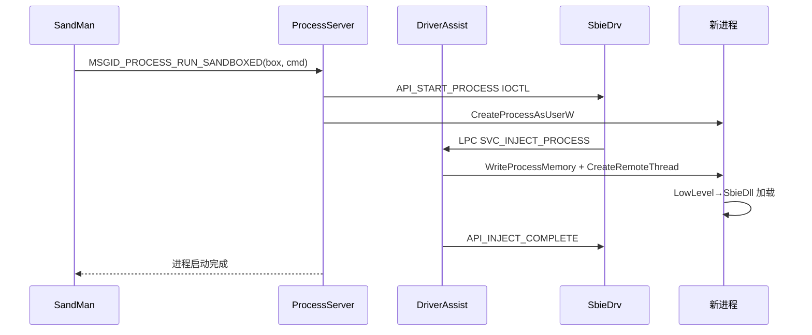

# 模块分析：系统服务层（SbieSvc.exe）

## 概述

SbieSvc.exe 是 Sandboxie 的**系统服务进程**，以 SYSTEM 权限运行，在用户态与内核驱动之间充当桥梁。它负责加载驱动、管理 DLL 注入、代理沙箱进程的特权操作，以及为 GUI 提供管理接口。

## 基本信息

| 属性 | 值 |
|------|----|
| 输出文件 | `SbieSvc.exe` |
| 运行权限 | SYSTEM（Windows 服务）|
| 服务名称 | `SbieSvc` |
| 通信方式 | 命名管道（← SbieDll/GUI）+ LPC（← SbieDrv）|
| 源码目录 | `Sandboxie/core/svc/` |

## 子组件架构

## 子组件职责

| 组件 | 文件 | 职责 |
|------|------|------|
| `DriverAssist` | `DriverAssist.cpp` + 系列 | 驱动加载、LPC 通信、DLL 注入协调 |
| `PipeServer` | `PipeServer.cpp` | 命名管道服务框架（消息路由）|
| `ProcessServer` | `ProcessServer.cpp` | 进程启动/终止/挂起 |
| `GuiServer` | `GuiServer.cpp` | Job Object、窗口站管理 |
| `FileServer` | `fileserver.cpp` | 文件特权操作代理 |
| `SbieIniServer` | `sbieiniserver.cpp` | 配置文件读写 |
| `ComServer` | `comserver.cpp` | COM 激活代理 |
| `IpHlpServer` | `iphlpserver.cpp` | IP Helper API 代理 |
| `ServiceServer` | `serviceserver.cpp` | SCM 服务访问代理 |
| `TerminalServer` | `terminalserver.cpp` | 终端服务代理 |
| `UserServer` | `UserServer.cpp` | 用户信息查询 |
| `MountManager` | `MountManager.cpp` | 磁盘挂载管理 |
| `QueueServer` | `queueserver.cpp` | 异步操作队列 |

## 通信架构

## 进程启动代理时序

## 特权操作代理模式

沙箱进程需要某些特权操作时，通过 SbieSvc 代理执行：

| 操作 | 原因 | 代理组件 |
|------|------|--------|
| 创建/终止进程 | 需要 SeDebugPrivilege | ProcessServer |
| 挂载磁盘镜像 | 需要 SeManageVolumePrivilege | MountManager |
| 读写配置文件 | 配置文件访问保护 | IniServer |
| 启动系统服务 | SCM 访问限制 | ServiceServer |
| COM 服务激活 | COM 权限限制 | ComServer |
