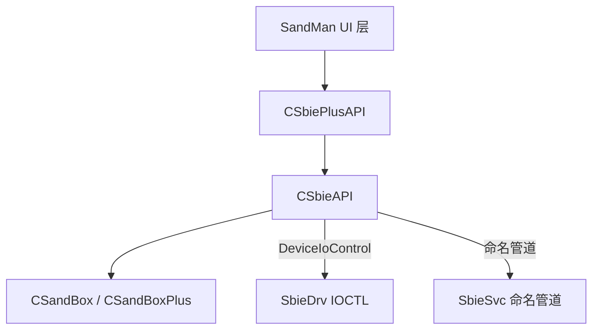

# 模块分析：应用层（SandMan.exe + QSbieAPI）

## 概述

SandMan.exe 是 Sandboxie Plus 的 **Qt6 图形界面主程序**，通过 QSbieAPI 库与 SbieDrv 和 SbieSvc 通信，提供沙箱创建/管理/监控等完整 GUI 功能。

## 基本信息

| 属性 | 值 |
|------|----|
| 输出文件 | `SandMan.exe` |
| UI 框架 | Qt 6.x |
| 源码目录 | `SandboxiePlus/SandMan/` + `SandboxiePlus/QSbieAPI/` |
| 依赖 | QSbieAPI.dll、Qt6Core/Widgets/Network |

## QSbieAPI 层架构

QSbieAPI 是 SandMan 与底层通信的封装层：



## 关键类

### CSbieAPI（SbieAPI.cpp）
底层核心 API 类：
- 打开 `\Device\SandboxieDriverApi` 设备句柄
- 封装所有 IOCTL 调用（`SbieApi_QueryDriverInfo`、`SbieApi_EnumBoxes` 等）
- 通过命名管道与 SbieSvc 通信（`CallService`）
- 维护沙箱列表（`QMap<QString, CSandBoxPtr>`）
- 定期刷新状态（`UpdateAsync` 定时器）

### CSbiePlusAPI（SbiePlusAPI.cpp）
扩展 API 层，添加 Plus 版专有功能：
- 证书验证与功能解锁
- 兼容性模板管理
- 在线更新检查
- 崩溃报告

### CSandBox / CSandBoxPlus（SandBox.cpp）
单个沙箱实例的对象模型：
- 持有沙箱名称、路径、配置
- `CleanBox()` — 清理沙箱内容
- `TerminateAll()` — 终止所有进程
- `TakeSnapshot()` / `RollbackSnapshot()` — 快照管理
- `GetFileRecoveryList()` — 文件恢复列表

## SandMan UI 结构

```
SandMan/
├── SandMan.cpp        # CSandMan 主窗口
├── Views/
│   ├── SbieView.cpp   # 沙箱列表视图
│   └── TraceView.cpp  # 资源访问跟踪视图
├── Windows/
│   ├── OptionsWindow.cpp  # 沙箱选项对话框
│   ├── SettingsWindow.cpp # 全局设置对话框
│   └── SnapshotWindow.cpp # 快照管理对话框
├── Wizards/
│   └── NewBoxWizard.cpp   # 创建沙箱向导
└── Models/
    ├── SandBoxModel.cpp   # 沙箱列表数据模型
    └── SbieProcess.cpp    # 进程数据模型
```

## 功能特性概览

| 功能 | 组件 |
|------|------|
| 沙箱创建/删除 | NewBoxWizard + CSbieAPI |
| 在沙箱中运行程序 | SbieView 右键菜单 |
| 沙箱内容清理 | CSandBox::CleanBox |
| 进程终止 | CSandBox::TerminateAll |
| 快照/回滚 | SnapshotWindow |
| 文件恢复 | FileRecoveryWindow |
| 配置编辑 | OptionsWindow（100+ 选项）|
| 资源访问跟踪 | TraceView（实时监控）|
| 网络访问监控 | NetworkAccessWindow |
| 证书管理 | SettingsWindow |
| 在线更新 | OnlineUpdater |
