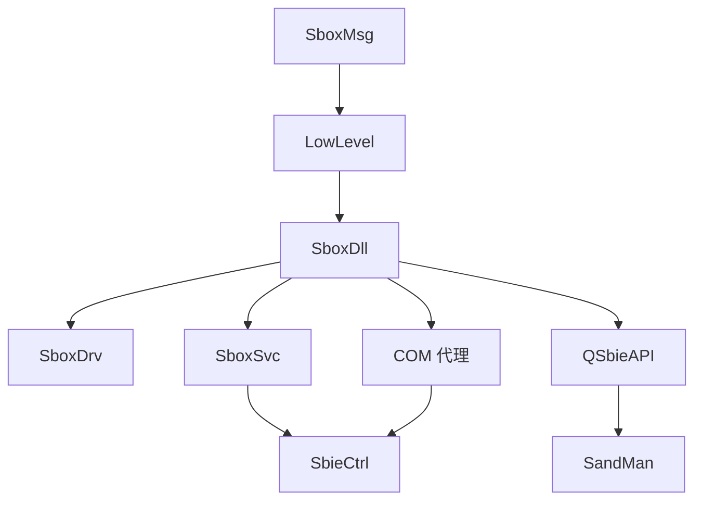

# Sandboxie-Plus — 构建系统

本文档描述如何从源代码构建 Sandboxie-Plus。

---

## 快速开始

### 完整构建步骤

```powershell
# 1. 克隆仓库
git clone https://github.com/sandboxie-plus/Sandboxie.git
cd Sandboxie

# 2. 安装 Qt (使用 aqtinstall 或官方安装器)
# 推荐使用 aqtinstall:
pip install aqtinstall
aqt install-qt windows desktop 6.8.3 win64_msvc2022_64

# 3. 设置环境变量
set Qt6_DIR=C:\Qt\6.8.3\msvc2022_64
set PATH=%Qt6_DIR%\bin;%PATH%

# 4. 打开 Visual Studio 2022 开发者命令提示符
# 然后构建核心组件
msbuild Sandboxie\Sandbox.sln /p:Configuration=Release /p:Platform=x64

# 5. 构建 Plus GUI
msbuild SandboxiePlus\SandboxiePlus.sln /p:Configuration=Release /p:Platform=x64
```

---

## 前置依赖

| 依赖 | 版本要求 | 安装方式 | 说明 |
|------|----------|----------|------|
| **Visual Studio** | 2022 (17.14+) | [官网下载](https://visualstudio.microsoft.com/) | 需要包含 C++ 工作负载 |
| **Windows SDK** | 10.0.19041+ | VS 安装器 | Windows 10/11 开发 |
| **Qt** | 6.8.3 | [官网](https://www.qt.io/) 或 aqtinstall | Plus GUI 依赖 |
| **OpenSSL** | 3.4.0 | 构建脚本自动下载 | 加密功能 |
| **Git** | 任意版本 | [官网下载](https://git-scm.com/) | 源码管理 |

### Visual Studio 组件

安装 Visual Studio 时，确保选择以下工作负载：

- **使用 C++ 的桌面开发**
- **Windows 10/11 SDK**
- **C++ ATL for latest v143 build tools** (可选，用于某些组件)

---

## 构建命令

### 核心组件 (Sandbox.sln)

| 目标 | 命令 | 说明 |
|------|------|------|
| **Debug x64** | `msbuild Sandbox.sln /p:Configuration=Debug /p:Platform=x64` | 调试版本 |
| **Release x64** | `msbuild Sandbox.sln /p:Configuration=Release /p:Platform=x64` | 发布版本 |
| **Debug Win32** | `msbuild Sandbox.sln /p:Configuration=Debug /p:Platform=Win32` | 32位调试 |
| **Release Win32** | `msbuild Sandbox.sln /p:Configuration=Release /p:Platform=Win32` | 32位发布 |

### Plus GUI (SandboxiePlus.sln)

| 目标 | 命令 | 说明 |
|------|------|------|
| **Debug x64** | `msbuild SandboxiePlus.sln /p:Configuration=Debug /p:Platform=x64` | 调试版本 |
| **Release x64** | `msbuild SandboxiePlus.sln /p:Configuration=Release /p:Platform=x64` | 发布版本 |

### 单独构建组件

```powershell
# 只构建驱动
msbuild Sandboxie\core\drv\SboxDrv.vcxproj /p:Configuration=Release /p:Platform=x64

# 只构建 DLL
msbuild Sandboxie\core\dll\SboxDll.vcxproj /p:Configuration=Release /p:Platform=x64

# 只构建服务
msbuild Sandboxie\core\svc\SboxSvc.vcxproj /p:Configuration=Release /p:Platform=x64

# 只构建 Plus GUI
msbuild SandboxiePlus\SandMan\SandMan.vcxproj /p:Configuration=Release /p:Platform=x64
```

---

## 构建顺序

由于组件间存在依赖关系，建议按以下顺序构建：



### 推荐构建顺序

1. **SboxMsg** — 消息资源（无依赖）
2. **LowLevel** — 低级注入代码（无依赖）
3. **SboxDll** — 注入 DLL（依赖 LowLevel, SboxMsg）
4. **SboxDrv** — 内核驱动（依赖 SboxMsg）
5. **SboxSvc** — 系统服务（依赖 SboxDll）
6. **COM 代理** — BITS, Crypto, RpcSs, WUAU 等（依赖 SboxDll）
7. **QSbieAPI** — API 封装层（依赖 SboxDll）
8. **SandMan** — Plus GUI（依赖 QSbieAPI）
9. **SbieCtrl** — Classic GUI（依赖 SboxDll, COM 代理）

---

## 构建产物

| 产物 | 路径 | 说明 |
|------|------|------|
| **SbieDrv.sys** | `Sandboxie\core\drv\*.sys` | 内核驱动 |
| **SbieDll.dll** | `Sandboxie\core\dll\*.dll` | 注入 DLL (32/64位) |
| **SbieSvc.exe** | `Sandboxie\core\svc\*.exe` | 系统服务 |
| **LowLevel.dll** | `Sandboxie\core\low\*.dll` | 低级注入代码 |
| **SandMan.exe** | `SandboxiePlus\SandMan\*.exe` | Plus GUI |
| **SbieCtrl.exe** | `Sandboxie\apps\control\*.exe` | Classic GUI |
| **QSbieAPI.dll** | `SandboxiePlus\QSbieAPI\*.dll` | API 封装层 |

### 输出目录结构

```
Sandboxie/
├── Bin/
│   ├── x64/
│   │   ├── Release/
│   │   │   ├── SbieDrv.sys
│   │   │   ├── SbieDll.dll
│   │   │   ├── SbieSvc.exe
│   │   │   └── ...
│   │   └── Debug/
│   └── Win32/
│       ├── Release/
│       └── Debug/
```

---

## CI/CD 流程

项目使用 GitHub Actions 进行自动化构建。

### 主要工作流

| 工作流 | 文件 | 触发条件 |
|--------|------|----------|
| **main.yml** | `.github/workflows/main.yml` | push to master/experimental |
| **codeql.yml** | `.github/workflows/codeql.yml` | 定期运行 |
| **codespell.yml** | `.github/workflows/codespell.yml` | 拼写检查 |

### 构建矩阵

```yaml
# main.yml 构建矩阵
jobs:
  Build_x64_Qt6:
    runs-on: windows-2022
    # Qt 6.8.3, x64 Release
  
  Build_x86_Qt5:
    runs-on: windows-2022
    # Qt 5.15.16, x86 Release
```

### 构建变量

构建变量定义在 `Installer\buildVariables.cmd`：

```batch
set "qt_version=6.8.3"
set "qt6_version=6.8.3"
set "openssl_version=3.4.0"
```

---

## 常见构建问题

### 问题 1：找不到 Qt

**错误信息：**
```
error MSB6006: "cmd.exe" exited with code 3.
Could not find Qt installation
```

**解决方案：**
```powershell
# 设置 Qt 环境变量
set Qt6_DIR=C:\Qt\6.8.3\msvc2022_64
set PATH=%Qt6_DIR%\bin;%PATH%
```

### 问题 2：驱动签名错误

**错误信息：**
```
error MSB3073: signtool.exe failed
```

**解决方案：**
- 开发环境可以使用测试签名模式
- 生产环境需要有效的代码签名证书

```powershell
# 启用测试签名模式 (需要管理员权限)
bcdedit /set testsigning on
```

### 问题 3：Windows SDK 版本不匹配

**错误信息：**
```
error MSB8036: The Windows SDK version 10.0.xxxxx was not found
```

**解决方案：**
- 安装所需的 Windows SDK 版本
- 或修改项目文件中的 SDK 版本

### 问题 4：Qt 6 在 Windows 7 上运行

**说明：** Qt 6 默认不支持 Windows 7

**解决方案：**
```powershell
# 运行 Windows 7 兼容性修复脚本
call Installer\fix_qt6_win7.cmd
```

---

## 开发环境配置

### Visual Studio Code

推荐扩展：
- C/C++ (Microsoft)
- CMake Tools
- Qt tools

### 调试配置

```json
// launch.json 示例
{
    "version": "0.2.0",
    "configurations": [
        {
            "name": "Debug SandMan",
            "type": "cppvsdbg",
            "request": "launch",
            "program": "${workspaceFolder}/Bin/x64/Debug/SandMan.exe",
            "args": [],
            "stopAtEntry": false,
            "cwd": "${workspaceFolder}",
            "environment": []
        }
    ]
}
```

---

## 相关文档

- [架构总览](overview.md) — 系统整体架构
- [入门指南](../guides/getting-started.md) — 新贡献者入门
- [依赖规则](dependency-rules.md) — 构建顺序依赖
