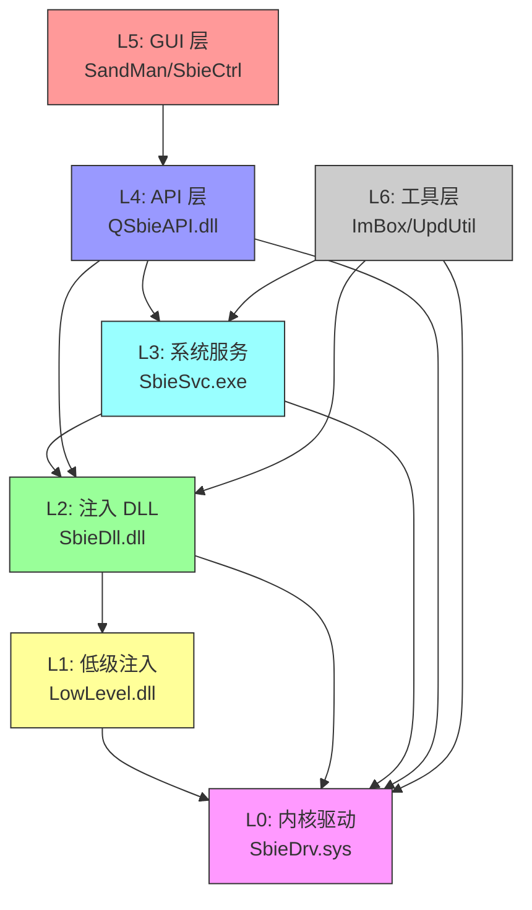

# Sandboxie-Plus — 依赖规则

本文档定义了 Sandboxie-Plus 的分层架构和依赖方向规则。这些规则确保代码结构清晰、可维护，并避免循环依赖。

---

## 层级定义

| 层级 | 名称 | 包含组件 | 可依赖 |
|------|------|----------|--------|
| **L0** | 内核驱动 | SbieDrv.sys | Windows 内核 API |
| **L1** | 低级注入 | LowLevel.dll | L0 (通过驱动调用) |
| **L2** | 注入 DLL | SbieDll.dll | L0, L1 |
| **L3** | 系统服务 | SbieSvc.exe | L0, L2 |
| **L4** | API 层 | QSbieAPI.dll | L0, L2, L3 |
| **L5** | GUI 层 | SandMan.exe, SbieCtrl.exe | L4 |
| **L6** | 工具层 | ImBox.exe, UpdUtil.exe | L0, L2, L3 |

---

## 依赖关系图



---

## 模块间依赖规则

### 允许的依赖方向

```
高层 → 低层 (向下依赖)
```

具体规则：

1. **L0 (内核驱动)** 只能依赖 Windows 内核 API
2. **L1 (低级注入)** 只能被 L2 调用，不能依赖任何用户态库
3. **L2 (注入 DLL)** 可以调用 L0 的 IOCTL 接口，使用 L1 的注入功能
4. **L3 (系统服务)** 可以调用 L0 和 L2，但不能被 L0/L2 反向调用
5. **L4 (API 层)** 封装 L0/L2/L3 的接口，为 L5 提供统一 API
6. **L5 (GUI 层)** 只能通过 L4 访问核心功能，禁止直接调用 L0/L2/L3
7. **L6 (工具层)** 可以独立使用，但需要遵循向下依赖原则

### 禁止的依赖方向

以下依赖方向是 **严格禁止** 的：

| 违规类型 | 说明 | 后果 |
|----------|------|------|
| **向上依赖** | 低层调用高层 | 破坏分层结构 |
| **循环依赖** | A 依赖 B，B 依赖 A | 编译/链接问题 |
| **跨层调用** | L5 直接调用 L0 | 绕过安全检查 |
| **同层循环** | 同层组件互相依赖 | 维护困难 |

---

## 目录结构与层级对应

```
Sandboxie/
├── core/
│   ├── drv/          → L0: 内核驱动
│   ├── low/          → L1: 低级注入
│   ├── dll/          → L2: 注入 DLL
│   └── svc/          → L3: 系统服务
├── apps/
│   ├── control/      → L5: 经典 GUI
│   ├── start/        → L5: 启动器
│   └── com/          → L2: COM 代理 (特殊)
├── SboxHostDll/      → L2: 宿主注入 DLL
└── msgs/             → 共享资源

SandboxiePlus/
├── QSbieAPI/         → L4: API 封装层
├── SandMan/          → L5: Plus GUI
├── MiscHelpers/      → L4: 辅助库
└── QtSingleApp/      → L5: 单实例支持

SandboxieTools/
├── ImBox/            → L6: 加密沙箱工具
├── UpdUtil/          → L6: 更新工具
└── Common/           → L6: 共享工具代码
```

---

## 共享代码规则

### 共享头文件

以下目录包含跨模块共享的头文件：

| 目录 | 内容 | 使用者 |
|------|------|--------|
| `Sandboxie/common/` | 共享定义和数据结构 | 所有模块 |
| `Sandboxie/core/dll/sbiedll.h` | DLL 导出接口 | L2, L3, L4 |
| `Sandboxie/core/drv/api_defs.h` | IOCTL 定义 | L0, L2, L3, L4 |

### 共享代码约束

1. **共享头文件只能包含定义，不能包含实现**
2. **修改共享头文件需要重新编译所有依赖模块**
3. **新增共享定义需要放在正确的目录中**

---

## 如何校验依赖规则

### 方法 1：手动检查

```powershell
# 检查 DLL 是否引用了不该引用的模块
dumpbin /imports SbieDll.dll | findstr "QSbieAPI"
dumpbin /imports SandMan.exe | findstr "SbieDrv"
```

### 方法 2：代码审查

在 PR 审查时检查：
- 新增的 `#include` 是否符合层级规则
- 新增的链接依赖是否合理
- 是否引入了循环依赖

### 方法 3：架构测试

建议添加架构测试（目前未实现）：

```cpp
// 示例架构测试
TEST(ArchitectureTest, NoUpwardDependency) {
    // 验证 L5 不直接依赖 L0
    EXPECT_FALSE(HasDependency("SandMan.exe", "SbieDrv.sys"));
}

TEST(ArchitectureTest, NoCircularDependency) {
    // 验证无循环依赖
    EXPECT_FALSE(HasCircularDependency());
}
```

---

## 常见违规示例

### 违规 1：GUI 直接调用驱动

```cpp
// ❌ 错误：SandMan 直接调用驱动 IOCTL
HANDLE hDevice = CreateFile(L"\\\\.\\SandboxieDriverApi", ...);
DeviceIoControl(hDevice, API_GET_VERSION, ...);
```

**正确做法：**

```cpp
// ✅ 正确：通过 QSbieAPI 调用
CSbieAPI api;
api.Connect(false, false);
QString version = api.GetVersion();
```

### 违规 2：DLL 依赖服务

```cpp
// ❌ 错误：SbieDll 直接依赖 SbieSvc 的内部结构
#include "svc/stdafx.h"  // 服务内部头文件
```

**正确做法：**

```cpp
// ✅ 正确：使用公共接口
#include "sbiedll.h"  // 公共头文件
```

### 违规 3：循环依赖

```cpp
// ❌ 错误：A.h 包含 B.h，B.h 包含 A.h
// A.h
#include "B.h"
// B.h
#include "A.h"  // 循环！
```

**正确做法：**

```cpp
// ✅ 正确：使用前向声明
// A.h
class B;  // 前向声明
// B.h
class A;  // 前向声明
```

---

## 相关文档

- [架构总览](overview.md) — 系统整体架构
- [组件详解](components.md) — 各组件的详细接口
- [构建系统](build-system.md) — 构建顺序和依赖
