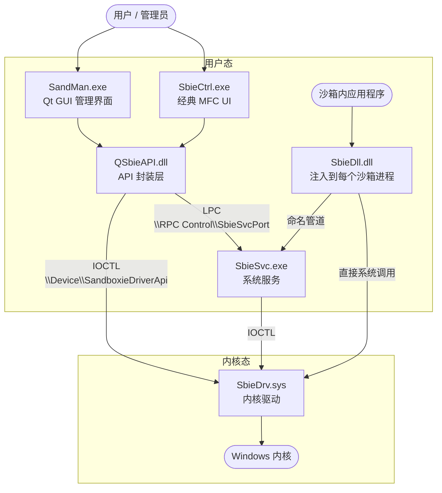
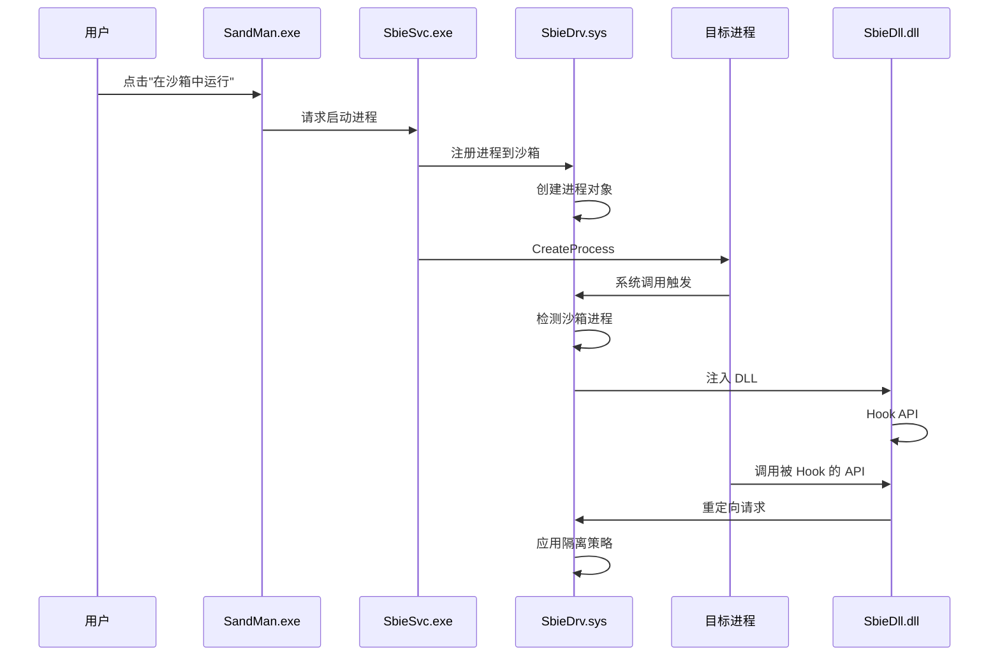
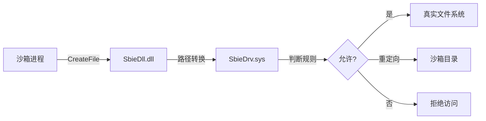

# Sandboxie-Plus — 架构总览

> **一句话描述：** Sandboxie-Plus 是一个开源 Windows 沙箱隔离软件，通过内核驱动拦截系统调用，将进程的文件/注册表/IPC 操作重定向到沙箱目录，实现进程隔离而不影响用户体验。

---

## 系统架构图



---

## 核心组件清单

| 组件 | 路径 | 职责 | 入口点 | 依赖 |
|------|------|------|--------|------|
| **SbieDrv.sys** | `Sandboxie/core/drv/` | 内核驱动，拦截系统调用，强制隔离策略 | `DriverEntry` (driver.c) | Windows 内核 API |
| **SbieDll.dll** | `Sandboxie/core/dll/` | 注入 DLL，用户态 Hook，路径重定向 | `DllMain` (dllmain.c) | SbieDrv, SbieSvc |
| **SbieSvc.exe** | `Sandboxie/core/svc/` | 系统服务，进程管理，配置代理，权限代理 | `main` (main.cpp) | SbieDrv |
| **LowLevel.dll** | `Sandboxie/core/low/` | 低级注入代码，用于早期进程注入 | `LowLevel_Init` (init.c) | SbieDll |
| **SandMan.exe** | `SandboxiePlus/SandMan/` | Qt GUI 管理界面（Plus 版） | `main` (main.cpp) | QSbieAPI, Qt6 |
| **SbieCtrl.exe** | `Sandboxie/apps/control/` | 经典 MFC UI（Classic 版） | `MyApp` (MyApp.cpp) | SbieDll |
| **QSbieAPI.dll** | `SandboxiePlus/QSbieAPI/` | Qt API 封装层，提供 C++ 接口 | `CSbieAPI` (SbieAPI.h) | SbieDll, Qt6 |
| **SboxHostDll.dll** | `Sandboxie/SboxHostDll/` | 宿主注入 DLL，用于宿主进程注入 | `SboxHostDll` (SboxHostDll.cpp) | SbieDll |
| **ImBox.exe** | `SandboxieTools/ImBox/` | 加密沙箱镜像管理工具 | `ImBox` (ImBox.cpp) | ImDisk, crypto |
| **UpdUtil.exe** | `SandboxieTools/UpdUtil/` | 更新工具 | `UpdUtil` (UpdUtil.cpp) | 网络 API |

---

## 数据流概要

### 1. 进程启动流程



### 2. 文件操作重定向



---

## 技术栈

| 层级 | 技术 | 说明 |
|------|------|------|
| **内核驱动** | Windows Kernel API, WDM | 内核态系统调用拦截 |
| **系统服务** | C++, Win32 API | 用户态服务进程 |
| **注入 DLL** | C, Win32 API, Inline Hook | 用户态 API Hook |
| **GUI (Plus)** | Qt 6.8.3, C++17 | 现代化管理界面 |
| **GUI (Classic)** | MFC, C++ | 经典管理界面 |
| **加密沙箱** | AES-XTS, Serpent, Twofish | 加密镜像存储 |
| **构建系统** | Visual Studio 2022, MSBuild | Windows 原生构建 |
| **CI/CD** | GitHub Actions | 自动化构建和发布 |

---

## 部署拓扑

```
┌─────────────────────────────────────────────────────────────┐
│                      Windows 系统                            │
│  ┌─────────────────────────────────────────────────────┐   │
│  │                    内核态                            │   │
│  │  ┌─────────────┐                                    │   │
│  │  │ SbieDrv.sys │ ← 系统调用拦截                      │   │
│  │  └─────────────┘                                    │   │
│  └─────────────────────────────────────────────────────┘   │
│                           ↑ IOCTL                          │
│  ┌─────────────────────────────────────────────────────┐   │
│  │                    用户态                            │   │
│  │  ┌─────────────┐    ┌─────────────┐                 │   │
│  │  │ SbieSvc.exe │ ←→ │ SandMan.exe │                 │   │
│  │  │  (服务)     │    │  (GUI)      │                 │   │
│  │  └─────────────┘    └─────────────┘                 │   │
│  │         ↑                                           │   │
│  │  ┌─────────────────────────────────────────────┐   │   │
│  │  │              沙箱进程                        │   │   │
│  │  │  ┌─────────────┐  ┌─────────────┐           │   │   │
│  │  │  │ SbieDll.dll │  │   App.exe   │           │   │   │
│  │  │  │  (注入)     │←→│ (沙箱化)    │           │   │   │
│  │  │  └─────────────┘  └─────────────┘           │   │   │
│  │  └─────────────────────────────────────────────┘   │   │
│  └─────────────────────────────────────────────────────┘   │
│                                                             │
│  ┌─────────────────────────────────────────────────────┐   │
│  │              沙箱文件系统                           │   │
│  │  C:\Sandbox\<用户名>\<沙箱名>\                      │   │
│  └─────────────────────────────────────────────────────┘   │
└─────────────────────────────────────────────────────────────┘
```

---

## 关键设计决策

1. **三层架构分离**：内核驱动负责强制隔离，服务进程负责策略执行，注入 DLL 负责透明重定向
2. **路径重定向机制**：通过 Hook 文件 API，将沙箱内的路径映射到沙箱目录
3. **进程注入策略**：使用 LowLevel.dll 实现早期注入，确保进程启动时即被隔离
4. **双 UI 支持**：Plus 版（Qt）和 Classic 版（MFC）共享核心组件

---

## 相关文档

- [组件详解](components.md) — 各组件的详细接口和内部架构
- [依赖规则](dependency-rules.md) — 分层依赖规则和约束
- [构建系统](build-system.md) — 完整的构建说明
- [安全模型](security-model.md) — 安全边界和敏感区域
