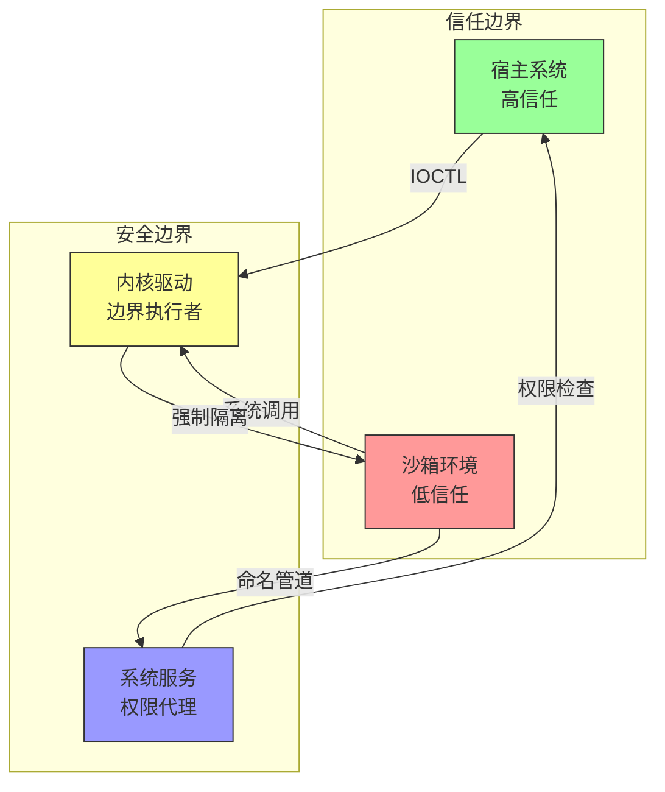

# Sandboxie-Plus — 安全模型

本文档描述 Sandboxie-Plus 的安全边界、威胁模型和敏感代码区域。

---

## 威胁边界



### 信任级别

| 区域 | 信任级别 | 说明 |
|------|----------|------|
| **宿主系统** | 高 | 完全信任，可访问所有资源 |
| **内核驱动** | 最高 | 系统核心，必须可信 |
| **系统服务** | 高 | 以 SYSTEM 权限运行 |
| **沙箱进程** | 低 | 不信任，所有操作需验证 |
| **注入 DLL** | 中 | 在沙箱进程内运行，但由系统注入 |

---

## 认证与授权

### 进程身份

Sandboxie 使用以下机制管理沙箱进程的身份：

1. **Token 创建**：为沙箱进程创建受限 Token
2. **SID 管理**：分配唯一的沙箱 SID
3. **权限限制**：移除危险权限（如 SeDebugPrivilege）

### 关键代码位置

| 功能 | 文件 | 说明 |
|------|------|------|
| Token 创建 | `core/drv/token.c` | 创建受限 Token |
| Token 操作 | `core/drv/thread_token.c` | 线程 Token 管理 |
| SID 管理 | `core/svc/DriverAssistSid.cpp` | SID 分配 |
| 权限检查 | `core/drv/process_api.c` | 进程权限验证 |

### 授权规则

```
沙箱进程 → 文件操作 → 驱动检查 → 允许/重定向/拒绝
沙箱进程 → 注册表操作 → 驱动检查 → 允许/重定向/拒绝
沙箱进程 → IPC 操作 → 驱动检查 → 允许/重定向/拒绝
沙箱进程 → 网络操作 → WFP 过滤 → 允许/拒绝
```

---

## 敏感数据处理

### 加密沙箱

ImBox 提供加密沙箱功能，使用 AES-XTS 加密：

| 算法 | 用途 | 位置 |
|------|------|------|
| **AES-XTS** | 主加密算法 | `SandboxieTools/ImBox/dc/crypto_fast/` |
| **Serpent** | 备选加密 | `SandboxieTools/ImBox/dc/crypto_fast/` |
| **Twofish** | 备选加密 | `SandboxieTools/ImBox/dc/crypto_fast/` |
| **SHA-512** | 密钥派生 | `SandboxieTools/ImBox/dc/crypto_fast/sha512_pkcs5_2.c` |

### 密码存储

- **不存储明文密码**
- 使用 PBKDF2 进行密钥派生
- 密钥仅存在于内存中

### 敏感数据流

```
用户密码 → PBKDF2 → 加密密钥 → AES-XTS 加密/解密
                    ↓
              内存中临时存储（进程退出后清除）
```

---

## 安全关键代码清单

| 文件/模块 | 安全关注点 | 修改风险 | 建议 |
|-----------|-----------|----------|------|
| `core/drv/driver.c` | 驱动入口点 | **极高** | 需要安全专家审查 |
| `core/drv/token.c` | Token 创建 | **极高** | 影响隔离安全性 |
| `core/drv/process.c` | 进程管理 | **高** | 影响进程隔离 |
| `core/drv/syscall.c` | 系统调用拦截 | **极高** | 核心安全机制 |
| `core/drv/file_flt.c` | 文件过滤 | **高** | 文件隔离关键 |
| `core/drv/key_flt.c` | 注册表过滤 | **高** | 注册表隔离关键 |
| `core/drv/ipc.c` | IPC 过滤 | **高** | IPC 隔离关键 |
| `core/dll/dllmain.c` | DLL 入口 | **高** | 注入安全性 |
| `core/dll/hook_inst.c` | Hook 安装 | **高** | Hook 安全性 |
| `core/svc/DriverAssist.cpp` | 服务核心 | **中** | 权限代理 |
| `SandboxieTools/ImBox/ImBox.cpp` | 加密沙箱 | **高** | 数据安全 |

---

## 安全开发规则

### 必须遵守

1. **所有用户输入必须验证** — 来自沙箱进程的所有数据都不可信
2. **使用安全的字符串函数** — 禁止使用 `strcpy`, `sprintf` 等
3. **缓冲区大小检查** — 所有缓冲区操作必须检查边界
4. **内核代码禁止使用标准 C 运行时** — 使用内核专用函数
5. **敏感数据必须清零** — 密码、密钥使用后必须清零内存

### 禁止操作

1. **禁止在内核代码中使用浮点运算**
2. **禁止直接信任沙箱进程传递的指针**
3. **禁止在日志中输出敏感数据**
4. **禁止绕过权限检查**
5. **禁止在沙箱进程中执行高权限操作**

### 代码审查要求

修改以下区域时必须进行安全审查：

- 内核驱动 (`core/drv/`)
- Token 相关代码 (`token.c`, `thread_token.c`)
- 系统调用拦截 (`syscall*.c`)
- 加密相关代码 (`SandboxieTools/ImBox/dc/`)

---

## 已知安全问题

### 问题 1：DLL 注入检测

某些反作弊/反病毒软件可能检测到 SbieDll.dll 的注入行为。

**影响：** 可能导致沙箱化进程被拒绝运行

**缓解措施：**
- 使用 SbieHide 等工具尝试隐藏注入
- 将相关程序添加到排除列表

### 问题 2：权限提升风险

如果驱动或服务存在漏洞，可能被利用进行权限提升。

**影响：** 沙箱隔离被绕过

**缓解措施：**
- 定期安全审计
- 最小权限原则
- 及时修复漏洞

### 问题 3：沙箱逃逸

某些特殊技术可能绕过沙箱隔离。

**影响：** 恶意代码可能影响宿主系统

**缓解措施：**
- 启用增强隔离模式
- 限制危险系统调用
- 使用 Privacy Enhanced 沙箱

---

## 安全配置建议

### 高安全配置

```ini
[DefaultBox]
# 启用隐私增强模式
PrivacyEnabled=y

# 禁用网络访问
AllowNetworkAccess=n

# 限制系统调用
SysCallRestriction=y

# 禁用打印机访问
AllowSpoolerPrintToFile=n

# 禁用剪贴板访问
OpenClipboard=n
```

### 最小权限配置

```ini
[DefaultBox]
# 使用受限 Token
DropPrivileges=y

# 禁用管理员权限
FakeAdminRights=n

# 限制进程数量
ProcessLimit=10
```

---

## 安全更新流程

1. **漏洞报告** → 通过 SECURITY.md 中的渠道报告
2. **漏洞评估** → 安全团队评估严重程度
3. **修复开发** → 开发修复补丁
4. **安全审查** → 修复代码经过安全审查
5. **发布更新** → 发布安全更新版本
6. **公告发布** → 发布安全公告

---

## 相关文档

- [架构总览](overview.md) — 系统整体架构
- [组件详解](components.md) — 各组件的详细接口
- [SECURITY.md](../../SECURITY.md) — 安全漏洞报告流程
