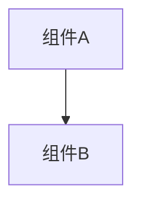

# Design: <标题>

**状态：** Draft | In Review | Approved | Implemented | Deprecated  
**作者：** <名字>  
**日期：** <YYYY-MM-DD>  
**关联域：** 核心隔离 | 用户界面 | API 封装 | 加密存储 | 更新服务

---

## 问题描述

<这个设计解决什么问题？>

## 目标

<成功的衡量标准是什么？>

## 方案设计

### 架构变更

<描述架构层面的变更，含图表>



### 接口设计

<描述新增或修改的接口>

```cpp
// 示例接口
NTSTATUS NewFunction(
    HANDLE ProcessId,
    const WCHAR* BoxName
);
```

### 数据结构

<描述新增或修改的数据结构>

```cpp
typedef struct _NEW_STRUCTURE {
    ULONG Field1;
    WCHAR Field2[MAX_PATH];
} NEW_STRUCTURE;
```

### 配置变更

<描述 Sandboxie.ini 配置项的变更>

```ini
[DefaultBox]
NewSetting=y
```

---

## 替代方案

<考虑过但未选择的方案，以及原因>

### 方案 A: <名称>

<描述>

**未选择原因：** <原因>

### 方案 B: <名称>

<描述>

**未选择原因：** <原因>

---

## 影响分析

### 安全影响

- [ ] 无安全影响
- [ ] 有安全影响（说明如下）

<安全影响描述>

### 性能影响

- [ ] 无性能影响
- [ ] 有性能影响（说明如下）

<性能影响描述>

### 向后兼容性

- [ ] 完全兼容
- [ ] 部分兼容（说明如下）
- [ ] 不兼容（需要迁移）

<兼容性说明>

### 依赖变更

- [ ] 无依赖变更
- [ ] 有依赖变更（说明如下）

<依赖变更说明>

---

## 测试计划

### 单元测试

<描述需要的单元测试>

### 集成测试

<描述需要的集成测试>

### 手动测试

<描述需要的手动测试场景>

---

## 实施计划

| 阶段 | 任务 | 预估工作量 |
|------|------|-----------|
| 1 | <任务> | <时间> |
| 2 | <任务> | <时间> |
| 3 | <任务> | <时间> |

---

## 开放问题

| 问题 | 状态 | 解决方案 |
|------|------|----------|
| <问题> | Open/Resolved | <解决方案> |

---

## 参考文档

- [相关文档链接]()
