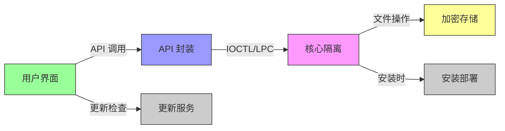

# Sandboxie-Plus — 业务域划分

本文档定义 Sandboxie-Plus 的业务域及其边界。

---

## 域清单

| 域 | 路径 | 职责 | 核心组件 |
|----|------|------|----------|
| **核心隔离** | `Sandboxie/core/` | 进程隔离、资源重定向 | SbieDrv, SbieDll, SbieSvc |
| **用户界面** | `Sandboxie/apps/`, `SandboxiePlus/SandMan/` | 用户交互、配置管理 | SandMan, SbieCtrl |
| **API 封装** | `SandboxiePlus/QSbieAPI/` | 统一 API 接口 | QSbieAPI |
| **加密存储** | `SandboxieTools/ImBox/` | 加密沙箱镜像 | ImBox |
| **更新服务** | `SandboxieTools/UpdUtil/` | 软件更新 | UpdUtil |
| **安装部署** | `Installer/` | 安装程序 | Inno Setup |

---

## 域间交互图



---

## 域详细说明

### 1. 核心隔离域

**路径：** `Sandboxie/core/`

**职责：**
- 内核级系统调用拦截
- 进程隔离和资源重定向
- 安全策略执行

**子域：**

| 子域 | 路径 | 说明 |
|------|------|------|
| 驱动 | `core/drv/` | 内核驱动 |
| DLL | `core/dll/` | 注入 DLL |
| 服务 | `core/svc/` | 系统服务 |
| 低级注入 | `core/low/` | 早期注入代码 |

**边界规则：**
- 只能通过 IOCTL/LPC 与其他域通信
- 不依赖 GUI 域
- 不依赖 Qt 或其他 UI 框架

### 2. 用户界面域

**路径：** `Sandboxie/apps/`, `SandboxiePlus/SandMan/`

**职责：**
- 用户交互
- 配置管理
- 状态展示

**子域：**

| 子域 | 路径 | 说明 |
|------|------|------|
| Plus GUI | `SandboxiePlus/SandMan/` | Qt 现代界面 |
| Classic GUI | `Sandboxie/apps/control/` | MFC 经典界面 |
| 启动器 | `Sandboxie/apps/start/` | 程序启动器 |

**边界规则：**
- 必须通过 API 层访问核心功能
- 不能直接调用驱动
- 不能依赖核心域内部结构

### 3. API 封装域

**路径：** `SandboxiePlus/QSbieAPI/`

**职责：**
- 提供统一的 C++/Qt API
- 封装底层通信细节
- 提供类型安全接口

**边界规则：**
- 可以调用核心域的公共接口
- 不能访问核心域内部实现
- 为 UI 域提供服务

### 4. 加密存储域

**路径：** `SandboxieTools/ImBox/`

**职责：**
- 加密沙箱镜像管理
- AES-XTS 加密实现
- 与 ImDisk 驱动集成

**边界规则：**
- 独立于核心隔离域
- 可被核心域调用
- 不依赖 UI 域

### 5. 更新服务域

**路径：** `SandboxieTools/UpdUtil/`

**职责：**
- 检查软件更新
- 下载更新包
- 执行更新

**边界规则：**
- 独立运行
- 不依赖核心隔离域
- 可被 UI 域调用

### 6. 安装部署域

**路径：** `Installer/`

**职责：**
- 安装程序打包
- 驱动安装
- 初始配置

**边界规则：**
- 仅在安装时运行
- 不依赖运行时组件

---

## 域边界规则

### 允许的交互

```
UI 域 → API 域 → 核心域
核心域 → 加密存储域
UI 域 → 更新服务域
```

### 禁止的交互

```
核心域 → UI 域 ❌
核心域 → API 域 ❌ (反向)
加密存储域 → UI 域 ❌
```

---

## 相关文档

- [架构总览](architecture/overview.md) — 系统整体架构
- [依赖规则](architecture/dependency-rules.md) — 分层依赖规则
