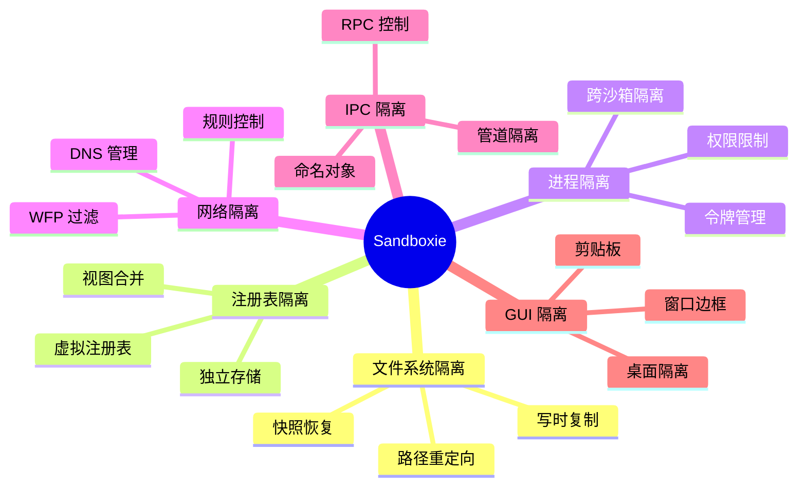
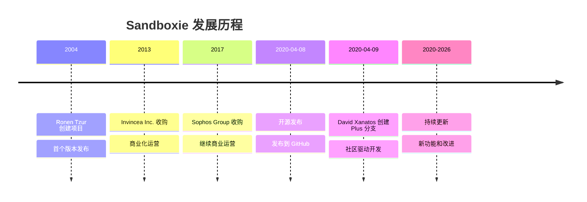
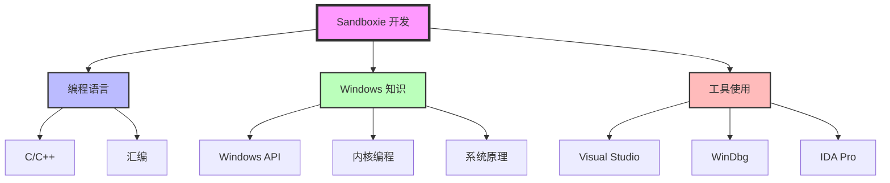
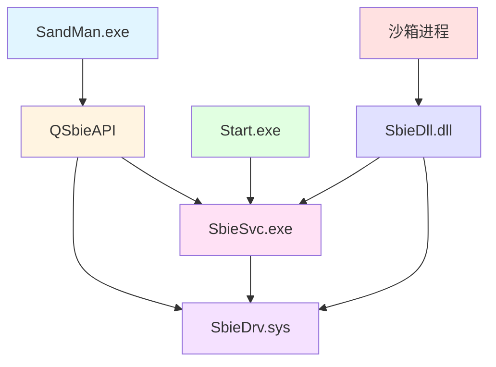

# Sandboxie 项目概述与技术栈

> 本文档详细介绍 Sandboxie 项目的背景、目标、技术栈和所需技能

---

## 📋 目录

1. [项目简介](#项目简介)
2. [项目历史](#项目历史)
3. [核心价值](#核心价值)
4. [技术栈详解](#技术栈详解)
5. [所需技能](#所需技能)
6. [开发环境](#开发环境)
7. [项目结构](#项目结构)
8. [编译构建](#编译构建)

---

## 项目简介

### 什么是 Sandboxie

Sandboxie 是一个基于**沙箱隔离技术**的 Windows 安全软件，它通过创建隔离的虚拟环境来运行应用程序，防止程序对系统造成永久性修改。

### 核心特性



### 应用场景

1. **安全测试**
   - 测试不可信的软件
   - 运行可疑程序
   - 分析恶意软件

2. **隐私保护**
   - 浏览器隔离
   - 防止追踪
   - 保护个人信息

3. **系统保护**
   - 防止系统修改
   - 避免注册表污染
   - 保持系统干净

4. **多实例运行**
   - 同时运行多个程序实例
   - 不同配置的程序
   - 游戏多开

---

## 项目历史

### 发展时间线



### 版本演进

| 版本 | 时间 | 主要特性 |
|------|------|---------|
| 1.x - 3.x | 2004-2010 | 基础隔离功能 |
| 4.x | 2011-2015 | 增强兼容性 |
| 5.x | 2016-2020 | 现代化改进 |
| Plus 0.x | 2020-2021 | 开源版本 |
| Plus 1.x | 2021-现在 | 新 UI 和功能 |

### Classic vs Plus

| 特性 | Classic | Plus |
|------|---------|------|
| UI 框架 | MFC | Qt 6 |
| 界面风格 | 传统 Windows | 现代化 |
| 功能 | 基础功能 | 增强功能 |
| 更新频率 | 较低 | 活跃 |
| 社区支持 | 有限 | 活跃 |

---

## 核心价值

### 技术价值

1. **深度系统集成**
   - 内核级隔离
   - 系统调用拦截
   - 完整的虚拟化

2. **高性能设计**
   - 最小化开销
   - 智能缓存
   - 优化的数据结构

3. **良好的兼容性**
   - 支持大多数应用
   - 丰富的兼容性模板
   - 持续改进

### 学习价值

1. **Windows 内核编程**
   - 驱动开发
   - 系统调用
   - 内核对象管理

2. **系统虚拟化技术**
   - 文件系统虚拟化
   - 注册表虚拟化
   - 进程隔离

3. **Hook 技术**
   - API Hook
   - Inline Hook
   - Trampoline 技术

4. **安全机制**
   - 沙箱设计
   - 权限控制
   - 攻击面分析

---

## 技术栈详解

### 编程语言

#### 1. C 语言（60%）

**用途**：
- 内核驱动（SbieDrv.sys）
- 用户态 DLL（SbieDll.dll）
- 底层注入（LowLevel.dll）

**特点**：
- 直接的内存操作
- 高性能
- 与 Windows API 无缝集成

**示例代码**：
```c
// 驱动入口函数
NTSTATUS DriverEntry(
    PDRIVER_OBJECT DriverObject,
    PUNICODE_STRING RegistryPath)
{
    NTSTATUS status;
    
    // 初始化驱动
    status = Driver_Init(DriverObject, RegistryPath);
    if (!NT_SUCCESS(status)) {
        return status;
    }
    
    // 注册卸载函数
    DriverObject->DriverUnload = Driver_Unload;
    
    return STATUS_SUCCESS;
}
```

#### 2. C++（35%）

**用途**：
- 系统服务（SbieSvc.exe）
- API 封装层（QSbieAPI）
- GUI 层（SandMan）

**特点**：
- 面向对象
- STL 容器
- Qt 框架集成

**示例代码**：
```cpp
// API 封装类
class CSbieAPI : public QObject
{
    Q_OBJECT
public:
    CSbieAPI(QObject* parent = nullptr);
    virtual ~CSbieAPI();
    
    // 连接到驱动
    virtual SB_STATUS Connect();
    
    // 枚举沙箱
    virtual QMap<QString, CSandBoxPtr> GetAllBoxes();
    
signals:
    void BoxAdded(const QString& boxName);
    void BoxRemoved(const QString& boxName);
};
```

#### 3. 汇编语言（<5%）

**用途**：
- Hook 跳板代码
- 底层注入
- 特殊优化

**示例代码**：
```asm
; Trampoline 跳板
Hook_Trampoline:
    push rax
    mov rax, [OriginalFunction]
    jmp rax
```

### 框架和库

#### 1. Windows Driver Kit (WDK)

**版本**：10.0.19041 或更高

**用途**：
- 驱动开发
- 内核 API
- 调试工具

**关键组件**：
- `ntddk.h` - 内核头文件
- `wdm.h` - WDM 驱动模型
- `fltKernel.h` - 文件系统过滤

#### 2. Qt Framework

**版本**：Qt 6.x

**用途**：
- GUI 开发
- 跨平台支持
- 信号槽机制

**使用的模块**：
```cpp
#include <QtCore>      // 核心功能
#include <QtGui>       // GUI 基础
#include <QtWidgets>   // 控件
#include <QtNetwork>   // 网络
#include <QtConcurrent> // 并发
```

#### 3. MFC (Microsoft Foundation Classes)

**用途**：
- Classic UI
- 传统 Windows 界面

#### 4. STL (Standard Template Library)

**用途**：
- 容器（vector, map, set）
- 算法
- 字符串处理

### 构建工具

#### 1. Visual Studio

**版本**：2019 或 2022

**配置**：
- C++ 桌面开发
- Windows SDK
- WDK 集成

#### 2. qmake / CMake

**用途**：
- Qt 项目构建
- 跨平台支持

#### 3. InnoSetup

**用途**：
- 安装包制作
- 版本管理

---

## 所需技能

### 必备技能矩阵



### 技能等级要求

| 技能 | 初级 | 中级 | 高级 | 说明 |
|------|------|------|------|------|
| C 语言 | ⭐⭐⭐ | ⭐⭐⭐⭐ | ⭐⭐⭐⭐⭐ | 核心语言 |
| C++ | ⭐⭐ | ⭐⭐⭐ | ⭐⭐⭐⭐ | 服务和 GUI |
| Windows API | ⭐⭐⭐ | ⭐⭐⭐⭐ | ⭐⭐⭐⭐⭐ | 必须掌握 |
| 内核编程 | ⭐ | ⭐⭐⭐ | ⭐⭐⭐⭐⭐ | 驱动开发 |
| 汇编 | ⭐ | ⭐⭐ | ⭐⭐⭐⭐ | Hook 实现 |
| Qt | ⭐ | ⭐⭐⭐ | ⭐⭐⭐⭐ | GUI 开发 |
| 调试 | ⭐⭐ | ⭐⭐⭐⭐ | ⭐⭐⭐⭐⭐ | 问题诊断 |

### 学习资源

#### 书籍推荐

**C/C++ 编程**
1. 《C Primer Plus》（第 6 版）
2. 《C++ Primer》（第 5 版）
3. 《Effective C++》
4. 《More Effective C++》

**Windows 编程**
1. 《Windows 程序设计》（Charles Petzold）
2. 《Windows via C/C++》（Jeffrey Richter）
3. 《Windows 核心编程》

**内核编程**
1. 《Windows 内核原理与实现》
2. 《Windows Internals》（第 7 版）
3. 《Windows 驱动开发技术详解》
4. 《Rootkits: Subverting the Windows Kernel》

**逆向工程**
1. 《逆向工程权威指南》
2. 《加密与解密》（第 4 版）
3. 《IDA Pro 权威指南》

#### 在线资源

**官方文档**
- [MSDN - Windows API](https://docs.microsoft.com/en-us/windows/win32/)
- [WDK 文档](https://docs.microsoft.com/en-us/windows-hardware/drivers/)
- [Qt 文档](https://doc.qt.io/)

**社区资源**
- [OSR Online](https://www.osronline.com/) - 驱动开发社区
- [ReactOS](https://reactos.org/) - 开源 Windows 实现
- [GitHub - Sandboxie](https://github.com/sandboxie-plus/Sandboxie)

**视频教程**
- YouTube - Windows Internals
- Pluralsight - Windows Driver Development
- Udemy - Qt C++ GUI Development

---

## 开发环境

### 硬件要求

| 组件 | 最低配置 | 推荐配置 |
|------|---------|---------|
| CPU | Intel i5 / AMD Ryzen 5 | Intel i7 / AMD Ryzen 7 |
| 内存 | 8 GB | 16 GB 或更多 |
| 硬盘 | 50 GB 可用空间 | 100 GB SSD |
| 显示器 | 1920x1080 | 2560x1440 或更高 |

### 软件要求

#### 必需软件

1. **Windows 10/11**
   - 版本：1909 或更高
   - 架构：x64

2. **Visual Studio 2019/2022**
   - 工作负载：
     - C++ 桌面开发
     - Windows 驱动程序开发
   - 组件：
     - MSVC v142/v143
     - Windows 10/11 SDK
     - CMake 工具

3. **Windows Driver Kit (WDK)**
   - 版本：10.0.19041 或更高
   - 匹配 SDK 版本

4. **Qt 6.x**
   - 版本：6.2 或更高
   - 组件：
     - Qt Creator
     - MSVC 2019/2022 64-bit
     - Qt 5 Compatibility Module

#### 可选软件

1. **调试工具**
   - WinDbg Preview
   - Sysinternals Suite
   - Process Monitor
   - Process Explorer

2. **逆向工具**
   - IDA Pro / Ghidra
   - x64dbg
   - PE Explorer

3. **版本控制**
   - Git
   - GitHub Desktop / SourceTree

### 环境配置

#### 1. 启用测试签名

```cmd
# 以管理员身份运行
bcdedit /set testsigning on
# 重启计算机
```

#### 2. 配置符号路径

```cmd
# 设置环境变量
setx _NT_SYMBOL_PATH "SRV*C:\Symbols*https://msdl.microsoft.com/download/symbols"
```

#### 3. 安装 Qt

```bash
# 使用在线安装器
qt-unified-windows-x64-online.exe

# 或使用 vcpkg
vcpkg install qt6:x64-windows
```

---

## 项目结构

### 目录树

```
Sandboxie/
├── Sandboxie/                    # 核心代码（C）
│   ├── core/                     # 核心组件
│   │   ├── drv/                  # 内核驱动
│   │   │   ├── driver.c          # 驱动入口
│   │   │   ├── api.c             # IOCTL 接口
│   │   │   ├── process.c         # 进程管理
│   │   │   ├── file.c            # 文件虚拟化
│   │   │   ├── key.c             # 注册表虚拟化
│   │   │   └── ...
│   │   ├── dll/                  # 用户态 DLL
│   │   │   ├── dll.c             # DLL 入口
│   │   │   ├── hook.c            # Hook 框架
│   │   │   ├── file.c            # 文件 Hook
│   │   │   ├── key.c             # 注册表 Hook
│   │   │   └── ...
│   │   ├── svc/                  # 系统服务
│   │   │   ├── main.cpp          # 服务入口
│   │   │   ├── ProcessServer.cpp # 进程服务器
│   │   │   ├── DriverAssist.cpp  # 驱动助手
│   │   │   └── ...
│   │   └── low/                  # 底层注入
│   ├── apps/                     # 应用程序
│   │   ├── start/                # 启动器
│   │   ├── control/              # Classic UI
│   │   └── com/                  # COM 包装器
│   ├── install/                  # 安装文件
│   │   ├── Templates.ini         # 配置模板
│   │   └── kmdutil/              # 驱动加载器
│   └── msgs/                     # 消息文件
├── SandboxiePlus/                # Plus 版代码（C++/Qt）
│   ├── QSbieAPI/                 # API 封装层
│   │   ├── SbieAPI.cpp           # 核心 API
│   │   └── Sandboxie/            # 沙箱对象
│   ├── SandMan/                  # GUI 主程序
│   │   ├── SandMan.cpp           # 主窗口
│   │   ├── Views/                # 视图
│   │   ├── Windows/              # 窗口
│   │   └── Wizards/              # 向导
│   └── MiscHelpers/              # 辅助工具
├── Installer/                    # 安装器
│   └── Sandboxie-Plus.iss        # InnoSetup 脚本
├── docs/                         # 文档
│   ├── ai-analysis/              # AI 分析文档
│   └── learning/                 # 学习文档
└── .cursor/                      # Cursor 配置
    └── skills/                   # Skills
        └── sandboxie-analyzer/   # 分析 Skill
```

### 模块依赖关系



---

## 编译构建

### 编译步骤

#### 1. 克隆仓库

```bash
git clone https://github.com/sandboxie-plus/Sandboxie.git
cd Sandboxie
```

#### 2. 编译核心组件

```cmd
# 打开 Visual Studio 解决方案
start Sandboxie\Sandbox.sln

# 或使用命令行
msbuild Sandboxie\Sandbox.sln /p:Configuration=Release /p:Platform=x64
```

**注意**：必须先编译 x86 的 LowLevel 项目，再编译 x64 项目。

#### 3. 编译 Plus UI

```cmd
# 使用 Qt Creator 打开
qtcreator SandboxiePlus\SandMan\SandMan.pro

# 或使用 qmake
cd SandboxiePlus
qmake
nmake release
```

#### 4. 生成安装包

```cmd
# 使用 InnoSetup 编译
iscc Installer\Sandboxie-Plus.iss
```

### 编译配置

#### Debug vs Release

| 配置 | 优化 | 符号 | 用途 |
|------|------|------|------|
| Debug | 无 | 完整 | 开发调试 |
| Release | 最大 | 最小 | 发布版本 |

#### 平台配置

| 平台 | 架构 | 说明 |
|------|------|------|
| Win32 | x86 | 32 位（LowLevel.dll） |
| x64 | x64 | 64 位（主要平台） |
| ARM64 | ARM64 | ARM 架构 |

### 常见编译问题

#### 问题 1：WDK 未找到

**解决方案**：
```cmd
# 设置 WDK 路径
set WDKContentRoot=C:\Program Files (x86)\Windows Kits\10\
```

#### 问题 2：Qt 未找到

**解决方案**：
```cmd
# 添加 Qt 到 PATH
set PATH=%PATH%;C:\Qt\6.5.0\msvc2019_64\bin
```

#### 问题 3：签名失败

**解决方案**：
- 启用测试签名模式
- 或使用自签名证书

---

## 下一步

阅读完本文档后，建议继续学习：

1. **[02-架构设计详解.md](02-架构设计详解.md)** - 理解三层架构
2. **[13-开发调试指南.md](13-开发调试指南.md)** - 搭建开发环境
3. **[15-技术学习路线.md](15-技术学习路线.md)** - 系统学习相关技术

---

**文档版本**：1.0  
**最后更新**：2026-03-05  
**适用版本**：Sandboxie Plus 1.x
