# Sandboxie 架构设计详解

> 本文档深入解析 Sandboxie 的三层架构设计，包括各层职责、通信机制和设计理念

---

## 📋 目录

1. [架构概览](#架构概览)
2. [三层架构设计](#三层架构设计)
3. [通信机制](#通信机制)
4. [数据流分析](#数据流分析)
5. [设计模式](#设计模式)
6. [架构优势](#架构优势)

---

## 架构概览

### 整体架构图

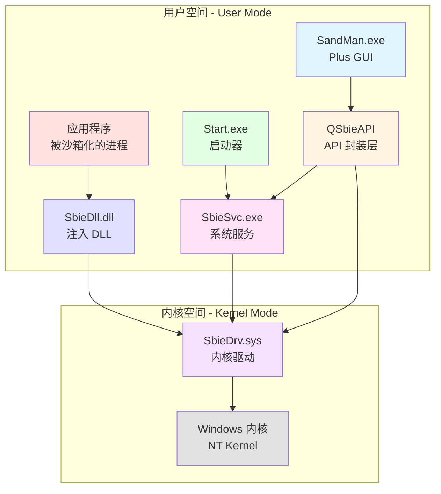

### 架构分层

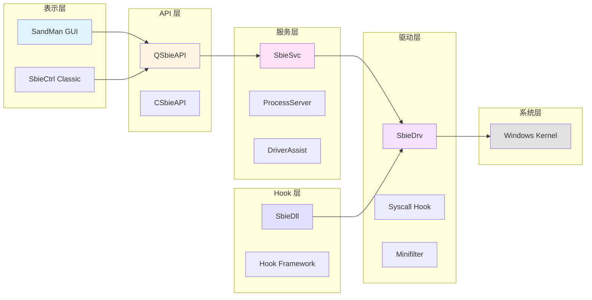

---

## 三层架构设计

### 第一层：内核驱动层（Kernel Driver Layer）

#### 职责定位

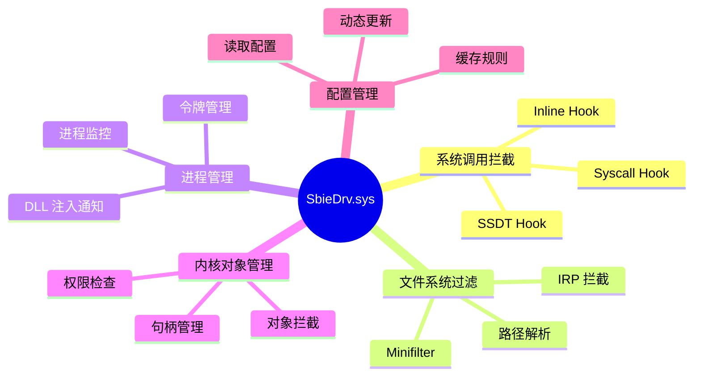

#### 核心组件

| 组件 | 文件 | 职责 | 复杂度 |
|------|------|------|--------|
| 驱动框架 | `driver.c` | 驱动入口和初始化 | 中 |
| API 分发 | `api.c` | IOCTL 命令处理 | 中 |
| 进程管理 | `process.c` | 进程注册和监控 | 高 |
| 文件虚拟化 | `file.c` | 文件系统拦截 | 高 |
| 注册表虚拟化 | `key.c` | 注册表拦截 | 高 |
| IPC 隔离 | `ipc.c` | IPC 对象隔离 | 中 |
| 网络过滤 | `net.c` | 网络访问控制 | 中 |
| GUI 隔离 | `gui.c` | 窗口和桌面隔离 | 中 |
| 系统调用 | `syscall.c` | 系统调用管理 | 高 |
| 配置系统 | `conf.c` | 配置读取和缓存 | 中 |

#### 关键数据结构

**PROCESS 结构体**：
```c
typedef struct _PROCESS {
    // 基本信息
    ULONG pid;                      // 进程 ID
    HANDLE process_id;              // 进程句柄
    PEPROCESS process_object;       // 进程对象指针
    
    // 沙箱信息
    BOX *box;                       // 所属沙箱
    BOOLEAN is_sandboxed;           // 是否沙箱化
    ULONG session_id;               // 会话 ID
    
    // 令牌信息
    HANDLE primary_token;           // 主令牌
    ULONG token_flags;              // 令牌标志
    
    // 链表节点
    LIST_ENTRY list_entry;          // 全局进程链表
    LIST_ENTRY box_entry;           // 沙箱进程链表
    
    // 同步
    ERESOURCE lock;                 // 进程锁
    
    // 统计信息
    ULONG create_time;              // 创建时间
    ULONG terminate_time;           // 终止时间
} PROCESS;
```

**BOX 结构体**：
```c
typedef struct _BOX {
    // 基本信息
    WCHAR name[34];                 // 沙箱名称
    ULONG session_id;               // 会话 ID
    
    // 配置信息
    WCHAR *file_root_path;          // 文件根路径
    WCHAR *ipc_root_path;           // IPC 根路径
    WCHAR *key_root_path;           // 注册表根路径
    
    // 规则列表
    LIST_ENTRY open_file_paths;     // 允许的文件路径
    LIST_ENTRY closed_file_paths;   // 禁止的文件路径
    LIST_ENTRY open_key_paths;      // 允许的注册表路径
    LIST_ENTRY closed_key_paths;    // 禁止的注册表路径
    
    // 进程列表
    LIST_ENTRY processes;           // 沙箱内的进程
    
    // 链表节点
    LIST_ENTRY list_entry;          // 全局沙箱链表
    
    // 同步
    ERESOURCE lock;                 // 沙箱锁
} BOX;
```

#### 工作流程

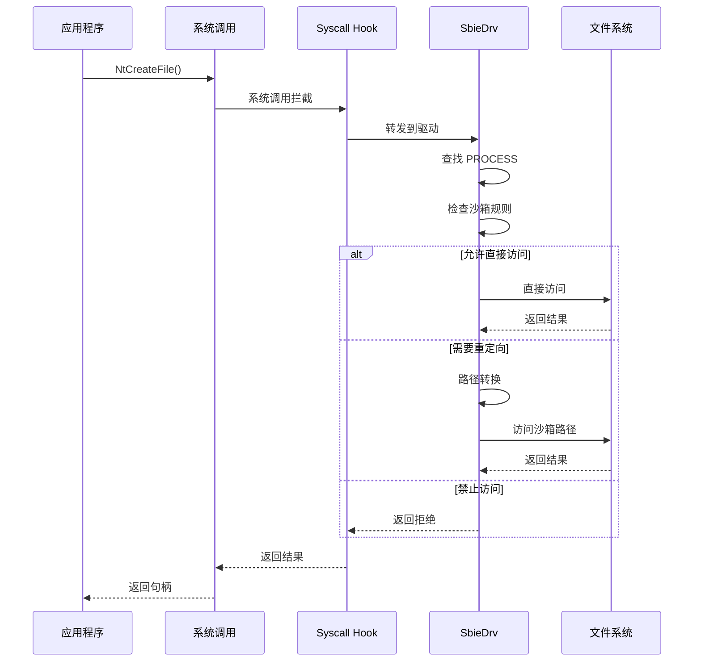

---

### 第二层：用户态 DLL 层（User-Mode DLL Layer）

#### 职责定位

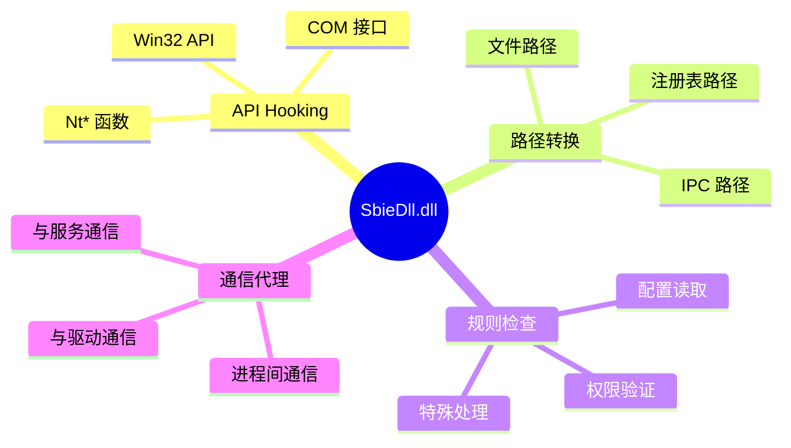

#### Hook 框架

**Hook 类型**：

1. **Inline Hook**（主要方式）
```c
// Hook 安装
BOOLEAN Hook_Install(
    PVOID TargetFunction,
    PVOID HookFunction,
    PVOID *OriginalFunction)
{
    // 1. 保存原始字节
    memcpy(original_bytes, TargetFunction, 16);
    
    // 2. 创建跳板
    *OriginalFunction = Create_Trampoline(TargetFunction);
    
    // 3. 写入跳转指令
    Write_Jump(TargetFunction, HookFunction);
    
    return TRUE;
}
```

2. **IAT Hook**（辅助方式）
```c
// 修改导入表
BOOLEAN Hook_IAT(
    HMODULE Module,
    LPCSTR FunctionName,
    PVOID HookFunction)
{
    // 1. 查找 IAT
    PIMAGE_IMPORT_DESCRIPTOR import = Find_IAT(Module);
    
    // 2. 查找函数地址
    PVOID *func_addr = Find_Function_In_IAT(import, FunctionName);
    
    // 3. 替换地址
    *func_addr = HookFunction;
    
    return TRUE;
}
```

#### Hook 示例

**文件操作 Hook**：
```c
// Hook NtCreateFile
NTSTATUS NTAPI Hook_NtCreateFile(
    PHANDLE FileHandle,
    ACCESS_MASK DesiredAccess,
    POBJECT_ATTRIBUTES ObjectAttributes,
    PIO_STATUS_BLOCK IoStatusBlock,
    PLARGE_INTEGER AllocationSize,
    ULONG FileAttributes,
    ULONG ShareAccess,
    ULONG CreateDisposition,
    ULONG CreateOptions,
    PVOID EaBuffer,
    ULONG EaLength)
{
    NTSTATUS status;
    WCHAR *path = NULL;
    
    // 1. 获取文件路径
    path = Get_File_Path(ObjectAttributes);
    
    // 2. 检查规则
    if (Should_Redirect(path)) {
        // 3. 路径转换
        Convert_To_Sandbox_Path(path);
        
        // 4. 写时复制
        if (Is_Write_Access(DesiredAccess)) {
            Copy_On_Write(path);
        }
    }
    
    // 5. 调用原始函数
    status = Original_NtCreateFile(
        FileHandle, DesiredAccess, ObjectAttributes,
        IoStatusBlock, AllocationSize, FileAttributes,
        ShareAccess, CreateDisposition, CreateOptions,
        EaBuffer, EaLength);
    
    return status;
}
```

#### 路径转换机制

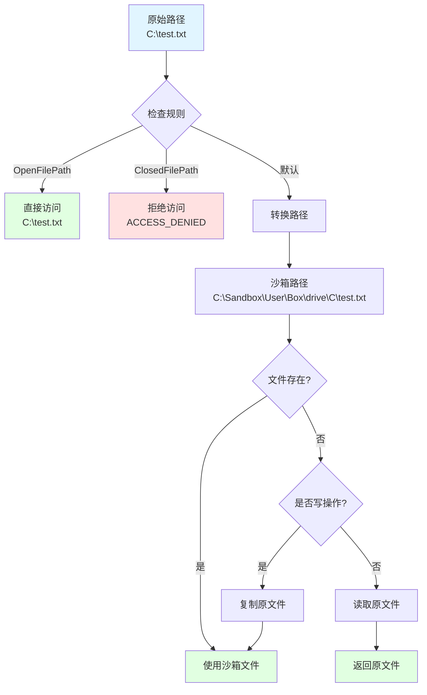

---

### 第三层：服务层（Service Layer）

#### 职责定位

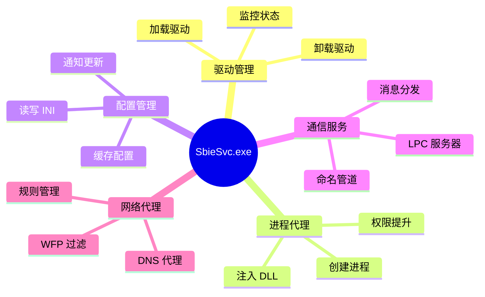

#### 服务架构

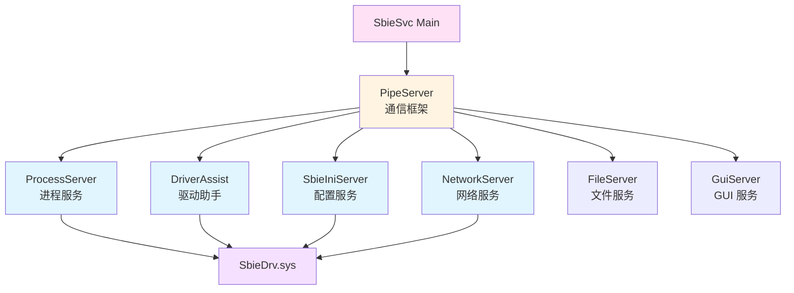

#### 进程创建流程

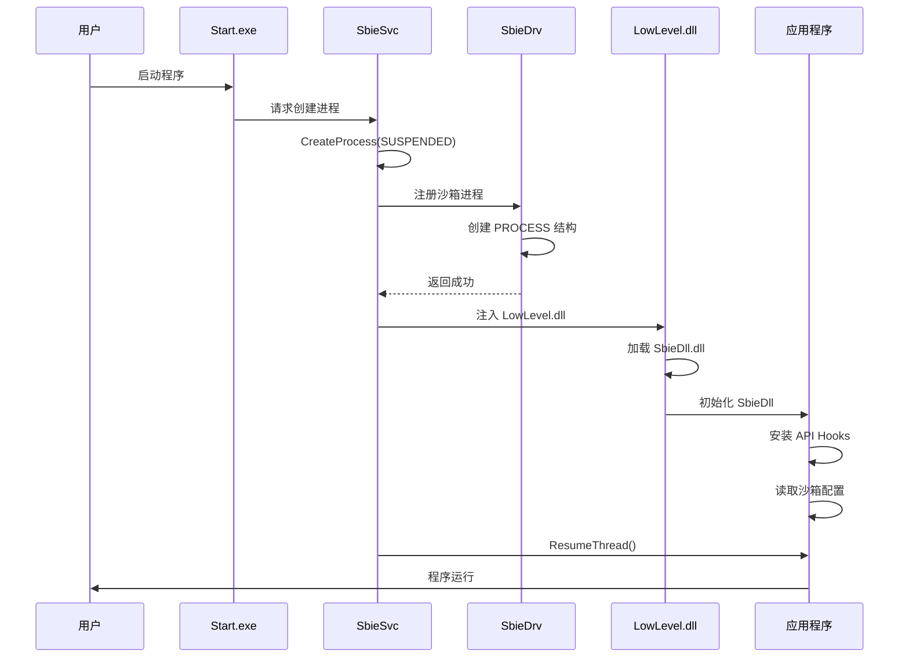

---

## 通信机制

### IOCTL 通信（驱动 ↔ 用户态）

#### 通信架构

```mermaid
graph LR
    A[用户态程序] -->|DeviceIoControl| B[\Device\SandboxieDriverApi]
    B --> C[Api_Ioctl_Dispatcher]
    C --> D1[API_QUERY_PROCESS]
    C --> D2[API_ENUM_PROCESSES]
    C --> D3[API_START_PROCESS]
    C --> D4[API_QUERY_BOX_PATH]
    
    style A fill:#e1f5ff
    style B fill:#fff4e1
    style C fill:#ffe1f5
```

#### IOCTL 命令

| 命令 | 代码 | 功能 | 权限 |
|------|------|------|------|
| API_QUERY_PROCESS | 0x01 | 查询进程信息 | 用户 |
| API_ENUM_PROCESSES | 0x02 | 枚举进程 | 用户 |
| API_START_PROCESS | 0x03 | 启动进程 | 管理员 |
| API_QUERY_BOX_PATH | 0x04 | 查询沙箱路径 | 用户 |
| API_ENUM_BOXES | 0x05 | 枚举沙箱 | 用户 |
| API_QUERY_CONF | 0x06 | 查询配置 | 用户 |
| API_SET_CONF | 0x07 | 设置配置 | 管理员 |

#### 通信示例

```cpp
// 查询进程信息
NTSTATUS Query_Process_Info(ULONG pid)
{
    HANDLE device;
    NTSTATUS status;
    IO_STATUS_BLOCK iosb;
    
    struct {
        ULONG pid;
        WCHAR box_name[34];
        BOOLEAN is_sandboxed;
    } request, response;
    
    // 1. 打开设备
    status = NtOpenFile(
        &device,
        FILE_GENERIC_READ | FILE_GENERIC_WRITE,
        &obj_attr,
        &iosb,
        FILE_SHARE_READ | FILE_SHARE_WRITE,
        0);
    
    // 2. 准备请求
    request.pid = pid;
    
    // 3. 发送 IOCTL
    status = NtDeviceIoControlFile(
        device,
        NULL,
        NULL,
        NULL,
        &iosb,
        API_QUERY_PROCESS,
        &request,
        sizeof(request),
        &response,
        sizeof(response));
    
    // 4. 处理响应
    if (NT_SUCCESS(status)) {
        printf("Box: %S, Sandboxed: %d\n",
            response.box_name,
            response.is_sandboxed);
    }
    
    NtClose(device);
    return status;
}
```

### LPC 通信（GUI/DLL ↔ 服务）

#### LPC 架构

```mermaid
graph TB
    subgraph "客户端"
        A1[SandMan]
        A2[SbieDll]
        A3[Start.exe]
    end
    
    subgraph "服务端"
        B[\RPC Control\SbieSvcPort]
        C[PipeServer]
        D1[ProcessServer]
        D2[SbieIniServer]
        D3[其他服务器]
    end
    
    A1 -->|NtConnectPort| B
    A2 -->|NtConnectPort| B
    A3 -->|NtConnectPort| B
    
    B --> C
    C --> D1
    C --> D2
    C --> D3
    
    style B fill:#fff4e1
    style C fill:#ffe1f5
```

#### 消息格式

```c
// LPC 消息结构
typedef struct _SBIEINI_WIRE {
    PORT_MESSAGE h;                 // LPC 消息头
    ULONG msgid;                    // 消息 ID
    ULONG status;                   // 状态码
    ULONG session_id;               // 会话 ID
    ULONG data_len;                 // 数据长度
    UCHAR data[1];                  // 数据内容
} SBIEINI_WIRE;
```

#### 消息类型

| 消息 ID | 功能 | 方向 |
|---------|------|------|
| MSGID_PROCESS_CREATE | 创建进程 | 客户端→服务端 |
| MSGID_PROCESS_KILL | 终止进程 | 客户端→服务端 |
| MSGID_CONF_GET | 获取配置 | 客户端→服务端 |
| MSGID_CONF_SET | 设置配置 | 客户端→服务端 |
| MSGID_CONF_RELOAD | 重载配置 | 客户端→服务端 |
| MSGID_BOX_CREATE | 创建沙箱 | 客户端→服务端 |
| MSGID_BOX_DELETE | 删除沙箱 | 客户端→服务端 |

---

## 数据流分析

### 文件操作数据流

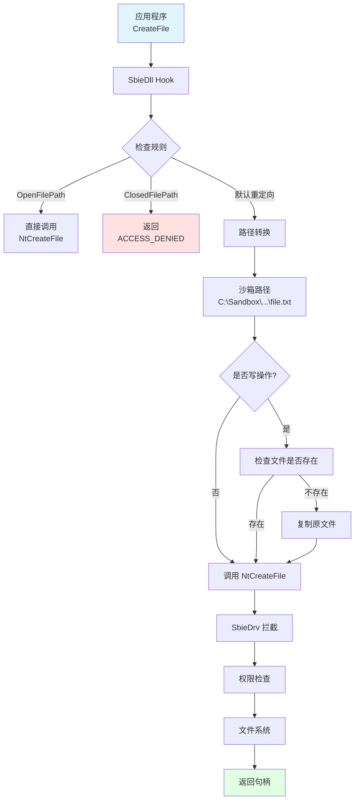

### 配置数据流

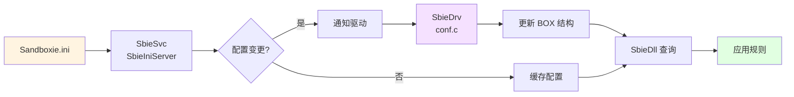

---

## 设计模式

### 1. 分层架构模式

**优势**：
- 职责清晰
- 易于维护
- 可扩展性强

**实现**：
```
表示层 (GUI) → API 层 → 服务层 → Hook 层 → 驱动层 → 系统层
```

### 2. 代理模式

**用途**：服务层代理进程创建

```cpp
class ProcessServer {
public:
    // 代理创建进程
    NTSTATUS CreateProcess(
        const WCHAR *command_line,
        const WCHAR *box_name)
    {
        // 1. 权限检查
        if (!CheckPermission()) {
            return STATUS_ACCESS_DENIED;
        }
        
        // 2. 创建进程（挂起）
        HANDLE process = ::CreateProcess(..., SUSPENDED);
        
        // 3. 通知驱动
        NotifyDriver(process, box_name);
        
        // 4. 注入 DLL
        InjectDll(process);
        
        // 5. 恢复进程
        ResumeThread(process);
        
        return STATUS_SUCCESS;
    }
};
```

### 3. 观察者模式

**用途**：配置变更通知

```cpp
class ConfigObserver {
public:
    virtual void OnConfigChanged(const QString &key) = 0;
};

class SbieIniServer {
    QList<ConfigObserver*> observers;
    
public:
    void NotifyConfigChanged(const QString &key) {
        for (auto observer : observers) {
            observer->OnConfigChanged(key);
        }
    }
};
```

### 4. 单例模式

**用途**：全局 API 实例

```cpp
class CSbieAPI {
private:
    static CSbieAPI *m_instance;
    
    CSbieAPI() { /* 私有构造 */ }
    
public:
    static CSbieAPI* GetInstance() {
        if (!m_instance) {
            m_instance = new CSbieAPI();
        }
        return m_instance;
    }
};
```

---

## 架构优势

### 1. 安全性

**多层防护**：
```
应用程序
    ↓ (DLL Hook - 第一道防线)
SbieDll
    ↓ (驱动拦截 - 第二道防线)
SbieDrv
    ↓ (内核强制 - 最后防线)
Windows 内核
```

### 2. 性能

**优化策略**：
- DLL 层快速路径（常见操作）
- 驱动层缓存（配置和路径）
- 异步处理（非关键操作）

### 3. 可维护性

**模块化设计**：
- 每层职责明确
- 接口定义清晰
- 易于测试和调试

### 4. 可扩展性

**扩展点**：
- 新的 Hook 函数
- 新的配置项
- 新的隔离机制
- 新的 GUI 功能

---

## 下一步

继续学习：

1. **[03-内核驱动层分析.md](03-内核驱动层分析.md)** - 深入驱动层
2. **[04-用户态DLL层分析.md](04-用户态DLL层分析.md)** - 深入 DLL 层
3. **[08-核心流程详解.md](08-核心流程详解.md)** - 关键流程分析

---

**文档版本**：1.0  
**最后更新**：2026-03-05
