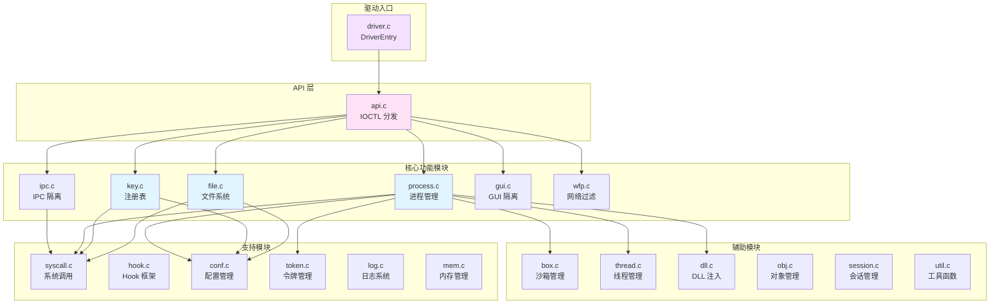
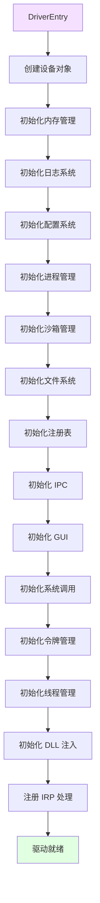
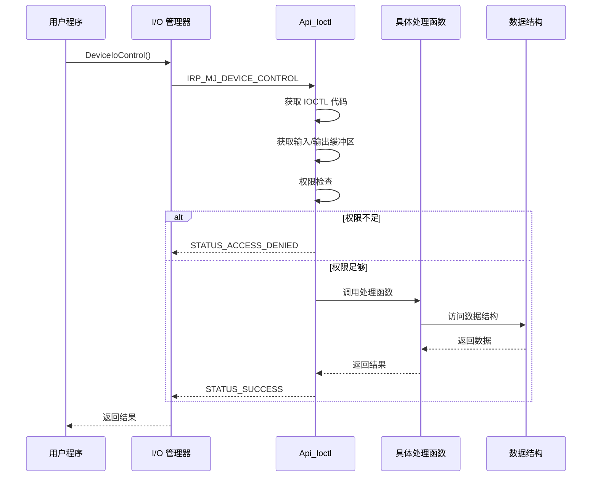

# Sandboxie 内核驱动层完整分析

> 本文档深入分析 SbieDrv.sys 内核驱动的所有模块和功能

---

## 📋 目录

1. [驱动概述](#驱动概述)
2. [核心模块分析](#核心模块分析)
3. [文件系统虚拟化](#文件系统虚拟化)
4. [注册表虚拟化](#注册表虚拟化)
5. [进程管理](#进程管理)
6. [IPC 隔离](#ipc-隔离)
7. [系统调用拦截](#系统调用拦截)
8. [配置系统](#配置系统)

---

## 驱动概述

### 驱动架构图



### 文件统计

| 类别 | 文件数 | 代码行数 | 说明 |
|------|--------|---------|------|
| 核心功能 | 6 | ~15,000 | file, key, process, ipc, gui, wfp |
| 系统调用 | 6 | ~8,000 | syscall, hook 相关 |
| 支持模块 | 10 | ~12,000 | conf, token, log, mem 等 |
| 辅助模块 | 10 | ~8,000 | box, thread, dll, obj 等 |
| 平台相关 | 10 | ~7,000 | _xp, _32, _64 后缀文件 |
| **总计** | **52** | **~50,000** | |

### 关键数据结构

```c
// 全局驱动对象
typedef struct _DRIVER {
    PDRIVER_OBJECT driver_object;       // 驱动对象
    PDEVICE_OBJECT device_object;       // 设备对象
    UNICODE_STRING device_name;         // 设备名称
    UNICODE_STRING dos_device_name;     // DOS 设备名
    
    // 全局锁
    ERESOURCE lock;
    
    // 版本信息
    ULONG version;
    ULONG abi_version;
    
    // 统计信息
    ULONG process_count;
    ULONG box_count;
} DRIVER;

// 进程结构
typedef struct _PROCESS {
    // 基本信息
    ULONG pid;                          // 进程 ID
    HANDLE process_id;                  // 进程句柄
    PEPROCESS process_object;           // 进程对象
    UNICODE_STRING image_name;          // 映像名称
    
    // 沙箱信息
    BOX *box;                           // 所属沙箱
    BOOLEAN is_sandboxed;               // 是否沙箱化
    ULONG session_id;                   // 会话 ID
    ULONG create_time;                  // 创建时间
    
    // 令牌信息
    HANDLE primary_token;               // 主令牌
    HANDLE impersonation_token;         // 模拟令牌
    ULONG token_flags;                  // 令牌标志
    
    // 父进程
    PROCESS *parent;                    // 父进程
    ULONG parent_pid;                   // 父进程 ID
    
    // 链表
    LIST_ENTRY list_entry;              // 全局进程链表
    LIST_ENTRY box_entry;               // 沙箱进程链表
    LIST_ENTRY children;                // 子进程链表
    LIST_ENTRY sibling_entry;           // 兄弟进程链表
    
    // 同步
    ERESOURCE lock;                     // 进程锁
    LONG ref_count;                     // 引用计数
    
    // 标志
    ULONG flags;
    #define PROCESS_FLAG_FORCED         0x00000001
    #define PROCESS_FLAG_LEADER         0x00000002
    #define PROCESS_FLAG_LINGER         0x00000004
    
    // 统计
    ULONG file_count;                   // 打开的文件数
    ULONG key_count;                    // 打开的注册表键数
} PROCESS;

// 沙箱结构
typedef struct _BOX {
    // 基本信息
    WCHAR name[34];                     // 沙箱名称（最多 32 字符 + NULL）
    ULONG session_id;                   // 会话 ID
    ULONG create_time;                  // 创建时间
    
    // 路径配置
    WCHAR *file_root_path;              // 文件根路径
    ULONG file_root_path_len;           // 路径长度
    WCHAR *ipc_root_path;               // IPC 根路径
    ULONG ipc_root_path_len;
    WCHAR *key_root_path;               // 注册表根路径
    ULONG key_root_path_len;
    
    // 规则列表
    LIST_ENTRY open_file_paths;         // OpenFilePath
    LIST_ENTRY closed_file_paths;       // ClosedFilePath
    LIST_ENTRY read_file_paths;         // ReadFilePath
    LIST_ENTRY write_file_paths;        // WriteFilePath
    
    LIST_ENTRY open_key_paths;          // OpenKeyPath
    LIST_ENTRY closed_key_paths;        // ClosedKeyPath
    LIST_ENTRY read_key_paths;          // ReadKeyPath
    LIST_ENTRY write_key_paths;         // WriteKeyPath
    
    LIST_ENTRY open_ipc_paths;          // OpenIpcPath
    LIST_ENTRY closed_ipc_paths;        // ClosedIpcPath
    
    // 进程列表
    LIST_ENTRY processes;               // 沙箱内的进程
    ULONG process_count;                // 进程数量
    
    // 链表
    LIST_ENTRY list_entry;              // 全局沙箱链表
    
    // 同步
    ERESOURCE lock;                     // 沙箱锁
    LONG ref_count;                     // 引用计数
    
    // 标志
    ULONG flags;
    #define BOX_FLAG_ENABLED            0x00000001
    #define BOX_FLAG_AUTO_DELETE        0x00000002
} BOX;
```

---

## 核心模块分析

### 1. driver.c - 驱动入口

**职责**：驱动的初始化和卸载

**关键函数**：

```c
// 驱动入口点
NTSTATUS DriverEntry(
    PDRIVER_OBJECT DriverObject,
    PUNICODE_STRING RegistryPath)
{
    NTSTATUS status;
    
    // 1. 初始化全局变量
    Driver_Object = DriverObject;
    
    // 2. 创建设备对象
    status = Driver_CreateDevice(DriverObject);
    if (!NT_SUCCESS(status)) {
        return status;
    }
    
    // 3. 初始化各个子系统
    status = Process_Init();        // 进程管理
    if (!NT_SUCCESS(status)) goto cleanup;
    
    status = Box_Init();            // 沙箱管理
    if (!NT_SUCCESS(status)) goto cleanup;
    
    status = File_Init();           // 文件系统
    if (!NT_SUCCESS(status)) goto cleanup;
    
    status = Key_Init();            // 注册表
    if (!NT_SUCCESS(status)) goto cleanup;
    
    status = Ipc_Init();            // IPC
    if (!NT_SUCCESS(status)) goto cleanup;
    
    status = Gui_Init();            // GUI
    if (!NT_SUCCESS(status)) goto cleanup;
    
    status = Syscall_Init();        // 系统调用
    if (!NT_SUCCESS(status)) goto cleanup;
    
    status = Token_Init();          // 令牌
    if (!NT_SUCCESS(status)) goto cleanup;
    
    status = Thread_Init();         // 线程
    if (!NT_SUCCESS(status)) goto cleanup;
    
    status = Dll_Init();            // DLL 注入
    if (!NT_SUCCESS(status)) goto cleanup;
    
    // 4. 注册卸载函数
    DriverObject->DriverUnload = Driver_Unload;
    
    // 5. 注册 IRP 处理函数
    DriverObject->MajorFunction[IRP_MJ_CREATE] = Driver_Create;
    DriverObject->MajorFunction[IRP_MJ_CLOSE] = Driver_Close;
    DriverObject->MajorFunction[IRP_MJ_DEVICE_CONTROL] = Api_Ioctl;
    
    return STATUS_SUCCESS;
    
cleanup:
    Driver_Unload(DriverObject);
    return status;
}

// 驱动卸载
VOID Driver_Unload(PDRIVER_OBJECT DriverObject)
{
    // 1. 清理各个子系统（逆序）
    Dll_Unload();
    Thread_Unload();
    Token_Unload();
    Syscall_Unload();
    Gui_Unload();
    Ipc_Unload();
    Key_Unload();
    File_Unload();
    Box_Unload();
    Process_Unload();
    
    // 2. 删除设备对象
    if (Driver_Device) {
        IoDeleteDevice(Driver_Device);
    }
    
    // 3. 删除符号链接
    if (Driver_DosDeviceName.Buffer) {
        IoDeleteSymbolicLink(&Driver_DosDeviceName);
    }
}
```

**初始化流程图**：



### 2. api.c - IOCTL 接口

**职责**：处理用户态的 IOCTL 请求

**IOCTL 命令表**：

| 命令代码 | 命令名 | 功能 | 权限 |
|---------|--------|------|------|
| 0x01 | API_QUERY_PROCESS | 查询进程信息 | 用户 |
| 0x02 | API_ENUM_PROCESSES | 枚举所有进程 | 用户 |
| 0x03 | API_START_PROCESS | 启动沙箱进程 | 管理员 |
| 0x04 | API_TERMINATE_PROCESS | 终止进程 | 管理员 |
| 0x05 | API_QUERY_BOX_PATH | 查询沙箱路径 | 用户 |
| 0x06 | API_ENUM_BOXES | 枚举所有沙箱 | 用户 |
| 0x07 | API_QUERY_CONF | 查询配置 | 用户 |
| 0x08 | API_SET_CONF | 设置配置 | 管理员 |
| 0x09 | API_RELOAD_CONF | 重载配置 | 管理员 |
| 0x0A | API_QUERY_DRIVER_INFO | 查询驱动信息 | 用户 |

**IOCTL 分发器**：

```c
NTSTATUS Api_Ioctl(
    PDEVICE_OBJECT DeviceObject,
    PIRP Irp)
{
    PIO_STACK_LOCATION irpSp;
    ULONG ioctl_code;
    PVOID input_buffer;
    ULONG input_length;
    PVOID output_buffer;
    ULONG output_length;
    NTSTATUS status;
    
    irpSp = IoGetCurrentIrpStackLocation(Irp);
    ioctl_code = irpSp->Parameters.DeviceIoControl.IoControlCode;
    
    input_buffer = Irp->AssociatedIrp.SystemBuffer;
    input_length = irpSp->Parameters.DeviceIoControl.InputBufferLength;
    output_buffer = Irp->AssociatedIrp.SystemBuffer;
    output_length = irpSp->Parameters.DeviceIoControl.OutputBufferLength;
    
    // 分发到具体的处理函数
    switch (ioctl_code) {
        case API_QUERY_PROCESS:
            status = Api_QueryProcess(
                input_buffer, input_length,
                output_buffer, output_length);
            break;
            
        case API_ENUM_PROCESSES:
            status = Api_EnumProcesses(
                input_buffer, input_length,
                output_buffer, output_length);
            break;
            
        case API_START_PROCESS:
            // 需要管理员权限
            if (!Api_CheckAdminRights()) {
                status = STATUS_ACCESS_DENIED;
                break;
            }
            status = Api_StartProcess(
                input_buffer, input_length,
                output_buffer, output_length);
            break;
            
        case API_QUERY_BOX_PATH:
            status = Api_QueryBoxPath(
                input_buffer, input_length,
                output_buffer, output_length);
            break;
            
        case API_QUERY_CONF:
            status = Api_QueryConf(
                input_buffer, input_length,
                output_buffer, output_length);
            break;
            
        case API_SET_CONF:
            // 需要管理员权限
            if (!Api_CheckAdminRights()) {
                status = STATUS_ACCESS_DENIED;
                break;
            }
            status = Api_SetConf(
                input_buffer, input_length,
                output_buffer, output_length);
            break;
            
        default:
            status = STATUS_INVALID_DEVICE_REQUEST;
            break;
    }
    
    // 完成 IRP
    Irp->IoStatus.Status = status;
    Irp->IoStatus.Information = NT_SUCCESS(status) ? output_length : 0;
    IoCompleteRequest(Irp, IO_NO_INCREMENT);
    
    return status;
}
```

**API 调用流程**：



继续阅读下一部分...

---

**文档版本**：1.0  
**最后更新**：2026-03-05  
**文件数量**：52 个核心文件
