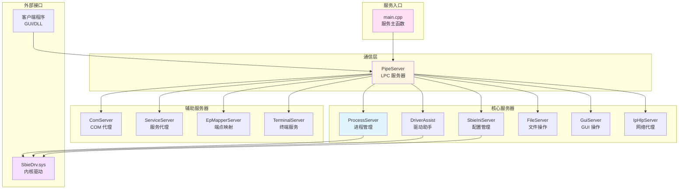
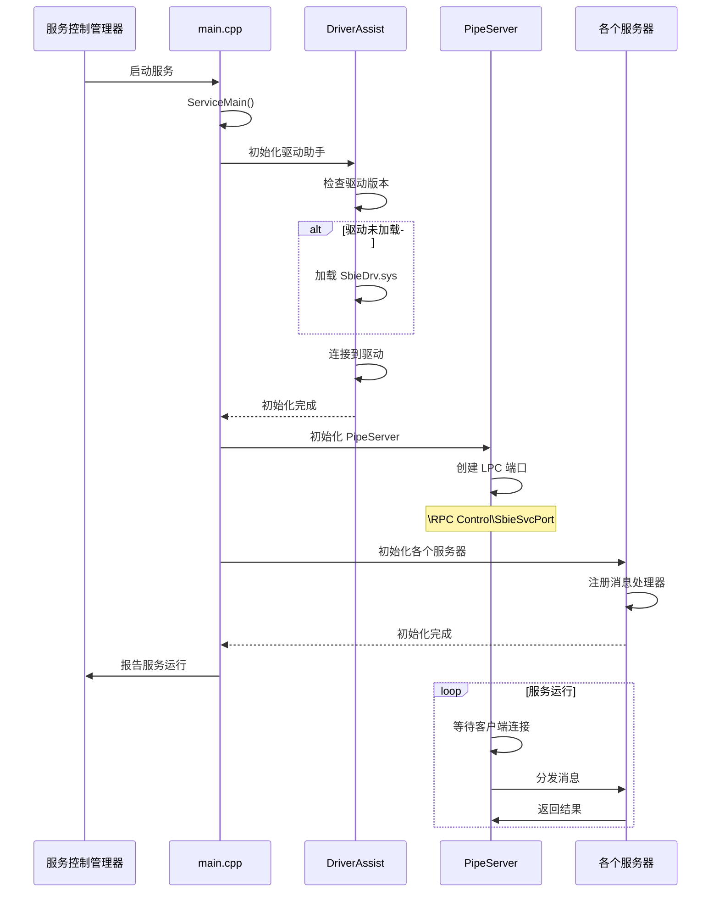
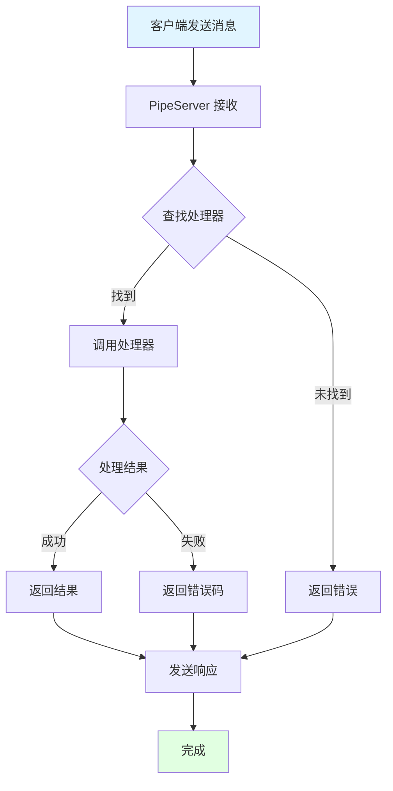
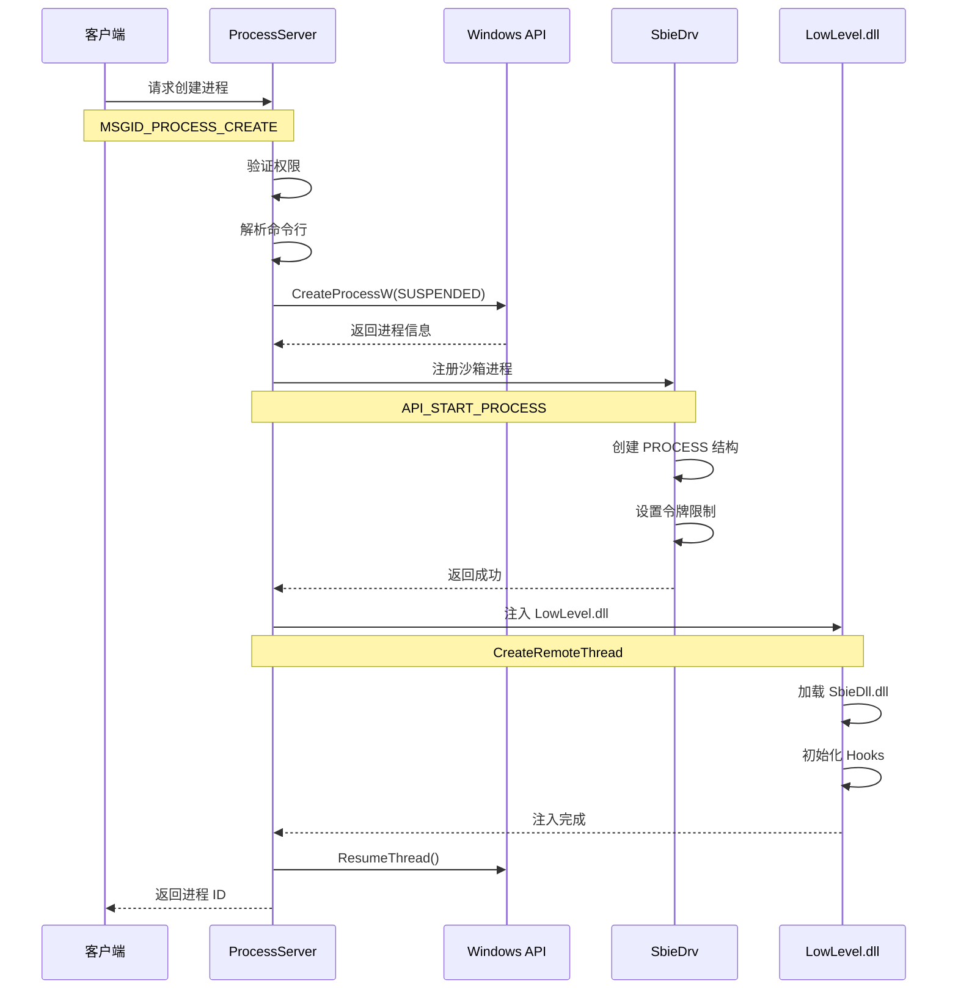
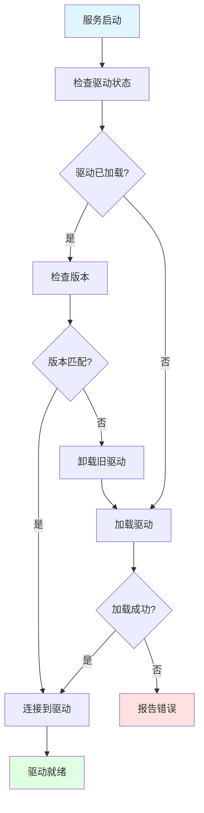
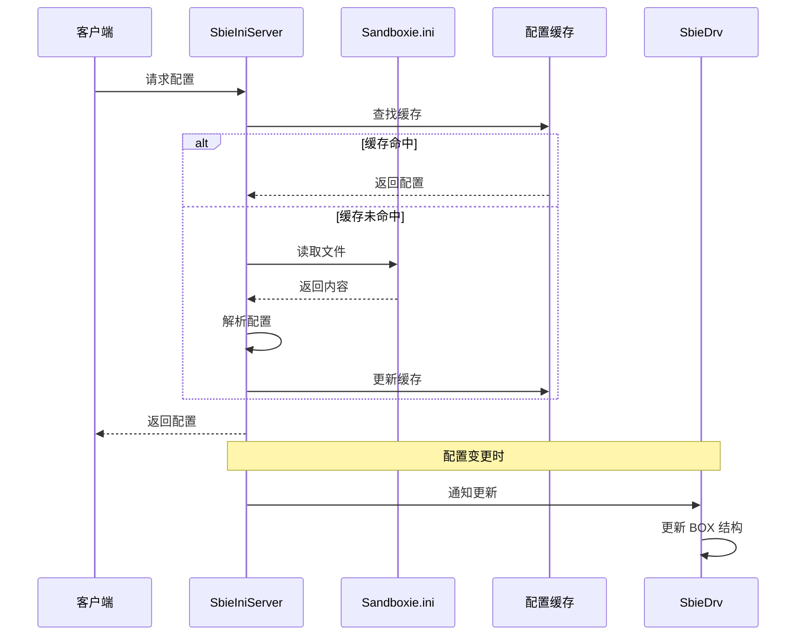

# Sandboxie 系统服务层完整分析

> 本文档详细分析 SbieSvc.exe 系统服务的架构、功能和实现

---

## 📋 目录

1. [服务概述](#服务概述)
2. [服务架构](#服务架构)
3. [核心服务器](#核心服务器)
4. [进程管理](#进程管理)
5. [驱动通信](#驱动通信)
6. [配置管理](#配置管理)
7. [网络代理](#网络代理)

---

## 服务概述

### 服务职责


### 服务特点

- **系统权限**：以 SYSTEM 账户运行
- **自动启动**：Windows 服务，开机自动启动
- **单实例**：每个系统只运行一个实例
- **多线程**：使用线程池处理请求
- **事件驱动**：基于消息和事件的架构

### 文件列表

**核心文件**（`Sandboxie/core/svc/`）：

| 文件 | 行数 | 功能 |
|------|------|------|
| main.cpp | ~500 | 服务入口和主循环 |
| PipeServer.cpp | ~800 | 通信框架 |
| ProcessServer.cpp | ~1500 | 进程服务器 |
| DriverAssist.cpp | ~1200 | 驱动助手 |
| sbieiniserver.cpp | ~1000 | 配置服务器 |
| fileserver.cpp | ~800 | 文件服务器 |
| GuiServer.cpp | ~600 | GUI 服务器 |
| iphlpserver.cpp | ~500 | 网络服务器 |
| comserver.cpp | ~1000 | COM 服务器 |
| **总计** | **~30,000** | |

---

## 服务架构

### 整体架构图



### 服务启动流程



---

## 核心服务器

### 1. PipeServer - 通信框架

**职责**：管理客户端连接和消息分发

#### 架构设计

```c++
class PipeServer {
private:
    // LPC 端口
    HANDLE m_port;
    
    // 客户端列表
    std::map<ULONG, ClientInfo*> m_clients;
    
    // 消息处理器映射
    std::map<ULONG, MessageHandler> m_handlers;
    
    // 工作线程
    std::vector<HANDLE> m_threads;
    
public:
    // 初始化
    NTSTATUS Initialize();
    
    // 注册消息处理器
    void RegisterHandler(ULONG msgid, MessageHandler handler);
    
    // 主循环
    void Run();
    
    // 处理消息
    NTSTATUS HandleMessage(SBIEINI_WIRE *msg);
};
```

#### 消息处理流程



#### 实现代码

```cpp
NTSTATUS PipeServer::Initialize()
{
    NTSTATUS status;
    OBJECT_ATTRIBUTES obj_attr;
    UNICODE_STRING port_name;
    
    // 1. 创建 LPC 端口
    RtlInitUnicodeString(&port_name, L"\\RPC Control\\SbieSvcPort");
    
    InitializeObjectAttributes(
        &obj_attr,
        &port_name,
        OBJ_CASE_INSENSITIVE,
        NULL,
        NULL);
    
    status = NtCreatePort(
        &m_port,
        &obj_attr,
        sizeof(SBIEINI_WIRE),
        sizeof(SBIEINI_WIRE),
        0);
    
    if (!NT_SUCCESS(status)) {
        return status;
    }
    
    // 2. 创建工作线程
    for (int i = 0; i < 4; i++) {
        HANDLE thread = CreateThread(
            NULL, 0,
            WorkerThreadProc,
            this,
            0, NULL);
        
        if (thread) {
            m_threads.push_back(thread);
        }
    }
    
    return STATUS_SUCCESS;
}

void PipeServer::Run()
{
    NTSTATUS status;
    SBIEINI_WIRE msg;
    
    while (true) {
        // 等待客户端连接或消息
        status = NtReplyWaitReceivePort(
            m_port,
            NULL,
            NULL,
            (PPORT_MESSAGE)&msg);
        
        if (!NT_SUCCESS(status)) {
            break;
        }
        
        // 处理消息
        HandleMessage(&msg);
    }
}

NTSTATUS PipeServer::HandleMessage(SBIEINI_WIRE *msg)
{
    NTSTATUS status;
    
    // 查找处理器
    auto it = m_handlers.find(msg->msgid);
    if (it == m_handlers.end()) {
        msg->status = STATUS_INVALID_PARAMETER;
        return STATUS_INVALID_PARAMETER;
    }
    
    // 调用处理器
    MessageHandler handler = it->second;
    status = handler(msg);
    
    msg->status = status;
    return status;
}
```

### 2. ProcessServer - 进程管理

**职责**：代理沙箱进程的创建和管理

#### 进程创建流程



#### 实现代码

```cpp
class ProcessServer {
public:
    NTSTATUS CreateProcess(
        const WCHAR *command_line,
        const WCHAR *box_name,
        ULONG *pid_out);
    
    NTSTATUS TerminateProcess(ULONG pid);
    
    NTSTATUS EnumProcesses(
        const WCHAR *box_name,
        ULONG *pids,
        ULONG *count);
    
private:
    NTSTATUS InjectDll(
        HANDLE process,
        HANDLE thread);
    
    NTSTATUS NotifyDriver(
        ULONG pid,
        const WCHAR *box_name);
};

NTSTATUS ProcessServer::CreateProcess(
    const WCHAR *command_line,
    const WCHAR *box_name,
    ULONG *pid_out)
{
    STARTUPINFOW si = {0};
    PROCESS_INFORMATION pi = {0};
    NTSTATUS status;
    BOOL ok;
    
    si.cb = sizeof(si);
    
    // 1. 创建挂起的进程
    ok = CreateProcessW(
        NULL,
        (LPWSTR)command_line,
        NULL, NULL,
        FALSE,
        CREATE_SUSPENDED | CREATE_UNICODE_ENVIRONMENT,
        NULL, NULL,
        &si, &pi);
    
    if (!ok) {
        return STATUS_UNSUCCESSFUL;
    }
    
    // 2. 通知驱动
    status = NotifyDriver(pi.dwProcessId, box_name);
    if (!NT_SUCCESS(status)) {
        TerminateProcess(pi.hProcess, 0);
        CloseHandle(pi.hProcess);
        CloseHandle(pi.hThread);
        return status;
    }
    
    // 3. 注入 DLL
    status = InjectDll(pi.hProcess, pi.hThread);
    if (!NT_SUCCESS(status)) {
        TerminateProcess(pi.hProcess, 0);
        CloseHandle(pi.hProcess);
        CloseHandle(pi.hThread);
        return status;
    }
    
    // 4. 恢复进程
    ResumeThread(pi.hThread);
    
    // 5. 返回进程 ID
    *pid_out = pi.dwProcessId;
    
    CloseHandle(pi.hProcess);
    CloseHandle(pi.hThread);
    
    return STATUS_SUCCESS;
}

NTSTATUS ProcessServer::InjectDll(
    HANDLE process,
    HANDLE thread)
{
    WCHAR dll_path[MAX_PATH];
    PVOID remote_buffer = NULL;
    HANDLE remote_thread = NULL;
    NTSTATUS status;
    
    // 1. 获取 LowLevel.dll 路径
    GetModuleFileNameW(NULL, dll_path, MAX_PATH);
    PathRemoveFileSpecW(dll_path);
    PathAppendW(dll_path, L"LowLevel.dll");
    
    // 2. 在目标进程中分配内存
    SIZE_T buffer_size = (wcslen(dll_path) + 1) * sizeof(WCHAR);
    remote_buffer = VirtualAllocEx(
        process,
        NULL,
        buffer_size,
        MEM_COMMIT | MEM_RESERVE,
        PAGE_READWRITE);
    
    if (!remote_buffer) {
        return STATUS_INSUFFICIENT_RESOURCES;
    }
    
    // 3. 写入 DLL 路径
    if (!WriteProcessMemory(
        process,
        remote_buffer,
        dll_path,
        buffer_size,
        NULL)) {
        VirtualFreeEx(process, remote_buffer, 0, MEM_RELEASE);
        return STATUS_UNSUCCESSFUL;
    }
    
    // 4. 创建远程线程加载 DLL
    remote_thread = CreateRemoteThread(
        process,
        NULL, 0,
        (LPTHREAD_START_ROUTINE)LoadLibraryW,
        remote_buffer,
        0, NULL);
    
    if (!remote_thread) {
        VirtualFreeEx(process, remote_buffer, 0, MEM_RELEASE);
        return STATUS_UNSUCCESSFUL;
    }
    
    // 5. 等待加载完成
    WaitForSingleObject(remote_thread, INFINITE);
    
    CloseHandle(remote_thread);
    VirtualFreeEx(process, remote_buffer, 0, MEM_RELEASE);
    
    return STATUS_SUCCESS;
}
```

### 3. DriverAssist - 驱动助手

**职责**：管理驱动的加载、卸载和通信

#### 驱动管理流程



#### 实现代码

```cpp
class DriverAssist {
public:
    NTSTATUS Initialize();
    NTSTATUS LoadDriver();
    NTSTATUS UnloadDriver();
    NTSTATUS ConnectToDriver();
    
    NTSTATUS SendIoctl(
        ULONG ioctl_code,
        PVOID input_buffer,
        ULONG input_length,
        PVOID output_buffer,
        ULONG output_length);
    
private:
    HANDLE m_driver_handle;
    ULONG m_driver_version;
    ULONG m_abi_version;
};

NTSTATUS DriverAssist::Initialize()
{
    NTSTATUS status;
    
    // 1. 检查驱动是否已加载
    status = ConnectToDriver();
    if (NT_SUCCESS(status)) {
        // 驱动已加载，检查版本
        ULONG driver_version = 0;
        status = QueryDriverVersion(&driver_version);
        
        if (NT_SUCCESS(status)) {
            if (driver_version == EXPECTED_VERSION) {
                return STATUS_SUCCESS;
            }
            else {
                // 版本不匹配，卸载旧驱动
                UnloadDriver();
            }
        }
    }
    
    // 2. 加载驱动
    status = LoadDriver();
    if (!NT_SUCCESS(status)) {
        return status;
    }
    
    // 3. 连接到驱动
    status = ConnectToDriver();
    return status;
}

NTSTATUS DriverAssist::LoadDriver()
{
    SC_HANDLE scm = NULL;
    SC_HANDLE service = NULL;
    NTSTATUS status;
    WCHAR driver_path[MAX_PATH];
    
    // 1. 获取驱动路径
    GetModuleFileNameW(NULL, driver_path, MAX_PATH);
    PathRemoveFileSpecW(driver_path);
    PathAppendW(driver_path, L"SbieDrv.sys");
    
    // 2. 打开服务控制管理器
    scm = OpenSCManagerW(NULL, NULL, SC_MANAGER_ALL_ACCESS);
    if (!scm) {
        return STATUS_UNSUCCESSFUL;
    }
    
    // 3. 创建服务
    service = CreateServiceW(
        scm,
        L"SbieDrv",
        L"Sandboxie Driver",
        SERVICE_ALL_ACCESS,
        SERVICE_KERNEL_DRIVER,
        SERVICE_DEMAND_START,
        SERVICE_ERROR_NORMAL,
        driver_path,
        NULL, NULL, NULL, NULL, NULL);
    
    if (!service) {
        // 服务可能已存在
        service = OpenServiceW(scm, L"SbieDrv", SERVICE_ALL_ACCESS);
        if (!service) {
            CloseServiceHandle(scm);
            return STATUS_UNSUCCESSFUL;
        }
    }
    
    // 4. 启动服务
    if (!StartServiceW(service, 0, NULL)) {
        DWORD error = GetLastError();
        if (error != ERROR_SERVICE_ALREADY_RUNNING) {
            CloseServiceHandle(service);
            CloseServiceHandle(scm);
            return STATUS_UNSUCCESSFUL;
        }
    }
    
    CloseServiceHandle(service);
    CloseServiceHandle(scm);
    
    return STATUS_SUCCESS;
}

NTSTATUS DriverAssist::ConnectToDriver()
{
    OBJECT_ATTRIBUTES obj_attr;
    UNICODE_STRING device_name;
    IO_STATUS_BLOCK iosb;
    NTSTATUS status;
    
    // 打开驱动设备
    RtlInitUnicodeString(&device_name, L"\\Device\\SandboxieDriverApi");
    
    InitializeObjectAttributes(
        &obj_attr,
        &device_name,
        OBJ_CASE_INSENSITIVE,
        NULL,
        NULL);
    
    status = NtOpenFile(
        &m_driver_handle,
        FILE_GENERIC_READ | FILE_GENERIC_WRITE,
        &obj_attr,
        &iosb,
        FILE_SHARE_READ | FILE_SHARE_WRITE,
        0);
    
    return status;
}
```

---

## 配置管理

### SbieIniServer - 配置服务器

**职责**：管理 Sandboxie.ini 的读写和缓存

#### 配置文件结构

```ini
[GlobalSettings]
FileRootPath=C:\Sandbox\%USER%\%SANDBOX%
IpcRootPath=\Sandbox\%USER%\%SANDBOX%\Session_%SESSION%
KeyRootPath=\REGISTRY\USER\Sandbox_%USER%_%SANDBOX%

[DefaultBox]
Enabled=y
AutoDelete=n

# 文件规则
OpenFilePath=%AppData%
ClosedFilePath=!<pipe>,\\Device\\Afd
ReadFilePath=%SystemRoot%

# 注册表规则
OpenKeyPath=HKEY_CURRENT_USER\Software\Classes
ClosedKeyPath=HKEY_LOCAL_MACHINE\System

# IPC 规则
OpenIpcPath=*
ClosedIpcPath=SbieSvcPort

# 模板
Template=Firefox
Template=Chrome
```

#### 配置读取流程



继续阅读更多内容...

---

**文档版本**：1.0  
**最后更新**：2026-03-05
