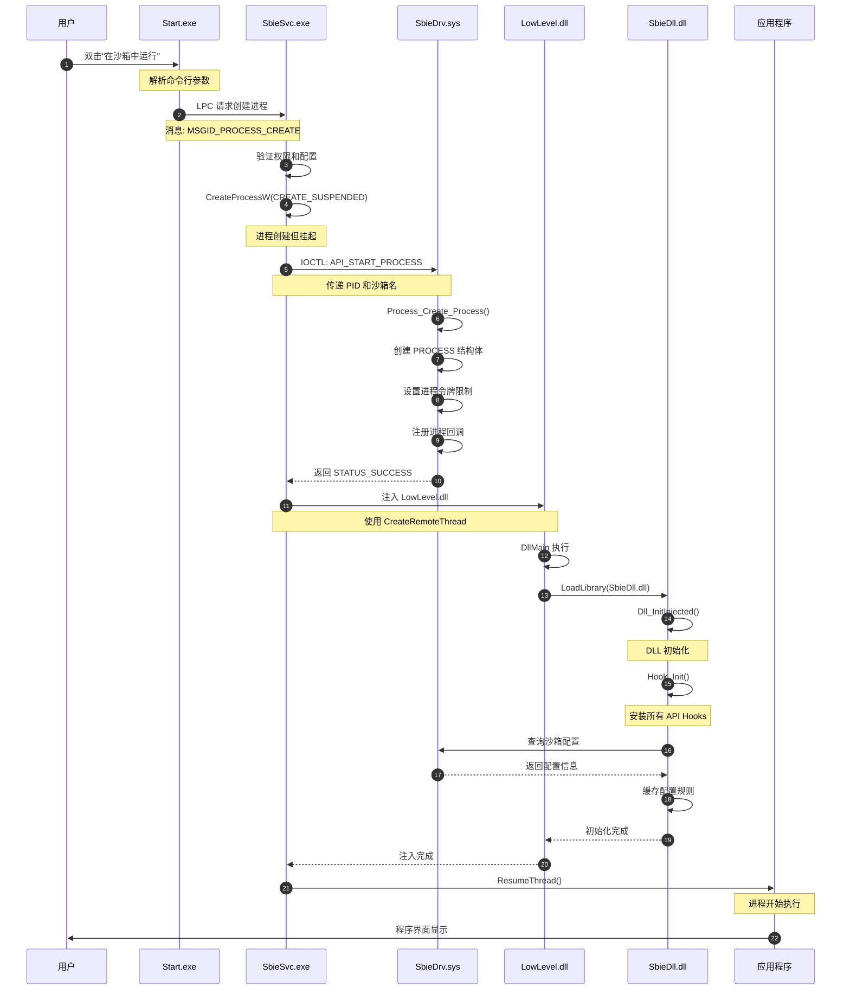
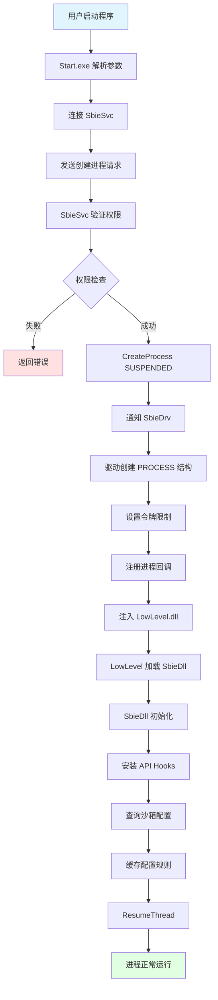
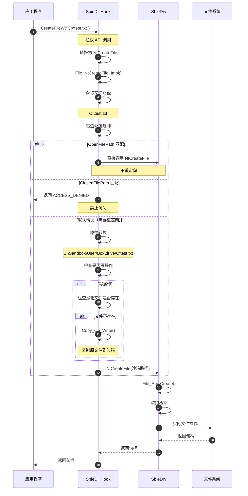
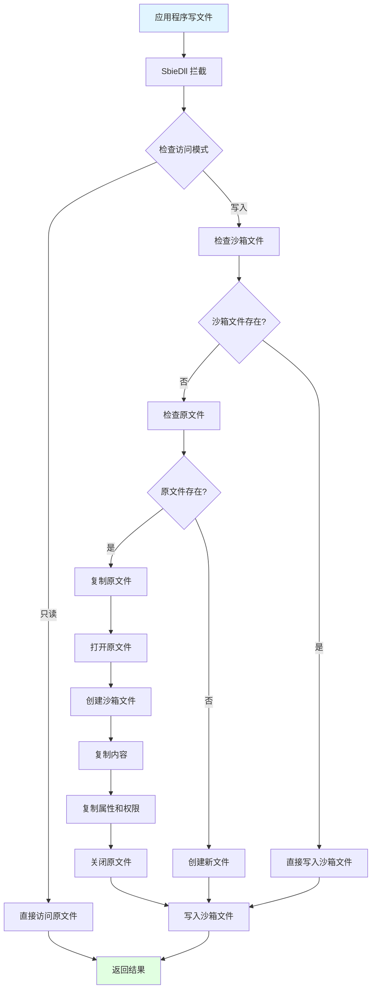
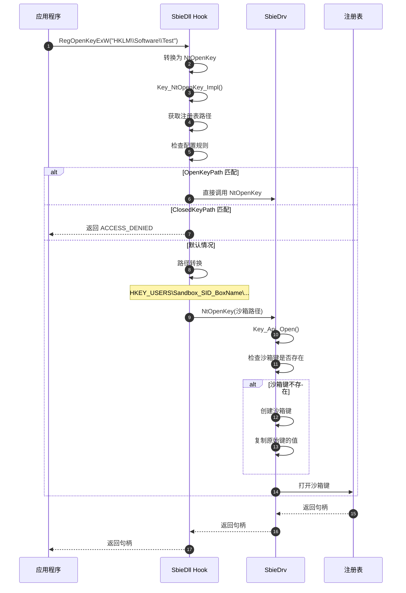
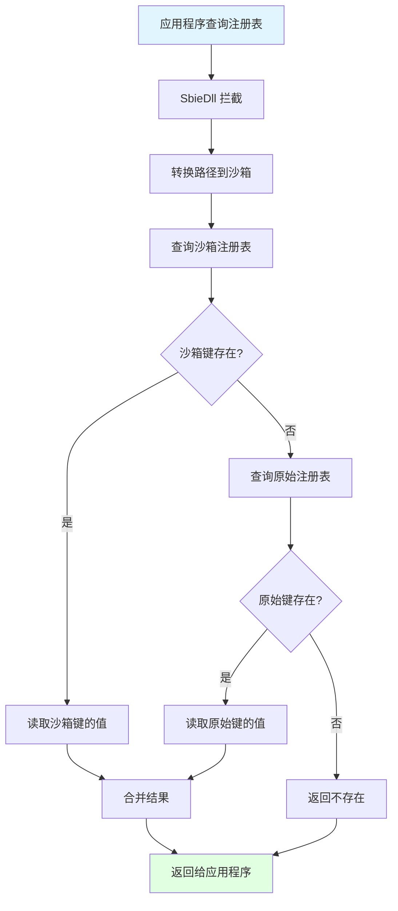

# Sandboxie 核心流程详解

> 本文档通过详细的时序图和流程图，深入解析 Sandboxie 的核心执行流程

---

## 📋 目录

1. [进程启动流程](#进程启动流程)
2. [文件操作流程](#文件操作流程)
3. [注册表操作流程](#注册表操作流程)
4. [进程间通信流程](#进程间通信流程)
5. [网络访问流程](#网络访问流程)
6. [配置更新流程](#配置更新流程)
7. [快照和恢复流程](#快照和恢复流程)

---

## 进程启动流程

### 完整时序图



### 详细步骤说明

#### 步骤 1-2：用户触发启动

**位置**：`apps/start/start.cpp`

```cpp
int _tmain(int argc, TCHAR *argv[])
{
    // 解析命令行
    // 格式: Start.exe /box:BoxName program.exe args
    
    WCHAR *box_name = NULL;
    WCHAR *command_line = NULL;
    
    Parse_Command_Line(argc, argv, &box_name, &command_line);
    
    // 连接到服务
    HANDLE port = Connect_To_Service();
    
    // 发送创建进程请求
    Send_Create_Process_Request(port, box_name, command_line);
    
    return 0;
}
```

#### 步骤 3-5：服务创建进程

**位置**：`core/svc/ProcessServer.cpp`

```cpp
NTSTATUS ProcessServer::CreateProcess(
    const WCHAR *command_line,
    const WCHAR *box_name)
{
    STARTUPINFO si = {0};
    PROCESS_INFORMATION pi = {0};
    
    si.cb = sizeof(si);
    
    // 1. 创建挂起的进程
    BOOL ok = CreateProcessW(
        NULL,
        command_line,
        NULL, NULL,
        FALSE,
        CREATE_SUSPENDED,  // 关键：挂起状态
        NULL, NULL,
        &si, &pi);
    
    if (!ok) {
        return STATUS_UNSUCCESSFUL;
    }
    
    // 2. 通知驱动
    NTSTATUS status = NotifyDriver(pi.dwProcessId, box_name);
    if (!NT_SUCCESS(status)) {
        TerminateProcess(pi.hProcess, 0);
        return status;
    }
    
    // 3. 注入 DLL
    status = InjectDll(pi.hProcess, pi.hThread);
    if (!NT_SUCCESS(status)) {
        TerminateProcess(pi.hProcess, 0);
        return status;
    }
    
    // 4. 恢复进程
    ResumeThread(pi.hThread);
    
    CloseHandle(pi.hThread);
    CloseHandle(pi.hProcess);
    
    return STATUS_SUCCESS;
}
```

#### 步骤 6-9：驱动注册进程

**位置**：`core/drv/process.c`

```c
NTSTATUS Process_Create_Process(
    ULONG pid,
    const WCHAR *box_name)
{
    PROCESS *proc = NULL;
    BOX *box = NULL;
    NTSTATUS status;
    
    // 1. 查找沙箱
    box = Box_Find(box_name);
    if (!box) {
        return STATUS_OBJECT_NAME_NOT_FOUND;
    }
    
    // 2. 分配 PROCESS 结构
    proc = ExAllocatePoolWithTag(
        NonPagedPool,
        sizeof(PROCESS),
        'corP');
    
    if (!proc) {
        return STATUS_INSUFFICIENT_RESOURCES;
    }
    
    // 3. 初始化结构
    memset(proc, 0, sizeof(PROCESS));
    proc->pid = pid;
    proc->box = box;
    proc->is_sandboxed = TRUE;
    proc->session_id = box->session_id;
    
    // 4. 打开进程对象
    status = PsLookupProcessByProcessId(
        (HANDLE)(ULONG_PTR)pid,
        &proc->process_object);
    
    if (!NT_SUCCESS(status)) {
        ExFreePoolWithTag(proc, 'corP');
        return status;
    }
    
    // 5. 设置令牌限制
    status = Token_Restrict_Process(proc);
    
    // 6. 添加到全局链表
    ExAcquireResourceExclusiveLite(&Process_ListLock, TRUE);
    InsertTailList(&Process_List, &proc->list_entry);
    InsertTailList(&box->processes, &proc->box_entry);
    ExReleaseResourceLite(&Process_ListLock);
    
    return STATUS_SUCCESS;
}
```

#### 步骤 10-15：DLL 注入和初始化

**位置**：`core/dll/dll.c`

```c
BOOLEAN Dll_InitInjected(HINSTANCE hInstance)
{
    NTSTATUS status;
    
    // 1. 保存 DLL 句柄
    Dll_Instance = hInstance;
    
    // 2. 初始化 Hook 框架
    status = Hook_Init();
    if (!NT_SUCCESS(status)) {
        return FALSE;
    }
    
    // 3. 查询沙箱信息
    status = SbieApi_QueryProcess(
        GetCurrentProcessId(),
        Dll_BoxName,
        NULL, NULL, NULL);
    
    if (!NT_SUCCESS(status)) {
        return FALSE;
    }
    
    // 4. 查询沙箱配置
    status = SbieApi_QueryConf(
        Dll_BoxName,
        &Dll_BoxConfig);
    
    // 5. 安装各模块的 Hooks
    File_Init();      // 文件系统 Hooks
    Key_Init();       // 注册表 Hooks
    Proc_Init();      // 进程 Hooks
    Ipc_Init();       // IPC Hooks
    Gui_Init();       // GUI Hooks
    Net_Init();       // 网络 Hooks
    
    return TRUE;
}
```

### 进程启动流程图



---

## 文件操作流程

### 文件创建/打开时序图



### 写时复制（Copy-on-Write）流程



### 文件操作代码示例

**位置**：`core/dll/file.c`

```c
NTSTATUS File_NtCreateFile_Impl(
    HANDLE *FileHandle,
    ACCESS_MASK DesiredAccess,
    OBJECT_ATTRIBUTES *ObjectAttributes,
    IO_STATUS_BLOCK *IoStatusBlock,
    LARGE_INTEGER *AllocationSize,
    ULONG FileAttributes,
    ULONG ShareAccess,
    ULONG CreateDisposition,
    ULONG CreateOptions,
    void *EaBuffer,
    ULONG EaLength)
{
    NTSTATUS status;
    WCHAR *path = NULL;
    WCHAR *sandbox_path = NULL;
    BOOLEAN should_redirect = FALSE;
    
    // 1. 获取文件路径
    path = File_GetPath(ObjectAttributes);
    if (!path) {
        return __sys_NtCreateFile(
            FileHandle, DesiredAccess, ObjectAttributes,
            IoStatusBlock, AllocationSize, FileAttributes,
            ShareAccess, CreateDisposition, CreateOptions,
            EaBuffer, EaLength);
    }
    
    // 2. 检查规则
    if (File_MatchPath(path, L"OpenFilePath")) {
        // 允许直接访问
        should_redirect = FALSE;
    }
    else if (File_MatchPath(path, L"ClosedFilePath")) {
        // 禁止访问
        Dll_Free(path);
        return STATUS_ACCESS_DENIED;
    }
    else {
        // 需要重定向
        should_redirect = TRUE;
    }
    
    // 3. 路径转换
    if (should_redirect) {
        sandbox_path = File_TranslatePath(path);
        
        // 4. 写时复制
        if (DesiredAccess & (FILE_WRITE_DATA | FILE_APPEND_DATA)) {
            File_CopyOnWrite(path, sandbox_path);
        }
        
        // 5. 更新路径
        File_UpdateObjectAttributes(ObjectAttributes, sandbox_path);
    }
    
    // 6. 调用原始函数
    status = __sys_NtCreateFile(
        FileHandle, DesiredAccess, ObjectAttributes,
        IoStatusBlock, AllocationSize, FileAttributes,
        ShareAccess, CreateDisposition, CreateOptions,
        EaBuffer, EaLength);
    
    // 7. 清理
    if (path) Dll_Free(path);
    if (sandbox_path) Dll_Free(sandbox_path);
    
    return status;
}
```

**写时复制实现**：

```c
NTSTATUS File_CopyOnWrite(
    const WCHAR *source_path,
    const WCHAR *target_path)
{
    HANDLE source_handle = NULL;
    HANDLE target_handle = NULL;
    NTSTATUS status;
    UCHAR buffer[4096];
    IO_STATUS_BLOCK iosb;
    
    // 1. 检查目标文件是否已存在
    if (File_Exists(target_path)) {
        return STATUS_SUCCESS;  // 已经复制过了
    }
    
    // 2. 检查源文件是否存在
    if (!File_Exists(source_path)) {
        return STATUS_SUCCESS;  // 源文件不存在，无需复制
    }
    
    // 3. 打开源文件
    status = File_Open(source_path, &source_handle, FILE_READ_DATA);
    if (!NT_SUCCESS(status)) {
        return status;
    }
    
    // 4. 创建目标文件
    status = File_Create(target_path, &target_handle, FILE_WRITE_DATA);
    if (!NT_SUCCESS(status)) {
        NtClose(source_handle);
        return status;
    }
    
    // 5. 复制内容
    while (TRUE) {
        status = NtReadFile(
            source_handle, NULL, NULL, NULL, &iosb,
            buffer, sizeof(buffer), NULL, NULL);
        
        if (status == STATUS_END_OF_FILE) {
            break;
        }
        
        if (!NT_SUCCESS(status)) {
            goto cleanup;
        }
        
        status = NtWriteFile(
            target_handle, NULL, NULL, NULL, &iosb,
            buffer, (ULONG)iosb.Information, NULL, NULL);
        
        if (!NT_SUCCESS(status)) {
            goto cleanup;
        }
    }
    
    // 6. 复制文件属性
    File_CopyAttributes(source_handle, target_handle);
    
    status = STATUS_SUCCESS;
    
cleanup:
    if (source_handle) NtClose(source_handle);
    if (target_handle) NtClose(target_handle);
    
    return status;
}
```

---

## 注册表操作流程

### 注册表打开时序图



### 注册表合并查询流程



继续阅读 [08-核心流程详解-续.md](08-核心流程详解-续.md) 了解更多流程...

---

**文档版本**：1.0  
**最后更新**：2026-03-05
