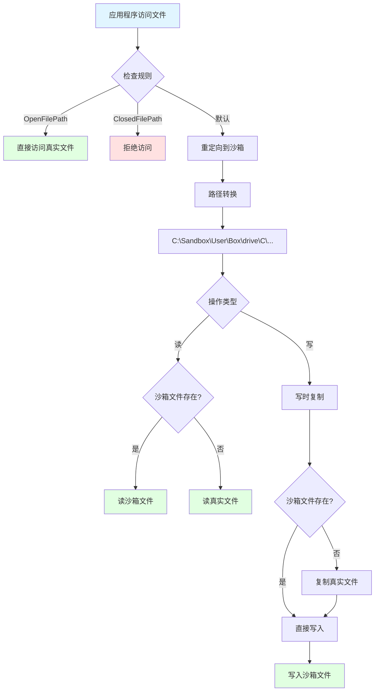
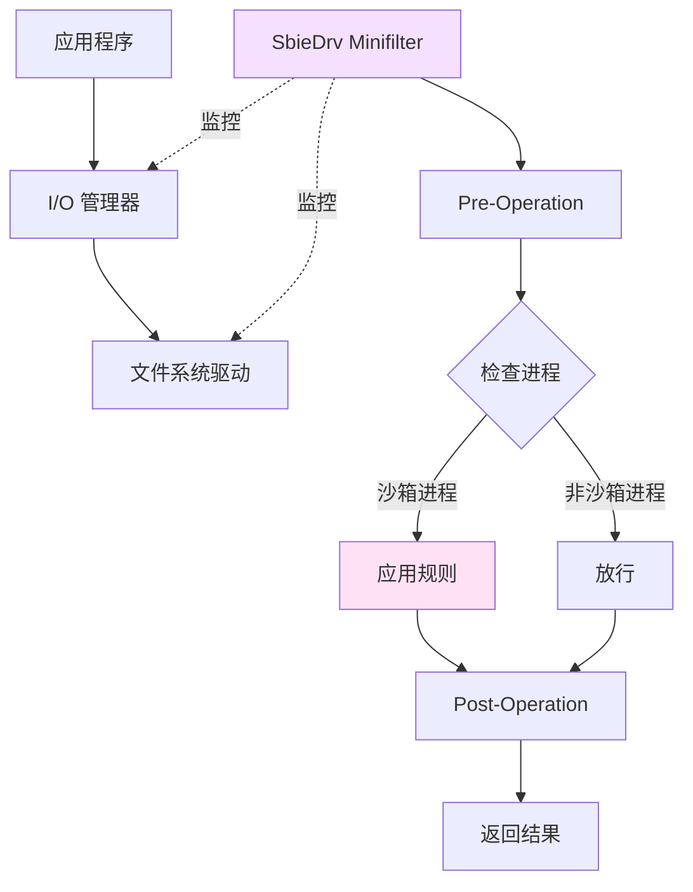
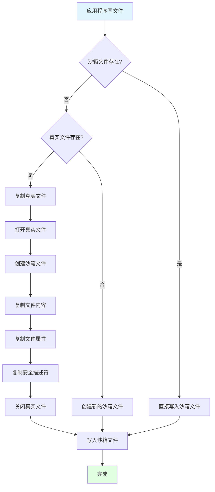

# Sandboxie 文件系统虚拟化深度分析

> 本文档详细分析文件系统虚拟化的实现机制，包括路径重定向、写时复制、规则匹配等

---

## 📋 目录

1. [文件系统虚拟化概述](#文件系统虚拟化概述)
2. [驱动层实现](#驱动层实现)
3. [DLL层实现](#dll层实现)
4. [路径转换机制](#路径转换机制)
5. [写时复制机制](#写时复制机制)
6. [规则匹配系统](#规则匹配系统)
7. [特殊文件处理](#特殊文件处理)

---

## 文件系统虚拟化概述

### 核心原理



### 文件路径映射

**真实路径 → 沙箱路径**：

```
真实路径：C:\Windows\System32\notepad.exe
沙箱路径：C:\Sandbox\UserName\DefaultBox\drive\C\Windows\System32\notepad.exe

真实路径：D:\Documents\test.txt
沙箱路径：C:\Sandbox\UserName\DefaultBox\drive\D\Documents\test.txt

真实路径：\\?\Volume{GUID}\file.dat
沙箱路径：C:\Sandbox\UserName\DefaultBox\drive\{GUID}\file.dat
```

### 涉及的文件

**驱动层**（`Sandboxie/core/drv/`）：
- `file.c` - 文件系统核心（~3000 行）
- `file_flt.c` - Minifilter 实现（~1500 行）
- `file_xlat.c` - 路径转换（~1000 行）
- `file_ctrl.c` - 控制操作（~800 行）
- `file_xp.c` - Windows XP 兼容（~500 行）

**DLL层**（`Sandboxie/core/dll/`）：
- `file.c` - 文件 API Hook（~2500 行）
- `file_dir.c` - 目录操作（~1200 行）
- `file_copy.c` - 写时复制（~800 行）
- `file_link.c` - 链接处理（~600 行）
- `file_pipe.c` - 命名管道（~500 行）

---

## 驱动层实现

### file.c - 核心功能

#### 关键数据结构

```c
// 文件对象
typedef struct _FILE {
    HANDLE handle;                      // 文件句柄
    UNICODE_STRING path;                // 文件路径
    PROCESS *process;                   // 所属进程
    ULONG access_mask;                  // 访问权限
    ULONG share_access;                 // 共享模式
    ULONG create_disposition;           // 创建方式
    ULONG create_options;               // 创建选项
    
    BOOLEAN is_boxed_path;              // 是否沙箱路径
    BOOLEAN is_open_path;               // 是否 OpenFilePath
    BOOLEAN is_closed_path;             // 是否 ClosedFilePath
    
    LIST_ENTRY list_entry;              // 链表节点
} FILE;

// 路径规则
typedef struct _FILE_PATH {
    WCHAR *path;                        // 路径模式
    ULONG path_len;                     // 路径长度
    BOOLEAN is_wildcard;                // 是否包含通配符
    LIST_ENTRY list_entry;              // 链表节点
} FILE_PATH;
```

#### 文件创建拦截

```c
NTSTATUS File_NtCreateFile(
    PROCESS *proc,
    SYSCALL_ENTRY *syscall_entry,
    ULONG_PTR *user_args)
{
    HANDLE *FileHandle;
    ACCESS_MASK DesiredAccess;
    OBJECT_ATTRIBUTES *ObjectAttributes;
    IO_STATUS_BLOCK *IoStatusBlock;
    LARGE_INTEGER *AllocationSize;
    ULONG FileAttributes;
    ULONG ShareAccess;
    ULONG CreateDisposition;
    ULONG CreateOptions;
    PVOID EaBuffer;
    ULONG EaLength;
    
    UNICODE_STRING *path = NULL;
    UNICODE_STRING *sandbox_path = NULL;
    NTSTATUS status;
    BOOLEAN should_redirect = FALSE;
    
    // 1. 提取参数
    FileHandle = (HANDLE *)user_args[0];
    DesiredAccess = (ACCESS_MASK)user_args[1];
    ObjectAttributes = (OBJECT_ATTRIBUTES *)user_args[2];
    IoStatusBlock = (IO_STATUS_BLOCK *)user_args[3];
    AllocationSize = (LARGE_INTEGER *)user_args[4];
    FileAttributes = (ULONG)user_args[5];
    ShareAccess = (ULONG)user_args[6];
    CreateDisposition = (ULONG)user_args[7];
    CreateOptions = (ULONG)user_args[8];
    EaBuffer = (PVOID)user_args[9];
    EaLength = (ULONG)user_args[10];
    
    // 2. 获取文件路径
    status = File_GetPath(ObjectAttributes, &path);
    if (!NT_SUCCESS(status)) {
        return status;
    }
    
    // 3. 检查规则
    if (File_MatchPath(proc->box, path, L"OpenFilePath")) {
        // 允许直接访问
        should_redirect = FALSE;
    }
    else if (File_MatchPath(proc->box, path, L"ClosedFilePath")) {
        // 禁止访问
        ExFreePool(path);
        return STATUS_ACCESS_DENIED;
    }
    else if (File_MatchPath(proc->box, path, L"ReadFilePath")) {
        // 只读访问
        if (DesiredAccess & (FILE_WRITE_DATA | FILE_APPEND_DATA)) {
            ExFreePool(path);
            return STATUS_ACCESS_DENIED;
        }
        should_redirect = FALSE;
    }
    else {
        // 默认重定向
        should_redirect = TRUE;
    }
    
    // 4. 路径转换
    if (should_redirect) {
        status = File_TranslatePath(proc->box, path, &sandbox_path);
        if (!NT_SUCCESS(status)) {
            ExFreePool(path);
            return status;
        }
        
        // 5. 写时复制
        if (DesiredAccess & (FILE_WRITE_DATA | FILE_APPEND_DATA)) {
            status = File_CopyOnWrite(path, sandbox_path);
            if (!NT_SUCCESS(status)) {
                ExFreePool(path);
                ExFreePool(sandbox_path);
                return status;
            }
        }
        
        // 6. 更新 ObjectAttributes
        File_UpdateObjectAttributes(ObjectAttributes, sandbox_path);
    }
    
    // 7. 调用原始系统调用
    status = Syscall_Invoke(syscall_entry, user_args);
    
    // 8. 清理
    if (path) ExFreePool(path);
    if (sandbox_path) ExFreePool(sandbox_path);
    
    return status;
}
```

#### 路径匹配算法

```c
BOOLEAN File_MatchPath(
    BOX *box,
    UNICODE_STRING *path,
    const WCHAR *setting_name)
{
    LIST_ENTRY *list_head;
    LIST_ENTRY *entry;
    FILE_PATH *file_path;
    
    // 1. 获取规则列表
    if (wcscmp(setting_name, L"OpenFilePath") == 0) {
        list_head = &box->open_file_paths;
    }
    else if (wcscmp(setting_name, L"ClosedFilePath") == 0) {
        list_head = &box->closed_file_paths;
    }
    else if (wcscmp(setting_name, L"ReadFilePath") == 0) {
        list_head = &box->read_file_paths;
    }
    else {
        return FALSE;
    }
    
    // 2. 遍历规则
    entry = list_head->Flink;
    while (entry != list_head) {
        file_path = CONTAINING_RECORD(entry, FILE_PATH, list_entry);
        
        // 3. 匹配路径
        if (file_path->is_wildcard) {
            // 通配符匹配
            if (File_MatchWildcard(path->Buffer, file_path->path)) {
                return TRUE;
            }
        }
        else {
            // 精确匹配或前缀匹配
            if (File_MatchPrefix(path->Buffer, file_path->path)) {
                return TRUE;
            }
        }
        
        entry = entry->Flink;
    }
    
    return FALSE;
}

// 通配符匹配
BOOLEAN File_MatchWildcard(
    const WCHAR *str,
    const WCHAR *pattern)
{
    while (*str && *pattern) {
        if (*pattern == L'*') {
            // 匹配任意字符
            pattern++;
            if (!*pattern) return TRUE;
            
            while (*str) {
                if (File_MatchWildcard(str, pattern)) {
                    return TRUE;
                }
                str++;
            }
            return FALSE;
        }
        else if (*pattern == L'?') {
            // 匹配单个字符
            pattern++;
            str++;
        }
        else if (towlower(*pattern) == towlower(*str)) {
            // 字符匹配（不区分大小写）
            pattern++;
            str++;
        }
        else {
            return FALSE;
        }
    }
    
    // 处理剩余的 *
    while (*pattern == L'*') {
        pattern++;
    }
    
    return (!*str && !*pattern);
}
```

### file_flt.c - Minifilter 实现

#### Minifilter 架构



#### Minifilter 回调

```c
// Pre-Create 回调
FLT_PREOP_CALLBACK_STATUS File_PreCreate(
    PFLT_CALLBACK_DATA Data,
    PCFLT_RELATED_OBJECTS FltObjects,
    PVOID *CompletionContext)
{
    PROCESS *proc;
    NTSTATUS status;
    UNICODE_STRING *path = NULL;
    
    // 1. 获取当前进程
    proc = Process_Find(PsGetCurrentProcessId());
    if (!proc || !proc->is_sandboxed) {
        // 非沙箱进程，放行
        return FLT_PREOP_SUCCESS_NO_CALLBACK;
    }
    
    // 2. 获取文件路径
    status = FltGetFileNameInformation(
        Data,
        FLT_FILE_NAME_NORMALIZED | FLT_FILE_NAME_QUERY_DEFAULT,
        &path);
    
    if (!NT_SUCCESS(status)) {
        return FLT_PREOP_SUCCESS_NO_CALLBACK;
    }
    
    // 3. 应用规则
    if (File_MatchPath(proc->box, path, L"ClosedFilePath")) {
        // 禁止访问
        Data->IoStatus.Status = STATUS_ACCESS_DENIED;
        FltReleaseFileNameInformation(path);
        return FLT_PREOP_COMPLETE;
    }
    
    // 4. 路径重定向在 DLL 层处理
    FltReleaseFileNameInformation(path);
    return FLT_PREOP_SUCCESS_NO_CALLBACK;
}

// Post-Create 回调
FLT_POSTOP_CALLBACK_STATUS File_PostCreate(
    PFLT_CALLBACK_DATA Data,
    PCFLT_RELATED_OBJECTS FltObjects,
    PVOID CompletionContext,
    FLT_POST_OPERATION_FLAGS Flags)
{
    // 记录文件访问日志
    if (NT_SUCCESS(Data->IoStatus.Status)) {
        Log_File_Access(
            PsGetCurrentProcessId(),
            Data->Iopb->TargetFileObject->FileName.Buffer,
            Data->Iopb->Parameters.Create.SecurityContext->DesiredAccess);
    }
    
    return FLT_POSTOP_FINISHED_PROCESSING;
}
```

---

## DLL层实现

### file.c - API Hook

#### Hook 的 API 列表

```c
// 需要 Hook 的文件 API
static const HOOK_ENTRY File_Hooks[] = {
    // Nt* 系列
    { "NtCreateFile", File_NtCreateFile },
    { "NtOpenFile", File_NtOpenFile },
    { "NtDeleteFile", File_NtDeleteFile },
    { "NtSetInformationFile", File_NtSetInformationFile },
    { "NtQueryInformationFile", File_NtQueryInformationFile },
    { "NtQueryDirectoryFile", File_NtQueryDirectoryFile },
    { "NtQueryVolumeInformationFile", File_NtQueryVolumeInformationFile },
    
    // Win32 API
    { "CreateFileW", File_CreateFileW },
    { "CreateFileA", File_CreateFileA },
    { "DeleteFileW", File_DeleteFileW },
    { "DeleteFileA", File_DeleteFileA },
    { "MoveFileW", File_MoveFileW },
    { "MoveFileA", File_MoveFileA },
    { "CopyFileW", File_CopyFileW },
    { "CopyFileA", File_CopyFileA },
    { "GetFileAttributesW", File_GetFileAttributesW },
    { "GetFileAttributesA", File_GetFileAttributesA },
    { "SetFileAttributesW", File_SetFileAttributesW },
    { "SetFileAttributesA", File_SetFileAttributesA },
    { "FindFirstFileW", File_FindFirstFileW },
    { "FindFirstFileA", File_FindFirstFileA },
    { "FindNextFileW", File_FindNextFileW },
    { "FindNextFileA", File_FindNextFileA },
    
    { NULL, NULL }
};
```

#### CreateFile Hook 实现

```c
HANDLE WINAPI File_CreateFileW(
    LPCWSTR lpFileName,
    DWORD dwDesiredAccess,
    DWORD dwShareMode,
    LPSECURITY_ATTRIBUTES lpSecurityAttributes,
    DWORD dwCreationDisposition,
    DWORD dwFlagsAndAttributes,
    HANDLE hTemplateFile)
{
    WCHAR *sandbox_path = NULL;
    HANDLE handle;
    BOOLEAN should_redirect = FALSE;
    
    // 1. 检查是否在沙箱中
    if (!Dll_IsBoxedProcess) {
        return __sys_CreateFileW(
            lpFileName, dwDesiredAccess, dwShareMode,
            lpSecurityAttributes, dwCreationDisposition,
            dwFlagsAndAttributes, hTemplateFile);
    }
    
    // 2. 规范化路径
    WCHAR normalized_path[MAX_PATH];
    if (!File_NormalizePath(lpFileName, normalized_path, MAX_PATH)) {
        SetLastError(ERROR_INVALID_NAME);
        return INVALID_HANDLE_VALUE;
    }
    
    // 3. 检查规则
    if (File_CheckOpenPath(normalized_path)) {
        // OpenFilePath - 直接访问
        should_redirect = FALSE;
    }
    else if (File_CheckClosedPath(normalized_path)) {
        // ClosedFilePath - 拒绝访问
        SetLastError(ERROR_ACCESS_DENIED);
        return INVALID_HANDLE_VALUE;
    }
    else if (File_CheckReadPath(normalized_path)) {
        // ReadFilePath - 只读
        if (dwDesiredAccess & (GENERIC_WRITE | FILE_WRITE_DATA)) {
            SetLastError(ERROR_ACCESS_DENIED);
            return INVALID_HANDLE_VALUE;
        }
        should_redirect = FALSE;
    }
    else {
        // 默认重定向
        should_redirect = TRUE;
    }
    
    // 4. 路径转换
    if (should_redirect) {
        sandbox_path = File_TranslatePathForDll(normalized_path);
        if (!sandbox_path) {
            SetLastError(ERROR_NOT_ENOUGH_MEMORY);
            return INVALID_HANDLE_VALUE;
        }
        
        // 5. 写时复制
        if (dwDesiredAccess & (GENERIC_WRITE | FILE_WRITE_DATA)) {
            File_CopyOnWriteForDll(normalized_path, sandbox_path);
        }
        
        lpFileName = sandbox_path;
    }
    
    // 6. 调用原始 API
    handle = __sys_CreateFileW(
        lpFileName, dwDesiredAccess, dwShareMode,
        lpSecurityAttributes, dwCreationDisposition,
        dwFlagsAndAttributes, hTemplateFile);
    
    // 7. 清理
    if (sandbox_path) {
        Dll_Free(sandbox_path);
    }
    
    return handle;
}
```

---

## 路径转换机制

### 转换规则

```c
// 路径转换函数
WCHAR* File_TranslatePath(const WCHAR *real_path)
{
    WCHAR *sandbox_path;
    WCHAR drive_letter;
    const WCHAR *path_after_drive;
    
    // 1. 分配缓冲区
    // 格式: C:\Sandbox\User\Box\drive\X\...
    sandbox_path = Dll_Alloc(
        (wcslen(Dll_BoxFilePath) + wcslen(real_path) + 20) * sizeof(WCHAR));
    
    if (!sandbox_path) {
        return NULL;
    }
    
    // 2. 处理不同类型的路径
    if (real_path[0] && real_path[1] == L':') {
        // 驱动器路径: C:\path\file.txt
        drive_letter = towlower(real_path[0]);
        path_after_drive = real_path + 2;
        
        swprintf(sandbox_path,
            L"%s\\drive\\%c%s",
            Dll_BoxFilePath,
            drive_letter,
            path_after_drive);
    }
    else if (wcsncmp(real_path, L"\\\\?\\", 4) == 0) {
        // 扩展路径: \\?\C:\path\file.txt
        if (real_path[4] && real_path[5] == L':') {
            drive_letter = towlower(real_path[4]);
            path_after_drive = real_path + 6;
            
            swprintf(sandbox_path,
                L"%s\\drive\\%c%s",
                Dll_BoxFilePath,
                drive_letter,
                path_after_drive);
        }
        else if (wcsncmp(real_path + 4, L"Volume{", 7) == 0) {
            // 卷 GUID: \\?\Volume{GUID}\path
            const WCHAR *guid_start = real_path + 11;
            const WCHAR *guid_end = wcschr(guid_start, L'}');
            
            if (guid_end) {
                WCHAR guid[40];
                wcsncpy(guid, guid_start, guid_end - guid_start);
                guid[guid_end - guid_start] = 0;
                
                swprintf(sandbox_path,
                    L"%s\\drive\\{%s}%s",
                    Dll_BoxFilePath,
                    guid,
                    guid_end + 1);
            }
        }
    }
    else if (wcsncmp(real_path, L"\\\\", 2) == 0) {
        // UNC 路径: \\server\share\path
        swprintf(sandbox_path,
            L"%s\\share%s",
            Dll_BoxFilePath,
            real_path + 1);  // 保留一个 \
    }
    else {
        // 相对路径或其他
        swprintf(sandbox_path,
            L"%s\\other%s",
            Dll_BoxFilePath,
            real_path);
    }
    
    return sandbox_path;
}
```

### 路径转换示例

```
输入: C:\Windows\System32\notepad.exe
输出: C:\Sandbox\User\Box\drive\c\Windows\System32\notepad.exe

输入: D:\Documents\test.txt
输出: C:\Sandbox\User\Box\drive\d\Documents\test.txt

输入: \\?\C:\Program Files\app.exe
输出: C:\Sandbox\User\Box\drive\c\Program Files\app.exe

输入: \\?\Volume{12345678-1234-1234-1234-123456789012}\file.dat
输出: C:\Sandbox\User\Box\drive\{12345678-1234-1234-1234-123456789012}\file.dat

输入: \\server\share\folder\file.txt
输出: C:\Sandbox\User\Box\share\server\share\folder\file.txt
```

---

## 写时复制机制

### 实现原理



### 写时复制代码

```c
NTSTATUS File_CopyOnWrite(
    const WCHAR *real_path,
    const WCHAR *sandbox_path)
{
    HANDLE real_handle = NULL;
    HANDLE sandbox_handle = NULL;
    NTSTATUS status;
    UCHAR buffer[4096];
    IO_STATUS_BLOCK iosb;
    FILE_BASIC_INFORMATION basic_info;
    FILE_STANDARD_INFORMATION std_info;
    
    // 1. 检查沙箱文件是否已存在
    if (File_Exists(sandbox_path)) {
        return STATUS_SUCCESS;  // 已经复制过了
    }
    
    // 2. 检查真实文件是否存在
    if (!File_Exists(real_path)) {
        return STATUS_SUCCESS;  // 真实文件不存在，无需复制
    }
    
    // 3. 打开真实文件
    status = File_OpenForRead(real_path, &real_handle);
    if (!NT_SUCCESS(status)) {
        return status;
    }
    
    // 4. 获取文件信息
    status = NtQueryInformationFile(
        real_handle,
        &iosb,
        &std_info,
        sizeof(std_info),
        FileStandardInformation);
    
    if (!NT_SUCCESS(status)) {
        NtClose(real_handle);
        return status;
    }
    
    // 5. 创建沙箱目录
    File_CreateDirectoryPath(sandbox_path);
    
    // 6. 创建沙箱文件
    status = File_CreateForWrite(sandbox_path, &sandbox_handle);
    if (!NT_SUCCESS(status)) {
        NtClose(real_handle);
        return status;
    }
    
    // 7. 复制文件内容
    LARGE_INTEGER offset = {0};
    while (TRUE) {
        status = NtReadFile(
            real_handle,
            NULL, NULL, NULL,
            &iosb,
            buffer,
            sizeof(buffer),
            &offset,
            NULL);
        
        if (status == STATUS_END_OF_FILE) {
            break;
        }
        
        if (!NT_SUCCESS(status)) {
            goto cleanup;
        }
        
        status = NtWriteFile(
            sandbox_handle,
            NULL, NULL, NULL,
            &iosb,
            buffer,
            (ULONG)iosb.Information,
            &offset,
            NULL);
        
        if (!NT_SUCCESS(status)) {
            goto cleanup;
        }
        
        offset.QuadPart += iosb.Information;
    }
    
    // 8. 复制文件属性
    status = NtQueryInformationFile(
        real_handle,
        &iosb,
        &basic_info,
        sizeof(basic_info),
        FileBasicInformation);
    
    if (NT_SUCCESS(status)) {
        NtSetInformationFile(
            sandbox_handle,
            &iosb,
            &basic_info,
            sizeof(basic_info),
            FileBasicInformation);
    }
    
    // 9. 复制安全描述符
    File_CopySecurityDescriptor(real_handle, sandbox_handle);
    
    status = STATUS_SUCCESS;
    
cleanup:
    if (real_handle) NtClose(real_handle);
    if (sandbox_handle) NtClose(sandbox_handle);
    
    // 如果失败，删除部分复制的文件
    if (!NT_SUCCESS(status)) {
        File_Delete(sandbox_path);
    }
    
    return status;
}
```

---

继续阅读更多内容...

**文档版本**：1.0  
**最后更新**：2026-03-05
