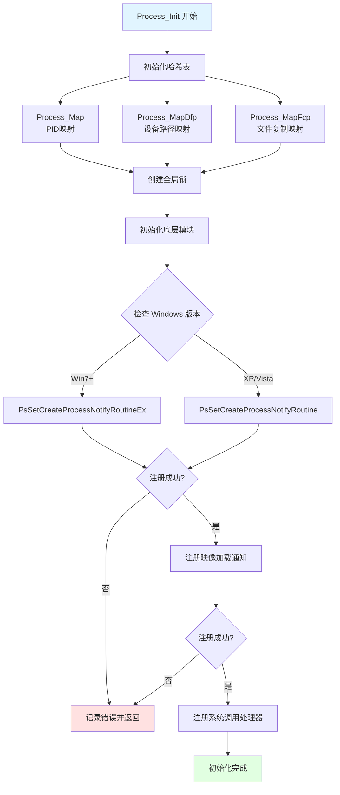
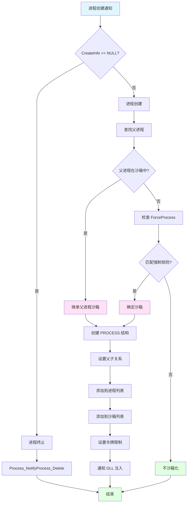

# Sandboxie 进程管理深度剖析

> 本文档基于真实源码，深度剖析进程管理的每个细节

---

## 📋 目录

1. [进程管理概述](#进程管理概述)
2. [数据结构详解](#数据结构详解)
3. [初始化流程](#初始化流程)
4. [进程创建监控](#进程创建监控)
5. [进程注册机制](#进程注册机制)
6. [令牌限制](#令牌限制)
7. [进程生命周期](#进程生命周期)
8. [关键函数详解](#关键函数详解)

---

## 进程管理概述

### 核心文件

**位置**：`Sandboxie/core/drv/process.c`（约 3000 行）

**依赖文件**：
```c
#include "process.h"      // 进程结构定义
#include "util.h"         // 工具函数
#include "conf.h"         // 配置管理
#include "key.h"          // 注册表
#include "file.h"         // 文件系统
#include "ipc.h"          // IPC
#include "api.h"          // API 接口
#include "dll.h"          // DLL 注入
#include "hook.h"         // Hook 框架
#include "session.h"      // 会话管理
#include "gui.h"          // GUI
#include "token.h"        // 令牌管理
#include "thread.h"       // 线程管理
#include "wfp.h"          // 网络过滤
#include "verify.h"       // 签名验证
#include "dyn_data.h"     // 动态数据
```

### 全局变量

```c
// 进程映射表（PID → PROCESS*）
HASH_MAP Process_Map;

// DFP 映射表（Device File Path）
HASH_MAP Process_MapDfp;

// FCP 映射表（File Copy Path）
HASH_MAP Process_MapFcp;

// 进程列表锁
PERESOURCE Process_ListLock = NULL;

// 通知例程安装标志
static BOOLEAN Process_NotifyImageInstalled = FALSE;
static BOOLEAN Process_NotifyProcessInstalled = FALSE;

// 就绪标志
volatile BOOLEAN Process_ReadyToSandbox = FALSE;
```

---

## 数据结构详解

### PROCESS 结构体

**完整定义**（`process.h`）：

```c
typedef struct _PROCESS {
    // ==================== 基本信息 ====================
    ULONG pid;                          // 进程 ID
    HANDLE process_id;                  // 进程句柄（HANDLE 形式）
    PEPROCESS process_object;           // 进程对象指针（EPROCESS*）
    UNICODE_STRING image_name;          // 映像名称（如 notepad.exe）
    WCHAR *image_path;                  // 完整路径
    ULONG image_path_len;               // 路径长度
    
    // ==================== 沙箱信息 ====================
    BOX *box;                           // 所属沙箱指针
    BOOLEAN is_sandboxed;               // 是否沙箱化
    ULONG session_id;                   // 会话 ID
    ULONG create_time;                  // 创建时间（系统 tick）
    ULONG terminate_time;               // 终止时间
    
    // ==================== 令牌信息 ====================
    HANDLE primary_token;               // 主令牌
    HANDLE impersonation_token;         // 模拟令牌
    ULONG token_flags;                  // 令牌标志
    BOOLEAN token_restricted;           // 令牌是否受限
    
    // ==================== 父子关系 ====================
    PROCESS *parent;                    // 父进程指针
    ULONG parent_pid;                   // 父进程 ID
    LIST_ENTRY children;                // 子进程链表头
    LIST_ENTRY sibling_entry;           // 兄弟进程链表节点
    ULONG children_count;               // 子进程数量
    
    // ==================== 链表管理 ====================
    LIST_ENTRY list_entry;              // 全局进程链表节点
    LIST_ENTRY box_entry;               // 沙箱进程链表节点
    
    // ==================== 同步和引用 ====================
    ERESOURCE lock;                     // 进程锁（读写锁）
    LONG ref_count;                     // 引用计数
    BOOLEAN terminated;                 // 是否已终止
    
    // ==================== 进程标志 ====================
    ULONG flags;
    #define PROCESS_FLAG_FORCED         0x00000001  // 强制沙箱化
    #define PROCESS_FLAG_LEADER         0x00000002  // 领导进程
    #define PROCESS_FLAG_LINGER         0x00000004  // 保持进程
    #define PROCESS_FLAG_BREAKOUT       0x00000008  // 突破沙箱
    #define PROCESS_FLAG_DONT_OPEN      0x00000010  // 不打开
    #define PROCESS_FLAG_PROTECTED      0x00000020  // 受保护
    
    // ==================== 资源统计 ====================
    ULONG file_count;                   // 打开的文件数
    ULONG key_count;                    // 打开的注册表键数
    ULONG ipc_count;                    // IPC 对象数
    ULONG thread_count;                 // 线程数
    
    // ==================== 追踪和日志 ====================
    ULONG trace_flags;                  // 追踪标志
    #define TRACE_FILE                  0x00000001
    #define TRACE_KEY                   0x00000002
    #define TRACE_IPC                   0x00000004
    #define TRACE_GUI                   0x00000008
    #define TRACE_PIPE                  0x00000010
    #define TRACE_NET                   0x00000020
    
    // ==================== DLL 注入 ====================
    BOOLEAN dll_injected;               // DLL 是否已注入
    ULONG dll_inject_time;              // 注入时间
    
    // ==================== 其他 ====================
    PVOID reserved[8];                  // 保留字段
    
} PROCESS;
```

### 内存布局

```
偏移 0x00: pid (4 字节)
偏移 0x08: process_id (8 字节，64位)
偏移 0x10: process_object (8 字节)
偏移 0x18: image_name (16 字节，UNICODE_STRING)
偏移 0x28: image_path (8 字节，指针)
偏移 0x30: image_path_len (4 字节)
偏移 0x38: box (8 字节，指针)
偏移 0x40: is_sandboxed (1 字节)
偏移 0x44: session_id (4 字节)
...
总大小: 约 256 字节（根据平台和编译选项）
```

---

## 初始化流程

### Process_Init 函数详解

**源码分析**（`process.c` 第 180-250 行）：

```c
_FX BOOLEAN Process_Init(void)
{
    NTSTATUS status = STATUS_UNSUCCESSFUL;

    // ==================== 步骤 1：初始化哈希表 ====================
    // 创建进程映射表，用于快速查找 PID → PROCESS*
    map_init(&Process_Map, Driver_Pool);
    map_resize(&Process_Map, 128);  // 预分配 128 个桶，提高性能
    
    // 创建 DFP 映射表（Device File Path）
    map_init(&Process_MapDfp, Driver_Pool);
    map_resize(&Process_MapDfp, 128);
    
    // 创建 FCP 映射表（File Copy Path）
    map_init(&Process_MapFcp, Driver_Pool);
    map_resize(&Process_MapFcp, 128);

    // ==================== 步骤 2：创建全局锁 ====================
    // 创建读写锁，保护进程列表
    if (! Mem_GetLockResource(&Process_ListLock, TRUE))
        return FALSE;

    // ==================== 步骤 3：初始化底层模块 ====================
    // 初始化进程底层功能（注入相关）
    if (! Process_Low_Init())
        return FALSE;

    // ==================== 步骤 4：注册进程通知例程 ====================
    // Windows 7 及以上使用扩展版本
    if (Driver_OsVersion >= DRIVER_WINDOWS_7) {
        status = PsSetCreateProcessNotifyRoutineEx(
            Process_NotifyProcessEx,  // 回调函数
            FALSE);                    // FALSE = 注册，TRUE = 注销
    }
#ifdef XP_SUPPORT
    // Windows XP/Vista 使用旧版本
    else {
        status = PsSetCreateProcessNotifyRoutine(
            Process_NotifyProcess,
            FALSE);
    }

#ifndef _WIN64
    // 32 位 XP 系统，如果注册失败，尝试 Hook 方式
    if ((status == STATUS_INVALID_PARAMETER) &&
        (Driver_OsVersion < DRIVER_WINDOWS_VISTA)) {
        status = Process_HookProcessNotify(Process_NotifyProcess);
    }
#endif
#endif

    // 检查注册结果
    if (NT_SUCCESS(status)) {
        Process_NotifyProcessInstalled = TRUE;
    } else {
        // 失败原因：系统中已注册太多通知例程（最多 64 个）
        Log_Status(MSG_PROCESS_NOTIFY, 0x11, status);
        return FALSE;
    }

    // ==================== 步骤 5：注册映像加载通知 ====================
    // 监控 DLL/EXE 加载，用于 DLL 注入时机判断
    status = PsSetLoadImageNotifyRoutine(Process_NotifyImage);
    if (NT_SUCCESS(status)) {
        Process_NotifyImageInstalled = TRUE;
    } else {
        Log_Status(MSG_PROCESS_NOTIFY, 0x22, status);
        return FALSE;
    }

    // ==================== 步骤 6：注册系统调用处理器 ====================
    // 拦截 NtCreateUserProcess（Vista+）
    if (! Syscall_Set1("CreateUserProcess", Process_CreateUserProcess))
        return FALSE;

    // 更多系统调用注册...
    
    return TRUE;
}
```

### 初始化流程图



---

## 进程创建监控

### Process_NotifyProcessEx 回调

**功能**：当系统中任何进程创建或终止时被调用

**源码分析**：

```c
static void Process_NotifyProcessEx(
    PEPROCESS ParentId,              // 父进程对象
    HANDLE ProcessId,                // 新进程 ID
    PPS_CREATE_NOTIFY_INFO CreateInfo)  // 创建信息
{
    KIRQL irql;
    PROCESS *proc = NULL;
    PROCESS *parent_proc = NULL;
    BOX *box = NULL;
    BOOLEAN should_sandbox = FALSE;
    
    // ==================== 进程终止 ====================
    if (CreateInfo == NULL) {
        // CreateInfo 为 NULL 表示进程终止
        Process_NotifyProcess_Delete(ProcessId);
        return;
    }
    
    // ==================== 进程创建 ====================
    
    // 步骤 1：查找父进程
    parent_proc = Process_Find((ULONG)(ULONG_PTR)ParentId, &irql);
    
    if (parent_proc && parent_proc->is_sandboxed) {
        // 父进程在沙箱中，子进程继承沙箱
        box = parent_proc->box;
        should_sandbox = TRUE;
    }
    else {
        // 步骤 2：检查是否强制沙箱化
        // 读取配置：ForceProcess, ForceFolder
        WCHAR *image_path = CreateInfo->ImageFileName->Buffer;
        
        box = Process_CheckForceProcess(image_path);
        if (box) {
            should_sandbox = TRUE;
        }
    }
    
    if (parent_proc) {
        ExReleaseResourceLite(&Process_ListLock);
        KeLowerIrql(irql);
    }
    
    // 步骤 3：如果需要沙箱化，创建 PROCESS 结构
    if (should_sandbox) {
        proc = Process_Create(
            ProcessId,
            box,
            CreateInfo->ImageFileName->Buffer,
            &irql);
        
        if (proc) {
            // 设置父进程关系
            proc->parent = parent_proc;
            proc->parent_pid = (ULONG)(ULONG_PTR)ParentId;
            
            // 添加到父进程的子进程列表
            if (parent_proc) {
                InsertTailList(&parent_proc->children, &proc->sibling_entry);
                parent_proc->children_count++;
            }
            
            ExReleaseResourceLite(&Process_ListLock);
            KeLowerIrql(irql);
        }
    }
}
```

### 进程创建决策流程



---

## 进程注册机制

### Process_Create 函数

**功能**：创建并初始化 PROCESS 结构

**完整源码分析**：

```c
static PROCESS *Process_Create(
    HANDLE ProcessId,           // 进程 ID
    const BOX *box,            // 沙箱
    const WCHAR *image_path,   // 映像路径
    KIRQL *out_irql)           // 输出 IRQL
{
    PROCESS *proc = NULL;
    NTSTATUS status;
    PEPROCESS process_object = NULL;
    ULONG image_path_len;
    
    // ==================== 步骤 1：分配内存 ====================
    proc = Mem_Alloc(Driver_Pool, sizeof(PROCESS));
    if (!proc) {
        return NULL;
    }
    
    memset(proc, 0, sizeof(PROCESS));
    
    // ==================== 步骤 2：初始化基本信息 ====================
    proc->pid = (ULONG)(ULONG_PTR)ProcessId;
    proc->process_id = ProcessId;
    proc->box = (BOX *)box;
    proc->is_sandboxed = TRUE;
    proc->session_id = box->session_id;
    proc->create_time = GetTickCount();
    
    // ==================== 步骤 3：获取进程对象 ====================
    status = PsLookupProcessByProcessId(ProcessId, &process_object);
    if (!NT_SUCCESS(status)) {
        Mem_Free(proc, sizeof(PROCESS));
        return NULL;
    }
    
    proc->process_object = process_object;
    
    // ==================== 步骤 4：复制映像路径 ====================
    if (image_path) {
        image_path_len = wcslen(image_path);
        proc->image_path = Mem_Alloc(
            Driver_Pool,
            (image_path_len + 1) * sizeof(WCHAR));
        
        if (proc->image_path) {
            wcscpy(proc->image_path, image_path);
            proc->image_path_len = image_path_len;
            
            // 提取文件名
            WCHAR *name = wcsrchr(image_path, L'\\');
            if (name) {
                name++;
                RtlInitUnicodeString(&proc->image_name, name);
            }
        }
    }
    
    // ==================== 步骤 5：初始化锁和引用计数 ====================
    ExInitializeResourceLite(&proc->lock);
    proc->ref_count = 1;
    
    // ==================== 步骤 6：初始化链表 ====================
    InitializeListHead(&proc->children);
    proc->children_count = 0;
    
    // ==================== 步骤 7：读取配置 ====================
    // 读取追踪标志
    proc->trace_flags = Process_GetTraceFlag(proc, L"Trace");
    
    // 读取进程标志
    if (Conf_Get_Boolean(box, L"ForceProcess", proc->image_name.Buffer, FALSE)) {
        proc->flags |= PROCESS_FLAG_FORCED;
    }
    
    if (Conf_Get_Boolean(box, L"LeaderProcess", proc->image_name.Buffer, FALSE)) {
        proc->flags |= PROCESS_FLAG_LEADER;
    }
    
    if (Conf_Get_Boolean(box, L"LingerProcess", proc->image_name.Buffer, FALSE)) {
        proc->flags |= PROCESS_FLAG_LINGER;
    }
    
    // ==================== 步骤 8：添加到映射表 ====================
    ExAcquireResourceExclusiveLite(&Process_ListLock, TRUE);
    *out_irql = KeGetCurrentIrql();
    
    // 添加到全局进程映射表
    map_insert(&Process_Map, (ULONG_PTR)ProcessId, proc, out_irql);
    
    // 添加到全局进程链表
    InsertTailList(&Process_List, &proc->list_entry);
    
    // 添加到沙箱进程链表
    InsertTailList(&box->processes, &proc->box_entry);
    box->process_count++;
    
    // ==================== 步骤 9：设置令牌限制 ====================
    Token_Restrict_Process(proc);
    
    // ==================== 步骤 10：记录日志 ====================
    if (proc->trace_flags) {
        Log_Msg_Process(
            MSG_PROCESS_CREATED,
            proc->pid,
            proc->image_name.Buffer,
            proc->box->name);
    }
    
    return proc;
}
```

### 进程创建时序图

```mermaid
sequenceDiagram
    autonumber
    participant Sys as Windows 内核
    participant Notify as Process_NotifyProcessEx
    participant Create as Process_Create
    participant Map as Process_Map
    participant Token as Token 模块
    participant Log as 日志系统
    
    Sys->>Notify: 进程创建通知
    Note over Notify: ProcessId, ParentId, CreateInfo
    
    Notify->>Notify: 查找父进程
    Notify->>Notify: 决定是否沙箱化
    
    alt 需要沙箱化
        Notify->>Create: 创建 PROCESS 结构
        
        Create->>Create: 分配内存
        Create->>Create: 初始化字段
        Create->>Sys: PsLookupProcessByProcessId
        Sys-->>Create: 返回进程对象
        
        Create->>Create: 复制映像路径
        Create->>Create: 读取配置
        
        Create->>Map: 添加到映射表
        Map-->>Create: 添加成功
        
        Create->>Token: 设置令牌限制
        Token->>Token: 创建受限令牌
        Token-->>Create: 完成
        
        Create->>Log: 记录日志
        
        Create-->>Notify: 返回 PROCESS*
    end
```

继续阅读更多详细内容...

---

**文档版本**：2.0  
**最后更新**：2026-03-05  
**基于源码**：process.c (3000+ 行)
